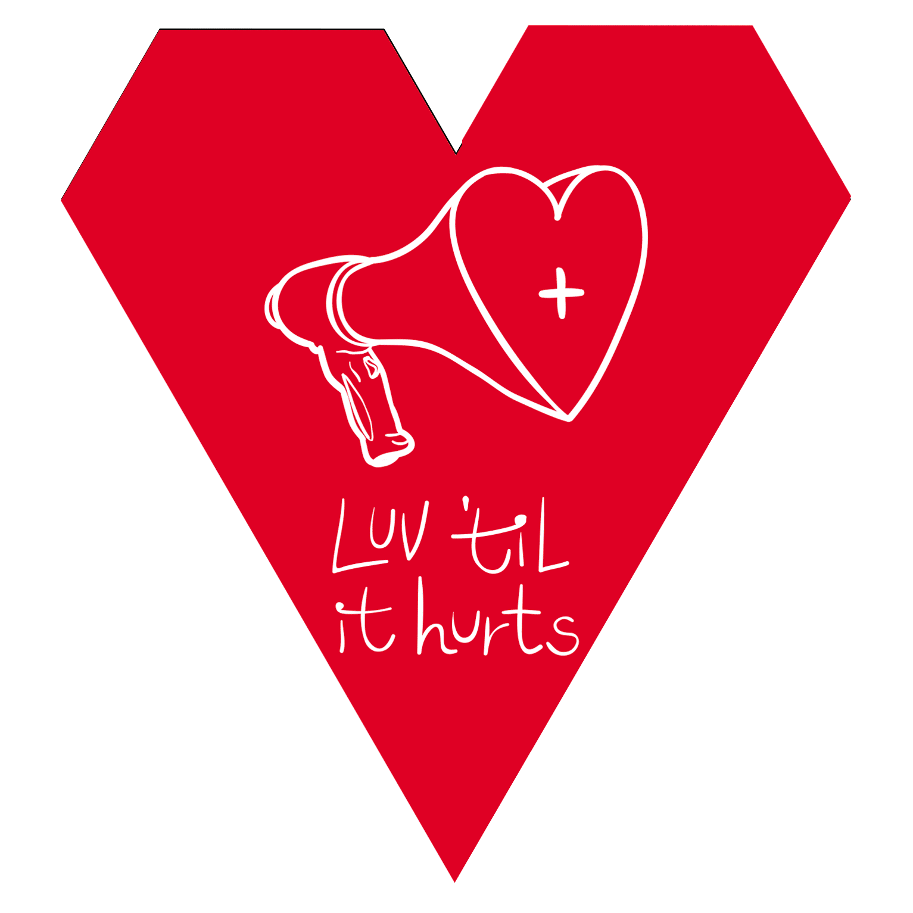

The [LUV game](https://luvhurts.co/play-me/) is a part of Luv 'til it Hurts. The idea is based on a game played around the world called _[Exquisite Corpse](https://en.wikipedia.org/wiki/Exquisite_corpse)_. It's a non-competitive game that can be played with only two people as well as a large group. The game is super easy. A new design or 'visual work' is made each time people play the game together. The [LUV game](https://luvhurts.co/play-me/) simply offers an excuse to talk about HIV and stigma in a range of settings from museum to public space or even on the street. The game idea came up when I asked a young design time in Port Said (Egypt) to help me communicate the values and goals of Luv 'til it Hurts. The [LUV game](https://luvhurts.co/play-me/) launched officially in Bogotá and Grenoble in late October; will have another run during São Paulo's December 1st AIDS Walk, and will be [available online](https://luvhurts.co/play-me/) the same day, [World AIDS Day](https://en.wikipedia.org/wiki/World_AIDS_Day) 2019.

A 23-year old designer, Saouf suggested the basic 'tile' form (within his interpretation of the _[Exquisite Corpse](https://en.wikipedia.org/wiki/Exquisite_corpse)_ game) as a variable form that can be used individually--as a sticker on the back of a laptop in a busy Cairo cafe--in a recognizable way yet one that does not always 'scream' HIV. From the beginning, the making of the [LUV game](https://luvhurts.co/play-me/) has been a multi-layered process of working with old friends; incorporating new ideas from artists and others; as well as considering safety and wellness in relation to the yet urgent need for dialogue on HIV and stigma. Also by popularizing the overall design of the game and the individual tiles, we are enacting a branding strategy that 'gets ready' for the next phase of Luv 'til it Hurts … and ultimately unearthing HIV-related stigmas! An old friend and senior designer, [Adham Bakry](http://abakry.com/en/) developed the game idea. This is also important. Luv 'til it Hurts is asking people who may not encounter HIV in their daily lives to get involved. To become allies. While perhaps hard to see, it is one of the most rewarding parts of making LUV.
