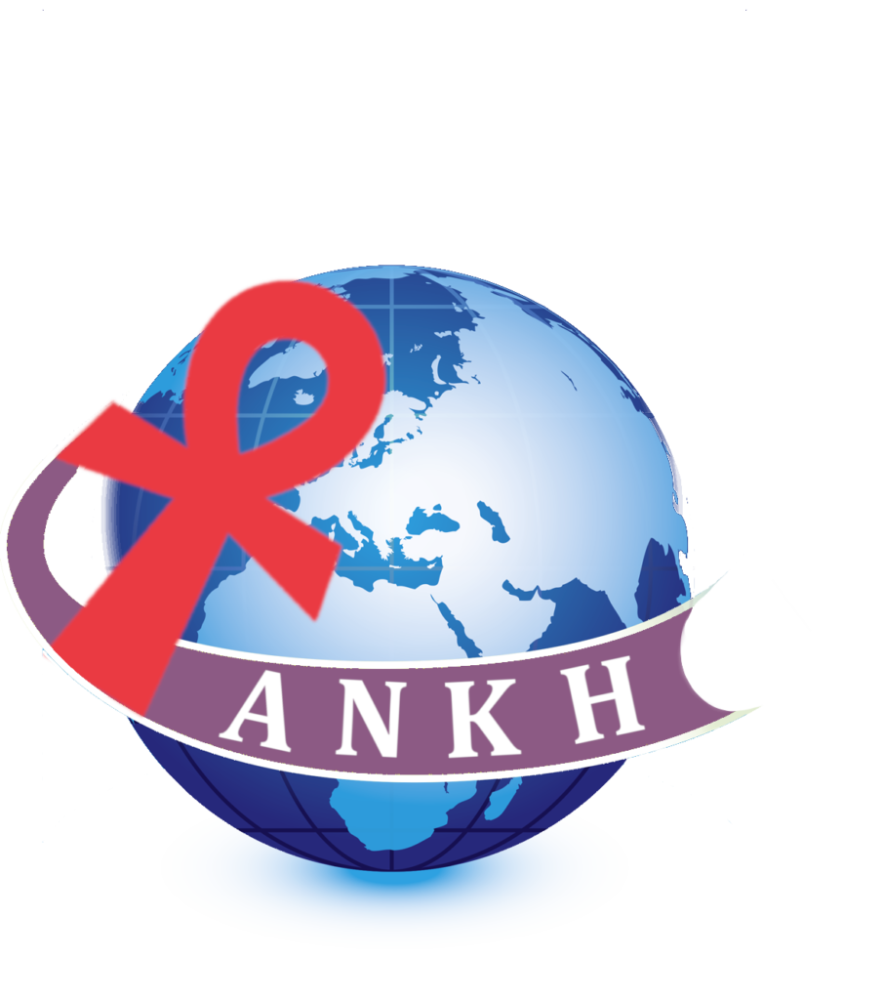

The ANKH (Arab Network for Knowledge on Human rights) association helps and supports the rights of minority groups, specifically LGBTQI and people living with HIV, in the Euromediterranean region.

The Know More Campaign is an initiative of the association**.** It is a health campaign to improve awareness about sexually transmitted diseases by providing diverse information in the Arabic language from reliable sources, without stigmatizing individuals on the basis of gender, religion, ethnic background, color, or sexual orientation. HIV is one of the main themes of the campaign.

'Points of Life' is an exhibition project set up by the campaign and association, focusing on people living with HIV in Egypt and highlighting their personal experiences, joys, and challenges.

See: [ANKH Association](https://www.ankhfrance.org/)

See: [The Know More Campaign](https://www.facebook.com/know.more.campaign/)

  
  

