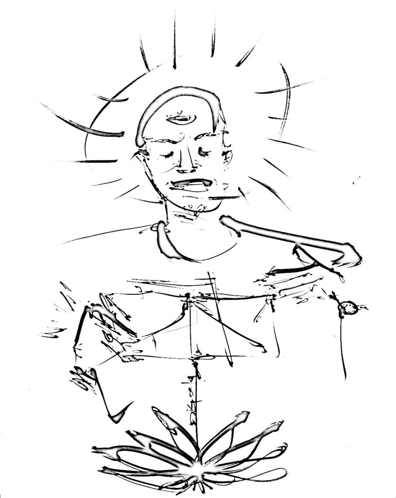

The Launch Pad is a randomized series of new stories --some poems, some prose, some both. These works in progress imagine the Launch of Luv 'til It Hurts as a point of departure to consider the prospective, imagined and re-imagined legacies of the HIV/AIDS pandemic in some future time.

Poet, writer, activist, and conceptual artist **[Brad Walrond](https://www.bradwalrond.com/)** maintains Launch Pad as a column charting his growing participation in the Luv 'til it Hurts project over its two-year initial run. He is also the maker of [Every Where Alien](https://www.bradwalrond.com/everywhere-alien-weekend), a [LUV coalition member](https://luvhurts.co/every-where-alien/).

<figure>

<figcaption>

Drawing by Dig Ferreira

</figcaption>

</figure>

Brad’s multi-disciplinary work explores the nexus between virtual reality, identity formation and human consciousness at the intersection of race, gender, sex, and desire. His first collection of poems and prose entitled: "Every Where Alien," will be published later this year by Moore Black Press. You can find out more at [www.bradwalrond.com](http://www.bradwalrond.com/) and follow him @bradwalrond on Facebook and Instagram.

Brad Walrond’s debut collection Every Where Alien is published by Moore Black Press. The themes here explores the author’s own black queer exploration of the world, domestic and abroad and how these experiences map onto the discovery of co-occurring and overlapping art and resistance movements among New York City’s underground communities. Communities like the New Black Arts Movement, the New York Ballroom Scene, Black Rock Coalition, Underground house dance and music community, and the black queer political arts and activist movements that arose in response to racism, homophobia, transphobia, and the HIV/AIDS pandemic. Brad was born in Brooklyn, New York to first generation parents from Barbados. Brad began writing and performing at the age of 24 when commissioned to participate in a theatre production curated by Harry Belafonte. Brad soon became one of the foremost writers and performers of the 1990s Black Arts Movement centered in New York City. Brad aims with his work to provoke explorations of how we experience and are impacted by historical remembered and imagined time to encourage us to identify and piece together the common and conflicting threads of our human inheritance by amplifying and interrogating the great power and contradictions inherent to identity. Brad has collaborated with artists like Erykah Badu and Camille Brown & Dancers. Brad’s first recording is a single Underneath the Metal on the breakout spoken word compilation album Eargasms: Crucial Poetics Vol. 1 featuring, among others, Abiodun Oyewole of the Last Poets, jessica Care moore, Mos Def aka Yasin Bey, and Saul Williams. His most recent track "fallopia" on Shelley Nicole’s blakbüshe soon to be released I Am American album is produced by Vernon Reid. Brad’s poetics and praxis has taken him across the country and as far as São Paulo, Brazil and Taipei, Taiwan.

Brad is also debuting ‘da Boogie Down’, a suite of poems, including: [borinquen](https://luvhurts.co/texts/borinquen/), [contract work](https://luvhurts.co/texts/contract-work/), [closing doors](https://luvhurts.co/texts/closing-doors/)
