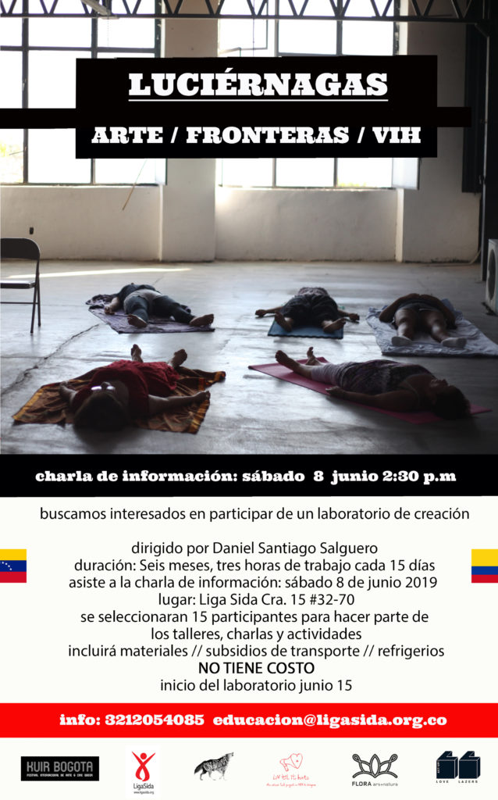

Luciérnagas is a participatory six-month arts lab, set up by artist **Daniel Santiago**, focused on HIV Stigma and Venezuelan migration. He expects a group of 15 people who will participate in talks and workshops every two weeks for an entire semester. He will propose to them to collaborate on a final live performance, based on how fireflies produce lights in the darkness for flirting and communicate with others. The preparation for this performance (body, tech and concept) will be part of the second half of the lab. The contents will be offered by different artists and organizations invited by the artist. This project is made under his one-year art residency at FLORA, Bogotá.

**ENGLISH**

Bodies containing Fireflies that wander through the nocturnal jungle, emitting calls and small sparks of light for courting and to find copulation. They remind us that in the jungle there are no limits or borders. Migrating, as many do out of necessity, or as a virus does from one body into another, is a fluid process. The spectator is invited to use the space to take a break, breathe, and rethink of him/herself as an individual body, and as a gear in a collective body in constant movement.

In AIDS and Its Metaphors (1987), Susan Sontag proposes a relationship with illnesses that is not of pity. Instead, she suggests approaching the illness by recognizing it as being a fundamental part of living organisms. Sontag's intake emphasises the necessity of confronting the illness with compassion, which implies understanding what happens to the other as if it was happening to yourself. In Survival of the Fireflies (1992), Georges Didi-Huberman proposes these light bugs as being metaphors of resilience, especially during convoluted political moments. These are some reflections that have opened up in the Luciérnagas lab of research and creation.

The goal of Luciérnagas was to convene a group of people for a period of six months, to think, talk, and act around themes associated with HIV / AIDS in relation to current urgent migration crises.

* * *

**ESPAÑOL**

Cuerpos contenedores de Luciérnagas deambulan por la selva nocturna, emiten cantos y pequeños destellos de luz para cortejar y buscar una posible cópula. Nos recuerdan que en esta selva no hay límites ni fronteras. Migrar, como lo hacen muchos por necesidad, o como lo hace un virus de un cuerpo a otro, es un proceso de fluidos. El espectador es invitado a tomarse un espacio para pausar, respirar y repensarse como cuerpo individuo y como engranaje de un cuerpo colectivo en constante movimiento.

En El sida y Sus Metáforas (1987), Susan Sontag propone una relación con las enfermedades diferente a la de la lástima. En cambio, sugiere una aproximación a la enfermedad desde el reconocimiento de ésta como parte fundamental de los organismos vivos. El aporte de Sontag es enfático en la necesidad de afrontar la enfermedad con compasión, que implica entender lo que le pasa al otro como si le pasara a uno mismo. Por su parte, Georges Didi-Huberman en su libro Supervivencia de las Luciérnagas (1992), propone a los insectos luminosos como metáfora de resiliencia, sobre todo en momentos políticos enrevesados. Estas son algunas de las reflexiones que se abren a partir del laboratorio de investigación y creación Luciérnagas.

Luciérnagas tuvo como fin convocar a un grupo de personas, a lo largo de seis meses, para pensar, conversar y actuar alrededor de temáticas vinculadas al VIH / SIDA en relación con las urgentes crisis migratorias actuales.

