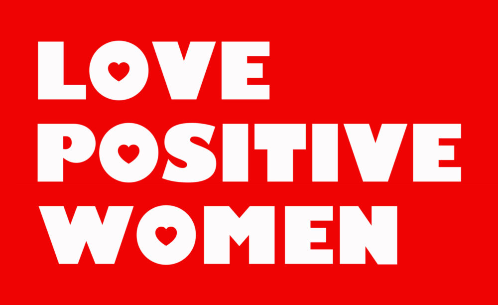

[Love Positive Women](http://jessicawhitbread.com/project/love-positive-women/) (February 1-14, 2020), a project by artist, [Jessica Whitbread](http://jessicawhitbread.com/) is the focus of LUV’s Act II. Similar to last year, [14 days](https://luvhurts.co/lovewomen/) of women-authored (and focused) content in on our site in partnership with [Love Positive Women](https://visualaids.org/projects/love-positive-women). The [cloth heart project](https://luvhurts.co/texts/puppy-luv-cloth-hearts/) started in Brasil on World AIDS Day 2019 during the 3rd annual São Paulo AIDS Walk. Designer, [George Ferraz](https://www.instagram.com/georgeferraz/?hl=en) created 100 cloth hearts made of two different styles of African fabric each (see [here](https://www.facebook.com/WeAllEatEggSandwiches/?__tn__=kC-R&eid=ARBB5xf61vL37wx0aRpI2naq7ESpQfAWVU2vNMgHvwzulysPlLHhSEHYNtfUl72WkqpQ2kq9VoP5SZgG&hc_ref=ARTb35Pv0L_54Wb1QTta-NxuFg7WjsfEpAdRgWU8IgzNI660d7AXsJ3NqiNx0S9JQ74&fref=nf&__xts__[0]=68.ARBUlLSAbTugW9SgMIZKnah1sQH3YEkpTFgscPQL9crtr6GjtebbuhNgX0X-M6ITF1syNKeThukby7OnwtVIxobo3NrD9Qnwq2y8fcTrHnKon92_tIkociTiwo7-EH_Zjp5U7CpTgkyoT9ia2JffCn8KEhFrnpQ1yo3rbu2wXQyufZrBcPODufkb2MZQeOoS70BBwAndw0SPHHpnrVhCvLQJM8YWS_7yyMuY8Qi5NH8hKP7nSwZk80hpVnyV9i4JMxxWDs_KFFvbXEywXnSyCJpW_2-N2nBRILd6fV3zxzRkZdZfKKJTro3guaJYhUNRb-rc1rmZTjLMABLeTHEfuBU) for more info). [These were distributed](https://luvhurts.co/encounters/luv-game-feedback-from-sao-paulo-somos-mais-aids-walk/) to anyone who wanted one during the AIDS Walk. George sent [the design](https://luvhurts.co/wp-content/uploads/2019/12/Luv_booklet3.pdf) to [Oma Elzubair](https://luvhurts.co/texts/what-do-a-sudanese-mom-search-the-internet-for/) in Khartoum (Sudan) and she will offer a similar gesture by distributing 100 cloth hearts to women–embroidered with ‘love positive women’ in Arabic–in Khartoum during Love Positive Women 2020. Oma gathered a team of women–Sherif Hussien, Randa Mursal, and Fatima Alameen–to support a series of actions locally in Khartoum, which begin during Love Positive Women 2020. 

Working with Fatima, the team will engage medicine students in person and the Arab Trainers College through an online network. Oma feels that the initial response warrants a long-term support group for HIV+ folks, family members, friends and lovers. They have already named it محتاج / ة أتكلم إيجابي! (I Need to Talk +), and Oma will blog about it in the coming weeks, including one update during LPW 2020 and the local Khartoum events. After learning about the relationship between criminalization of HIV and local perceptions of adultery, Oma began to consider a longer-term response. Her vision is to mobilize ‘a full network of people who make the HIV+ people and AIDS patients’ lives more better’. During LPW 2020, there will be a workshop about AIDS/HIV+ in Sudan’s main women’s prison where the cloth hearts will be used. Additionally, they will print 500 specially-designed cards (like telegrams) with hand-written, positive affirmations for other events and groups. At the prison, they will deliver the hearts and play the [LUV game](https://luvhurts.co/play-me/). Designer [Adham Bakry](http://abakry.com/en/) (who made up the LUV game from his studio in Port Said) will create a new sign for LPW in Arabic (أحبوهن إيجابيات‎) and send to Oma in Khartoum for branding her events. 

At the same time there will be events in both NYC and São Paulo. When posed with the idea of a LPW event in NYC, New York-based, Brasilian artist [Thiago Correia Gonçalves](https://thiagocorreiagoncalves.com/?fbclid=IwAR01nJ06crAMY0c7orJHarLEBM0oFQY58OJIPfzpfI2JNnqhXpyBbxeokjQ) suggested a celebration of [Iemanjá](https://en.wikipedia.org/wiki/Yem%E1%BB%8Dja), the saint of fishers. This happened on February 9th in Brooklyn and was called ‘Bobo for \[LUV\] Iemanjá’. Thiago made a [special poster](https://luvhurts.co/lovepositivewomen/bobo-for-yemanja-lpw2020/) for this. And, since there are some cultural / queer spaces in his other hometown of São Paulo that participated, he made a second poster edition in Portuguese that was featured in [esponja](http://www.esponja.info/) (and other spaces) for the duration of LPW 2020. George made more cloth hearts and along with the Iemanjá poster, he helped style the participating cultural spaces in São Paulo. The São Paulo municipal [secretary of human rights (LGBTI unit)](https://www.prefeitura.sp.gov.br/cidade/secretarias/direitos_humanos/lgbti/) helped publicize the holiday both locally and through the Latin America Rainbow Cities network.

Within the 14 contributors for the LPW 2020 series, LUV partner, [Nhimbe Trust](https://www.nhimbe.org/) contributed the serialization of a women-authored play, MAIDEI, considering local HIV conditions in Bulawayo, Zimbabwe. Nhimbe Trust is a Zimbabwean non-profit non-governmental organization that works at the intersection of culture and development to foster local socio-economic development. Nhimbe’s development programs in the arts and culture sector have consistently contributed to structural action in youth and women empowerment initiatives. Nhimbe is committed to pioneering work that defends freedom of artistic expression in Zimbabwe.

On the occasion of Love Positive Women 2020, Colombian-Ecuadorian cartoonist [Power Paola](https://www.instagram.com/powerpaola/) offered some new [Spanish-language designs](https://luvhurts.co/encounters/fresh-designs-for-love-positive-women-2020/), which can be used by LPW for years to come.

<iframe src="https://player.vimeo.com/video/402595839" width="640" height="640" allowfullscreen></iframe>

And, that’s Act II!
