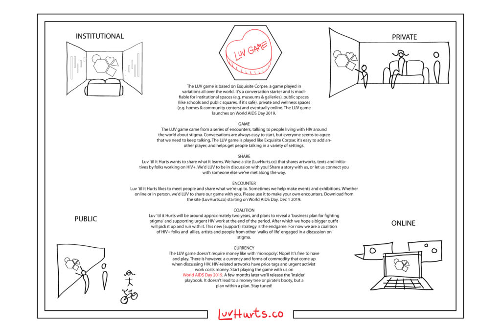

_\*This just in! LUV Game 'box set' design by Adham Bakry!!_

The [LUV Game strategy](https://luvhurts.co/the-game/) is explained on its [broadsheet](https://drive.google.com/file/d/0By6i86TJubAaVG5IVkJPVkt5X0lGaFAwTlQtUF8tS2hsTzk0/view), and its logic rehearsed in a sappy homage, _[Thank you to Lois Weaver (ample version)](https://luvhurts.co/field-notes/thank-you-to-lois-weaver-ample-version/)_. This page is for sharing different language versions of its simple set of instructions as well as the game pieces (tiles) in both black & white and color (at bottom), and also a book of partner tiles. In fact, the Partner Tile book serves as [a second set of instructions](https://luvhurts.co/encounters/the-ideas-for-partner-tiles/) (for organizational use), which came up in the game-making process. And, please please please remember codeword 'Abbie Hoffman' when stealing this game …

[LUV\_English](https://luvhurts.co/wp-content/uploads/2019/09/LUV_English-1.pdf) [Download  
](https://luvhurts.co/wp-content/uploads/2019/09/LUV_English-1.pdf)

[LUV\_Portuguese](https://luvhurts.co/wp-content/uploads/2019/11/LUV_-PT3-1-1.pdf)[Download](https://luvhurts.co/wp-content/uploads/2019/11/LUV_-PT3-1-1.pdf)

[LUV\_Arabic](https://luvhurts.co/wp-content/uploads/2019/10/LUV_inst_Ar.pdf) [Download](https://luvhurts.co/wp-content/uploads/2019/10/LUV_inst_Ar.pdf)

[LUV\_French](https://luvhurts.co/wp-content/uploads/2019/11/LUV_-_FR_.pdf) [Download](https://luvhurts.co/wp-content/uploads/2019/11/LUV_-_FR_.pdf)

[LUV\_Dutch](https://luvhurts.co/wp-content/uploads/2019/11/LUV__DT_.pdf) [Download  
](https://luvhurts.co/wp-content/uploads/2019/11/LUV__DT_.pdf)

[LUV\_Spanish](https://luvhurts.co/wp-content/uploads/2019/11/LUV_-_ES_.pdf) [Download](https://luvhurts.co/wp-content/uploads/2019/11/LUV_-_ES_.pdf)

[LUV\_Mandarin](https://luvhurts.co/wp-content/uploads/2019/11/LUV_-MANDARIN.pdf) [Download](https://luvhurts.co/wp-content/uploads/2019/11/LUV_-MANDARIN.pdf)

[LUV\_Turkish](https://luvhurts.co/wp-content/uploads/2019/12/LUV_-TURKISH.pdf)[Download  
](https://luvhurts.co/wp-content/uploads/2019/12/LUV_-TURKISH.pdf)

[LUV\_Greek](https://luvhurts.co/wp-content/uploads/2019/12/LUV_-GREEK.pdf)[Download](https://luvhurts.co/wp-content/uploads/2019/12/LUV_-GREEK.pdf)

[LUV\_German](https://luvhurts.co/wp-content/uploads/2019/12/LUV_-GERMAN.pdf)[Download](https://luvhurts.co/wp-content/uploads/2019/12/LUV_-GERMAN.pdf)

[B/W Game Pieces (Grenoble)](https://luvhurts.co/wp-content/uploads/2019/12/Luv_booklet.pdf)[Download](https://luvhurts.co/wp-content/uploads/2019/12/Luv_booklet.pdf)

[Color Game Pieces (São Paulo)](https://luvhurts.co/wp-content/uploads/2019/12/Luv_booklet3.pdf)[Download  
](https://luvhurts.co/wp-content/uploads/2019/12/Luv_booklet3.pdf)

[LUV Partner Tiles (Global)](https://luvhurts.co/wp-content/uploads/2019/12/Luv_PartnerBook.pdf)[Download](https://luvhurts.co/wp-content/uploads/2019/12/Luv_PartnerBook.pdf)

[Game Piece Pamphlet (Bogota)](https://luvhurts.co/wp-content/uploads/2019/12/Luv_booklet2-1.pdf)[Download](https://luvhurts.co/wp-content/uploads/2019/12/Luv_booklet2-1.pdf)
