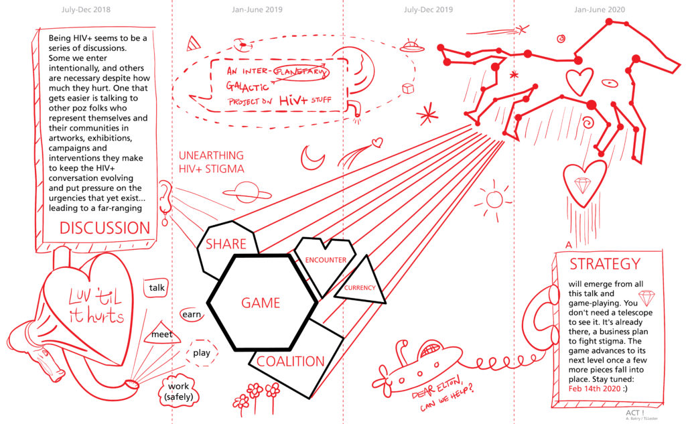

**GAME**

The LUV game came from a series of encounters, talking to people living with HIV around the world about stigma. Conversations are always easy to start, but everyone seemed to agree that we need to keep talking. The LUV game is played like Exquisite Corpse; it's easy to add another player; and helps get people talking in a variety of settings. 

<figure>

<figcaption>

For [Act I](https://drive.google.com/file/d/0By6i86TJubAaVG5IVkJPVkt5X0lGaFAwTlQtUF8tS2hsTzk0/view?usp=sharing), 'the game' is the centerpiece (or by-product) in a set of requisite priorities

</figcaption>

</figure>

  
**SHARE**

Luv 'til it Hurts wants to share what it learns. We have a site (LuvHurts.co) that shares artworks, texts and initiatives by folks working on HIV+. We'd LUV to be in discussion with you! Share a story with us, or let us connect you with someone else we've met along the way.

  
**ENCOUNTER**

Luv 'til it Hurts likes to meet people and share what we're up to. Sometimes we help make events and exhibitions. Whether online or in person, we'd LUV to share our game with you. Please use it to make your own encounters. Download from site (LuvHurts.co) starting on World AIDS Day, Dec 1 2019.

  
**COALITION**

Luv 'til it Hurts will be around approximately two years, and plans to reveal a 'business plan for fighting stigma' and supporting urgent HIV work at the end of the period. After which we hope a bigger outfit will pick it up and run with it. This new \[support\] strategy is the endgame. For now we are a coalition of HIV+ folks and  allies, artists and people from other 'walks of life' engaged in a discussion on stigma.

  
**CURRENCY**

The LUV game doesn't require money like with 'monopoly'. Nope! It's free to have and play. There is however, a currency and forms of commodity that come up when discussing HIV. HIV-related artworks have price tags and urgent activist work costs money. Start playing the game with us on World AIDS Day 2019. A few months later we'll release the 'insider' playbook. It doesn't lead to a money tree or pirate's booty, but a plan within a plan. Stay tuned!
