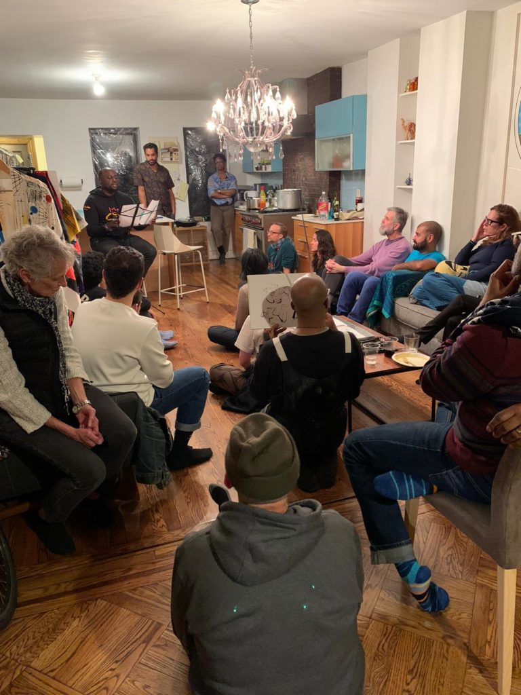

Could Be The Ballroom was always our Nuclear option  
A rock scrabble bunker become a threshing floor  
How we survived our Coldest War

A Mother a Father an entire house full of babies  
tucked into mangers woven out of street corner filament  
limber enough to parent those of us:

born with and with out parents  
with and without islands

begat inside flags with and without stripes  
while reading for A-level exams

stretched astride Empires and Queens  
too Black to be British  
too gay to be queer—

too poor for the crowns we deserve

* * *

Boys and girls born beyond signage  
onto intersections above and below 42nd street  
where hormones traffic themselves,

Run all the rules. Busts all the lights  
cum shot out of blackness too Pentecostal  
for its own beneficence

Could Be the Ballroom Scene laid its own bedrock  
atop an inference. As if by subterfuge.  
As if by stagecraft. As if by premonition:

The way we live  
The way we die  
The way we transition

In and out of space  
In and out of time  
In and out of academies & boarding schools  
With and without degrees.

In and out of dimension  
The lives we all span is a performance

* * *

1986: What a performance it was!  
In the year of our Lord June 30, 1986  
adjudicating case: 478 U.S. 186 otherwise known as Bowers v. Hardwick the Supreme Court upheld Georgia’s Sodomy laws in a 5-4 decision.[\[1\]](https://artseverywhere.ca/roundtables/1986/#_ftn1)

This year 1986 according to dissenting Justice Blackmun—enjoined by William Brennan Jr.,  
Thurgood Marshall and John Paul Stevens—our nation’s highest court became _“obsessively focused on homosexual activity”_

So happens this same year 1986  
a midsummer night’s dream is bequeathed  
to Reverend Charles Angel;[\[2\]](https://artseverywhere.ca/roundtables/1986/#_ftn2) a new faith begins its practice inside the living rooms of Black Gay men  
fagged playing Russian roulette with their secrets the waters break. Gay Men of African Descent[\[3\]](https://artseverywhere.ca/roundtables/1986/#_ftn3) is born

June 14, 1986  
Daniel Garret[\[4\]](https://artseverywhere.ca/roundtables/1986/#_ftn4) freebases on a James Baldwin line:  
_“Our history is each other”_ and a group of Black Gay Men  
exhale enough pride inside a writer’s workshop  
to inscribe for themselves a new nation:

_Other Countries_[\[5\]](https://artseverywhere.ca/roundtables/1986/#_ftn5)

write themselves out of a BlackHeart  
Collecting the floodlit life-force condensed  
inside Joseph’s Beam[\[6\]](https://artseverywhere.ca/roundtables/1986/#_ftn6)

In some ways we all still live huddled, impatient,  
un-relented inside Joseph’s hologram

_If There’s a Cure For This I Don’t Want It_[\[7\]](https://artseverywhere.ca/roundtables/1986/#_ftn7)

* * *

October 1986  
Craig Harris[\[8\]](https://artseverywhere.ca/roundtables/1986/#_ftn8) black gay living  
with AIDS and walking realness

grabs the mic from the San Francisco Health Commissioner at the American Public Health’s Assoc. first AIDS workshop speaking for all of us he proclaims: “I Will Be Heard”

before Craig’s mic drops  
National Minority AIDS Council is born  
Craig Harris, Paul Kawata, Gil Gerard,  
Suki Ports, Marie St. Cyr[\[9\]](https://artseverywhere.ca/roundtables/1986/#_ftn9)

invite our colored selves to the Ball  
because the rainbow was never enough.

* * *

On this runway Audre Lorde cries _Dear Joe_[\[10\]](https://artseverywhere.ca/roundtables/1986/#_ftn10)  
_& the tinny juke box music comes up_  
_through the floor of our shoes_

This runway is a Battle  
This runway is an Extravaganza  
Watch listen learn  
This Battle Is and Is Not Yours

The Old Way : The New Way :  
either way spells perseverance  
crafted out of imaginary high school diplomas

The Old Way : The New Way :  
either way spells perseverance  
out of nothing besides our poverty, our disease,  
our sex, our privilege, our shame, our death,

A people a culture an art form a wellspring is born.

* * *

When lifespans splinter into foreshortened seasons  
a phallus engorged pandemic goes jackhammer & rogue  
sometimes God opens the second door

1986 is a second door  
a portal in time manned by the  
Queens of the Damned

a middle passage collects itself onto dry ground  
An ADODI[\[11\]](https://artseverywhere.ca/roundtables/1986/#_ftn11) river collapses alongside a  
New York City Nile

Shamans sing:

in & out of gender  
in & out of place.  
Yoruba priests  
walk bizarre

* * *

_When My Brother Fell_[\[12\]](https://artseverywhere.ca/roundtables/1986/#_ftn12)

I cared not how rich he was  
How Caribbean he was  
How Ivy League his poison oak  
How much southern fruit pickled his veins

_When My Brother Fell_

I cared not how many Prospect Park trees[\[13\]](https://artseverywhere.ca/roundtables/1986/#_ftn13)  
bear witness to his lovemaking. I paid no attention  
to which butch-queen-voguing-fem  
he was fucking  
in between bushes

Or to how big  
how thick  
how heavy  
the thorns

he let ride his back into Heaven

_When My Brother Fell_  
_I picked up his weapons and never questioned_  
The category he walked  
how much make-up he had on  
or which label she wore  
behind closed doors

I never questioned  
If his momma knew  
If his daddy cared

I kept walking

* * *

Essex said, _“there was no one lonelier than you Joseph”_  
30 years later, we not gon’ do it that way this time  
The Ballroom collapses whole classes into nations

Every call gets a response  
Every name every category  
every non-binary  
is an intention

A Universal law makes its own rules  
Divines its own boundaries  
causing legends to be born

While Paris Burns  
Assoto’s Saints[\[14\]](https://artseverywhere.ca/roundtables/1986/#_ftn14) and Willie’s Ninjas[\[15\]](https://artseverywhere.ca/roundtables/1986/#_ftn15)  
stand guard

a whole river of boys born without bones  
boys born without spoons let alone silver

bright boys born on islands in between boroughs  
that rupture beneath their salt water promise

Somehow the Ballroom always knew why  
Boys and Girls born too-fluid-for-homes

need Houses

Essex said, _“If we must die on the front line_  
_don’t let loneliness Kill us”_

_If There’s a Cure For This I Don’t Want It_

* * *

1986 1986 1986 is a house song at morning mass a break beat, a beat box, a carol, a love song, a dirge  
a Brooklyn Children’s Museum born again  
inside a Donald Woods’[\[16\]](https://artseverywhere.ca/roundtables/1986/#_ftn16) forest

1986 is  
a GMAD, an NMAC, an ADODI  
a god-accented ebonic surviving for Joseph,  
for Essex, for Donald, for Willie,  
for Assoto Saint, for Craig Harris

For all Us born Survivors of the Coldest War  
With and without parents.

Born too gay,  
too queer for the crowns  
we deserve.

* * *

- 
    
- 
    
- 
    
- 
    

\*Images are from 'Bobó for Yemanjá', a February 9th event celebrating [Love Positive Women](https://luvhurts.co/lovewomen/) 2020 in NYC at which Brad performed 1986 and other poems.

* * *

#### Endnotes

[\[1\]](https://artseverywhere.ca/roundtables/1986/#_ftnref1) In Atlanta, Georgia, August 1982 Michael Hardwick was issued a citation for drinking in public. Hardwick missed his court date and an arrest warrant was issued. However, before receiving the warrant, Hardwick paid the $50 fine. Nevertheless, two weeks later, police arrived at Harwick’s home, were admitted by roommate, and found Hardwick in his bedroom having sex with another man. The police arrested Hardwick and his companion for sodomy, a felony under Georgia law. Hardwick challenged the statute’s constitutionality in Federal District Court with the support of the ACLU. The case challenging the constitutionality of Georgia’s sodomy laws reached the U.S. Supreme Court in 1986. The Court issued a divided opinion holding that there was no constitutional protection for acts of sodomy, and that states could outlaw those practices. The case drew attention to sodomy laws across the country and in the years that followed several state legislatures repealed such laws. Finally, in 2003, in Lawrence v. Texas the Supreme Court overturned its ruling in the Bowers v. Hardwick case and invalidated the 13 remaining state sodomy laws insofar as they applied to private consensual conduct among adults.

[\[2\]](https://artseverywhere.ca/roundtables/1986/#_ftnref2) Charles Angel (1952-1986), a Pentecostal minister, community organizer, social advocate, and activist, who helped found the organization, Gay Men of African Descent (GMAD).

[\[3\]](https://artseverywhere.ca/roundtables/1986/#_ftnref3) Gay Men of African Descent (GMAD) was founded in 1986 with the mission of advancing the welfare of black gay men through education, social support, political advocacy, and health and wellness promotion. (For more information see the [NYPL Archives and Manuscripts](http://archives.nypl.org/scm/21213))

[\[4\]](https://artseverywhere.ca/roundtables/1986/#_ftnref4) Daniel Garret was a member of the Blackheart Collective, founded in 1980 by the Harlem-born Isaac Jackson. Blackheart members, all New York City-based black gay artists, produced a literary journal. The publication sought to queer dominant black intellectual traditions such as Afrocentrism and extend the gay liberation movement’s concern with prisoner rights and prison reform to a broader race- and class-based critique of carceral state power. The Blackheart collective disbanded in 1985.

[\[5\]](https://artseverywhere.ca/roundtables/1986/#_ftnref5) Other Countries was a writer’s workshop formed to develop, disseminate, and preserve the diverse cultural expressions of black gay men. The group produced two journals in the early years of the AIDS crisis, _Other Countries: Black Gay Voices_ (1988) and the book-length _Sojourner: Black Gay Voices in the Age of AIDS_ (1993).

[\[6\]](https://artseverywhere.ca/roundtables/1986/#_ftnref6) Joseph Beam was born December 30, 1954, in Philadelphia. He studied journalism at Franklin College in Indiana where he was an active member of the Black Student Union. Back in Philadelphia in the early 1980s, Beam got a job at Giovanni’s Room, a GLBT bookstore and began writing news articles, personal essays, poetry, and short stories that reflected the life experiences of black Gay men. In 1984, the Lesbian and Gay Press Association honored him with an award for outstanding achievement by a minority journalist. Disappointed at the lack of published gay black male voices, he edited the pioneering anthology, _In the Life_ (1986). Beam helped resurrect the flagging National Coalition of Black Lesbians and Gays—originally founded in 1978—joining the executive committee and editing the organization’s journal, Black/Out. He died of complications related to AIDS in December 1988, just three days shy of his 34th birthday. After his death, Beam’s mother and his friend Essex Hemphill completed a second anthology of black Gay men’s writing, _Brother to Brother_ (1991), which Beam was working on when he died (extract from Liz Highleyman’s article, “[Who was Joseph Beam?](http://www.sgn.org/sgnnews34_51/mobile/page30.cfm)” for Seattle News.)

[\[7\]](https://artseverywhere.ca/roundtables/1986/#_ftnref7) The refrain from Diana Ross’s 1976 hit song, “Love Hangover,” written by Pamela Sawyer and Marilyn McLeod. The song is one of the anthems of the House and Ballroom community.

[\[8\]](https://artseverywhere.ca/roundtables/1986/#_ftnref8) In 1986, the American Public Health Association (APHA) had its first AIDS workshop, and neglected to invite any HIV/AIDS or medical leaders of color to the event. Craig Harris crashed the meeting, taking the stage and the microphone from Dr. Merv Silverman, the San Francisco Health Commissioner. This was the genesis of a national movement and the founding moment of the National Minority AIDS Council (NMAC) that quickly became a voice for communities of color, spreading awareness of the disproportionate impact that HIV/AIDS had on their communities (see [https://gay-sd.com/the-national-minority-aids-council-they-will-be-heard/](https://gay-sd.com/the-national-minority-aids-council-they-will-be-heard/)).

[\[9\]](https://artseverywhere.ca/roundtables/1986/#_ftnref9) Leaders of prominent minority AIDS organization nationwide – including Paul Kawata, Gil Gerald, Calu Lester, Don Edwards, Timm Offutt, Norm Nickens, Craig Harris, Carl Bean, Suki Ports, Marie St.Cyr and Sandra McDonald – started the National Minority AIDS Council (NMAC) in response to the American Public Health Association’s (APHA) failure to invite anyone of color to participate on the panel at its first ever AIDS workshop in 1986. NMAC members met with U.S. Surgeon General C. Everett Koop when he was writing his historic report on the AIDS. Originally scheduled for just 15 minutes the meeting lasted nearly two and half hours. More than three decades later, HIV still disproportionately impacts communities of color and NMAC continues to provide public policy education programs, conferences, treatment and research programs initiatives, trainings, and electronic and printed resource materials (see [http://www.nmac.org/wp-content/uploads/2018/05/History.pdf](http://www.nmac.org/wp-content/uploads/2018/05/History.pdf)).

[\[10\]](https://artseverywhere.ca/roundtables/1986/#_ftnref10) Audre Lorde (1934-1992) dedicated both her life and her creative talent to confronting and addressing injustices of racism, sexism, classism, and homophobia. Lorde was born in New York City to West Indian immigrant parents. She earned her BA from Hunter College and Master in Library Sciences from Columbia University. She was a librarian in the New York public schools throughout the 1960s. She had two children with her husband, Edward Rollins, a white, gay man, before they divorced in 1970. In 1972, Lorde met her long-time partner, Frances Clayton and began teaching as poet-in-residence at Tougaloo College. Lorde articulated early on the intersections of race, class, and gender in canonical essays such as “The Master’s Tools Will Not Dismantle the Master’s House.” _Sister Outsider: Essays and Speeches_ (1984) collected Lorde’s nonfiction prose and has become a canonical text in Black studies, women’s studies, and queer theory. In the late 1980s Lorde and fellow writer Barbara Smith founded Kitchen Table: Women of Color Press, which was dedicated to furthering the writings of black feminists.

[\[11\]](https://artseverywhere.ca/roundtables/1986/#_ftnref11) ADODI was born in 1986 in Philadelphia as a movement of same gender loving men of African descent. “Adodi” is the plural of “Ado,” a Yoruba word that describes a man who “loves” another man. The Adodi of the tribe are thought to embody both male and female ways of being and were revered as shamans, sages. and leaders. Adodi currently has chapters in Chicago, Detroit, Philadelphia, New York and Washington, DC. (see: [http://www.adodi.org/](http://www.adodi.org/))

[\[12\]](https://artseverywhere.ca/roundtables/1986/#_ftnref12) [Essex Hemphill](https://www.poetryfoundation.org/poets/essex-hemphill) (1967-1995) was a writer who addressed race, identity, sexuality, HIV/AIDS, and the family in his work. His first full-length poetry collection, _Ceremonies: Prose and Poetry_ (1992), won the National Library Association’s Gay, Lesbian, and Bisexual New Author Award. He edited the anthology _Brother to Brother: New Writing by Black Gay Men_ (1991). His work is featured in the documentaries _Tongues Untied_ (1989), _Black Is … Black Ain’t_ (1994), and _Looking for Langston_ (1989). Hemphill died of complications from AIDS in 1995.

[\[13\]](https://artseverywhere.ca/roundtables/1986/#_ftnref13) [The Vale of Cashmere](https://hyperallergic.com/246424/in-the-vale-of-cashmere-prospect-parks-hidden-world-of-gay-cruising/) is a secluded patch of wilderness in Prospect Park that’s been the unofficial locus of gay cruising in Brooklyn since the 1970s. In his short story, “Summer Chills” in _Brother to Brother: New Writings by Black Gay Men_, Rory Buchanan writes: “When I got there, I found the park filled with men in the same horny, hungry state of mind I was in … I can’t remember ever seeing so many gorgeous black men in any one place.”

[\[14\]](https://artseverywhere.ca/roundtables/1986/#_ftnref14) [Assotto Saint](https://ubuntubiographyproject.com/2017/10/02/assotto-saint/) (1957-1994) was a Haitian-born, pioneering poet, author, performance artist, musician, editor, human rights and AIDS activist, theatrical founder, and dancer. Saint was among the first Black activists to disclose his HIV positive status, and one of the first poets to include the AIDS crisis in his work. After graduating from Jamaica High School in New York City, he enrolled as a pre-med student at Queens College. In 1980, Saint fell in love with Jaan Urban Holmgren, a Swedish-born composer with whom he began collaborating on a number of theatrical and musical projects. Their relationship would last 14 years. They were both diagnosed as HIV positive in 1987. The death of his partner Jaan Urban Holmgren in 1993 profoundly affected Saint. In his poem, “Wishing for Wings,” he concludes that no words can convey his despair over Holmgren’s death. Saint died of AIDS-related complications on June 29, 1994. He had requested that, in protest of the indifference of American society to those dying of AIDS, that the American flag be burned at his funeral and its ashes scattered on his grave. Holmgren and Saint are buried side-by-side at the Cemetery of the Evergreens in Brooklyn.

[\[15\]](https://artseverywhere.ca/roundtables/1986/#_ftnref15) [Willi Ninja](https://ubuntubiographyproject.com/2018/04/12/willi-ninja/) (1961-2006) was a dancer, performance artist, and choreographer who was featured in “Paris is Burning.” He was a self-taught dancer who was perfecting his vogueing style by his twenties. As mother of the House of Ninja, he became a New York celebrity, and give modelling stars like Naomi Campbell pointers early in their careers. He also inspired Madonna and her 1990 hit song and music video, “Vogue.” In 2004, Willi Ninja opened a modelling agency, EON (Elements of Ninja), but continued to dance, appearing on the television series “America’s Next Top Model” and “Jimmy Kimmel Live,” and dropping in at local clubs. Willie Ninja died of AIDS-related heart failure in New York City on September 2, 2006, at the age of 45.

[\[16\]](https://artseverywhere.ca/roundtables/1986/#_ftnref16) Donald Woods (1958-1992) was a poet, singer, and creative worker based in Brooklyn. He earned a bachelor’s degree at The New School and did postgraduate study in arts administration. His work as a writer began with his involvement in the Blackheart Collective. He studied with Audre Lorde and participated in Other Countries, a black gay men’s writing workshop. Woods was one of several authors of “Tongues Untied,” Marlon T. Riggs’s film about black gay men. He also appeared in Riggs’s film, “No Regrets.” (see: [https://www.nytimes.com/1992/06/29/obituaries/donald-w-woods-34-aids-film-executive.html](https://www.nytimes.com/1992/06/29/obituaries/donald-w-woods-34-aids-film-executive.html))

[This article](https://artseverywhere.ca/roundtables/1986/) was originally published in ArtsEverywhere on Feb 27th, 2020.

https://soundcloud.com/user-749818941/brad-walrond-reading-1986

\*See [Every Where Alien in the LUV coalition](https://luvhurts.co/every-where-alien/). And, check out Brad Walrond’s [Launch Pad](https://luvhurts.co/features/launch-pad/) column in our [Features](https://luvhurts.co/features/).
