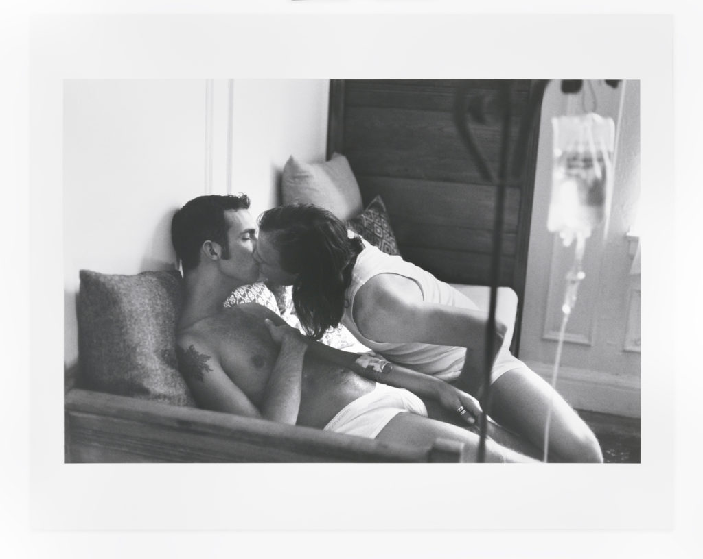
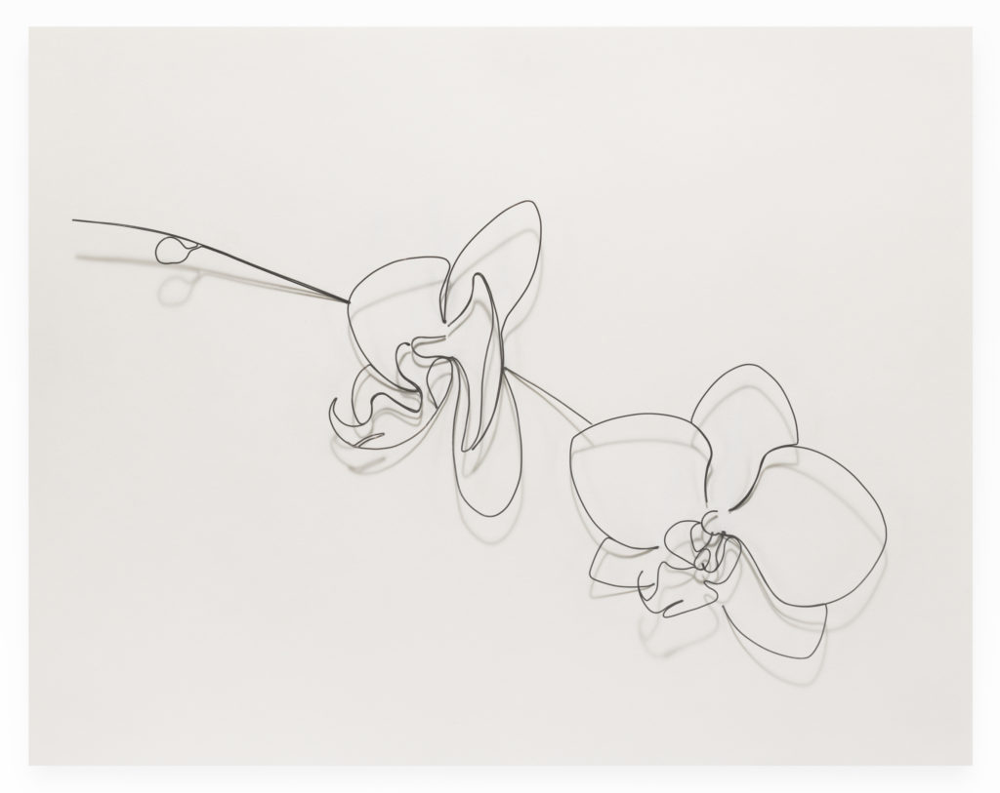
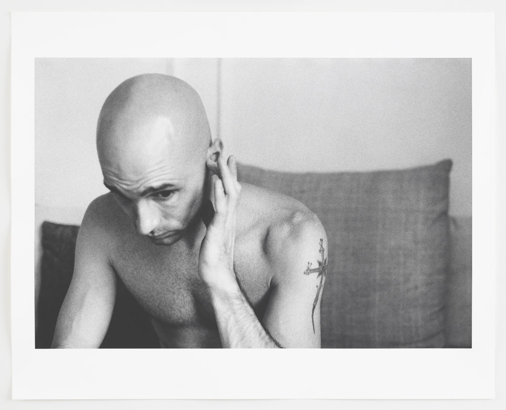
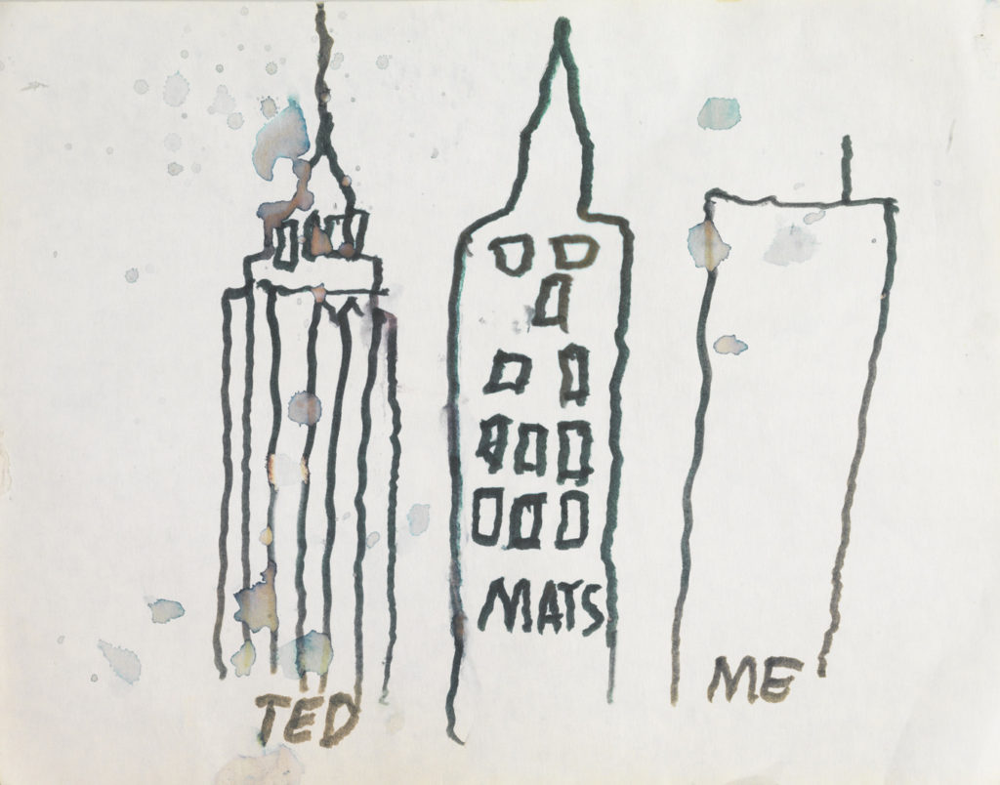

Institute 193, the innovative gallery and publisher, has announced the publication of _**Eric Rhein: Lifelines**_ 

This is the first book from artist Eric Rhein: a unique monograph-memoir spanning three decades of his life and artwork. It features intimate photographs taken between 1989 and 2012—including self-portraits and images of friends and lovers from the period between Rhein’s HIV diagnosis, his near death, and the returning vitality that new medications would afford him. As a personal response to the AIDS crisis, these compelling portraits highlight tenderness and care as life-saving forces. 

<figure>

<figcaption>

Kinsmen (self-portrait, with Leaves (an AIDS memorial), the MacDowell Colony), 1996

</figcaption>

</figure>

The book also includes watercolors, delicate assemblages, and wire drawings—notably his ongoing project _Leaves_, an AIDS memorial honoring over 300 individuals whom Rhein knew. 

Eric’s work embodies love, touch, connection to nature, and to familial and regional history. The artist draws from his Kentucky roots and his family relationship with his uncle Lige Clarke—a gay rights pioneer of the 1960s and 70s. They are inspirations for his art and activism. Rhein mines collective and personal narratives, formulating pieces that are both poetic and documentary. 

<figure>

<figcaption>

Kissing Ken (self-portrait with Ken Davis), 1996

</figcaption>

</figure>

_“. . . .Eric Rhein's most recent book, is an emotional journey through intimate scenes where Eric, his friends, and his lovers share time and space during the AIDS crisis of the 90’s—a time of extreme duress and pain. "Feelings" is a word I often associate with Eric's gentle artworks: longing, love, lust, life—and this page-turner of a book is ripe with outbursts of intimate emotions. In his photographs and sculptures, Eric memorializes lives_ _lost_ _to AIDS, but he also rightfully celebrates his own survival. I am happy Eric is still here with us and able to communicate what it feels like to have survived a past that informs the experience of living in the present.”_ 

                                           — Carlos Motta, artist, activist, and documentarian 

The book includes essays by National Book Award-winning poet Mark Doty; former Institute 193 Director Paul Michael Brown; and Rhein. Of Eric’s work, Doty writes, _“These images affirm the desiring self at a moment when desire had become dangerous…”_

<figure>

<figcaption>

Orchids, 2019  
Wire and paper, 11 x 14 x 2 inches

</figcaption>

</figure>

<figure>

<figcaption>

Joe (Joe Piazza), 1993

</figcaption>

</figure>

<figure>

<figcaption>

Ted Mats Me (from Hospital Drawings, Saint Vincent’s Hospital), 1994  
Marker on paper, 11 x 12 inches

</figcaption>

</figure>

**About Eric Rhein:**  Eric has exhibited widely in the United States and abroad, and his work has been reviewed in the _New York Times, Huffington Post, ARTnews, Vanity Fair,_ and _Art in America_. _New York Times_ critic Holland Cotter wrote of Rhein’s work: _“…the combination of art and craft, delicacy and resiliency, feminine and masculine, is exquisitely wrought and is, as it should be, seductive but disturbing.”_ Eric Rhein is included in the Smithsonian Archives of American Art’s _Visual Arts and the AIDS Epidemic: An Oral History Project_. 

**About the publisher:**  _Institute 193_ collaborates with artists, musicians, and writers to produce exhibitions, publications, and projects that document the cultural landscape of the modern South. 

**Release date:**  November 10th, 2020

**Distributed by:**  ARTBOOK | Distributed Art Publishers

**ADVANCE PURCHASE NOW AVAILBLE:**

**Purchase through the publisher, Institute 193:**

[https://institute193.bigcartel.com/product/eric-rhein-lifelines](https://institute193.bigcartel.com/product/eric-rhein-lifelines)

**Purchase through Barnes & Noble:**

[https://www.barnesandnoble.com/w/eric-rhein-eric-rhein/1135547584?ean=9781732848238](https://www.barnesandnoble.com/w/eric-rhein-eric-rhein/1135547584?ean=9781732848238)

**Purchase through the distributor, ARTBOOK:**

[https://www.artbook.com/9781732848238.html](https://www.artbook.com/9781732848238.html)

**Purchase through Amazon:**

https://www.amazon.com/Eric-Rhein-Lifelines-Mark-Doty/dp/1732848238/ref=sr\_1\_1?dchild=1&keywords=eric+rhein+lifelines&qid=1602464590&s=books&sr=1-1
