\*Spanish below

**EN**

**LTIH:** Do you prefer being called Sergio or El Santo? 

**ES:** You can call me anything, I like both, Sergio is the name that my parents gave me, and El Santo is the name that I gave to my work, I’ll tell you a little bit more about the story of El Santo.

I believe it is important to start by telling you that when I was very little my mother would scold me, saying in an ironic way: “you are a saint, you never do anything, absolutely nothing.” Hehehe. In our culture saints are important, and I confess that ever since I was a little boy I really liked the idea of saints as characters, beyond the religious, I like to think that there can exist beings with some type of magic power or presence, with a sensibility that can change things, make things, or achieve things. In religion, saints, and even God himself, are like superheroes who give their all for a better world. I think it is very beautiful for one to believe in something, and even to believe in something in order to live. So I got the idea that the saint could be this character that lives in me and that is manifested through art and drawing. Because I need to believe in him, in something.  
And I believe that that is how the story of this character, or trademark, started in my art… And my saint really has fulfilled me, because I feel like, and I always tell my students, that I live the best version of Sergio, doing what I like best. 

**LTIH**: You work in ceramics. Do you work in other media? 

**ES:** I think that my work goes from illustration all the way to ceramics, or from ceramics all the way to illustration, it is a path that mixes up all the time, that comes together, that shows distances and parallels. I studied Graphic Design, and believe that that is very present in my work.

**LTIH:** I met you on a trip to Bogotá to visit [Luciérnagas](https://luvhurts.co/coalition/luciernagas/), a laboratory and project convened by Daniel Santiago Salguero. We met at the culmination or final ‘performance’ of the ten laboratories staged at the city’s Botanical Gardens. I made a joke about the ceramic penis pin you were wearing and learned that you had made it. You make ceramics at a studio where you also teach, El Santo Taller de Cerámica. Can you tell us a bit about your 'operation'? What happens there? 

**ES:** EL SANTO Taller de Cerámica is a space for creation, with its key driving force being ceramics. It is made up by Sergio and by all of the super beautiful and cool people who participate in the studio, working or taking classes, and it is SUPER important to make that clear, because the space is not a private room in which the artist makes his/her own works completely independently, and almost cloistered. In the way that I work, the participants give it life and contribute to having the studio reverberate throughout the neighborhood. The networks that are built with the students, friends, artists, and different people who intervene in the day to day of the studio, all allow for it to continue existing, alive, and happy, offering a space like what I am describing, magic in how it can work our inner selves and our thoughts while we are being creative. 

Ceramics is full of processes, the nature of the material demands a series of time periods, which teaches us one of the things that is most difficult for us humans: to have patience. Above all in times like this. Before this crisis, it seems like we never had time for anything, and that we needed everything immediately. In art, that is very difficult, artistic and creative practices are full of understandings and processes with materials that you work on through a time of reflection. This is something fascinating about art, because it always demands time, and is a great lesson. Ceramics is no exception, it obligates you to work the material almost from zero, and if you don’t have ceramic paste or clay already, it is literally from zero.

**LTIH:** You are based in Bogotá, but from another part of Colombia. Can you remind me, and when did you move to the capital? 

- [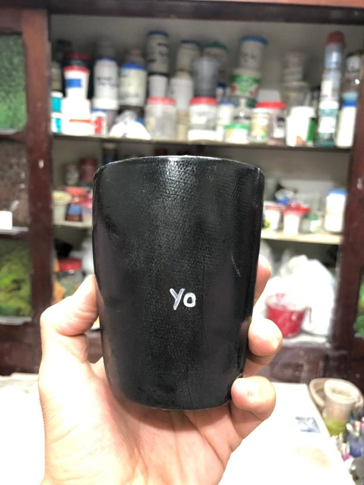](https://luvhurts.co/?attachment_id=3662)
    
- [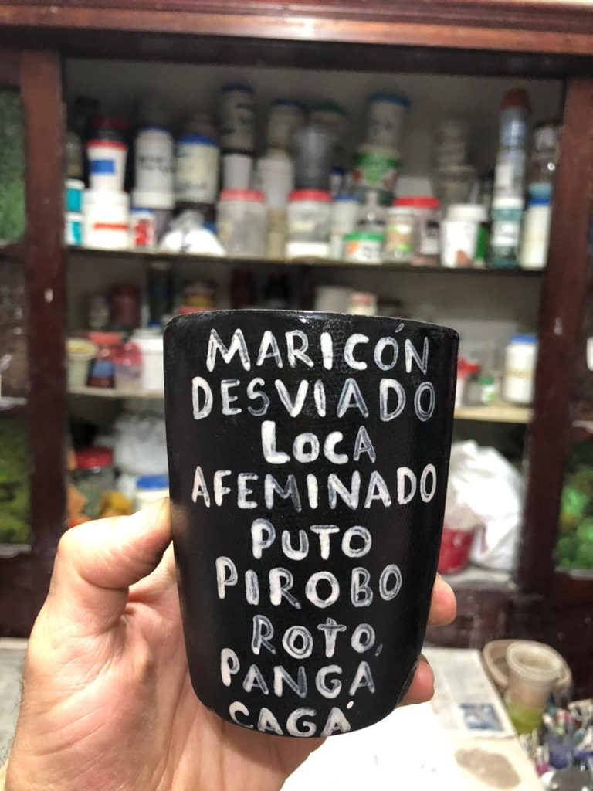](https://luvhurts.co/?attachment_id=3663)
    

**ES:** I am from Cartagena, from the Colombian Caribbean. For me the move to Bogotá was very important. In Cartagena I felt very lost and out of place, I did not feel like I was part of anything, I wanted to speak through my work but could not find the voice. Of course, at this point, I did not know that  these things are built with time. But I did know that I had to do something, a change that would produce a movement, and without a doubt, Bogotá was my best decision. In one way or another, I ended up setting up and forming a collective that would change my life, and together with another friend, my first serious collective project took off. In it, I learned many important things that I apply day to day, such as the love for this profession and the discipline that this loving relationship entails. I learned and learn each day to resist, to work with people, to be generous, and to try to be generous again the next day, with myself and with others. I learn everyday to believe in myself, to listen to myself and to value all of the decisions that I have taken and that have brought me here, as I have already said, living the best version of Sergio. I try to give this to people who come into contact with my studio and with my work in general, more than just saying in detail everything that I think and feel, more than just teaching the techniques and secrets that I have come to know about the material throughout these 11 years with the students. I want my work to offer ways, opinions, diverse situations, emotions, and possibilities of coming closer to a better version of ourselves. We construct this by working on our inner selves, through creativity. 

**LTIH:** Your work is nice ... I pick up a lot of data when I look at your INSTA page (similar to our visit). Your work is sweet, ironic and political at once. Can you say what your politics are?

**ES:** Thank you! I really like it that you say its effect is sweet, ironic and political. I think that there is nothing more political than knowing how to express the various situations that surround us in our lives, and that is precisely where my work comes from. It is about how this 36 year old gay _costeño_ lives in a country like Colombia, with the music that I like, my friends, popular sayings, things that I do not like, things that I do not agree with, things that we can work on, relationships. I think it is very important to generate, through different situations in life, actions that generate positive changes. For this, it is crucial that the things that surround you also reaffirm this purpose, for improvements in your world and in the world that surrounds you. When we change positively, we also affect the other, and then the other, and then the other, so in a country like Colombia, with a history of war and violence for more than 50 years, it is very important to know how to say: ‘no more!’ This is not okay, I am not going to be quiet, I do not want to be a witness, I do not want to participate in this violence, and I want to understand that we cannot hurt someone else for thinking differently, we cannot silence someone else because we do not like what he/she says, we cannot make someone else disappear because he/she is completely different from me. I cannot forget and leave aside someone else, because I want to control him/her completely and have it all to myself. We need to, as a society, generate a dialogue that permits us to understand and respect others’ many different situations, and bring the tools that we have over to what is possible, in order to be agents of change, positive change. Through simple gestures such as having solidarity with others and with yourself, or through our work, generating questions, emotions, reflection.

As a matter of fact, what better moment than the one that we are currently going through, to have us realize how fragile we are, that we all need a little bit of help, and some people a little bit more. As the lucky or unlucky people that we can become or already are, we realize that there are many things that are important and many that aren’t. We realize that we need each other and that we need to work so that things can be a least a little bit better. Because I believe in this. I do the work that I do, and make the pieces that I make, always with something positive, either in how it is elaborated, or by inserting some humor or sweetness that moves the spectator. For me, this is very important, and I have to confess that it is also the way that I like to approach people. I think that humor and sweetness encompass many important things that are directly related to intelligence and politics. I believe that it is the best way to use plastic tools with a critical and positive meaning. 

**LTIH:** And would you say that El Santo Taller de Cerámica is a political 'space'? 

**ES:** Definitely, yes! It is a space of resistance through art, which works with people’s creativity for the construction of positive internal landscapes. 

**LTIH:** Can you tell us something new you are working on (maybe a collaboration with another artist)? 

**ES:** Sure, at this moment, besides working on my own pieces and moving the studio, I am making a piece with Fernando Arias, a Colombian artist, who is important for his political and activist content; I am also in a project that I am super in love with. Well, first I want to say that I have a super cool collective with some friends, called “Colectivo El Engaño,” and together we are working with the Red Comunitária Trans, in a project called TRANSMEMORIA, and as the name says, we work with trans memories of people who have been assassinated or violated for being Trans, for being prostitutes, and for the different circumstances that the guild finds itself under in society, in the city of Bogotá, more precisely in the Santa Fe neighborhood. 

- [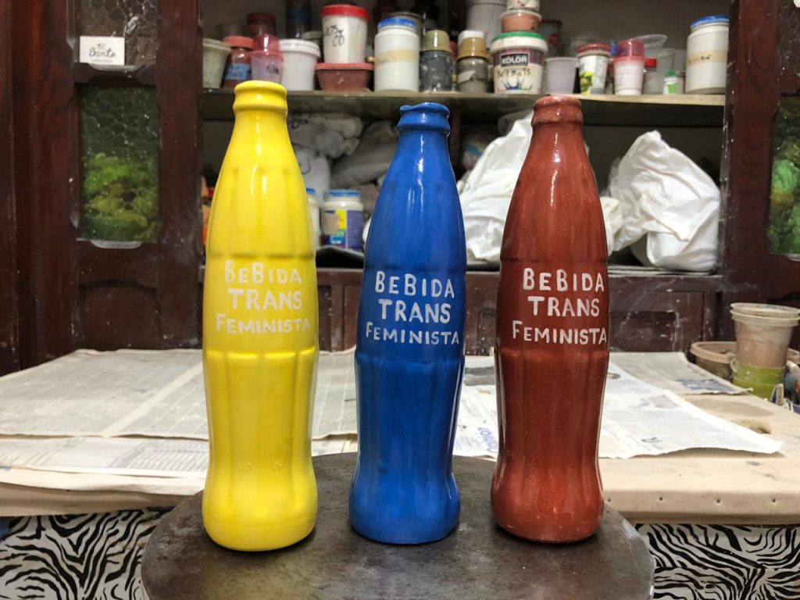](https://luvhurts.co/?attachment_id=3664)
    
- [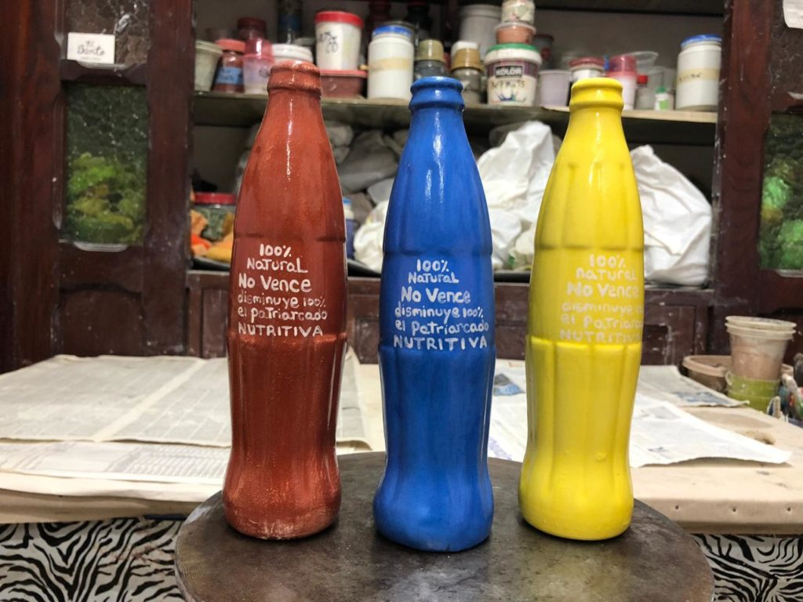](https://luvhurts.co/?attachment_id=3665)
    

I would like to tell you that to me, LA RED COMUNITÁRIA TRANS is incredible, the work they do is fantastic, how they do it, always with strength, intelligence, and without fear. They are always on their feet, always resting with joy and sensuality, and that moves me, it makes me passionate. I consider myself an ally and fan of the TRANS fight. First because it is completely violent and unjust, the fact that society arbitrarily does not allow you to be who you are or who you want to be, it seems to me like that violates all of a person’s fundamental rights. So, ever since we came into contact with them through the Engaño, we have been very moved by many things that we had ignored, and we have been fascinated with their strength and resistance. So with the Engaño, we have done some ceramic tiles that commemorate life, death, and in some way, the same neighborhood as a place of resistance. These tiles were taken from the neighborhood, at the exact spots where many girls were assassinated, in places where violence has been used against them, and places that are important to them for what they represent and for resistance. We have done this trans-prostitute-artistic action of memory and re-signification twice, and it’s been incredible for many reasons. Because we have worked together, because we have created networks. Because we have come together to leave a precedent saying that we have not forgotten our fallen sisters who we know have been assassinated, although the majority of the crimes are under a false silence. We are now more unified. We are speaking and screaming together that life is to be respected, that trans people’s lives are to be respected, and that no one has the right to impose violence onto them, no one has the right to forbid you from being who you want to be. Personally, I have learned to know and understand many very important things that I did not see before, and that have truly changed my life in a very positive way, giving me strength. The girls always fill you with empowerment and strength, so to surround myself and work with them through Engaño has been very beautiful and transformative. It fills me with a lot of pride and I feel very very happy to be part of something super magic, and for me it is moving and beautiful that they also recognize me as an ally. 

I think that together we can form a voice at the volume that is necessary for the love revolution.

BEST REGARDS AND KISSES!!!! 

\_\_\_\_\_\_\_\_\_\_\_\_\_\_\_\_\_\_\_\_\_\_\_\_\_\_\_\_\_\_\_

**ES**

**LTIH:** Do you prefer being called Sergio or El Santo? 

**ES:** Puedes decirme de cualquier forma, ambas me gustan, Sergio es el nombre que me dieron mis padres y El santo es el nombre que le di yo a mi trabajo, te contaré un poquito sobre la historia de EL Santo. 

Creo que es importante empezar contando que cuando yo estaba muy pequeño y mi madre me regañaba siempre me decía de manera irónica: “eres un santo, nunca haces nada, nadita nada”  jejeje.  En nuestra cultura los santos son muy importantes y confieso que desde pequeño me gustó mucho la idea de los Santos, como personajes, más allá de lo religioso, me gusta pensar que pueden existir seres con algún tipo de poderes o presencias mágicas, con una sensibilidad que puede cambiar las cosas, hacer cosas o lograr cosas, en la religión católica los santos y hasta el mismísimo Dios son como unos superhéroes que lo dan todo por un mundo mejor, de todo eso me parece muy bonito que uno crea en algo y me parece además vital creer en algo para poder vivir, entonces me hice la idea que el Santo podía ser este personaje que vive en mí y que se manifiesta atreves del arte y diseño, en principio por qué yo necesito creer en él, en algo.  

Y creo que así empieza la historia de este personaje o marca con el arte... Y mira que mi Santo me ha cumplido por qué yo siento y siempre cuento a mis estudiantes, que vivo la mejor versión de Sergio, haciendo lo que más me gusta.  

**LTIH:** You work in ceramics. Do you work in other media? 

**ES:** Yo creo que mi trabajo va desde la ilustración hasta la cerámica, o desde la cerámica hasta la ilustración, es un camino que se mezcla todo el tiempo, que se junta, que muestra distancias y situaciones paralelas. Yo estudié Diseño gráfico y creo que es un hecho que es un hecho que está muy presente en mi trabajo. 

**LTIH:** I met you on a trip to Bogotá to visit [Luciérnagas](https://luvhurts.co/coalition/luciernagas/), a laboratory and project convened by Daniel Santiago Salguero. We met at the culmination or final ‘performance’ of the ten laboratories staged at the city’s Botanical Gardens. I made a joke about the ceramic penis pin you were wearing and learned that you had made it. You make ceramics at a studio where you also teach, El Santo Taller de Cerámica. Can you tell us a bit about your 'operation'? What happens there? 

**ES:** EL SANTO taller de cerámica es un espacio de creación que tiene como motor principal la cerámica. Está conformado por Sergio y por toda la gente super bonita y bacana (like cool) que participa en el taller, trabajando o tomando clases, y esto es SUPER importante dejarlo claro, por qué este espacio no es una habitación privada donde un artista trabaja sus obras completamente independiente y casi enclaustrado. De la manera en la que yo trabajo, los participantes le dan vida y contribuyen a que el taller pueda latir atreves del barro, las redes que se construyen con los estudiantes, amigos, artistas y diferentes personas que intervienen en el día a día del taller permiten que el taller siga en pie, siga vivo y feliz ofreciendo un espacio como digo yo, mágico en el que se puede trabajar el interior y el pensamiento con y mientras somos creativos.  

La cerámica está llena de procesos, el material exige por naturaleza una serie de tiempos que enseñan algunas de las cosas que más nos cuesta a nosotros los humanos, y es tener paciencia, sobre todo en esas épocas y valga la pena decirlo así, que solíamos vivir antes de esta crisis, parecía que nunca teníamos tiempo para nada y que necesitábamos todo para ya, de entrada eso en el arte es muy difícil, las prácticas artísticas y creativas están llenas de entendimientos y  procesos con los materiales que se trabaja y momentos de reflexión. Eso del arte es fascinante porqué siempre exige tiempo y es una gran lección, y la cerámica no es la excepción, te obliga a trabajar el material, casi desde cero y si no tienes pasta cerámica o barro, desde cero literal. 

**LTIH:** You are based in Bogotá, but from another part of Colombia. Can you remind me, and when did you move to the capital? 

**ES:** Yo soy de Cartagena, del caribe Colombiano, para mí el cambió a  Bogotá fue super importante. En Cartagena me sentía muy perdido y desubicado, no me sentía parte de nada, quería hablar con mi trabajo pero no encontraba la voz. Claro en ese momento yo no sabía que esas cosas se construyen con tiempo , pero si supe que debía hacer algo, un cambio que produjera un movimiento  y sin duda Bogotá fue mi mejor decisión, de una u otra forma terminé armando y formando un colectivo que cambiaría mi vida y junto con otro amigo arrancó mi primer proyecto en colectivo serio, donde aprendí muchas cosas importantes que aplico día a día, como el amor por esta profesión y la disciplina que implica esta relación amorosa, aprendí y aprendo cada día a resistir, a trabajar con la gente, a ser generoso, y a tratar al día siguiente de ser nuevamente generoso, conmigo y con los demás, y aprendo todos los días a creer en mí, a escucharme y a valorar todas las decisiones que he tomado y qué me tienen aquí, como ya lo dije viviendo la mejor versión de Sergio. Y eso intento dar a las personas que tienen contacto con mi taller y con mi trabajo en general, más allá de contar con cada pieza lo que pienso y siento, más allá de enseñar las técnicas y secretos que conozco del material a lo largo de estos 11 años con los estudiantes, quiero que mi trabajo ofrezca maneras, opiniones, situaciones diversas, emociones y posibilidades de acércanos a una mejor versión de sí mismos.  Eso lo construimos trabajando nuestro interior con creatividad.  

- [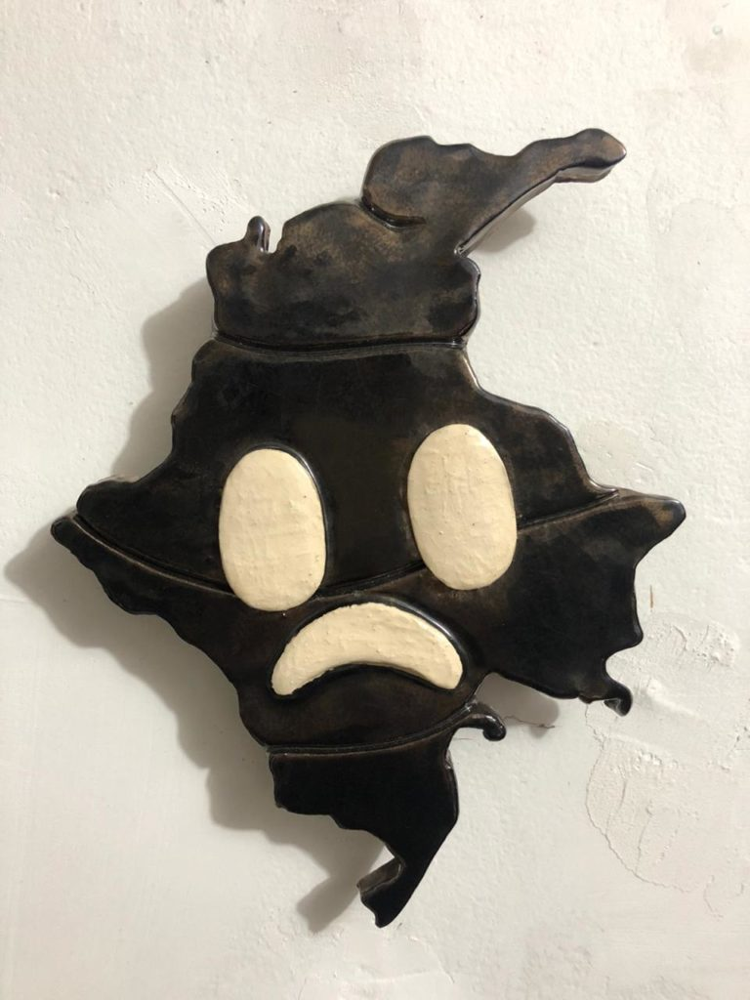](https://luvhurts.co/?attachment_id=3666)
    
- [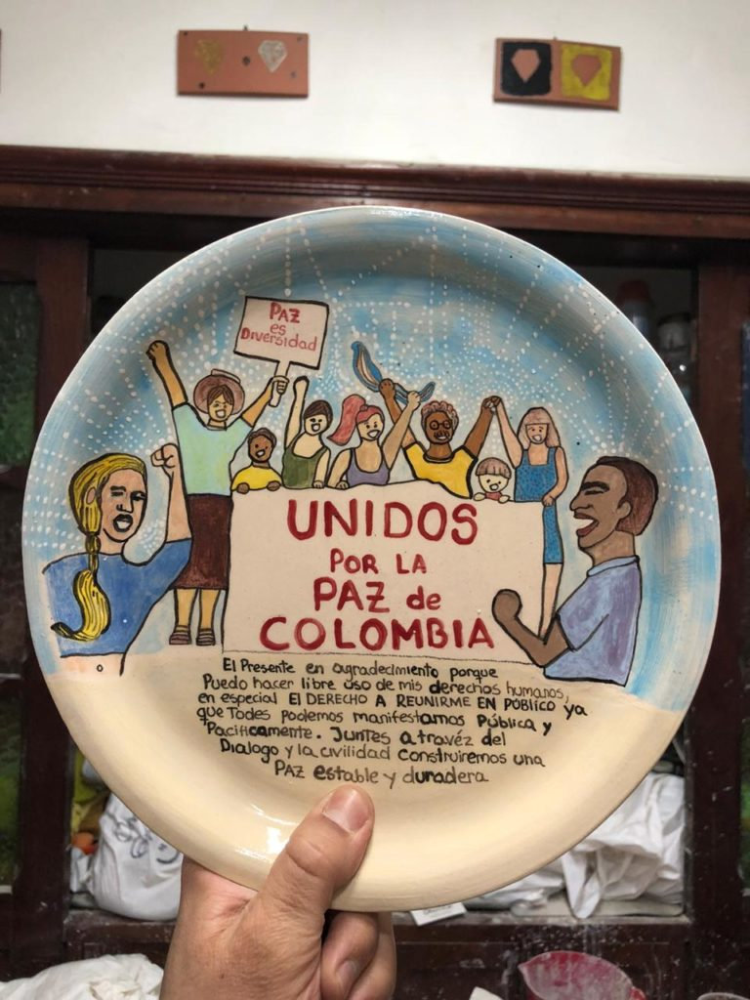](https://luvhurts.co/?attachment_id=3667)
    
- [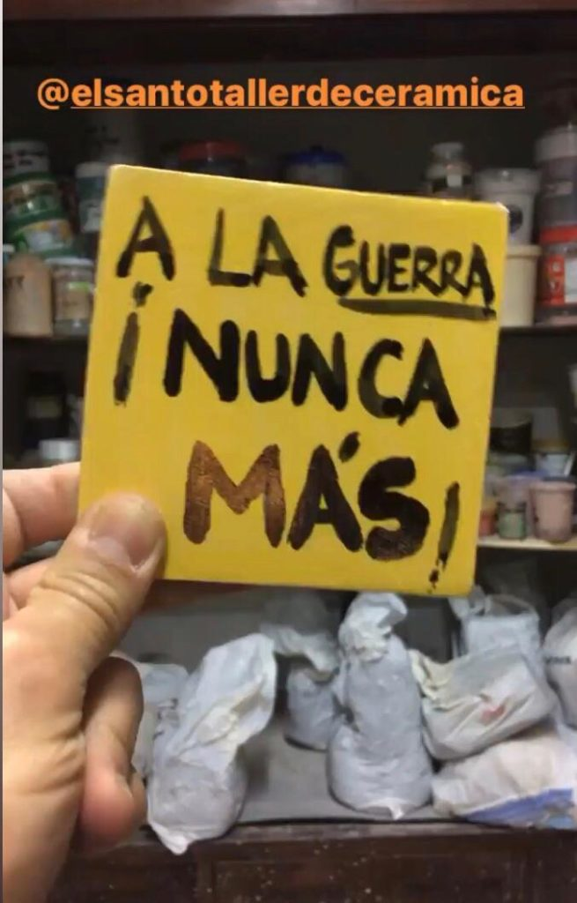](https://luvhurts.co/?attachment_id=3668)
    

**LTIH:** Your work is nice ... I pick up a lot of data when I look at your INSTA page (similar to our visit). Your work is sweet, ironic and political at once. Can you say what your politics are? 

**ES:** Gracias! me gusta mucho cuando dices que es dulce e irónico y político en su defecto, creo que de entrada no hay nada más político que saber expresar las situaciones diversas que nos rodean en nuestra vida y precisamente de eso va mi trabajo,  de cómo vive este costeño gay de 36 años en un país cómo Colombia, en la música que me gusta, en los amigos, en los dichos populares, en las cosas que no me gustan, en las cosas con las que no estoy de acuerdo, en las cosas que podemos trabajar, en las relaciones. Yo creo que es muy importante generar a través de las diferentes situaciones de la vida acciones que generen cambios positivos, para esto es clave que las cosas que te rodeen también reafirmen ese propósito en pro de mejoras a tu mundo y al mundo que te rodea. Cuando cambiamos positivamente afectamos también positivamente al otro y el otro al otro, entonces en un país cómo Colombia con una historia de guerra y violencia de más de 50 años es muy importante saber decir, no más! eso no está bien, no voy a callar, no quiero ser cómplice, no quiero participar de esa violencia y entender que no podemos agredir al otro por pensar diferente. No podemos silenciar al otro porque no me gusta lo que dice, no podemos desaparecer al otro porque es completamente diverso a mí, no podemos marginar a los otros por qué sus decisiones y privilegios son diferentes a los míos. No puedo olvidar y dejar de lado al otro porque quiero controlarlo todo y quiero que todo sea para mí. Necesitamos como sociedad generar un dialogo que nos permita entender y respetar las situaciones diversas de los demás y aportar con las herramientas que tengamos en lo posible para ser agentes de cambios, cambios positivos, a través de gestos sencillos como ser solidario con los demás y conmigo mismo o a través de nuestro trabajo generando preguntas, emociones, reflexión.  

Inclusive qué mejor momento que el que estamos viviendo para darnos cuenta de lo frágiles que somos, que todos necesitamos un poco de ayuda y algunas personas un poco más, de lo afortunados o desafortunados que podemos llegar hacer o somos, nos damos cuenta que hay muchas cosas importantes y muchas que no, nos damos cuenta que nos necesitamos y necesitamos trabajar para que las cosas estén al menos, un poquito mejor. Porque creo en eso, hago el trabajo que hago y hago las piezas que hago, siempre con algo positivo. Ya sea por la manera en la que está elaborado o porque encierre algo de humor o ternura que logre mover al espectador, para mí esto es muy importante y debo confesar que además es la manera en que me gusta acercarme a la gente. Pienso que el humor y la ternura encierran muchas cosas importantes relacionadas directamente con la inteligencia y la política, creo que es la mejor manera de utilizar las herramientas plásticas con sentido crítico y positivo.  

- 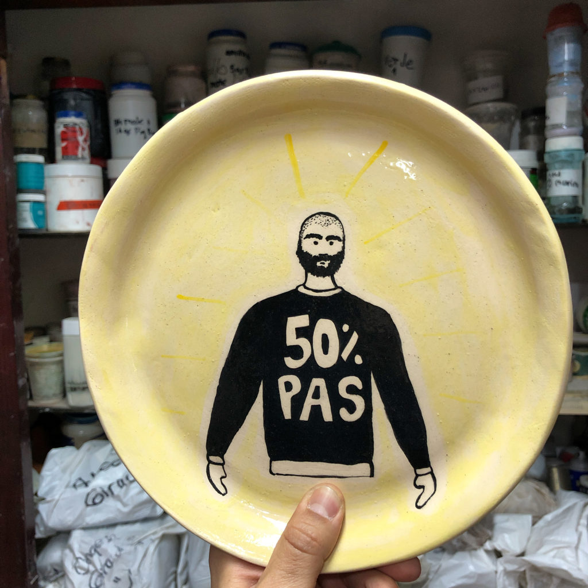
    
- 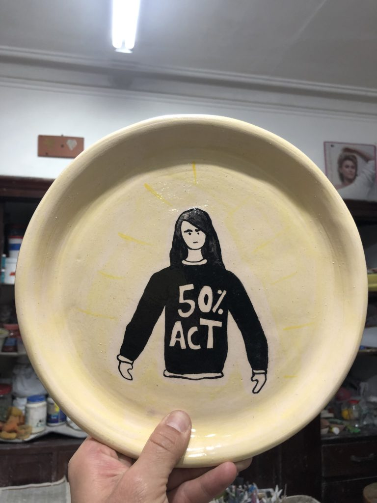
    

**LTIH:** And would you say that El Santo Taller de Cerámica is a political 'space'? 

**ES:** Definitivamente si! es un espacio de resistencia a través del arte, que trabaja con la creatividad de las personas para la construcción de paisajes internos positivos.   

**LTIH:** Can you tell us something new you are working on (maybe a collaboration with another artist)? 

**ES:** Claro, en este momento además de estar trabajando en piezas mías y estar moviendo el taller, estoy haciendo una pieza con Fernando Arias, artista colombiano, importante por su contenido político y activista;  también estoy  en un proyecto que me tiene super enamorado, bueno, primero quiero contar que yo tengo un colectivo super chévere con unos amigos que se llama "Colectivo El Engaño" y  juntos estamos trabajando con la Red Comunitaria Trans  en un proyecto que se llama TRANSMEMORIA, y como lo dice su nombre,  hacemos memoria Trans a diferentes  personas que han sido asesinadas y violentadas por ser Trans, por ser putas y por diferentes circunstancias en las que se encuentra el gremio en la sociedad, en la ciudad de Bogotá, más exactamente en el Barrio Santa Fe. Quisiera contar que a mí LA RED COMUNITARIA TRANS me parece increíble, me parece fantástico el trabajo que hacen, como lo hacen, siempre con fuerza, inteligencia, con o sin miedo siempre están de pie, siempre resistiendo con alegría y sensualidad y esto me emociona, me apasiona, me considero un aliado y fan de la lucha TRANS. De entrada porque es completamente violento e injusto que la sociedad arbitrariamente no te deje ser quién eres o quien quieres ser, eso me parece que atenta contra todos los derechos fundamentales de una persona. Así que desde que tuvimos contacto con ellas en el Engaño nos sentimos muy tocados por un montón de cosas que ignorábamos y quedamos fascinados con su fuerza y resistencia. Entonces hicimos con el engaño unas baldosas en cerámica que conmemoran la vida, la muerte y de alguna manera el mismo barrio como lugar de resistencia, estas baldosas las pegamos en el barrio en los lugares exactos donde fueron asesinadas muchas chicas, en sitios de violencia contra ellas y en lugares importantes para ellas por lo que representan y por resistencia. Esta acción trans puteril artística de memoria y resignificación la hemos hecho dos veces y ha sido increíble, por muchas razones. Porque hemos trabajado juntos, porque hemos hecho redes, porque nos hemos unido para dejar un precedente diciendo que no olvidamos a las hermanas caídas, que sabemos que fueron asesinadas y aunque la mayoría de los crímenes están en un falso silencio ahora estamos más unidos, hablando y gritando juntos que la vida se respeta, que la vida de las personas Trans se respeta y que nadie tiene derecho a violentarlas, nadie tiene derecho a prohibirte a ser quien tú quieres ser. Personalmente, he aprendido a conocer y a entender muchas cosas muy importantes que antes no veía y que de verdad me han cambiado la vida de manera muy positiva, me he llenado de fuerza, las chicas siempre te llenan de empoderamiento y fuerza, entonces llegar a acercarme y trabajar con ellas con el engaño ha sido muy bonito y transformador y me llena de mucho orgullo y me siento muy muy feliz de ser parte de algo super mágico, y para mí es muy emocionante y bonito que ellas también me reconozcan como un aliado.  

Creo que juntos podemos formar una voz con el volumen necesario para la revolución del amor.  

¡¡¡¡SALUDOS Y BESOS!!!! 

Pictures by: Sergio El Santo/El Santo Taller de Cerámica

- [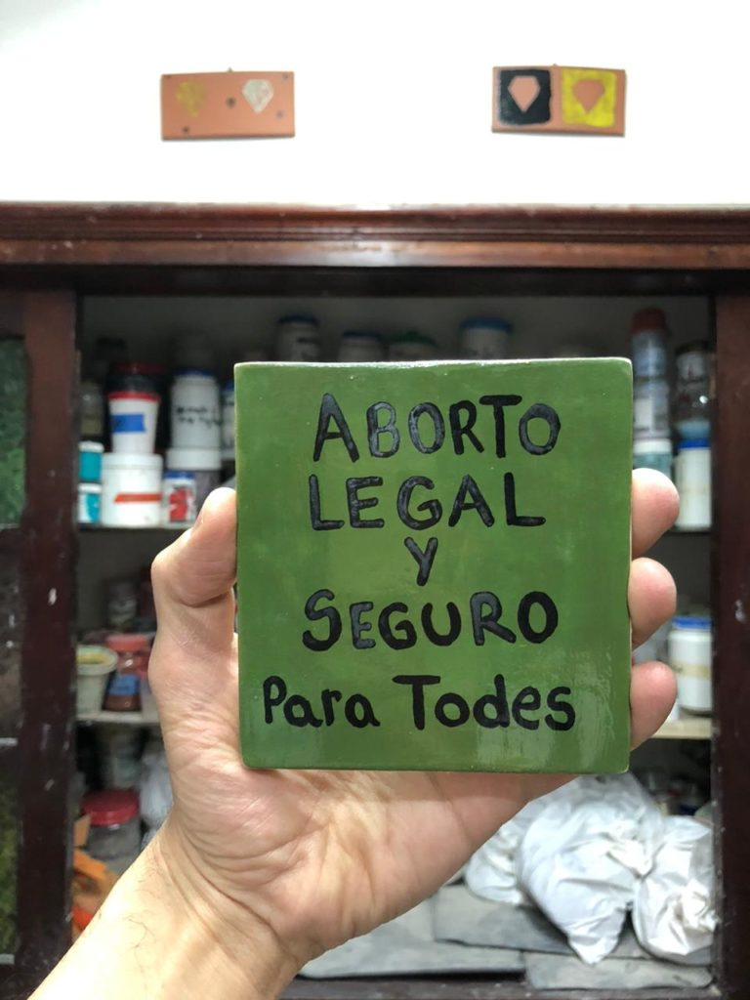](https://luvhurts.co/encounters/a-visit-with-el-santo-taller-de-ceramica-bogota/attachment/whatsapp-image-2020-04-23-at-5-36-51-am-1/)
    
- [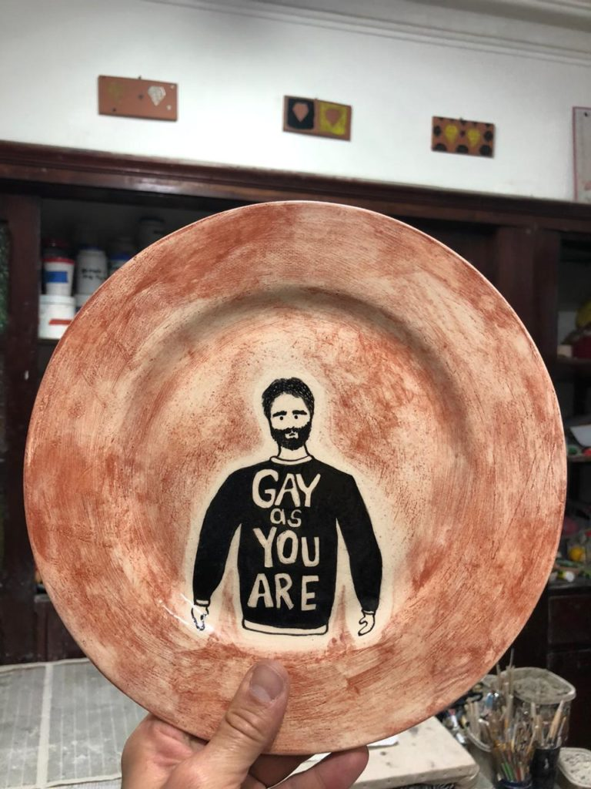](https://luvhurts.co/encounters/a-visit-with-el-santo-taller-de-ceramica-bogota/attachment/whatsapp-image-2020-04-23-at-5-36-51-am-2/)
    
- [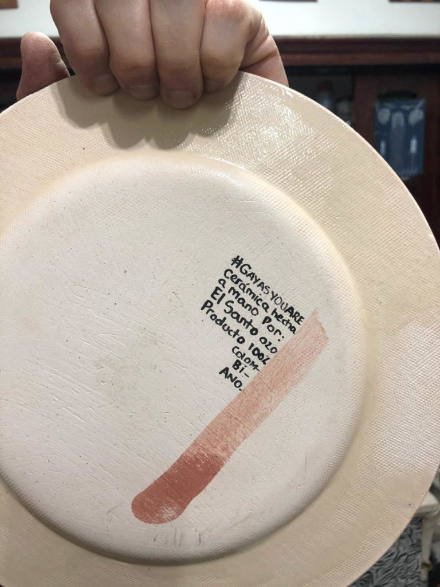](https://luvhurts.co/encounters/a-visit-with-el-santo-taller-de-ceramica-bogota/attachment/whatsapp-image-2020-04-23-at-5-36-52-am-3/)
    
- [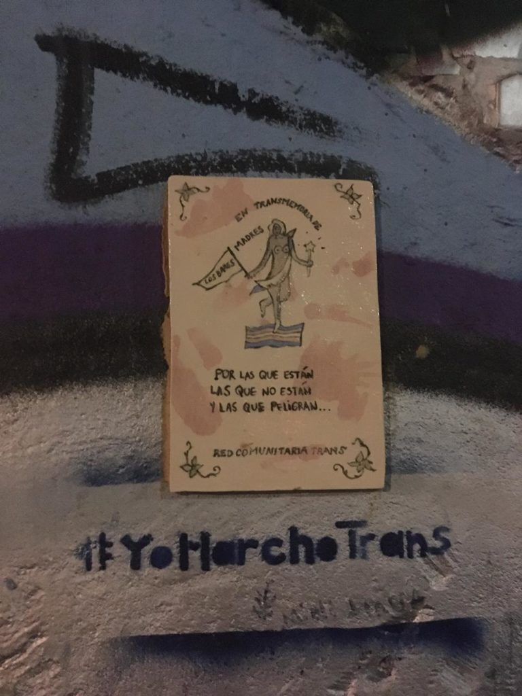](https://luvhurts.co/encounters/a-visit-with-el-santo-taller-de-ceramica-bogota/attachment/whatsapp-image-2020-04-23-at-5-36-55-am/)
    
- [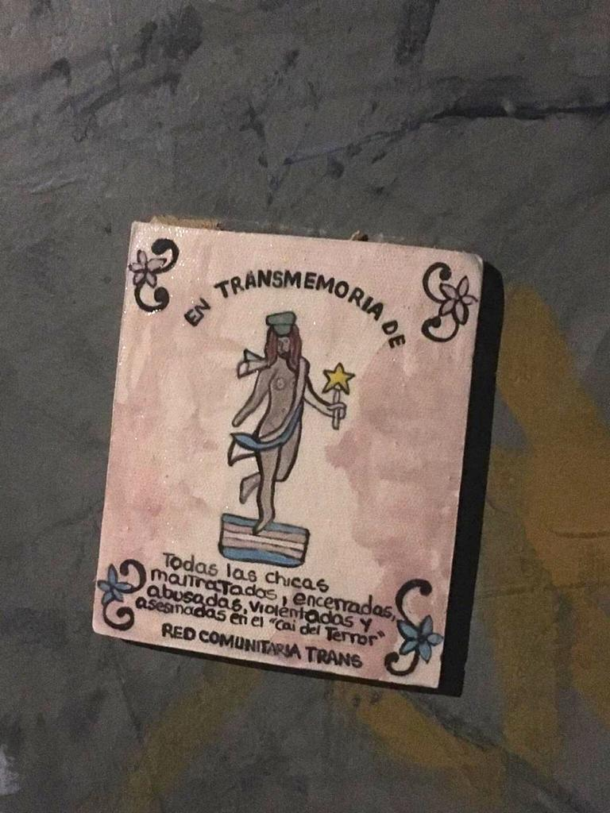](https://luvhurts.co/encounters/a-visit-with-el-santo-taller-de-ceramica-bogota/attachment/whatsapp-image-2020-04-24-at-12-13-46-pm/)
    
- [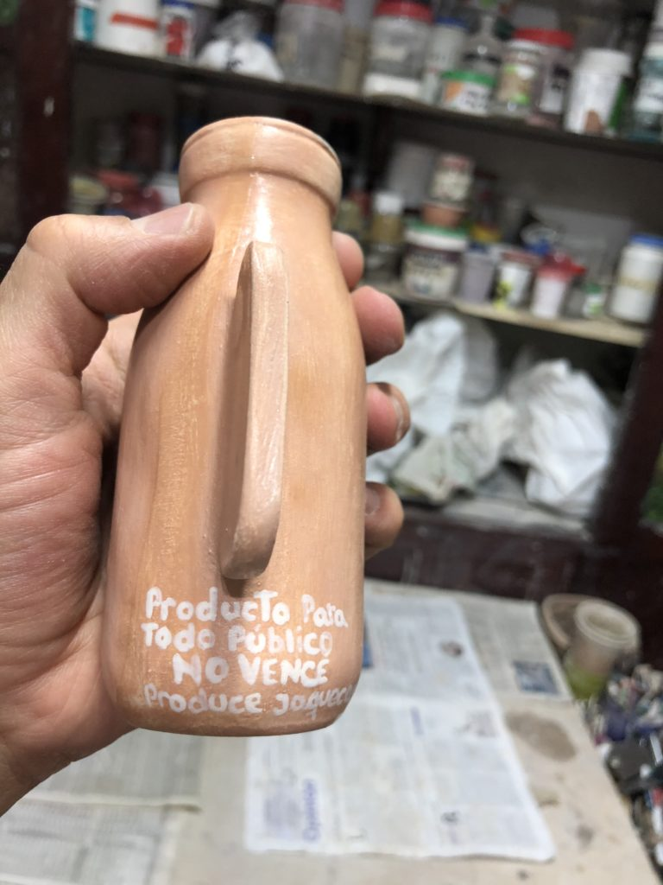](https://luvhurts.co/encounters/a-visit-with-el-santo-taller-de-ceramica-bogota/attachment/bebida-maricona-1/)
    
- [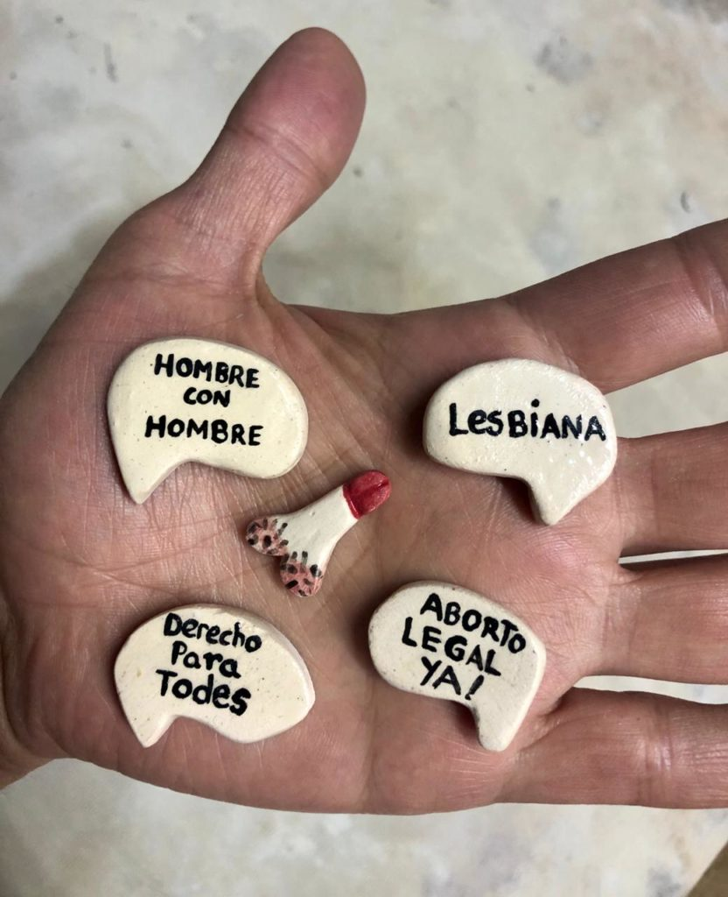](https://luvhurts.co/encounters/a-visit-with-el-santo-taller-de-ceramica-bogota/attachment/whatsapp-image-2020-04-23-at-5-36-56-am-1-1/)
    

Instagram: [El Santo Taller de Cerámica](https://www.instagram.com/elsantotallerdeceramica/)
