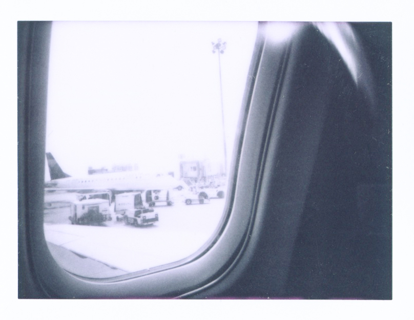

"It is just another coin in the pouch. Sometimes it comes out heads; it's a blessing. Sometimes it comes out tails; it's a curse". --- [Frederick Weston.](http://visualaids.org/artists/detail/frederick-weston)

As I have struggled at the many crossroads in my life, I have never thought one day I will embrace such thing that I used to disregard in my everyday life, and even carry it go on a journey for staying alive. To continue my research on HIV/ AIDS, I traveled to the city which is 12 hours different from my motherland, selling myself to explain my story and my project often and often, like the endless stage. There were happiness and disappointment in this unpredictable magical script; sometimes I even feel like I might have already seen it all, but of course, I have not, since I am merely a human being who is trying to find the connection as the lifeline to keep going. It seems like the world did hear my hunger, once again I had the opportunity to visit a new land where I have never been, I flew to Amsterdam for the [2018 International AIDS Conference](http://www.aids2018.org/) from the surreal life in New York.

<figure>

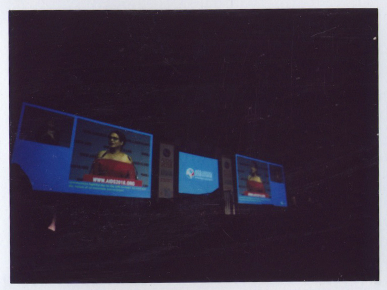

<figcaption>

Former sex worker Dinah de Riquet-Bons giving the speech at the opening.

</figcaption>

</figure>

  

The theme of AIDS 2018 is "Breaking Barriers, Building Bridges.”With the idea to create the bridge to link the right ground, the provider, researcher, social worker, artist, activist, and even the sales around the world who works in the AIDS field, all travel to Amsterdam for this biennial reunion. The 15,000 AIDS delegates from 160 countries take to the halls to share their research, experiences, and insights from the global response to HIV. The opening ceremony was one of the moments that made my sight misty from hearing those who already engage with the AIDS fight for a long time, and of course the voice of the unignorable youth force.

I was fortuned to receive the scholarship' support for this trip as a young artist/ activist from Taiwan and sharing the room with my case manager Issac. By offering more than 1,100 scholarships, the conference organizers made the conference accessible to people from resource-limited settings, researchers, young people, key and vulnerable populations and community representatives.

<figure>

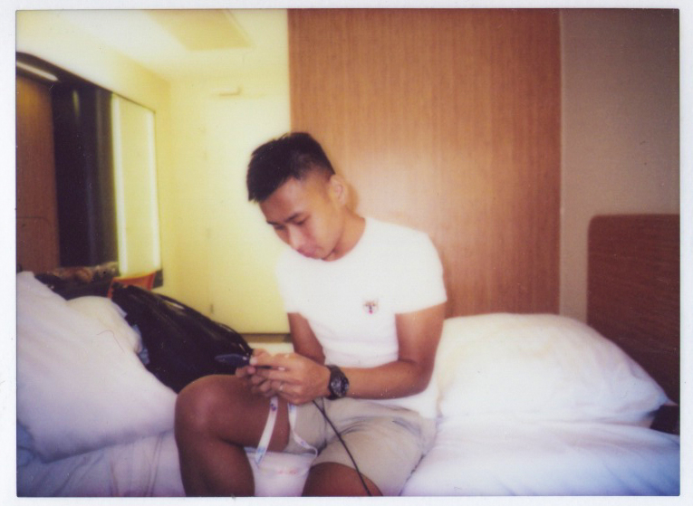

<figcaption>

Issac is checking the daily sessions on the conference’s app.

</figcaption>

</figure>

The young Filipino American researcher Alex Adia who led the research to the HIV-positive individuals to his homeland Malina. Devmi Dampella and Richa Saivi, the two youth advocate working in the field of sexual and reproductive health and rights at Family Planning Association(FPA) in Sri Lanka and India. Ghaith Ghaffari, a doctor and TV presenter in Baghdad, Iraq. Sophie Ryder-Jones Kortenbruck, my brave "sister" who just started her journey of activism to speak for the female HIV-positive community in Berlin through the broadcast and comedy show. I connected with these beautiful souls through the potluck lunch of the scholarship community, each of us has the different motivation and story to make this connection happen.

<figure>

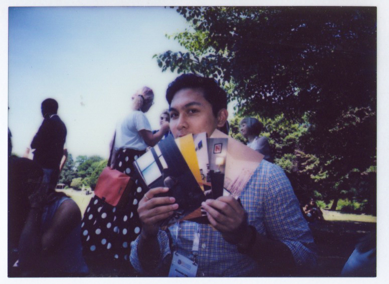

<figcaption>

Alex holding the postcard of my project [Humans As Hosts](https://www.kaironliu.com/humansashosts) with the information of Luv ’til it Hurts.

</figcaption>

</figure>

<figure>

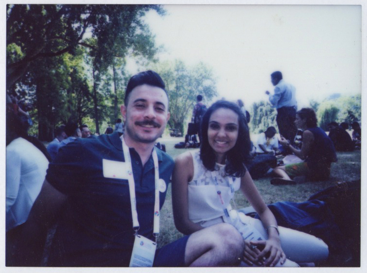

<figcaption>

Ghaith Ghaffari and Devmi Dampella.

</figcaption>

</figure>

<figure>

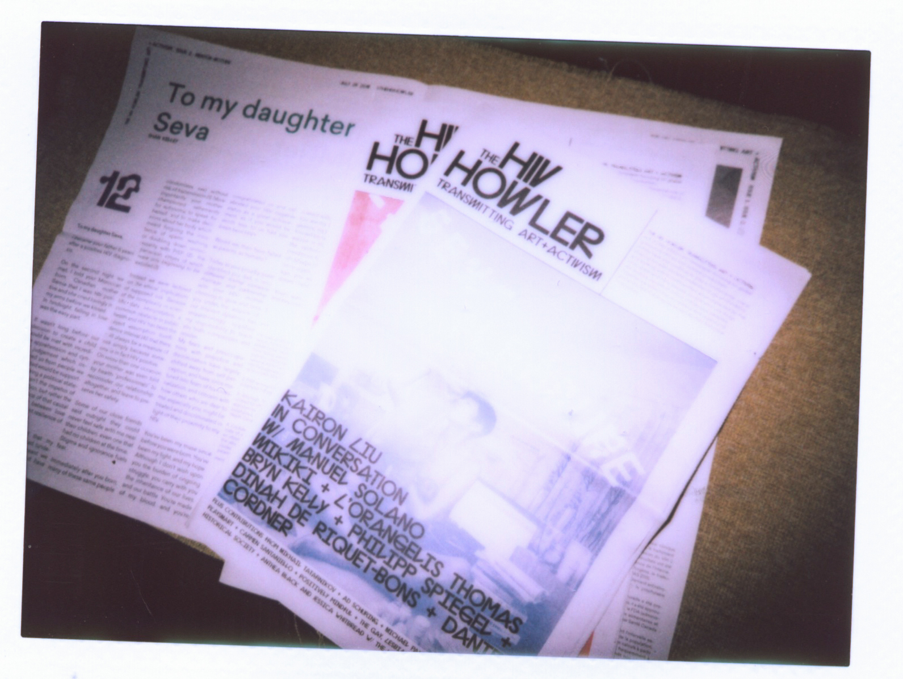

<figcaption>

One of the portrait pieces of Humans As Hosts on the cover of The HIV Howler issue 3.

</figcaption>

</figure>

This opportunity to AIDS 2018 has also made my participation in The HIV Howler possible. One month after I submitted my scholarship application, I received the invitation from the lovely publisher/editor Jessica Whitbread and Anthea Black, to present an in-conversation piece with the Manuel Solano by the coordinating and editing of Theodore Kerr. The conversation not only shows both of our vulnerability as an artist, and also the living situation in both of our surrounding. This artist newspaper recruited the arts from the poz artist in different nations, it first published at the conference in Amsterdam and now in Toronto.

<figure>

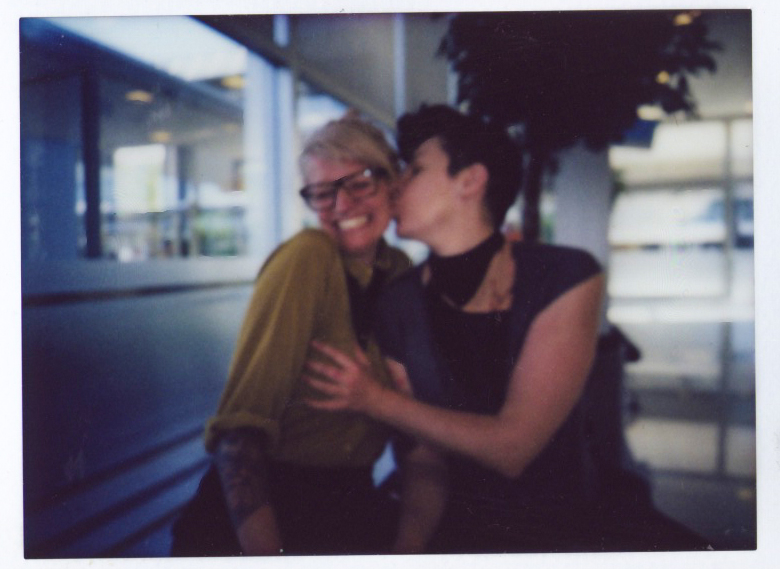

<figcaption>

The lovely couple Jessica and Anthea, they dedicate to create AIDS activism in multiple ways.

</figcaption>

</figure>

<figure>

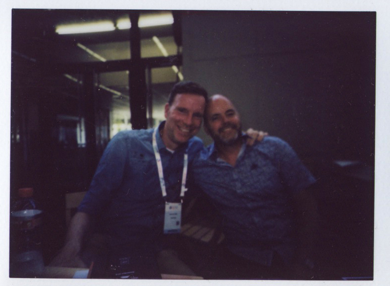

<figcaption>

The provider of [olvg](https://www.olvg.nl/) and his friend.

</figcaption>

</figure>

<figure>

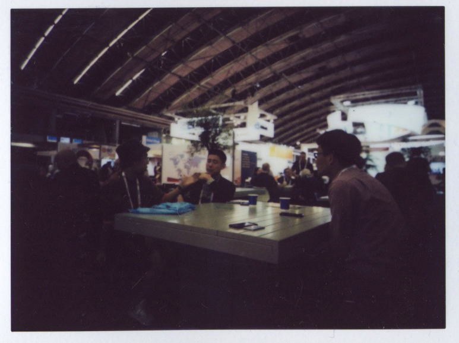

<figcaption>

A discussion between the researcher from Hongkong, China and a doctor and artist from Taiwan.

</figcaption>

</figure>

<figure>

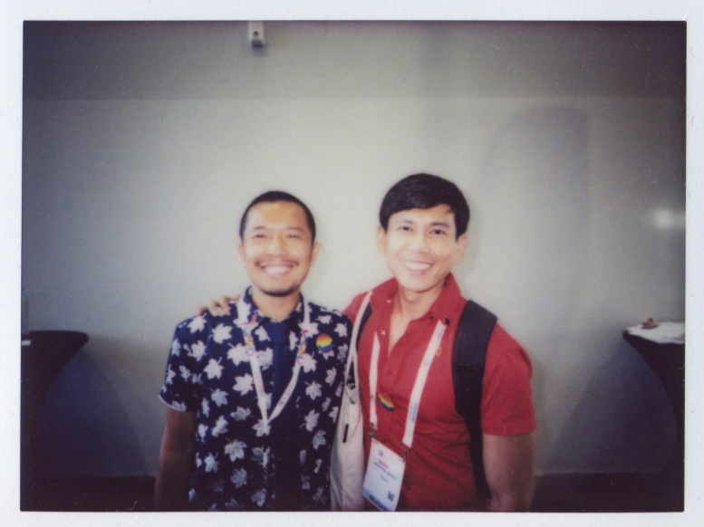

<figcaption>

Midnight Poonkasetwattana and Inad Quinones Rendon from [apcom](https://apcom.org/).

</figcaption>

</figure>

In this 7-days inspiration, most of my magical moment happened at Global Village. It was way beyond my imagination that how the artist/activist from different nations deliver their faith and necessity. The Global Village space itself is a big platform for bearing the multiple dialogue and magical coincidence. I remember that unexpected conversation about The HIV Howler, Humans As Hosts and Luv 'til it Hurts with the local health community center olvg, the excellent photobook "Invisible Lives" topic on the key population of HIV in different regions by Colet van der Ven and Adriaan Backer, the nice meeting with Carué ContreirasCarué Contreiras to learn the current situation and his story in Sao Paulo, The discussion for future collaboration with Midnight Poonkasetwattana and Inad Quinones Rendon from apcom. And most importantly, to engage more with the Taiwanese community. At this once in a lifetime chance, we spoke about to create the event for World AIDS Day event in Taiwan, and how can we develop the workshops for the providers to erase the stigma and rejection against the HIV-positive individuals. The conversations and networks that I gain during the period of the conference reveal the new page my journey as an activist and the beginning of this newborn AIDS campaign: Luv 'til it Hurts.

<figure>

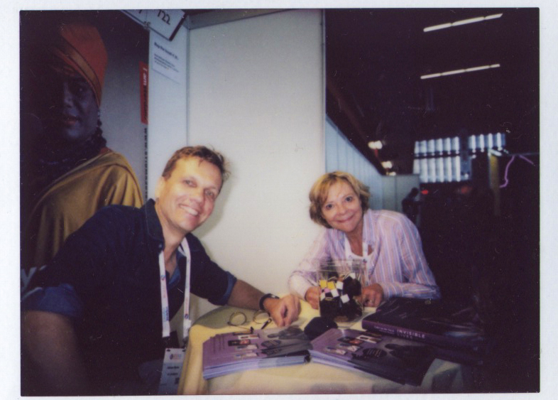

<figcaption>

Colet van der Ven and Adriaan Backer, the author and photographer of [Invisible Lives.](https://www.stigma2018.com/en-gb/home)

</figcaption>

</figure>

<figure>

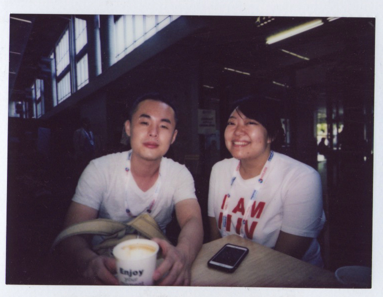

<figcaption>

A meeting with [Taiwan Tongzhi(Gay) Hotline Association](https://hotline.org.tw/english) and [Persons with HIV/AIDS Rights Advocacy Association of Taiwan (PRAATW)](https://praatw.org/)

</figcaption>

</figure>
