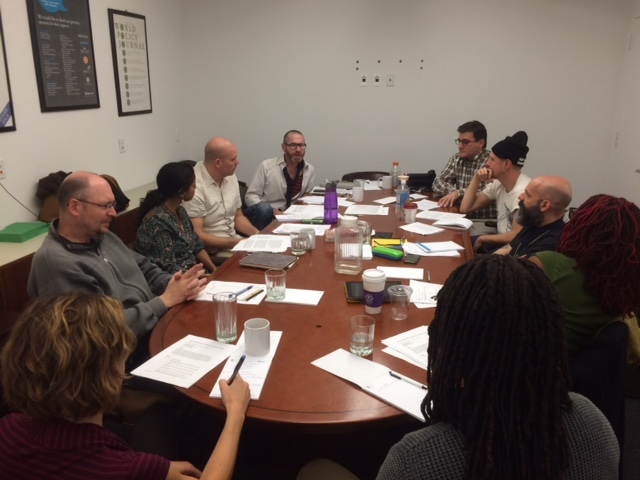
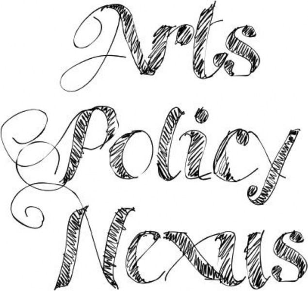

_\[\*A few years back, I created a meeting concept called Artist Roundtable (or A.RT) … I want to resuscitate this particular discussion on health and wellness in order to share [a unique policy paper](https://luvhurts.co/encounters/a-re-imagination-of-policy-and-health-2-of-2/) that came thereafter as byproduct. This article was originally_ [_published by the World Policy Journal_](http://worldpolicy.org/2015/06/09/art-policy-and-wellness/) on June 9th, 2015_. xo Todd\]_

_What would a policy that incorporates our ideas of medicine look like?_

On Friday, May 1, Artist Roundtable (A.RT) sought to answer this question during its third event, hosted by the World Policy Institute’s Arts-Policy Nexus. Developed by Todd Lester, director of Arts-Policy Nexus, A.RT is an approach to bridging different disciplines in creative work and policy-making as well as addressing crucial issues from varied directions.

Since A.RT’s foundation in 2014, four roundtables have taken place in Guelph, Canada, Sao Paulo, Brazil, New York, U.S., and Vancouver, Canada. The topics of discussion range from [climate change](http://worldpolicy.org/blog/2014/11/04/artist-roundtable-art-art-and-politics), to water, health, and [new economies](http://musagetes.ca/artist-round-table-a-rt-on-new-economies/)—with more on the way. The May 1 event, convened by Lester along with colleagues Nicolle Bennett, Program Director for Feel the Music!, and Patrick (Pato) Hebert, Associate Professor in the Department of Art and Public Policy at Tisch School of the Arts at NYU, brought together 11 like-minded artists for a conversation focused on the relationship between creativity, health, and wellness. The discussion further sought to explore how the relationship between artists and policymakers can help resolve localized health issues, how artists can better engage in this process, and the concrete benefits they can offer to the health field.

As the work of many invited to the conversation can attest to, art is a form of policy in and of itself. The arts are a representation of culture and society voiced through words, paintings, actions, and performance that can often shape the direction of policies long before they develop. In many cases, the connections and channels of communication that the arts provide may be more effective than traditional means of communication at conveying messages. In seeking to answer the question _“what would a policy that incorporates our ideas of medicine look like?”_ the artists at the May 1 event offered not only an expanded view of wellness, but also a wider definition of policy and those ultimately responsible for its creation.

As the discussion opened, the group spoke of the necessity of art in reshaping our understanding of health and well-being. More often than not, health is an intervention rather than an intravention; it is fundamentally reactionary. Throughout the afternoon, one phrase mentioned by those in the roundtable in particular stayed in the minds of those participating: “Nothing about us without us”—the latter ‘without us’ clause symbolizing the engaging and connective capacity of art and its application to health policy.

“Art needs language, but also gives language,” said Grace Aneiza Ali, founder of _[OF NOTE](http://www.ofnotemagazine.org/)_, a magazine on how creativity affects policy, “speaking in an ordinary way by extraordinary means is more effective in outreach.” Art gives language an avenue to maneuver with ‘us,’ whoever ‘us’ may be.

Ali went on to explain the divorce of spirituality from life, and how the separation affects our ideas of health and wellness. Spirituality, she said, is not the same as religion. Spirituality is defined as a general connection with those around you that is not necessarily initiated through a ritual. Because art can be practiced and enjoyed across social groups, it allows people to convey a message to a wider audience without having to be validated by an authority.

In its utilitarian and universal nature, art also serves as a platform for advocacy and activism, often grabbing the attention of those otherwise uninterested or unaware. One participant, Richard Hofrichter, Senior Director at Health Equity NACCHC, defined cultural activism as “representing a way of giving voice to people in their own language and images, derived from historical memory and current experiences, that enable grassroots groups to serve as a face of change.”

There are also more direct ways to promote health and well-being through creativity. Nelson Santos, Executive Director of [Visual AIDS](https://www.visualaids.org/), leads a collective that uses art to fight the spread of AIDS by provoking social interaction. One such project (“[Self-Enforced Disclosure](https://www.visualaids.org/gallery/detail/898)” by Greg Mitchell, 2007) features a man displaying a tattoo on his arm resembling a branded cattle, identifying himself in a somewhat contradictory playful font as being HIV-positive. The rough edges of the insignia symbolize the necessity of revealing such intimate information, yet the arcade game lettering and placement on a human body suggest a personal ownership of the HIV condition.

This more direct form of activism expressed in visually provocative images fosters a dialogue both with and among its audience. Using visual art to stir discussion brings those disconnected from important issues into a conversation that fosters better-informed points of view.

- 
    
- 
    

Members of the community can find therapeutic benefits from engaging themselves in creative activity. For instance, taking a simple “time out” from a busy day to draw and color can bring about a sense of youthful serenity in adults. [Lacy Mucklow](http://www.washingtonpost.com/express/wp/2015/03/24/coloring-books-for-grown-ups-can-ease-stress-and-calm-the-inner-child/), the author of Color Me Happy and Color Me Calm aims to alter the energy and mood of adults with her new coloring books. Coloring, which has a proven calming effect on children, renders the same results with individuals of almost any age. “Relief and healing come from this time out,” Mucklow says. Some simple “you” time with a coloring book can help calm and re-center your thinking and attitude.

Carlos Rodriguez Perez, the Director of Wellness and Recovery Division at Kings County Hospital Center, also recognizes the necessity of art and interaction in promoting wellness, as well as the inherent link between therapeutic activity and social change and justice.

In [partnership](http://worldpolicy.org/blog/2015/04/30/new-approaches-art-well-being) with the Beautiful Distress Foundation, Kings County hosts artists in its progressive arts therapy programs. With the help of resident artists such as Aldo van den Broek, this partnership is expanding the traditional definition of artist residencies and, in the process, the perceptions of mental health institutions and patients within the surrounding community. In a follow-up site visit to the program, A.RT participants were able to learn about the varied roles of artists within this space: as therapy providers, co-creators, and community engagers, all with the goal of reducing the effects and stigma of mental illness.

Even outside the context of experimental institutional partnerships, artists play a myriad of roles. Creative connectors, bridge-builders, providers of language, and stimulators of imagination—artists can speak to that which makes us uniquely human and connects us to others. In this regard, not only is art a tool to promote wellness for the individual, as in the case of coloring books, but also a way to promote advocacy and cultural dialogue to confront larger societal issues—as works like “Self-Enforced Disclosure” seek to achieve.

As the roundtable came to an end, the participants agreed on one thing: that the collaborative process can and will continue to explore ways that art and its creators can contribute, advocate, and co-create with both communities and policymakers surrounding issues of wellness and health. As the saying goes, “Nothing about us without us.”

\*\*\*\*\*

\*\*\*\*\*

_Jordan Clifford is an editorial assistant at_ World Policy Journal.

\[Photos courtesy of World Policy Institute\]
