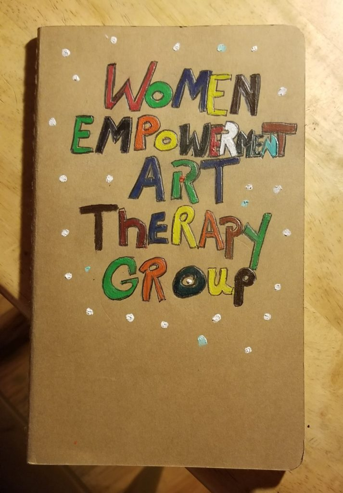

By Wanda Hernandez Parks

Chair on the board of Directors of Vocal-NY, cofounder of the Women Empowerment Art Therapy group, with Shirlene Cooper. I have encountered many great organizations, but only one connects art and activism. I became a member of Visual AIDS in 2014, when I attended the Love Positive Women event. I immediately fell in love with Visual AIDS and their mission and I am taking in every opportunity I can to leave a legacy behind.

I didn’t even think of being considered an artist by just making and painting crazy things. I love to create things, write poetry it keeps me relaxed, mentally and spiritually grounded. Not only is art fun and expressive, it allows me to let go and let my art open the door for dialogue. Art allows me to see first-hand beauty develop right before your very eyes. 

I have learned to sketch, color, draw, put things together and learned how to create beautiful colors schemes and shades. I have learned to share any and all knowledge with others who are not aware how, where and what they can do. 

Art brings together talented artist including myself, it allows me as an artist to be a part of the artistic community, unlocking dormant files and merging the past and present. Incorporating the two has a huge impact on society and my personal self. My work and that of other artist before me whose work is hidden from within. Art allows me to come forward and use yet another skill, art brings me joy. It soothes, calms and up lifts me. It inspires joy to physically have something you created, be a part of history is surreal. A piece of me something someone will cherish for eternity

Let’s not forget all the wonderful individuals I meet along the way, domestically and internationally. Whose stories connect the absence of a male figure in the home, single women man’s role. The streets are a jungle, every day I learn something new, things I see keep me in the loop and my inspiration kicks into mode.  I write or I draw, it all depends on how my spirit flows. There are many talented people in the streets of New York, many of our brothers and sisters behind the walls, women in crisis incarcerated souls, art brings out talent they didn’t know.  I have seen the talent I have witnessed the flows that keep the best artist from coming forth. In shadow counting let not exclude the homeless many great talents in the streets has fallen.

I am extremely excited to have entered the wonderful world of artistry it not only has broaden my horizons it makes my life colorful.  These days I strive to unlock others creative self as well so we can heal together.
