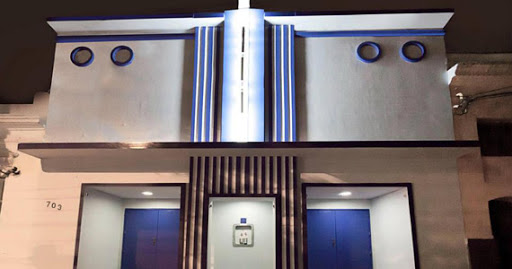

As is stated prominently, LUV is an HIV 'scrapbook of sorts' and as such influenced by my stream of consciousness, as well as that of other key participants. Basically anything that happened within the past three years is fair game to consider HIV against.   
  
Back during [Cidade Queer](https://www.cidadequeer.lanchonete.org/) we worked on HIV issues, trans issues and issues that cut across both. One might ask if HIV is a trans issue, and I would argue that it is...and that public health systems must urgently advance in ways to address this overlap. However, explaining that connection is not what this article is about.  Recently I was thinking how important and fun the 2016 [ATAQUE ball](http://explode.life/#attack) was to co-organize and how impressive the ballroom community is in São Paulo.  There are many things I'm excited to do after COVID lifts, and one of them is to produce another party, festa or ball. In fact, I have a nascent concept in mind (codeword 'Bienal Party').  
  
It just so happens that I got married during the period of Luv 'til it Hurts ... 9 November 2019 to be exact. That night we went with friends to Festa Mel (honey), and they even mentioned our nuptials in advance social media. We waited in line like everyone else, yet there were three stragglers from our wedding party who arrived later and in the interim the line grew quite long ... it would be an hour before they got in.  I asked [Aretha Sadick](https://www.instagram.com/arethasadick/?hl=en)\--friend and drag persona--to help me negotiate their entry. Night characters are often allowed to pass the line and enter for free because they bring aesthetic energy and sass to the party. These parties make quite a bit of money at the door, and it can be argued that the presence of fashionable, well-known nite-folk is part of the value a regular festa-goer is paying for. These characters are often trans and non-binary queer folk. When Aretha and I went to chat with the door staff, they told her in no uncertain terms that she was not a part of 'them' (referring to the collective that makes the party). It turned out ok--as I was otherwise persistent--and what stood out most was the facile, shifty influence afforded to Queen Aretha whilst she and her contemporaries lend considerable cache to the event. It got me thinking 'hey these nite-folk deserve better in return for their fabulousness and should be compensated with money rather than facile, shifty influence'.

  
This in turn led to an idea called 'Bienal Party'. The event is totally run by newer nite-folk rather than establishment party promoters, with door sales split evenly across its select team after expenses. For my part, it's a one-off experiment, yet it may forge a reusable template needed to interrupt the political economy of the nite.  Whilst I don't want to give away the full plotline here, I can say that my wishlist venue is [Yacht](https://www.facebook.com/ClubYacht/timeline) on 13 de Maio in Bixiga.
