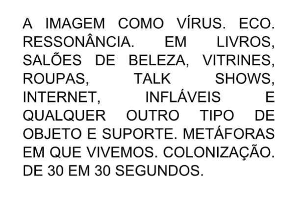

_\[\*Bruno Mendonça e Felipe Caprestano - Terra Falsa (parte do projeto "Nenhuma Intenção Revolucionária")\]_

O uso da palavra vírus para além do campo das ciências biológicas teve início a partir da década de 1980 com o desenvolvimento da cultura hacker, assim como ao longo da mesma década foi sendo assumido por outras áreas.  
  
Essa passagem conceitual de um objeto estudado pela área das ciências  
biológicas para outras disciplinas corresponde de forma bastante direta ao que os linguistas George Lakoff e Mark Johnson irão abordar como “metáfora conceitual”, ou seja, a atualização cognitiva de uma ideia. Essa atualização corresponde também a uma atualização cultural, social e político-econômica que ressignifica uma palavra, expressão ou conceito para dar conta de um novo contexto.  
  
Neste sentido a palavra vírus vem para dar conta de uma série de movimentos que estavam acontecendo na passagem do final da década de 1970 para o início da década de 1980. Neste momento, o mundo passava por um processo de sofisticação do capitalismo envolto a uma nova realidade tecnocrática, comunicacional e midiática gerando mudanças culturais significativas. O surgimento do vírus do HIV neste período, talvez seja um dos fatores que mais tenha se relacionado com todas essas questões, não só como “sintoma” dessas transformações mas também como dispositivo, complexificando definitivamente noções biopolíticas.  
  
É justamente a partir deste momento que alguns artistas e pesquisadores irão se debruçar sobre esta concepção de “vírus” de forma mais ampla. No campo das artes e da cultura isso moveu diversas frentes de trabalho e produções artísticas em que o HIV era usado como vértice para uma discussão maior sobre este “novo” momento.

Em todo o mundo as comunidades artísticas se mobilizaram - o que gerou o surgimento de novos formatos, linguagens e modus operandi. No campo das artes visuais, por exemplo, vimos nesta fase uma grande quantidade de projetos que tomaram os meios de comunicação de massa como suporte, a partir de ações de mídia tática, hackeamento, propostas de ruído, entre outras.  
  
No contexto brasileiro, o pesquisador Arlindo Machado apresenta uma consideração interessante sobre tais estratégias artísticas (e que aqui particularmente eram agravadas pela Ditadura e por uma crise política em curso):  
  
\[…\] as estruturas de poder, que subjazem por baixo das formas aparentemente inócuas de nossas sociedades, não tomam a forma de um discurso racional e distanciado, mas são produzidas com os mesmos instrumentos e meios com que essas estruturas são construídas. Trata-se, portanto, de um ataque por dentro, de uma contaminação interna, que faz com que essas estruturas deixem momentaneamente de funcionar como habitualmente se espera, para que as possamos enxergar por outro viés, preferencialmente crítico.  
(MACHADO, 2004 pg.08).  
  
Como comentado acima, o vírus do HIV, envolto a estes processos globais sócio-políticos, econômicos e culturais afetou também diretamente de forma transdisciplinar outros grupos, como o próprio ambiente acadêmico. Pesquisadores e intelectuais de diversas áreas passaram a analisar este novo contexto tomando o vírus do HIV como problemática.  
  
Um dos pesquisadores inserido nestas proposições que trouxe uma  
abordagem interessante no meu ponto de vista, foi o finlandês Jussi Parikka. Professor das faculdades de Winchester na Inglaterra e Turku na Finlândia, Parikka irá realizar diversos ensaios sobre o que ele denominará de “Capitalismo Viral”.

Tomando o vírus do HIV como um agente importante de alteração no  
entendimento da biopolítica, Parikka desenvolveu uma espécie de  
contextualização histórica a partir de uma “arqueologia das mídias”,  
exemplificando como o corpo se tornou commodity a partir da sofisticação do capitalismo (como descrito anteriormente).  
  
Métodos cada vez mais refinados e eficientes de desumanização e alienação fez o “Capitalismo Viral” se tornar irreversível. O corpo como commodity vem do aperfeiçoamento desse capitalismo em saber manejar uma espécie de imaterialidade, ou seja, produzindo paranoia, criando uma nova/outra relação de produção e consumo. Sendo assim, o “Capitalismo Viral” - se o relacionarmos à lógica do HIV funcionaria assim: Existe uma cooptação da “doença”, criando assim sistemas de manutenção desse “novo produto”. Manter uma espécie de “falsa panaceia” é interessante para continuar com a “lei da oferta e da procura”. Na verdade se formos pensar vários outros estratagemas da vida contemporânea funcionam desta maneira, todos atravessando o corpo.  
  
Parikka diz: A noção de capitalismo viral resulta de uma ideia do capitalismo como capaz de modulação contínua e heterogênese. \[…\] O poder do capitalismo reside na sua capacidade de apropriar-se do exterior, como uma parte de si mesmo. Em seu funcionamento, o capitalismo é uma máquina abstrata de continuar o novo, (re) inventando-se o tempo todo. \[…\] O capitalismo é como uma máquina pegajosa \[…\] É capaz de modular afeto, ações, práticas e discursos para que se possa obter valor até mesmo de riscos, acidentes e insegurança. Como tal, pode-se dizer que uma ideia do Capitalismo Viral refere-se ao poder de atração que o capitalismo baseia seu poder de marketing, este é o poder de afetar a chamar-nos para criar mundos em que nos sentimos naturais para viver. Este é o poder estético do afeto e da atração. (PARIKKA, 2011).

Conspirador ou não, melancólico ou não, distópico ou não - isso são análises individuais - porém a proposta apresentada neste texto é uma visão compartilhada de uma parte da comunidade LGBTQIA+ que exerce a militância e o ativismo em relação às políticas do HIV. A consciência desse corpo commodity e suas implicações gera novas possibilidades de subjetivação, atuações bio e micropolíticas além de novas estratégias. Como diz o artista Felipe Caprestano (importante agente cultural neste cenário): “SALVE-ME QUEM PODER!”

\_\_\_\_\_\_\_\_\_\_\_\_\_\_\_\_\_\_\_\_\_\_\_\_\_\_\_\_\_\_\_\_\_\_\_\_\_\_\_\_\_\_\_\_

1\. Bruno Mendonça é artista, pesquisador, educador e produtor cultural. Formado em Letras pelo Instituto Superior de Educação de São Paulo (ISESP) é também Mestre em Comunicação pela PUC-SP na linha de Processos de Criação na Comunicação e na Cultura. Desde 2005 desenvolve uma produção como artista-etc. Por meio de performances, zines e mostras, cria ambientes e plataformas – muitas vezes colaborativas e temporárias – para discutir e problematizar não só o meio artístico, mas também sexualidade, gênero, ou quaisquer categorias fixas da cultura. Utilizando-se de dispositivos variados, seus trabalhos criam uma espécie de rede narrativa e discursiva, complexificando as relações entre performance e performatividade. Desde 2010 atua como professor. Foi membro do Grupo de Crítica e Curadoria do Centro Cultural São Paulo entre 2013 e 2016 e da Fundação Bienal de São Paulo.

<figure>

<figcaption>

\- Bruno Mendonça

</figcaption>

</figure>

<figure>

<figcaption>

_\-_ Felipe de Carvalho _, Delação_

</figcaption>

</figure>
