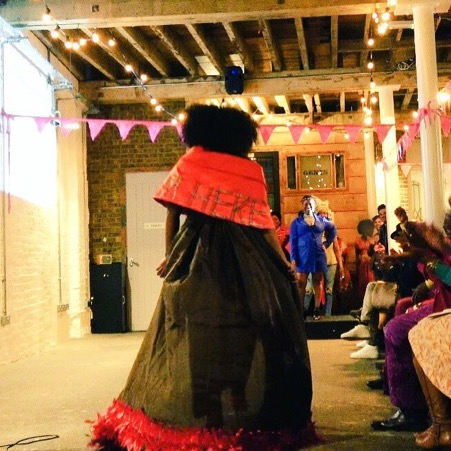
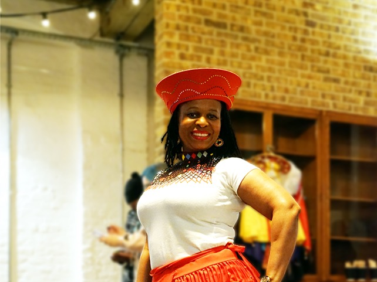
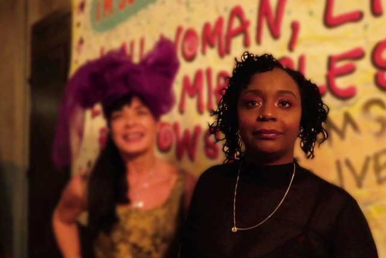

- 
    
- 
    
- 
    

The definition of an artist collective is, an initiative that is the result of a group of artists working together to achieve a common objective, this is also the definition of “Catwalk4power”. 

That most of the women involved would not describe themselves as artists or link the development of the most “empowering evening ever” to a shared creative process, is exactly why it worked.

Catwalk4power was ignited by the spark “We want to make women visible, how about a fashion show?” and with each contribution, suggestion and inspiration it has grown into a fierce fire and a force for positive engagement. Starting with a focus on what strengths women had, meant existing skills were realised and honed, and leaders allowed to emerge. Everyone involved had a stake in the project, and there wasn’t really a plan, it just grew organically, there was no right or wrong way to do anything, we just did it.

“It was the space, the opportunity to explore, I would not have thought I could do that, be artistic, but as I saw other women make things, I thought OK I’ll give it a go, I surprised myself”. This is how the first workshop worked. Artists Donna and Mare from ACT Up London demonstrated how to make necklaces, beads and bangles and women were given the opportunity and tools to simply make stuff.

You could just do anything, there were no expectations, you came and played, there were themes and common ideas, but it was also very fluid, It was a chance to explore, find your creative self and as the “project” grew, so did the women. The lead up to the event planned for International women’s day 2018 gradually unfolded and everyone flourished in their own way. Some created clothes, others cake. Some took to the floor to share Makosa dancing, and even more learnt how to strut and own their space.

Underlying it all was a belief that everyone has the capacity to be what they want to be and because of this everyone invested their time and energy. You didn’t have to commit to each workshop, you didn’t have to perfect poetry writing, technical drawing or even perform. You simply needed to turn up and have fun. Laughter was never far away, if it was a workshop at Positively UK, a “making” evening in someone’s home, or the IAS2018 conference in Amsterdam, there is always a joy in catwalk4power because it is a celebration. It is essentially a platform for women living with HIV to be their best selves, to step up, by strutting out of their comfort zone into an atmosphere of acceptance and appreciation. It is performance art, and creativity at its finest, whether you notice the intricately hand sown ribbons on Charity’s gown or the green anatomically representative bum from LeaSuwanna, the collection could be in any art gallery.

The initiative began with a handful of women and grew to over 40, raising funds through merchandising, self-managing and most importantly inspiring. The Catwalk4power is not an intervention for women living with HIV it is an evolution. This is why we celebrate for Love Positive Women, because they are inspiring!

For more information contact [Catwalk4power@positivelyuk.org](mailto:Catwalk4power@positivelyuk.org)
