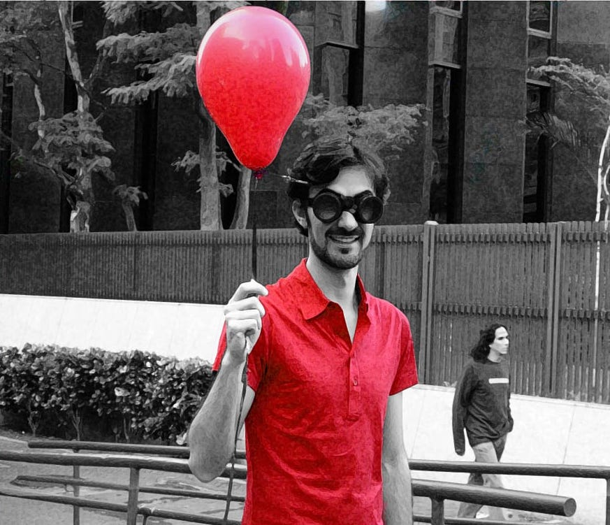
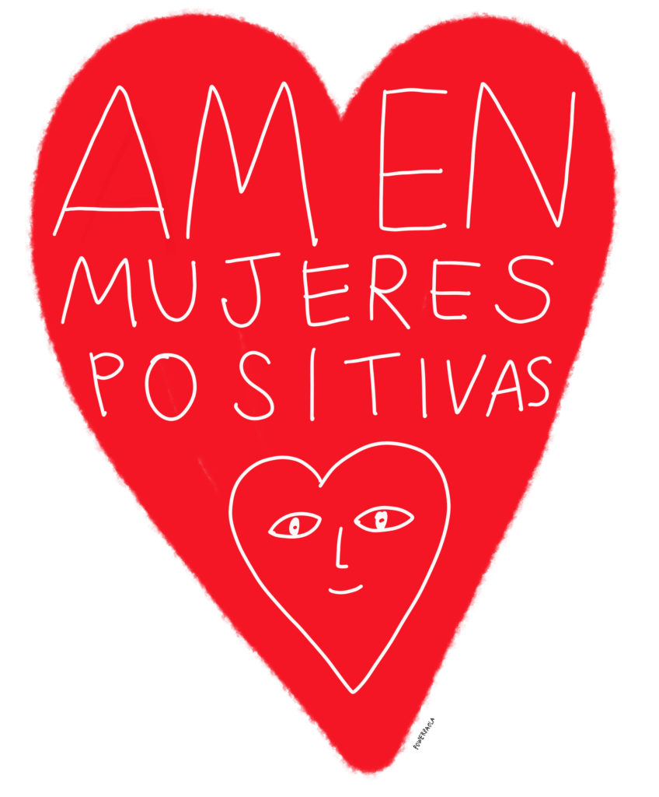

About fifteen years ago, my friend Dani called me to help her with the costume for a short film. She asked me for red clothes and accessories—specifically, an old brooch of fake ruby she knew I had. "Why red?" I asked. "Because this is a story about HIV," she justified and quickly briefed me about the project, called Certas Coisas (Certain Things). Here is the synopsis: the protagonist, who just found out he was HIV+, dives into a feeling of loneliness and isolation. It was like his individual timeline had been drastically interrupted, and he couldn’t go forward or take the path back. Instead, he would have to forge his own way, apart from the others—or, the ‘other’ was now him. The frustration of the perspective of a solitary life takes him on a daydream in which, through the lens of special glasses, he can identify HIV+ people by a red mark on their faces.

  
This is my oldest memory of having contact with the subject of HIV and it is precisely the red color that has resonated with both ‘Luv ‘til it hurts’ and ‘Love Positive Women’ projects. Looking at the merged logos of these initiatives (a red heart with the command words ‘love positive women’) made me reassess that past episode and, more importantly, rethink my understanding of it. The cohabitation of stigma and love, two apparently discrete ‘states of mind’, in the same color wasn’t possible to me at that time. Perhaps that is why I didn’t completely understand the fictional plot of that short film or the context in which it was conceived. I could only see the red of stigma. But I have been making an effort to let the love part arise. I am convinced that it happens when the problem is not an individual problem anymore, but a collective one—meaning that lots of allies are required to it.  
  
_Certas Coisas_ was written by the director, and, although it was not officially disclosed, we knew it was his personal story and that another person in the cast was also living with HIV. I remember that this information made me feel slightly alienated from the topic. It was like not having the necessary empirical experience to understand ‘certain things’; or not having the specific knowledge required to sympathize with the character. I have recognized a similar feeling while I was writing this text and even earlier, when I started a conversation with Todd Lester to engage Think Twice with Luv ‘til It Hurts. How can I come on board of a project whose issues I don’t live with? This question not only echoed from myself in the past, but it was also repeated by my colleagues of TT in a different modulation: "we don’t know much about HIV, so wouldn’t it be better to look for someone who researches the topic?" We feel so comfortable with digging into our subjects—onto which we continue to project ourselves and reinforce identities—, that it’s hard to move out from this familiar place. We spent so much time trying to find people to get involved in the project that we forgot to think of the ways we could do this by ourselves. It is not that searching for ‘key figures’ to speak and deepen the discussion is not already a course of action, but what I want to point out here is that collaborative projects are not exclusively about representativeness within it. Allies do not have to represent the cause or the movement, but rather join, in the discussions, fight stigma and commit to going for love.

<figure>

<figcaption>

By Power Paola

</figcaption>

</figure>

  
Working with collaborations or participatory practices is, in a way, also making my problem a problem for the others I’m working with. Luv ‘til It Hurts put me at the point of friction between stigma and love and I asked myself: which ‘red’ do you want to see? It made me remember that behind that short film’s narrative of a solitary HIV+ person, there were about fifteen people involved, all of them working with their own resources and trying to approach HIV in a poetic, comic and unconventional way. It has become symbolic that I kept this memory and that, today, my consciousness focuses not on what is explicit in that synopsis, but what was in the backstage: a collective production with people living with HIV and their allies.  
  
Last week, Irene, who is part of Think Twice, texted me to say that she has started to read about Mexican artists who have or work with HIV themes. Something that is making her rethink a few things from when she lived in Mexico. "It is already 'working' in me," she wrote. It’s almost magic, right? The gesture of bringing HIV to the table and talking about it is enough to spark curiosity and interest on the topic. Allies might not live with HIV, but this is not an excuse to not reflect on it.  
  
I am not a woman living with HIV, but I want to be an ally. I want to commit to loving positive women. I want to see the red of luv.
