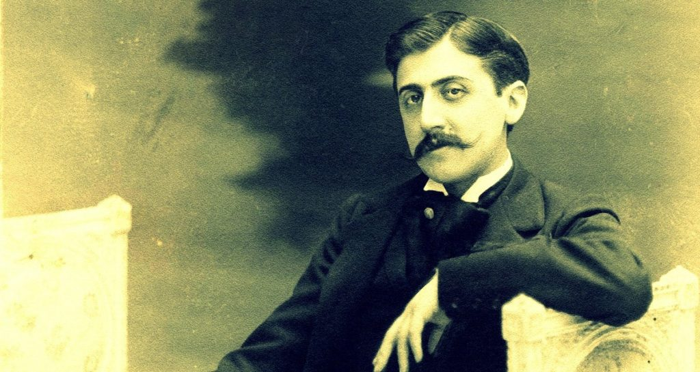
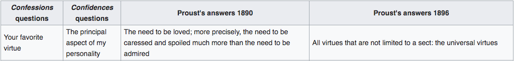

_\[\*I totally misunderstood what you wanted me to do with the 'Proust Questionnaire' and just answered the original. I get it now … you're gonna ask me these questions in a new fresh way. Is that it? Go ahead, and we'll link my new fresh answers [here](https://luvhurts.co/coalition/metamorphinemachinefuriosaxxx/)!\]_

hey ego sum frank (aka Dr. Prof. ego sum frank), 

I want to commend you on your new pursuit. While I've not yet visited the offices of MetaMorphineMachineFuriosaXXX, I imagine it to be a hybrid pharmacy and yarn shop. I even heard you all make quilts there. But before I would normally digress, let me answer these 35 questions that Proust used to 'size up' a character. I would like to assume the character of the difficult artist. I suppose this is somehow the real me; I've been called it with great regularity since I began the Luv 'til it Hurts project just over a year ago. I am starting to believe it, and therefore I'm ready to answer this particular MMMFXXX inquest. 

  
Proust doesn't really float my boat, but I would like to consider his answer to the first question (in both 1890 and 1896) as I begin:

<figure>

<figcaption>

Taken from: [Proust Questionnaire](https://en.wikipedia.org/wiki/Proust_Questionnaire)

</figcaption>

</figure>

1. What is your idea of perfect happiness? Equilibrium. Not explaining to capital 'C' curators what broad small 'c' curatorship can be. The phrase 'curatorial futures' just happened, but I'm pretty sure it was an early morning coffee fart. 
2. What is your greatest fear? That I'll never get a chance to tell you what I'm working on. That perhaps I'm wrong about what art is and I've fooled myself, but not you. You have stopped listening and I don't know it yet. Abandonment.
3. What is the trait you most deplore in yourself? This rambling. The voices that all want to be heard at once or with slight hierarchy. I take some drugs to correct it though, don't worry.
4. What is the trait you most deplore in others? Their piss poor attention spans. 
5. Which living person do you most admire? I think Robert Wilson, but only if he responds to my request in the way I want him to. My mother and father both trump Bob, but I struggle to find ways to show this admiration to them, and suppose perhaps that it is a different emotion. The name of which will come to me when I learn how to communicate better. 
6. What is your greatest extravagance? Living between NYC and São Paulo. The things I get to do having a generation of middle class-ness behind me. 
7. What is your current state of mind? I have a drug-addled mind. I take two pills a day for HIV and another for chronic depression. However I have proof (oral history) of my difficultness pre-dating my drug dependencies. 
8. What do you consider the most overrated virtue? Straightforwardness.
9. On what occasion do you lie? I omit lots of information. Since people usually like it when I stop talking, this is just like quietening one or two voices down to a level that you are speaking with a two-dimensional me. I omit the details of having my iPhone stolen when my mom sees that I ordered a new one on our family plan's insurance. But then when she masks her care for me with an ostensible concern over the phone hardware, I embellish the muggings to show her a glint of danger and work her 'guilt bone' for mis-applying her sympathies (to my phone instead of me) in the first place. I think on average I lie slightly more than the national index suggests. But I do not consider myself an outlier. 
10. What do you most dislike about your appearance? I wish I could get a tan just once in my life. 
11. Which living person do you most despise? Heidegger has come back to prove a point with Trump and Bolsonaro. I want him to die again. I want Hannah Arendt and Marielle Franco to come back to life in his place. 
12. What is the quality you most like in a man? Most male qualities repulse me (even in myself); I've known that I'm a lesbian for much longer than I've been arguing with them. 
13. What is the quality you most like in a woman? Tina Turner is from West Tennessee and Dolly Parton is from East Tennessee. I am from middle Tennessee. Motherhood. I like my mom too too much! I have a joke sometimes I set up by asking her if she knows how I became gay. I've already told you the punchline earlier in my answer. 
14.  Which words or phrases do you most overuse? I want. 
15. What or who is the greatest love of your life? I will not answer this question. It is a trap. Fuck you, Marcel Proust.
16. When and where were you happiest? I imagine myself to have been an avid lap swimmer in the womb. Yesterday at a poetry reading. That's my answer. Brooklyn. Now. 
17. Which talent would you most like to have? I would love to have extreme right-hand dexterity on an old fashioned desk calculator. I would love to have races and finish my taxes. I would use this dexterity for many more things. 
18. If you could change one thing about yourself, what would it be? I have this wart on my hand that no treatment seems to move. Take it away now, please.
19. What do you consider your greatest achievement? Survival.
20. If you were to die and come back as a person or a thing, what would it be? I would want to be Bruno Latour's sense of humor. Full stop. 
21. Where would you most like to live? São Paulo and NYC, with frequent trips to Cairo and Nashville. 
22. What is your most treasured possession? My wedding ring (the first one). I also like a horseshoe ring my dad wears, but I don't want to inherit it ever. 
23. What do you regard as the lowest depth of misery? Abandonment... 
24. What is your favorite occupation? Making things. Luv and otherwise:)
25. What is your most marked characteristic? A subtle potbelly that situates me somewhere between bear and cub. Bruce Willis told me how sexy it was in Pulp Fiction. 
26. What do you most value in your friends? Loyalty and long-term loyalty. 
27. Who are your favorite writers? Kafka, Lispector, Kadare, Soyinka, Winterson, Farah. Gonna read Ocean Vuong now that he's a MacArthur genius. 
28. Who is your hero of fiction? Elpenor, full stop. I'm still learning the why for. I need more tutelage, Ismar Tirelli Neto. 
29. Which historical figure do you most identify with? Howard Zinn.
30. Who are your heroes in real life? I respect Glenn Greenwald's work, but he is not my hero. The last Berlin Biennale, Zé Celso's Roda Viva, and various other contemporary loudspeakers repeat the Tina Turner line and suggest 'We Don't Need Another Hero' ... I don't not find an easy answer here. But because the theme is also HIV somehow, I'm gonna say South African Justice Edwin Cameron. I have some friends in Egypt who I also feel 'hero-y' about but whom I won't name. 
31. What are your favorite names? Lanier. I share middle names with Tennessee Williams. I dig it righteously. 
32. What is it that you most dislike? Giving up. 
33. What is your greatest regret? Not being in conversation with my former wife.
34. How would you like to die? I would like to know my assassin, and get to advise him/her/they on how to do it. 
35. What is your motto? Encouraging the unadvisable since 1973.

Proust's Questionnaire taken from ["35 Questions To Ask Your Characters From Marcel Proust"](https://thewritepractice.com/proust-questionnaire/)
