_\[\*Early this year I got the chance to talk to [Vinicius Couto](https://www.instagram.com/viniciuscouto/) in São Paulo about three strands of his work. The article contains images from a performance he made in São Paulo, Rio and Cairo. I was particularly interested in his idea of getting HIV+ people together, as well as what he says on 'aesthetics'. His initial interview took place before COVID19, and I asked for clarification on his idea for getting people together a few days ago. xo Todd\]_

**PT**

TLL: Você disse que o seu trabalho tem três áreas. Eu lembro de duas: Visitar países que não permitem pessoas positivas de entrar, como o Egito; E criar ou participar de uma rede de pessoas positivas? (Esqueci: eram pessoas ou artistas?) ... Você poderia explicar as três e talvez falar sobre as conexões que existem entre elas?

VC: Sim, hoje, pra além da \[I=I\] - trabalho que me introduziu no meio da performance, tenho mais 2 projetos: 

O primeiro é que nos próximos 10 anos, pretendo hackear os outros 47 países que restringem de alguma forma a minha entrada/permanência enquanto corpo positivo, independente de estado sorológico. A abertura se deu no Egito.

Ainda não sabemos exatamente como vai ser a minha atuação, mas a princípio sabemos que será uma visita com entrevistas e o meu estigma (o figurino de cabelos) ocupando a cidade. Como se ficasse explícito que por mais que exista restrições de entrada, a Aids existe em todos os lugares. 

O segundo é um projeto de 3 meses, ainda não encabeçado, que vai promover encontros a partir de um convite feito por lambe-lambes distribuídos pelas ruas da cidade. Nos encontros eu pretendo propor conteúdos que abordem questões positivas, entre filmes, informativos, performances e o que mais acontecer, com foco em conteúdos brasileiros e ao término  eu proponho uma roda de conversa junto com um questionário que levantará dados pra uma performance de reprodução de corpos.

E o trabalho que já existe é a I=I que é anual e gradativa, a cada ano são adicionados mais 365- frascos condizentes aos meus dias de tratamento desde que iniciei.

Além desses tenho um outro projeto ainda em especulação que é uma “cura dor ria posithiva”, onde convidarei artistas positivos a proporem novos olhares e possibilidades de visões desafogadas de tristeza e morte. Acredito que vem chegando o momento de pensarmos a luta positiva com menos dor e mais força.

TLL: Na verdade eu queria entender a sua prática artística. Não sei se você tem um 'artist statement' ou algum texto sobre essa sua 'viagem' artística. Por favor, poderia nos falar abertamente sobre o que você faz na vida .. e com a arte?

VC: Definitavamente, não tenho nenhuma estratégia nem pontos de partida. A minha vida sempre foi definida pelo acaso. Nunca consegui programar muitas coisas, talvez pela falta de grana ou até mesmo pela minha personalidade. 

No trabalho, escolhi investigar na arte, na moda e no cinema, corpos não normativos. Iniciei essa investigação em 2010, quando abri mão muitas vezes de trabalhar no meio branco/rico para me voltar a projetos que realmente fariam diferenças pra mim e pra outres.

Não acho que devemos protocolar o trabalho como “ganha pão”. O prazer deve se dar nas articulações profissionais. É uma pena pensar que, talvez no Brasil, ainda que exista, essa investigação ainda é pouco valorizada. Em teoria, talvez, eu tenha escolhido o prazer ao invés da riqueza. Tive oportunidades de trabalhar com as mais poderosas mas abri mão por não me ver presente em nenhum daqueles espaços. E quando veio o HIV, eu tinha duas escolhas, o silêncio e a possibilidade de desestruturar esse mesmo. Escolhi abrir e nada mais óbvio do que colocar meu próprio corpo em questão. Daí se deu na performance. Não sou um corpo acadêmico e nem defendo a academia. Acho que vivemos um declínio acadêmico que não possibilita a vivência das ruas, por exemplo. Defendo a minha investigação e interesse pelo olhar, pela vivência e principalmente pelo trânsito. A academia nos coloca em lugares muito teóricos mas a vivência é o que nos faz ter conclusões plausíveis sobre qualquer assunto. A verdade é que uma precisa da outra e eu escolhi a outra.

- 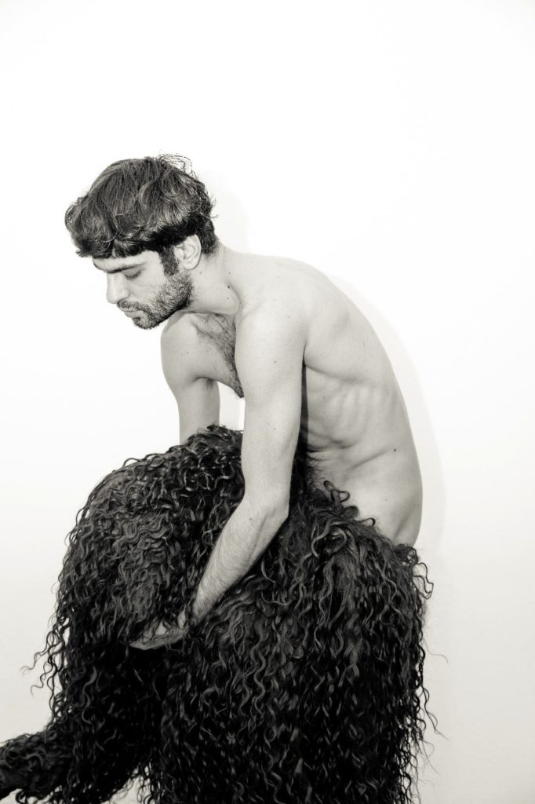
    
- 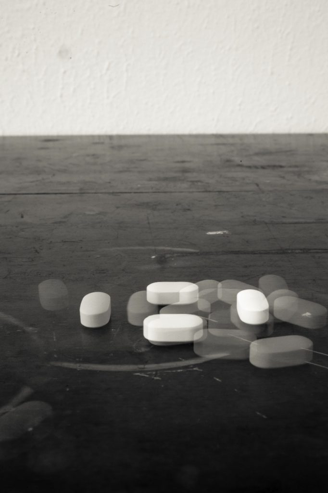
    

Bienal de Cairo (I=I Cairo)  
Fotos: otimokarater

TLL: Eu me lembro de uma resposta sua sobre estética durante a nossa visita, e tenho interesse especificamente nessa linha de pensamento. Você pode falar um pouco mais sobre isso?

VC: Legal que isso te marcou.

Defendo a estética como forma de informação, mas ainda assim ela fica sublime e aberta para conclusões diversas. Quando penso em arte/HIV, penso em trabalho com profundidade de informação, ainda que já vivemos há muito tempo com a questão do HIV/AIDS, o que se dá numa crescente epidemia é a falta de informação. É uma loucura vermos que ainda não temos políticas públicas efetivas no brasil e acho que a potencialidade vai se dar em novas ferramentas. É aí que entra a arte. Porém, por mais sublime que se apresente, a gente nunca vai conseguir se desvencilhar da informação, ela é o que vai fazer, talvez, um dia, a gente dar conta de introduzir a não conclusão em um trabalho de arte posithiva. Antes disso, defendo que todas as abordagens devam ser baseadas e introdutivas de informação. Esse ao menos é o meu formato de trabalho. Quando também defendo o “discurso popular” como o jeito mais abrangente e efetivo de transformação, eu penso nos meus, na minha tia que mora lá longe, naqueles que não aprenderam a buscar a informação. Somos um país com indução de informação e com altos índices de audiência nos grandes canais de TV, aqui as pessoas tem as TVs de última geração pra assistir a TV Globo, por exemplo. Ainda que já tenhamos acessos globais, estamos longe do domínio da tecnologia e da consciência de buscar fontes que realmente tragam  dados concretos.

TLL: Por favor, você poderia falar mais sobre a sua visita ao Cairo (Egito)? Sobre como foi morar lá por um tempo e se envolver com a cause do HIV por lá. Tenho curiosidade sobre qual foi a reação do público durante a Bienal de Cairo.

VC: Ah, o Egito! 

A Bienal do Cairo foi o espaço que me escolheu pra abrir a minha condição de posithivo. Antes disso eu estive 2 anos formulando a minha abertura. Ensaiei uma performance que se chama “libertar-ser” com curadoria da Susana Guardado pra um projeto que se chama Prazer é Poder, no Rio, lugar onde contrai o HIV. Nessa performance o meu corpo era apenas um estigma. Os cabelos eram o que viria a definir esse estigma futuramente. Lembro de um amigo e artista maravilhoso que me provoca muito, Tiago Rivado, me falando que era maravilhoso ver em Libertar-ser o quanto eu não sabia o que eu estava fazendo. E era exatamente sobre isso... Eu não sabia qual era o meu sentimento, eu só sabia que era algo que vinha de fora pra dentro e que ele tinha embates diversos. Depois do Egito que eu fui entender que existia narrativa entre libertar-ser e I=I.

Esse convite se deu por intermédio da Monica Hirano (hoje minha produtora) que estava produzindo a bienal e pediu pra mandar meu projeto. Ele foi aceito, consegui por meio de um financiamento coletivo afetivo produzido pelo Gilberto Vieira. conseguimos 10k pra essa viagem.

Cheguei no Cairo no dia do segundo turno que elegeu Bolsonaro, aos prantos e me sentindo culpado por não ter votado nesse dia, mas sabendo que estava me propondo a algo importante. Fiquei mais de 2 horas no aeroporto tendo a minha mala investigada,  sem saber nem falar inglês direito. Só falava “I'm an artist” com a carta da bienal na mão e meu único medo era o momento deles pegarem o meu remédio que levei nos frascos originais. A performance já começava ali, se eu fosse interrompido, ela também teria acontecido...

No fim eles ficaram tão entretidos com o figurino que só pegaram o remédio, abriram, viram que estava lacrado e me deixaram ir embora.

Consegui uma assistente lá do Cairo pra me auxiliar na produção, todos os frascos e rótulos foram produção local. Os frascos foram até que fáceis de achar, já os rótulos tivemos que andar por pelo menos 4 gráficas que não queriam imprimir por conter as palavras “gay” “HIV” e “AIDS” no conteúdo. Todas palavras proibidas até de mencionar naquele país. A assistente teve que falar que era pra um trabalho de faculdade. O corte dos rótulos vieram cheios de risadas e reprovações dos caras que cortavam e a performance foi um sucesso. Mesmo que ainda sem muito formato por ser a primeira, ela foi censurada, não pude ficar sem camiseta e tinham policiais filmando todos os movimentos da abertura da bienal. Ela estava toda em inglês então acho que as chances de ser mais censurada diminuíram. Nunca antes tinha me visto sendo observado por tanta gente, lembro até de uma criança me oferecendo coisas pra beber e me ajudando a tirar os rótulos, foi forte! Durou 3 horas, quase que a abertura toda e eu sentia que quem entendia tinha uma mistura de dó com compaixão. No fim, alguns homens vieram me abraçar e agradecer por aquele movimento. Suponho que eles eram positivos. Eu não me envolvi com as causas do país, não deu tempo, tentamos um contato com a UNAIDS de lá mas não teve sucesso. Mas pra mim, enquanto proponente, estar ali levando aquelas palavras que não podem nem ser faladas impressas em 740 frascos de remédios, já me fez ter sentido.

Naquele ano de 2018 o Egito tinha dobrado a quantidade de infecções durante toda a história da epidemia lá. Foram 11k novas infecções. Fiquei exatamente 1 mês lá, dei uma circulada, achei uma loucura, nunca antes tinha vivido uma cultura tão diferente da minha. Fiz uma pegação, os gays em grande maioria não moram lá por conta da proibição e são todos bem fechados. O aplicativo Grindr ja vem com uma notificação dizendo para tomar cuidado com “policiais disfarçados”. Fiquei com medo e preferi não me envolver. Imagina se fosse pego sendo gay e ainda por cima posithivo. Risos.

TLL: Você teve uma exposição no Rio, no Centro Cultural Hélio Oiticica. Você poderia falar mais sobre isso? Eu conheço um pouco (muito pouco:) sobre ele ... E na minha cabeça ele e a prática dele têm umas similaridades com a sua. É imaginação minha? Outras pessoas também dizem isso? E para você, existe uma relação?

VC: A performance no HO, foi a última atividade deles e minha de 2019. Eles me cederam o espaço e eu consegui que a produção fosse financiada por uma amiga, Silvana Bahia. Por ser uma instituição pública e pelo Rio/Brasil estar passando por momentos de sucateamento e dificuldades de estímulos à cultura, tudo estava bem precário. Estavam quase sem profissionais, nem dinheiro pra faxina eles tinham. Muito triste ver um lugar que sedia e dá abertura, principalmente para artistas periféricos, se encontrar naquele estado. Mas ainda que com dificuldades, a falta de estrutura deu força e gerou um novo caminho pro meu trabalho. Tivemos que imprimir os rótulos em papel adesivo normal, isso impossibilitou a retirada fácil dos rótulos e promoveu uma necessidade coletiva dos expectadores. Quando me vi propondo a todos que eles tirassem as informações contidas nos rótulos, pensei: 'uau, estou inserindo informações neles e junto comigo estão des-rotulando.' Tenho dito que essa foi a ação coletiva mais potente que eu me vi proponente. Tanto que agora teremos as 2 formas de rótulos, em papel vinílico, que facilita tirar e o adesivo de papel normal. No MAM-SP, por exemplo, eu retirei todos os rótulos e a interação se dava no meu movimento de colar nos expectadores. Ainda consegui reforçar a conclusão de que “As sequelas, os resquícios e a proliferação do vírus do HIV/AIDS sempre vai se mostrar fixado e mais presente nos territórios onde se tem precariedade, falta de acesso e de políticas públicas efetivas.

Estamos falando de (falta de) estrutura!” 

Esse texto foi legenda de uma foto que tirei minutos antes de eu começar a limpar os resquícios da minha performance na segunda-feira depois de ter sido advertido pela instituição por ter deixado e não ter limpado sabendo das condições deles.

Já as similaridades com os trabalhos do Hélio, eu agradeço. Nunca antes tinha parado pra pensar sobre isso, me identifico  no seu modo subversivo anarquista e vanguardista. Mas acho que enquanto artista, minimamente politizado, todos aqui levamos um pouco do Helio. Ele é pro Brasil uma das maiores referências que temos. Eu queria mesmo é ter vivido com ele em vários momentos. Risos!

Tenho uma certa dificuldade em colocar minhas referências em questão. Quando falo sobre meu corpo e sobre arte/HIV é uma coisa que está tão ligada e se torna tão genuína que óbvio que não existe corpo sem referência, mas minha construção se baseia na necessidade e na observação de outros corpos como o meu, basicamente.

**_Esclarecimento sobre 'juntar pessoas,' após o surgimento do COVID19:_**

_"Oi Todd. É mais ou menos a mesma coisa sim. Eu só tô ainda pensando em como eu vou agir com esse projeto. A ideia é que a gente consiga articular pessoas e artistas positivos a propor novos olhares, um olhar mais positivo mesmo, sabe. Mas eu acho que isso também, agora pensando, pode ser uma interrupção de formatos, de outros corpos. Então eu acho que a liberdade nessa proposição, ela tem que ser livre mesmo, não da pra gente induzir outros corpos a fazer outras coisas. Ela tem que ser livre. Mas eu acho que pensar nessa nova linguagem de trazer menos dor e trazer informação com um pouco mais de… Não sei explicar pra você. Mas sim, tudo parte do mesmo. Eu tô agora aqui escrevendo parte desse projeto inclusive. Mas é meio isso, é a mesma coisa, mas é pensar em novos formatos sabe, que não seja com dor, que não seja das pessoas ficarem tocadas. Eu acho que a gente precisa focar agora em outros lugares."_

\*\*\*  
**EN**  

TLL: Hi Vinicius. When we first met you told me you have three projects or perhaps work in three overlapping areas. Can you say something about each and maybe how they are all connected?

VC: Yes, today, asides from \[I=I\] - a work that introduced me to the milieu of performance, I have 2 projects: 

The first is that in the next 10 years, I intend to hack the other 47 countries that somehow restrict my entrance/permanence as a positive body, regardless of serological state. This opening to this took place in Egypt.

We still don't know exactly how my action will be, but for now we know that it will be a visit with interviews and that my stigma (the hair pieces) will be occupying the city. As if it was explicit that although there are entry restrictions, Aids exists everywhere. The second is a 3-month long project, with still no lead, which will promote meetings from invitations displayed on street posters and distributed throughout the city. In the meetings I intend to propose content that addresses positive matters, such as films, newsletters, performances, and whatever else happens, with a focus on Brazilian content, and in the end I propose a roundtable along with a questionnaire that will create data for a performance on the reproduction of bodies.

The work that already exists is the I=I, which is annual and gradual, and each year more than 365 flasks are added, pertaining to my days of treatment ever since I began it.

Besides these two, I have another project that is still under speculation which is a “posithive cure pain laugh”, for which I invited positive artists to propose new perspectives and possibilities of visions not laden with sadness and death. I believe the time is arriving for us to think about the positive fight with less pain and more strength. 

TLL: Actually I'd luv to understand better your artistic practice in general (pertaining to HIV and otherwise). Do you happen to have an artist statement or reflections on your 'artistic journey' so far? Please feel free to change the questions to suit the way you want to respond. I'm always interested to know how artists differentiate between their work (or practice) and life in general.

VC: Definitively, I have no strategy or departing point. My life was always defined by chance. I was never able to plan too many things, maybe for the lack of money or even due to my personality.

At work, I chose to research non-normative bodies in art, fashion and cinema. I began this research in 2010, when I gave up on several occasions the opportunity to work in the white/rich milieu in order to focus on projects that would really make a difference for me and others. 

I don’t think that we should protocol work as being a “bread winner.” Pleasure has to arise in professional articulations. It is a pity to think that, maybe in Brazil, although it exists, this research is still little valued. In theory, maybe, I chose pleasure instead of wealth. I’ve had the opportunity to work with powerful people but gave it all up because I was not seeing myself present in any of those spaces. And when HIV came up, I had two choices, silence or the possibility of dismantling silence itself. I chose to open up, and nothing was more obvious than to put my own body in question. That is where performance came from. I am not an academic body nor do I even defend academia. I think we are living an academic decline that does not allow as a possibility street experience, for example. I defend my research and my interest in the gaze, the experience, and mostly in the transit. Academia puts us in places that are too theoretical, but experience is what makes us have plausible conclusions about any subject. The truth is that one needs one another, and I have chosen the other.

TLL: I remember something you said when we met about aesthetics in relation to HIV. I'm particularly interested in this line of thought. Please expound:

VC: It’s cool that that left a mark on you.

I defend aesthetic as a form of information, but even in this way, it is kept sublime and open to various conclusions. When I think of art/HIV, I think of work that has a depth of information. Although we have lived for a long time with the matter of HIV/AIDS, what brings us to a growing epidemic is the lack of information. It is crazy to see that we still do not have effective public policy in Brazil, and I think that the potentiality will happen through new information tools. That’s where art comes in. Yet, however sublime it may present itself, we are never going to be able to free ourselves from information, it is what will make us, one day, think of introducing a non-conclusion to a positive work of art. Before this happens, I defend that all approaches must be based on, as well as introduce, information. At least this is my work format. While I also defend the “popular discourse” as a more comprehensive and effective means of transformation, I think of my people, of my aunt who lives far away, of those who did not learn to search for information. We are a country with the induction of information and with high audience rates in big tv channels, here people have the latest TV models to watch Globo, for example. Although there is global access, we are far from technological expertise and from having the awareness to search for sources that really bring us concrete information. 

TLL: Can you tell me more about your trip to Egypt for the Cairo Biennial? Did you stay long and would you say that your performance piece was seen outside of the frame of the government-sponsored art event?  Was your performance billed explicitly as pertaining to HIV? I'm curious about the public's reaction to your work.

VC: Oh, Egypt!

The Cairo Biennial was a space that chose me to open up by condition as posithive. Before this I spent 2 years formulating my opening up. I rehearsed a performance that is called “Libertar-ser,” under the curation of Susana Guardado for a project that is called Prazer é Poder, in Rio, where I contracted HIV. In this performance my body was only a stigma. The hair pieces were what would come to define this stigma in the future. I remember a friend and wonderful artist who provokes me a lot, Tiago Rivaldo, telling me that it was amazing to see in Libertar-ser how much I had no idea what I was doing. And it was exactly about that… I did not know what I was feeling, I just knew that it was something that came from the outside in and that it underwent several clashes. After Egypt I learned that there was a narrative between Libertar-ser and I=I.

This invitation happened through the Monica Hirano (my producer today) as an intermediary, who was producing the Biennial and asked me to send the project. It was accepted, I was able to do it through a collective affective financing by Gilberto Vieira. We were able to raise 10k for this trip. I arrived in Cairo in the day of the second round of elections that elected Bolsonaro, I was in tears and feeling guilty for not having voted on this day, but I knew that I was proposing myself to something important. I spent more than 2 hours in the airport with my suitcase being investigated, with me not knowing how to speak English well. All I could say was “I'm an artist,” with the Biennial letter in my hand. My only fear was of them grabbing my medicines that I took in their original flasks. The performance was already starting there, if I had been interrupted, it would already have happened…

In the end they were so entertained by my costume that they only took the medicine, opened it, saw that it was sealed, and let me go.

I was able to get an assistant in Cairo to help me with the production, all of the flasks and labels were locally produced. The flasks were even easy to find, but for the labels we had to go through at least 4 print shops that did not want to print them out because they contained the words “gay”, “HIV”, and “Aids.” These are all words that are prohibited from even being mentioned in that country. My assistant had to say that it was a work for college. The guys cut up the labels while laughing a lot and being disapproving of it. The performance was a success. Although it still did not have a lot of format, for being the first, it was censored, I was not allowed to be shirtless, and there were cops filming every movement at the Biennial opening. It was all in English, so I think that the chances of it being censored diminished. I had never before found myself being watched by so many people, I even remember a child that offered my things to drink and helped me remove the labels, it was strong! It lasted 3 hours, almost the entire opening, and I felt that those who understood it felt a mixture of pity and compassion. In the end, some men came to hug and thank me for that move. I suppose that they were positive. I did not get involved with the country’s causes, I did not have time, we tried to get in contact with the UNAIDS there, but without success. But for me, as a proponent, to be there and to be taking those words that can’t even be said out loud, printed onto 740 medicine flasks, already gave it meaning to me.

In that year, of 2018, Egypt had doubled the amount of infections during the entire history of the epidemics there. There were 11k new infections. I was there for one exact month, walked around, thought it was all crazy, I had never experienced a culture that was so different from mine. I had a hook up there, most of the gays don’t live there due to the prohibition and they are all very closed off. The Grindr app already comes with a notice to be careful with “undercover cops.” I was scared and preferred to not get involved. Imagine if I was caught being gay, and even more, being posithive? \[Laughs\]

- 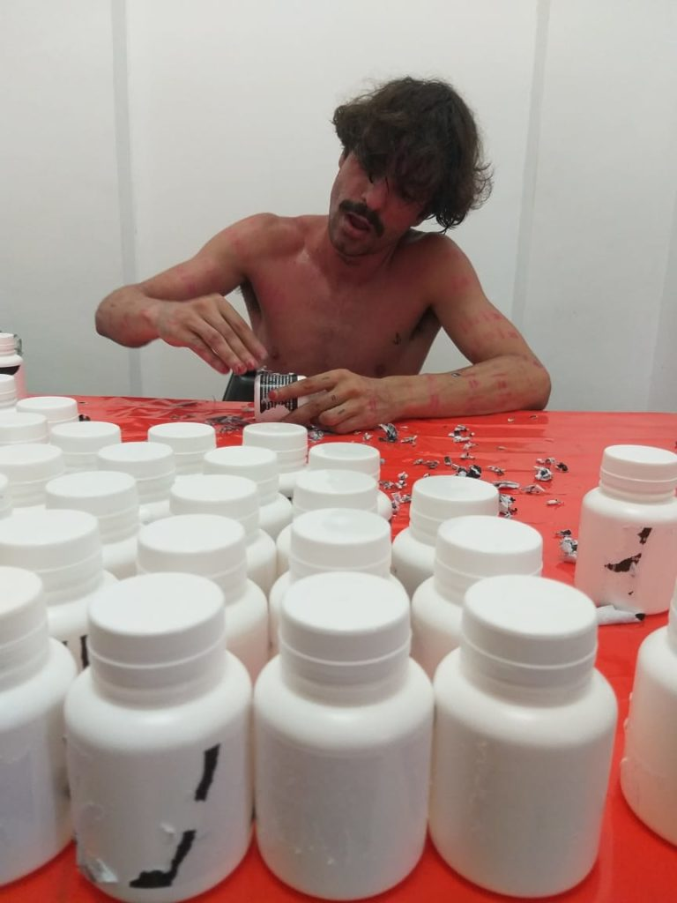
    
- 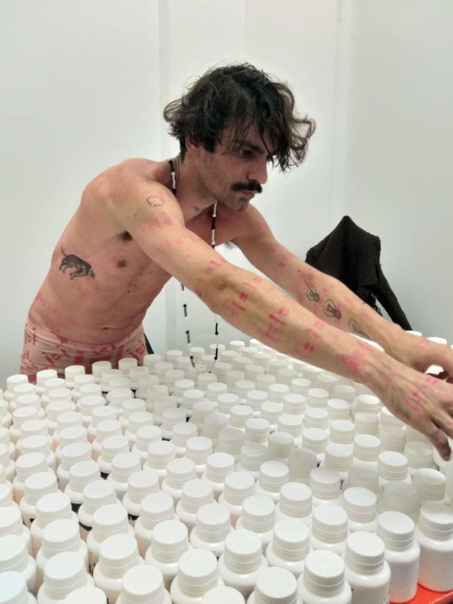
    
- 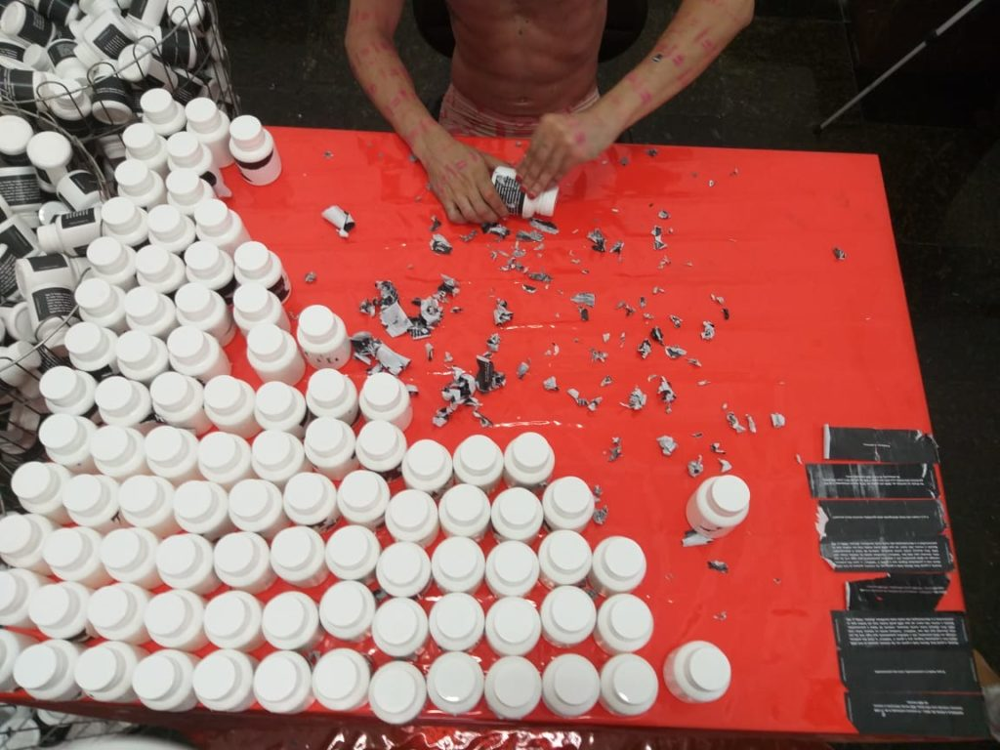
    
- 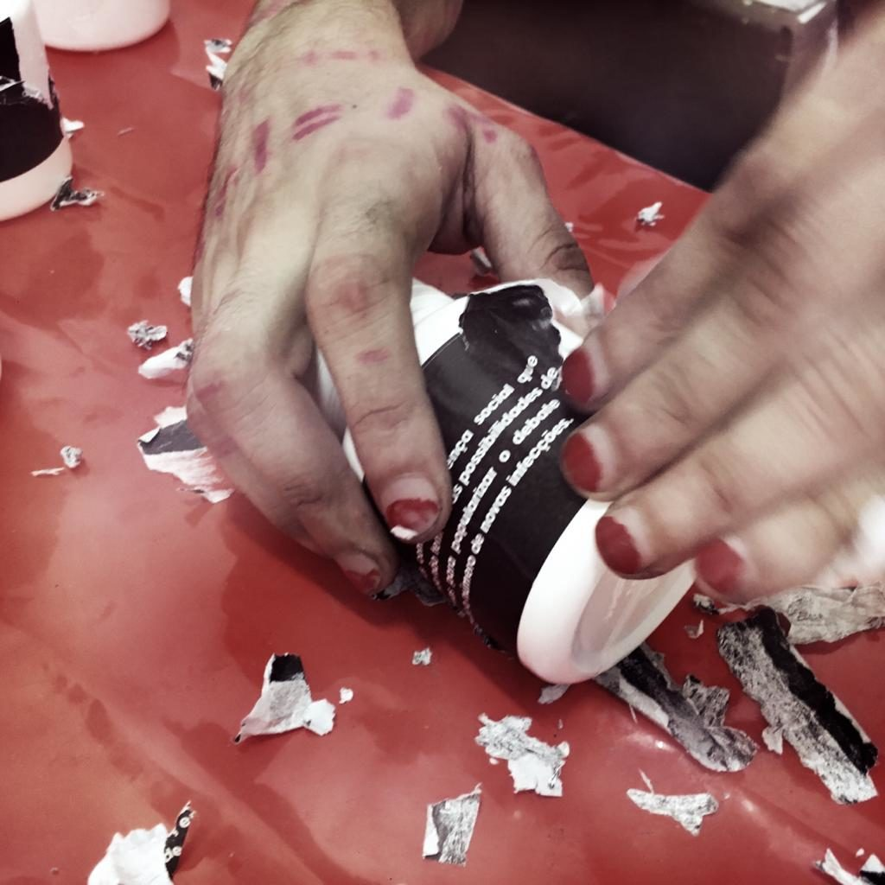
    

Centro Cultural Hélio Oiticica (I=I Rio de Janeiro)  
Fotos: Daniel Toledo  

TLL: You recently had an exhibition in Rio de Janeiro at the Hélio Oiticica Cultural Center. Can you say more about that? Was it the same piece you performed in Cairo? I know a little bit about the work (and style) of Hélio Oiticica, and in my head I can imagine similarities between his work and yours. Is this just my imagination? Have others made this comparison? And, well, do you make a connection yourself?

VC: The performance at HO was their and my last activity in 2019. They conceded me the space and I was able to have the production financed by a friend, Silvana Bahia. For being a public institution, and because Rio/Brazil is going through moments of scrapping and difficulty in the promotion of culture, everything was very precarious. They were almost without professionals, they didn’t even have money for the cleaning. It is very sad to see a place that hosts and gives exposure, especially for artists from the periphery, to find it in that state. Even with difficulties, the lack of structure gave strength and generated a new path for my work. We had to print out the labels on normal adhesive paper, which made it impossible to easily remove the labels, and promoted a collective necessity by the spectators. When I saw myself proposing to everyone that they remove the information contained on the labels, I thought: "wow, I am inserting information onto them, and they are un-labeling together with me." I have said that that was the most potent collective action that I have found myself being a proponent of. So much so that we will now have the 2 types of labels on vinyl, which facilitates the removal of the normal adhesive paper. At MAM-SP, for example, I removed all of the labels and the interaction took place in my movement of gluing it onto the spectators. I can still stress the conclusion that “The aftermath, the remnants, and the proliferation of the HIV/AIDS virus will always reveal itself as fixed to, and more present in precarious territories, where there is a lack of access and effective public policies. 

We are talking about a (lack of) structure!”

This text was the caption of a photo that I took minutes after arriving to clean up the remnants from my performance on Monday, after being adverted by the institution for having left and not cleaned up, knowing their condition.

Now, regarding similarities with Hélio’s work, I thank you. I had never stoped before to think about this, I identify with his subversive anarchist and vanguardist ways. But I think that like any minimally politicized artist, we all take a little bit from Hélio. He is, for Brazil, one of the biggest references we have. What I really wanted was to have lived with him on many occasions. \[Laughs\]

I have a certain difficulty putting my references in question. When I talk about my body and art/HIV, it is something that is so interlinked, and it becomes so genuine, that obviously there is no body that has no reference, but, basically, my construction is based on the necessity and observation of other bodies like my own.

**_Post-COVID19 outbreak clarification on 'getting people together':_**

_"Hi Todd. Yes, it is sort of the same thing. I am still thinking about how I’m gonna act in this new project. The idea is that we articulate positive people and artists, for them to propose new outlooks, a more positive one. You know, now that I was thinking, this can also be an interruption of formats, of other bodies’. So I think that liberty in this position really needs to be free, we can’t induct other bodies into doing things. It has to be free. But I think that we need to think about this new language that brings less pain and brings more information with a little bit of… I don’t know how to explain it to you. But yes, it is all part of the same thing. I am even now over here writing up this project. But that’s kind of it, it is the same thing, but it is to ask for new formats, one that isn’t all about pain, or all about moving people. I think that we need to focus on new areas."_

- 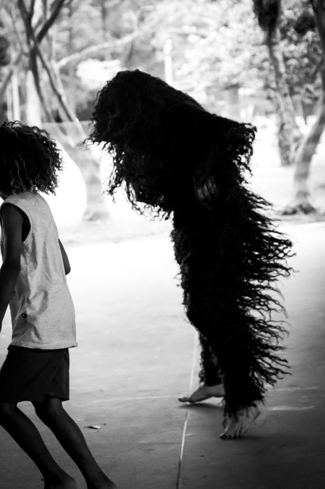
    
- 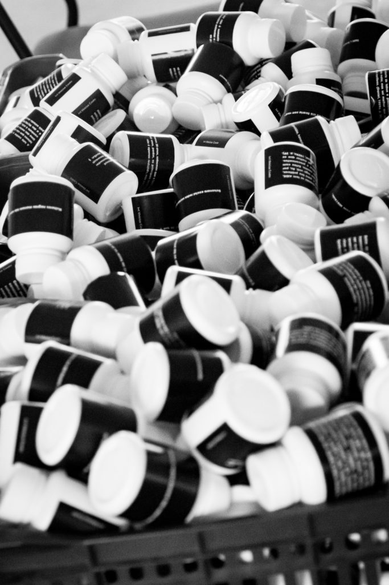
    
- 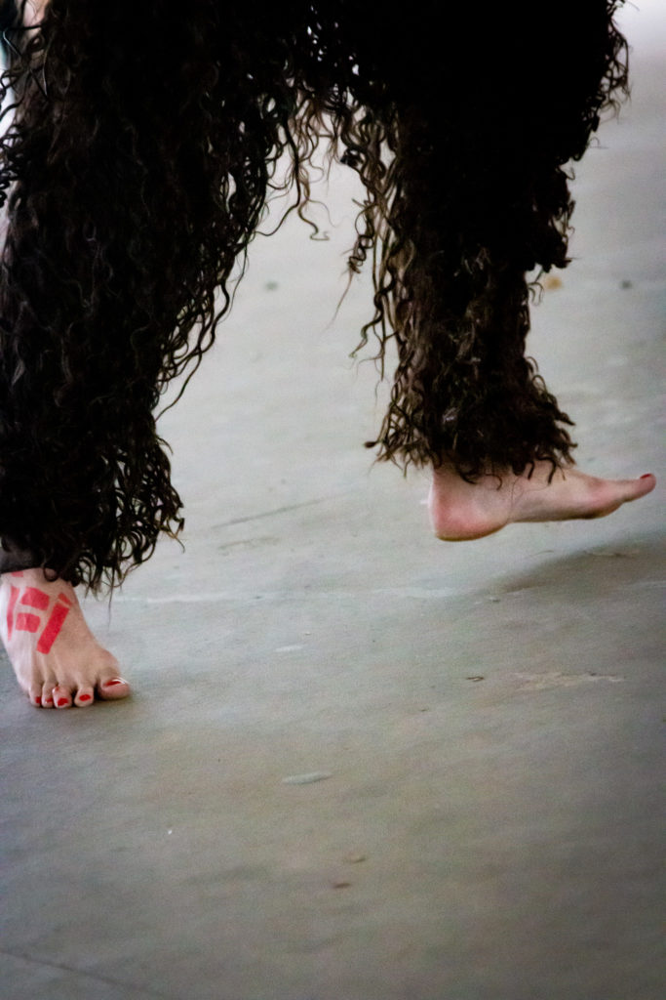
    
- 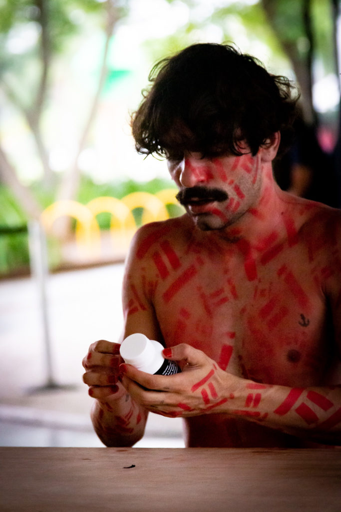
    
- 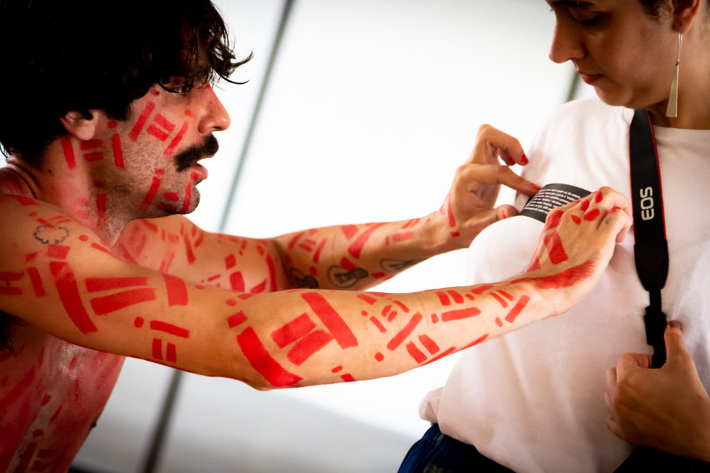
    
- 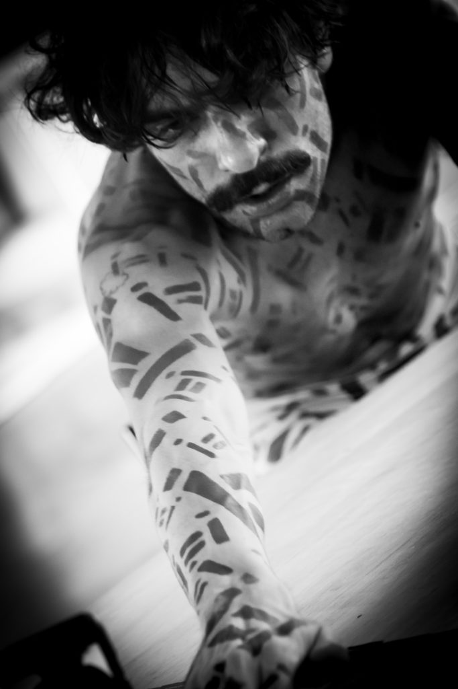
    
- 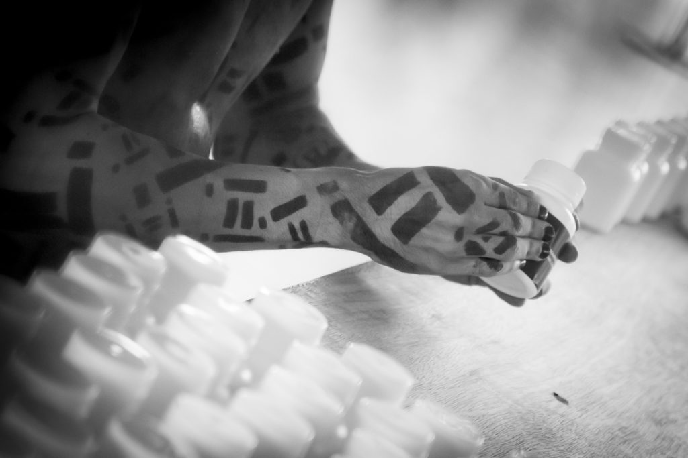
    
- 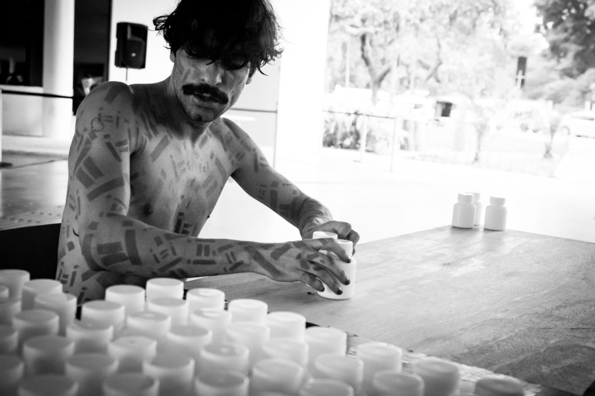
    

Museu de Arte Moderna (I=I São Paulo)  
Fotos: Carol Araujo  

https://youtu.be/2neFfX407TQ

https://youtu.be/pAOm5TBPI9U
