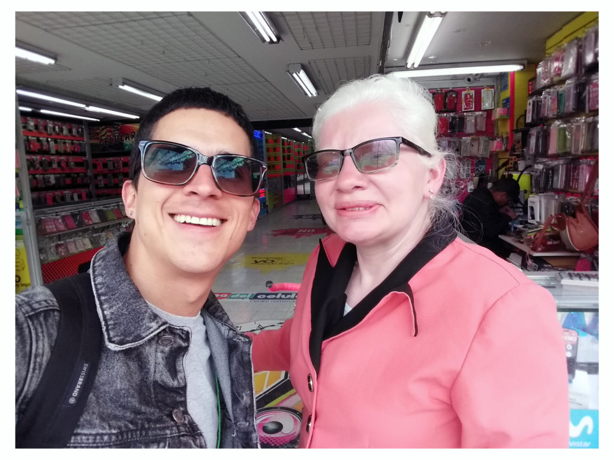
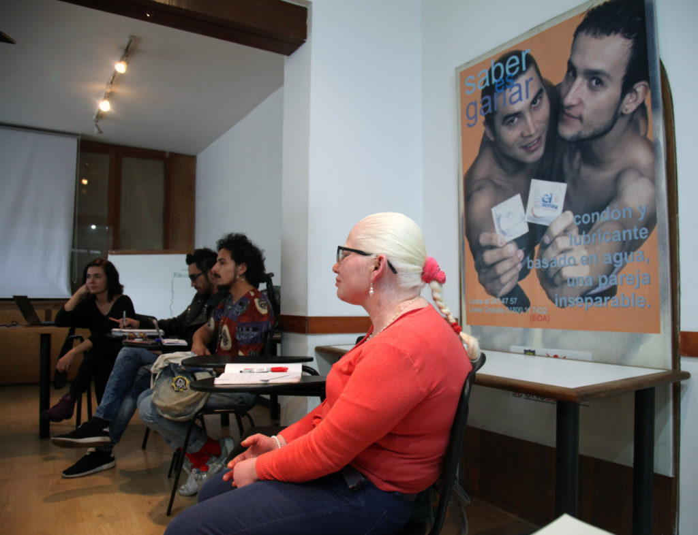

**DSS:** Buenas tarde, Jaque, gracias por estar aquí y colaborar con esta entrevista. Te voy a hacer unas preguntas que ya conoces. Si no quieres responder o te sientes incómoda podemos parar y no hay problema. 

¿Hace cuánto descubriste que tienes VIH? ¿Cómo ha sido todo desde entonces?

**JS:** Bueno, yo descubrí que tengo el virus del VIH desde noviembre del 2015. En un centro asistencial de mi barrio estaban en una campaña y me propusieron hacer la prueba, ahí me enteré. Para mi ha sido un poco complicado pero quiero salir adelante, surgir. Esto ha cambiado mi vida notablemente.

**DSS:** Cuando supiste ¿lo compartiste con tu familia, cómo reaccionaron?

**JS:** Si, primero lo compartí con mi compañero. Él se impactó mucho con la noticia y se perdió un tiempo. Después, lo compartí con mi madre pero hoy en día me arrepiento. Mi madre me dijo: ‘Defiéndase sola porque usted se buscó su problema’, palabras textuales que me han dolido mucho. Cada vez que tenemos un disgusto me lo saca a la luz. 

**DSS:** ¿Crees que de ser hombre las cosas habrían sido diferentes?

**JS:** Pues para mí, en mi modo de pensar, los hombres son mas sensibles a la noticia, se impactan y se resienten más. En mi caso, prefiero ser mujer porque yo soy valiente y soy capaz de enfrentar la realidad. Al principio, si me dio miedo por el rechazo de mi familia. Pero ahora lo asumo sin miedo. 

**DSS:** ¿Cómo es tu relación con los medicamentos?  

**JS:** Al principio me daba dolor de cabeza, mareo. Pero ahora son para mi una bendición ¿por qué? Porque me dan mucha energía, fortaleza y me siento bien, no me duele ni una uña. Y me permiten vivir. Mi EPS me los suministra y me los tomo todos los días a las 9 p. m. Son retrovirales. El VIH es un virus que si no tiene tratamiento se va desarrollando y la persona, al principio, no se da cuenta, como fue mi caso. Pero si uno tiene cuidado, va a los controles y se toma los medicamentos y se cuida, va a tener larga vida. Depende sobre todo del cariño que se tenga a uno mismo.

**DSS:** ¿Crees que tu visión del mundo ha cambiado desde que te enteraste que tenías VIH? ¿por qué?  

**JS:** Sí, porque la mujer que soy ahora no es la de antes. Yo soy una persona albina y de baja visión, las personas de mi entorno me rechazaban pero el rechazo de mi familia me hizo ser más fuerte, me tengo que defender sola y no tengo que depender de nadie. Y eso es lo que estoy haciendo. Estoy contenta porque estoy trabajando en un proyecto que se llama _Café a ciegas_, donde he conocido a personas invidentes. Dos tenemos la capacidad de ver, pero mi compañera ve un poco más, somos los ojos de grupo. He aprendido que los límites se los pone uno mismo, que si uno quiere surgir los sueños se pueden hacer realidad. Y el VIH es solamente un virus, pero si uno se cuida no pasa nada. Y ya, así de simple.

**DSS:** ¿Qué les quisieras decir a las mujeres con HIV / Sida?  

**JS:** Les quiero dar un consejo. Que si ven la necesidad de decirle a sus familiares y creen que los van a ayudar que le digan, pero sino mejor que no lo digan. También que uno mismo debe amar su cuerpo, quererse uno mismo, no pueden pensar que por tener VIH no son humanos, tienes valores, hay que seguir adelante, tener cuidado con el tratamiento, que la vida no se ha acabado. Esto es como un volver a nacer, porque uno tiene esperanza, y vive el día a día, no como antes que uno no se preocupaba, hay que fortalecerse, superarse, aprender, mantenerse ocupado, intercambiar ideas, capacitarse.

**DSS:** ¿ Qué le quisieras decir a los familiares o amigos de personas con el virus?  

**JS:** A los familiares les quisiera decir que sean considerados. Igual uno tiene el virus pero tiene la energía para comprender y hacer todo. Que no los hagan sentir menos y no los discriminen, porque es el peor error de una familia. Mejor que le den la libertad de vivir, porque la libertad es lo más maravilloso que puede haber. Entonces, yo les pediría de corazón que hay que comprenderlos y apoyarlos en lo más que se pueda.

**DSS:** Gracias Jaque, ¿hay algo más que quieras agregar?

**JS:** No, gracias, creo que ya lo dije todo. 

\_\_\_\_\_\_\_\_\_\_\_\_\_\_\_\_\_\_\_\_\_\_

**DSS:** Good afternoon, Jaque, thank you for being here and collaborating with this interview. I am going to ask you a few questions that you already know. If you don’t want to respond, or feel uncomfortable, we can stop and there is no problem. 

How long have you had HIV? How has everything been since then?

**JS:** Well, I found out I had the HIV virus on November of 2015. In an assistance center in my neighborhood, they were doing a campaign and proposed to me to do the test, that is where I found out. For me, it’s been a bit complicated but I want to move forward, arise. It has significantly changed my life.

**DSS:** When you found out, did you share with your family, and how did they react?

**JS:** Yes, I first shared it with my partner. He was very impacted by the news and was lost for a bit. Afterwards, I shared it with my mother, but today i regret it. My mother told me: ‘Fight it alone, because it was you that brought this problem upon yourself,’ textual words that have hurt me a lot. Every time we have some disagreement, it is brought back to light.

<figure>

<figcaption>

by Power Paola

</figcaption>

</figure>

**DSS:** Do you think that if you had been a man, things would have been different?

**JS:** Well to me, in my way of thinking, men are more sensitive to the news, they are more impacted by it and resist it more. In my case, I prefer being a woman because I am brave and capable of facing reality. In the beginning, it did scare me, because of my family’s rejection. But now I assume it without fear.

**DSS:** How is your relationship with the medications?

**JS:** At first they would give me headaches, nausea. But now they are a blessing to me. Why? Because they give me so much energy, strength, and I feel good, there is not even a fingernail on me that hurts. And they allow me to live. My EPS provides them for me, and I take them everyday at 9 PM. They are retroviral. HIV is a virus that, if left untreated, will continue developing and the person, at first, will not notice it, as was my case. But if one is careful, does checks, takes medicine, and takes care of themselves, he or she will have a long life. It is mostly about the care that one has with him/herself.

**DSS:** Do you think that your view of the word has changed since you found out you had HIV? Why?

**JS:** Yes, because the woman that I am today is not the same that I was before. I am an albino person and with low vision, people around me rejected me, but my family’s rejection made me stronger. I have to defend myself alone, and I do not have to depend on anyone. And that is what I am doing. I am happy because I am working on a project called _Café a Ciegas_, in which I have met people who are blind. Two of us have the capacity to see, but my partner sees a little bit more than me. We are the eyes of the group. I have learned that limits are imposed by ourselves, and if we want our dreams to emerge, they can be made real. HIV is just a virus, and if one takes care of him/herself, everything is okay. And that’s it, that simple.

**DSS:** What would you like to say to women with HIV / Aids?

**JS:** I want to give them an advice. That if they have the necessity of telling their family members, and believe that they will help them, that they do so. But otherwise, it is best that you don’t tell them. Also, that you have to love your own body, love yourself, you cannot think that because you have HIV that you are not human and have values. You have to keep moving forward, take care with treatment, as life is not over. It is like going back to being born again, because you have hope, and live life day by day, not like before when you did not care. You have to strengthen yourself, better yourself, learn, keep yourself busy, exchange ideas, get trained.

**DSS:** What do you want to say to family members or friends of people with the virus?

**JS:** To family members I want to ask them to be considering. A person may have the virus, but still has the energy to understand and do everything. That they do not make them feel lesser, and discriminate against them, because it is the worst error a family can commit. It is better that they give them the liberty to live, because liberty is the most wonderful thing there is. So I would ask the family members, with all my heart, to understand them and support them the most possible.

**DSS:** Thank you Jaque, is there anything else you would like to add?

**JS:** No, Thank you, I think I have already said it all. 

- 
    
- 
