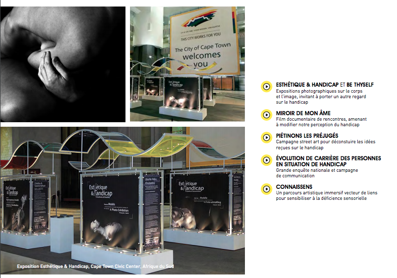

  
TL: Hi Deza .. we've known each other for over a decade now and met through my beloved Cameroonian network and when I was making freeDimensional. You are based in Paris and FULL STOP, I admire your work. When I met you, you had just placed beautiful portraits on Paris city buses of people that challenge our notions of what it means to be 'able'...that opened a discussion on 'ableism' in Paris and far beyond. Do you have a link to that previous work you can share here?

  
DN: Hi Todd, thanks for kindly introducing my work. Aesthetics and Disability was indeed my first big concept that started in 2008/2009 in South Africa with the sponsorship of the city of Cape Town. The exhibition was displayed afterwards in many other places and cities, and among them, Paris. My goal with this exhibition was to challenge the notions of "ableism" and "beauty". By inviting people to look far beyond what their eye can see, I wanted to celebrate diversity and particularly in this project people with disability.

You can read more about this project here: [https://www.carnetsdesante.fr/Esthetique-et-handicap](https://www.carnetsdesante.fr/Esthetique-et-handicap)

TL: And, what is CHAOS? Can you tell us a little about the recent poster campaign in Paris? And also about the upcoming.

DN: CHAOS is an awareness campaign on mental health. According to the World Health Organization, 1 out of 4 people worldwide suffers from mental health issues. It's the first cause of disabilities worldwide and the second cause of sick leave. Thus, it's a major societal problem that needs to be cleverly addressed in a crosswise manner (in institutions, in corporations as well as in society in general). Besides, psychological disorder goes with various stigmas and taboos. And the people hit by this issue also suffer from isolation. As a communication agency specialized in social corporation responsibility, we decide to launch this awareness campaign to stop the taboos and to open up a space for dialog that will lead in the building of a more inclusive society.     

CHAOS uses technological tools to propose an immersive experience in the "brain" of someone living with a mental health issue. The experience is divided into 2 parts, the first is just like a very poetic and epic trip in the "brain" and the second is 4 movies in VR talking about the personal experience of 4 people living with psychological disorders. It's an outdoor campaign that will be showcased in different cities in France and hopefully the campaign will be international if we succeed in making important collaborations and raising enough funds for that purpose.   

TL: Deza, when we got together in Paris a year ago, we discussed the overlaps between mental health and stigma (and in my case) HIV.

DN: Stigma is an obstacle to fulfillment as it prevents people from opening up and blossoming. And unfortunately, all those who are "different" from the standards (mental health, HIV...) face it somehow. We need to stand up in order to stop the stigma.  

TL: What we know is that HIV can exacerbate mental health issues and much of this is in the 'invisible' space that also conjures various stigmas. There are also cases in which a person has a mental health condition before contracting HIV. And, there are plenty of ways to understand how stigma affects people with either chronic illness, a mental health condition, and HIV. Yet these discussions tend to be _sotto voce_ and only get attention when they become extreme or so explicit that families and communities must address them. I am making LUV in order to open up a discussion on HIV related stigmas, and it seems we have a pretty big overlap with those also associated with mental health. What might our projects do to help broaden understanding in this 'overlap' space?

  
DN: Our projects need to be very popular and accessible to billions of people. That's why I chose to do an outdoor campaign. It has to go to the people and not wait for people to come to it. It has to be funky and speak a language that anyone can understand. Last but not least, it has to give space for discussions and create links between people from different backgrounds and cultures.  

TL: And, since I happen to live with both HIV and manic depressiveness, one of my biggest concerns is how the two medications interact, and the implications of changing HIV meds as there are advancements in care against the dosage of Bupropion I usually take for leveling out my moods. But too in relation to stigma, I imagine that the relabeling of the same Bupropion drug for those who are 'quitting smoking' has something to do with perception and, yes, stigma. Is there anything you'd like to ask me for your CHAOS campaign? Let's talk about it ... I would LUV to help out. 

  
DN: Thanks for openly sharing your personal experience on mental health issue as well as on HIV. I'd love to record a few minutes of interview with you for the CHAOS podcasts as the idea is also of empowering others with inspiring people just like you.

  
TL: What is happening from 3-6 October in Paris ... it's something BIG, right?

  
DN: Can't wait to get there... Y.E.S., it's the next big thing from E&H LAB and I'd be glad if you could come to Paris for this opening. More to be expressed soon.

<iframe src="https://player.vimeo.com/video/337519481" width="640" height="360" allowfullscreen></iframe>

For more information on CHAOS, see: [https://e-hlab.com/portfolio/xperiencechaos/](https://e-hlab.com/portfolio/xperiencechaos/)
