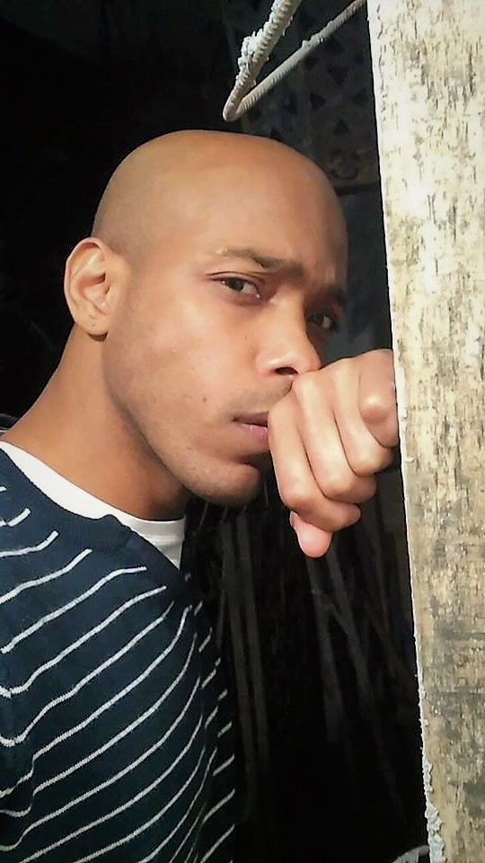
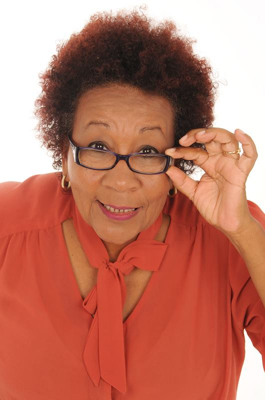

**EBL:** Momô, qual a sua avaliação sobre o cenário cinematográfico de um modo geral no Brasil?  
  
**MO:** Vejo o cenário cinematográfico no Brasil com muitas incertezas, apesar de sabermos recentemente que para o ano de 2020 grandes nomes do STREAM irão injetar alguns milhões no setor, o que é muito positivo, não teremos, por outros lado, políticas públicas neste sentido e, naturalmente, a comunidade mais carente não será tocada por essas ações do setor privado. Ao meu ver, faltam mais projetos que envolvam a parcela menos favorecida da população.  
  
**EBL:** Você é uma atriz de 63 anos, como você vê, dentro deste cenário do audiovisual que você desenhou, a questão da absorção de atrizes negras e com mais de 50 anos?  
  
**MO:** Participo de muitas campanhas para TV e as vezes alguns trabalhos no cinema, percebo que atrizes negras e idosas, quando aparecem, são como uma participação de obrigatoriedade, para cumprimento de etapas. Temos aqui 3 problemas, a IDADE, o GÊNERO e a RAÇA. A atriz negra está geralmente em desvantagem, seja ela jovem ou madura.  
  
**EBL:** Na sua opinião, o fato de eu, o autor e diretor da obra DORA NÃO CANSOU DE VIVER... ser negro, foi determinante para escolha de um elenco também negro? Em outras palavras, você acredita que seria menos provável que um diretor branco fizesse tal escolha?  
  
**MO:** Honestamente, eu acredito que você, o autor e diretor, ser negro, foi sim determinante para a escolha de um elenco afro, uma vez que o roteiro em si não deixa evidente esta especificidade em nenhum momento e eu infelizmente tenho dificuldade em admitir que um diretor branco pudesse fugir dos padrões que conhecemos, não digo que seria impossível, apenas improvável.  
  
**EBL:** O que te chamou atenção no roteiro de DORA NÃO CANSOU DE VIVER...?  
  
**MO:** O roteiro me causou um impacto muito grande pela sensibilidade e delicadeza com as quais ele foi escrito, você foi muito habilidoso, cada cena é como um desenho, uma pintura, e o fato de não ter diálogo no texto me cativou ainda mais, pois como atriz, esse tipo de trabalho além de ser raro é sempre muito desafiador e gratificante, pois nos faz descobrir algumas ferramentas que nós nem sequer sabíamos que tínhamos. E por fim a personagem em si, DORA, uma verdadeira guerreira que representa mulheres e mães no mundo inteiro, é uma personagem universal, de fácil identificação, mas com muita particularidade, muito bem atribuídas pelo autor.   
  
**EBL: Como atriz madura e mulher, o que você espera com esta obra audiovisual?**  
  
MO: Meu desejo é passar uma mensagem de amor e solidariedade, espero que ela chegue às escolas, que os jovens debatam sobre a importância das questões sociais e que levem esses questionamentos para seus lares, precisamos olhar mais ao nosso redor e não apenas esperar das autoridades, devemos cobrar sim, mas também fazer a nossa parte.

\_\_\_\_\_\_\_\_\_\_\_\_\_\_\_\_\_\_\_\_\_\_\_\_\_\_\_\_\_

**EBL:** Momô, what is your analysis of the general cinematographic scene in Brazil?

**MO**: I see the cinematographic scene in Brazil as having a lot of uncertainties, although we have found out recently that in the year of 2020, many big names from the STREAM will inject some millions into the sector, which is something very positive, but on another hand, we won’t have public policy in this sense, and, naturally, the more needy community will not be touched by these actions going on in the private sector. In my opinion, we lack more projects that involve the less favored portion of the population. 

**EBL:** You are a 63 year-old actress. How do you see, within this audiovisual scene that you described, the matter of the absorption of black actresses over the age of 50?

**MO:** I participate in many TV campaigns, and sometimes some works for cinema, and I notice that elderly black actresses, when they appear, it's like a participation out of obligation, to comply with requirements. Here we have 3 problems, AGE, GENDER, and RACE. The black actress is generally in a disadvantage, whether she is young or older.

**EBL:** In your opinion, the fact that the I, the author and director of DORA NÃO CANSOU DE VIVER… am black, was decisive in the choice of having a cast that is also black? In other words, do you believe it would be less probable that a white director would have made such a decision?

**MO:** Honestly, I believe that the fact that you, the author and director, are black, was indeed decisive in the choice of an afro cast, as the script itself does not make this specificity evident at any moment. I, unfortunately, have difficulty admitting that a white director would have been capable of escaping the standards we know, I’m not saying that it would have been impossible, just improbable.

**EBL:** What caught your attention in the script of DORA NÃO CANSOU DE VIVER...?

**MO:** The script caused a big impact on me for the great sensibility and delicacy in which it was written. You were very skilled, each scene is like a drawing, a painting, and the fact that there is no dialogue in the text captivated me even more, since, as an actress, this kind of work is not only rare, it is also challenging and rewarding, because it makes us discover some tools that we didn’t even know we had. And finally, the character herself, DORA, is a true warrior who represents women and mothers all over the world, she is a universal character, easy to identify with, but with many particularities, which were all very well attributed by the author.

**EBL:** As a senior actress and woman, what do you expect from this audiovisual work?

**MO:** My desire is to pass on a message of love and solidarity, and I hope that it arrives at schools, that young people debate the importance of social matters, and that they take these questionings back into their own homes. We need to look around us more, and not only at the authorities, we do need to  demand things from them, but we also need to do our part.

- 
    
- 
    

Help finance Emanuel Brauna-Lechat's film, 'DORA NÃO CANSOU DE VIVER...' here: [https://www.catarse.me/doranaocansoudeviver](https://www.catarse.me/doranaocansoudeviver)

See also: [interview with Emanuel Brauna-Lechat](https://luvhurts.co/encounters/dora-nao-consou-de-viver-a-film-in-the-making/)
