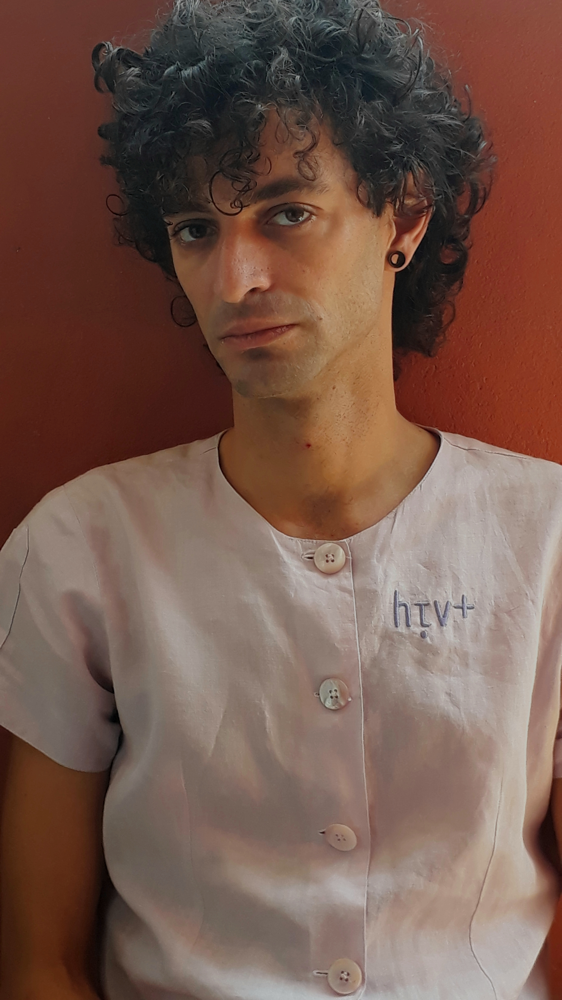

<figure>

<figcaption>

_photo: Cadu Oliveira_

</figcaption>

</figure>

My upstairs neighbor, Carué is a medical doctor and AIDS activist. While he doesn’t front as artist, he has a cool project (that occurs to me as artistic) by which he asks for a piece of clothing. He takes it to a local shopping mall, Galeria do Rock where a lot of young people hang out in the center of São Paulo and a specific embroidery shop in the busy arcade. He pays for ‘HIV+’ to be embroidered somewhere prominently on the piece. He then tells you where to pick it up. One need not be HIV+ to receive this gift. Recently I asked him if I could include a photograph of his embroidered work in a museum show that I’m co-curating. For a range of reasons, the curatorial group first used a cropped image of his suit coat without his face, and agreed that I would ask him if he preferred a different image. Carué insisted that we show his face, and so we replaced the ‘suit coat’ with a new image he provided. It was an easy decision to come to, perhaps because we have already acknowledged both the need to personalize (or put a face to HIV) against the subtext of using the face of a white man for this particular theme (and in the Museum of Sexual Diversity’s location in a busy metro station). Since these topics were already ‘on the table’, the curatorial group was able to easily balance the topic of HIV/AIDS with other themes; reconsider the prominence and placement of non-white faces and voices in the small space; and adjust the ratio of women, men, trans (men and women), and non-binary folks participating in the show. As a curator, artist and HIV+ downstairs neighbor, I found it a unique learning experience. And, I also understood why Carué required me to pick up my gift, when the lady at the embroidery shop asked me to repeat more loudly what was embroidered on the piece as she shuffled through past orders in the back of the shop. ‘HIV+’ I said, and tipped my head to the guy behind me in line who was waiting on us to finish the transaction. She found it, holding up a green linen button-up with fluorescent orange embroidery.
