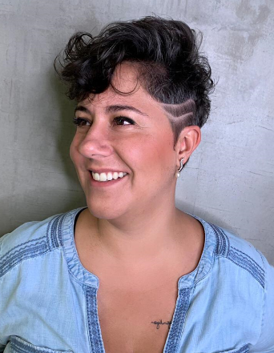

\_\_\_\_\_\_\_\_\_\_\_\_\_\_\_\_\_\_\_\_\_\_\_\_\_\_\_\_\_\_\_\_\_\_\_\_\_

Support Marina Vergueiro's [crowdfunding for the PROJETO EXPOSTA](https://www.kickante.com.br/campanhas/exposta)

\_\_\_\_\_\_\_\_\_\_\_\_\_\_\_\_\_\_\_\_\_\_\_\_\_\_\_\_\_\_\_\_\_\_\_\_\_

Eu tive Aids por dois meses.  
Há 7 anos, eu tive Aids por dois meses.  
AIDS.  
AIDS mesmo.  
Olha só.  
Não morri.  
Eu continuo aqui.  
A Aids não.  
Ela vazou.  
Evaporou de mim  
E sumiu.  
A Aids é coisa do meu passado,  
Desde que me tornei indetectável.  
Já o HIV sobreviveu  
Assim como eu.  
O HIV é um vírus que você não vê…  
Pois eu pareço tanto a você!  
Não é mesmo?  
Eu poderia ser você  
E você poderia ser eu  
O HIV não escolhe bicha, machão,  
santa ou ateu,  
tanto faz aonde você se meteu  
Ou com quem você meteu.  
O HIV é meu E é teu,  
É de quem cruzar O caminho,  
Seja monogâmica, “fiel”, bolsominion,  
Esquerdomacho, idosa, tarado,  
Mãe de família, trava, empresário,  
O HIV se lixa se você tá no armário!

Quando me encontrou,  
O HIV chegou como quem não quer nada,  
Me encheu de beijinhos,  
E me levou ao orgasmo.  
O HIV é um vírus apaixonado  
E, não, isso não é um pleonasmo.  
Me lembro do meu primeiro namorado  
Pera! Pera!  
Nananannanana  
NAO, ele não é o culpado.  
Ou você aponta o dedo na cara de quem te passou um resfriado?  
Ele foi vítima do estigma,  
Tão cruel que dói até na rima.

E Justamente por medo da discriminação,  
Por mais de meia década,  
me privei de amar e ser amada,  
Enclausurei meu tesão  
E em vida me fiz sepultada,

Mesmo indetectável e intransmissível,  
Eu me sentia des pre-zí-vel  
Por causa de um vírus invisível  
Que há um quarto de século já não é mais uma sentença de morte  
Acorda!  
Amar NÃO É brincar com a própria sorte!  
Amar é simplesmente amar  
e nos faz mais fortes!

Vírus da Imunodeficiência HUMANA!  
Por que você acha que você é diferente, hein boy, hein mana?!  
SUA IGNorancia não me engana!  
E nem te coloca à margem da epidemia  
Pode parar com esta PUTARIA  
De me julgar baseada no teu preconceito,  
Meu HIV não é um defeito,  
É um vírus, uma doença crônica,  
Uma falha no sistema,  
Definitivamente não é meu maior problema.  
Você tem medo de trepar comigo porque vai pegar?  
Você tem medo de me amar porque eu vou morrer?  
Ou você não sabe por que nunca conheceu ninguém com HIV?

PARA  
Respira!

Em que mundo você vive?  
Não vamos todos morrer?  
Por acaso Você se apresenta aas pessoas  
“Oi, prazer, sou fulano  
tenho diabetes e enxaqueca”  
Pelo amor da buceta,  
(Mãe de cada um de nós)

O que é maior pra você  
sua ignorância,  
seu preconceito  
ou o HIV?

https://youtu.be/0sZRT48cLJk

\_\_\_\_\_\_\_\_\_\_\_\_\_\_\_\_\_\_\_\_\_\_\_\_\_\_\_\_\_\_\_\_\_\_\_\_\_

Instagram: [https://www.instagram.com/marina\_vergueiro/](https://www.instagram.com/marina_vergueiro/)
