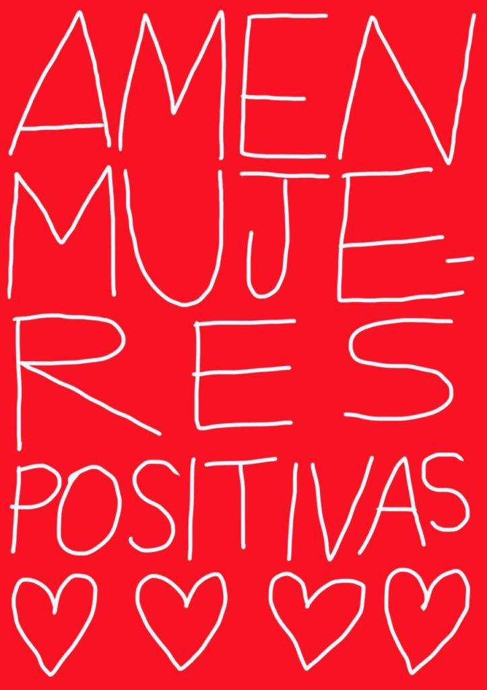
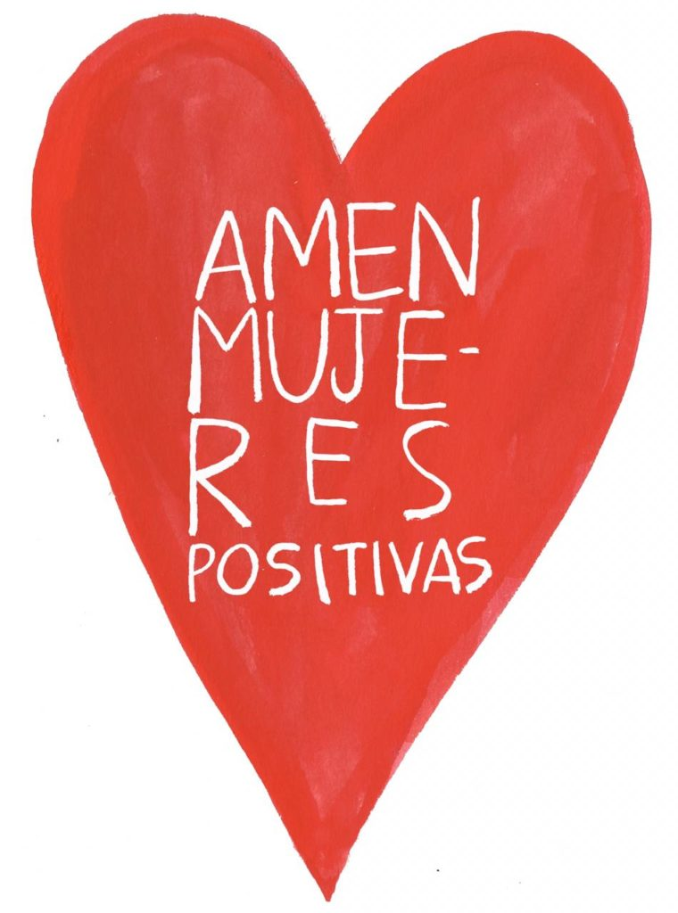
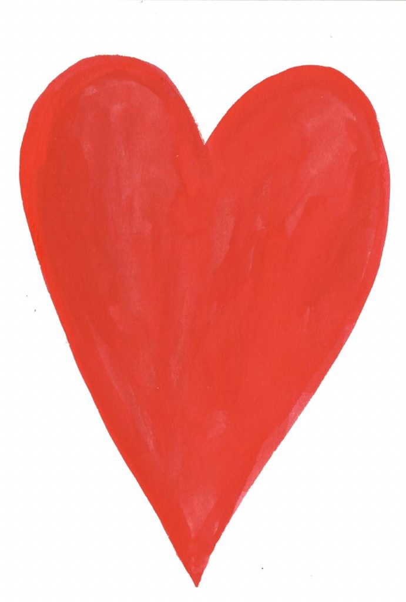
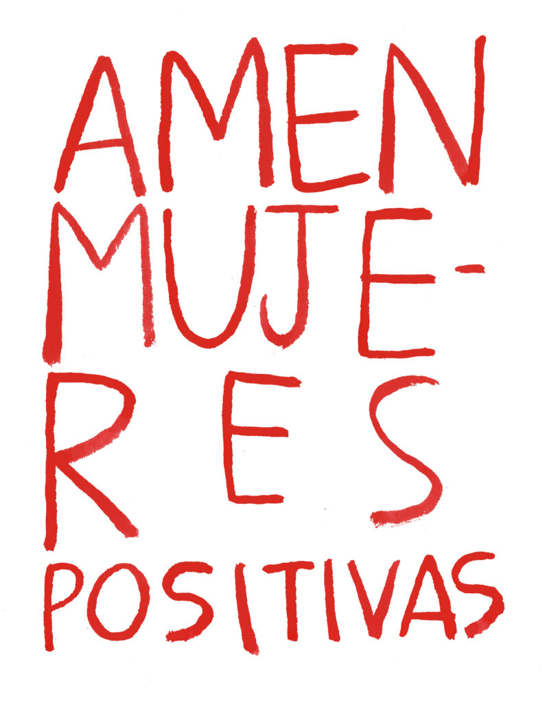

_\[On the occasion of_ [_Love Positive Women_](https://luvhurts.co/coalition/love-women/) _2020, a project by_ [_Jessica Lynn Whitbread_](http://jessicawhitbread.com/project/love-positive-women/) _and partners around the world, Colombian graphic artist,_ [_Power Paola_](https://www.instagram.com/powerpaola) _offered some new Spanish-language designs, which can be used for years to come as well. I met Power Paola through Daniel Santiago Salguero, who convened the [Luciérnagas](https://luvhurts.co/coalition/luciernagas/) laboratory. Thanks Daniel and Power Paola!! xo Todd\]_

- 
    
- 
    
- 
    
- 
