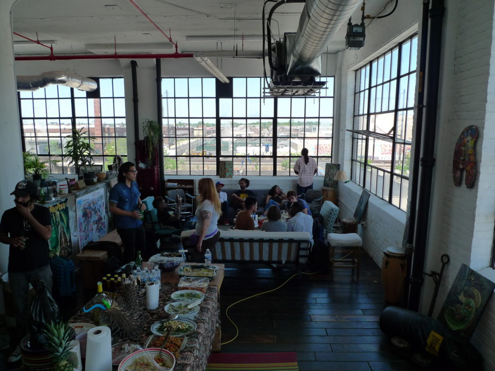

You've all heard about the gay content shows being cancelled or censored all over Brasil. Maybe you heard of the Sexualities show at MASP a couple years back as well. MASP is a big institution. It gets big-named curators. And a lot of attention. 

  
Just now there is a [theatre piece on HIV](https://www1.folha.uol.com.br/ilustrada/2019/10/caixa-cultural-cancela-peca-sobre-gay-soropositivo.shtml) being censored in São Paulo. 

I came up with the [Queer City (or Cidade Queer)](http://cidadequeer.lanchonete.org/) a project within [Lanchonete.org](http://lanchonete.org/) as a response to contracting HIV in São Paulo a few years before. I am happy with how Cidade Queer performed as a project. During its span in 2015/16, research would have been done for the forthcoming Sexualities show at MASP. In 2017 we were still making programming with a strong Canadian partner. I had a part-time job with that organization, resulting from a ten-year grant-receiving relationship during which I also served as creative director to some major foundation programs. I deployed a 20-year global cultural network to each program I took on for the Canadian organization. I forgot my HIV meds on one of my many international trips in 2017 working for the foundation. I asked for a 'cost of living allowance' /COLA-related increase on my next contract near the end of 2017. It was related to the cost of international travel insurance that would cover medication replacement. I was pouting about this once over dinner with a friend, an HIV+ medical doctor. He responded that he'd lost his medical post the week after he presented ideas on a panel at the Queer City finale, an international ball and awareness-raising day on a range of 'queer' issues. In that I understood that I was not alone. I recently got to go to Egypt and on way back met an exiled Egyptian activist living with his partner in Paris. He raised his voice about the government stalling his HIV meds, and he was beaten up one night in his apartment. Other serious danger signals happened: threats. They left to Paris and began advocacy work on the situation in Egypt and Middle East. I spoke to a Mexican artist who moved to Berlin after falling blind due to lack of access to HIV meds. These stories pile up as I survey my peers on their regions and conditions in preparation for Luv 'til it Hurts. 

  
Back around the end of Queer City and its ATAQUE ball in September 2016, I gave an interview to Brazilian Elle on the São Paulo Ballroom and Voguing scene. I specifically asked them to mention my HIV status. I specifically asked the journalist to state that I contracted HIV in São Paulo. And, this was the catalyst for creating and producing the programme. When I read the article this detail had been excluded. Then sometime in the same 2017 period was the Sexualities show at MASP until early 2018. I asked a Mexican magazine if it wanted a review, given that the show had a Mexican curator. The resulting review (after my two visits to the show) was declined. I pitched again to a Polish, US and another thematic 'art leaks' online journal. There was something I was doing in my rejected article akin to concrete poetry. I stated over and over throughout the article that I contracted HIV in São Paulo in the previous few years. I talked about gay white male privilege. I asked the publication curator why our research output, [Queer City: A Reader](http://www.edicoesaurora.com/cidade-queer-uma-leitora/) made with Publication Studio São Paulo) hadn't been considered for the publication table. The one that secures publications with fishing line. I asked in my article why the word or acronym HIV did not appear much (or at all, I think). A Colombian artist asked me in NYC how the show was, and I told him I hated it. Or rather that I had a beef with it I explained in a journal article. He told me the curator wouldn't like that. I think he meant the Mexican one.   

In the article I attempt to share some of the early signs of Brazil’s cultural revolution. I share the article (see below) with you today in protest of the theatre piece’s censorship. Caixa Cultural, you have a responsibility to help a closing society stay open at the cultural bridge-points, these ‘cultural’ spaces that you fund through public (Lei Rouanet and other channels) tax-relief incentivized funds. Please do your part to keep HIV in an open conversation. Some of the anecdotes I speak of in this crônica are related to stigma. Something that is often invisible, dormant, and awaiting 'fresh air' to displace and evolve society's sensibilities. One of the ways to offer that fresh air to HIV-related stigma is an open conversation. I contracted HIV in São Paulo just a few years ago, and I am your public. 

As a reaction and way-to-process my own feelings about HIV, I created the Luv 'til it Hurts project. the very first event was an organic public event in Philadelphia with [Amber Art & Design](http://www.amberartanddesign.com/), a public art and social justice-focused collective. In fact Amber Art visited São Paulo as residents to Lanchonete.org, during which time the project gained a 'Neighborhood Museum' concept and space (an apartment above the lunch counter) for the next year of programming. On May 24, 2018 Luv 'til it Hurts was supposed to have its open meeting / planning discussion at beginning of two-year process) at the Strawberry Mansion, a community space for which Amber Art & Design was commissioned to make programming. As the date for the event approached an Amber member told me that there was some opposition to an HIV-themed event at the Strawberry Mansion site. That we would like have the event at Amber's studio instead. It was a beautiful community meal with people traveling from NYC. Some of us gathered at an Amber member's house the night before, and a leader from the HIV activism world in NYC cooked food for both dinner and the next day's community lunch. Others came down the morning of. From memory there was a range of folks from Philly, a member of a NYC-based architectural / public space collective, a medical doctor/professor visiting the NYC AIDS Institute from the University of São Paulo, Taiwanese artist [Kairon Liu](https://www.kaironliu.com/), Sebastien the co-founder of [Residency Unlimited](http://www.residencyunlimited.org/) and now RiVET, an independent journalist and others. At the end of the day we have some ice cream and beer on porch of the Strawberry Mansion. 

  
While we had not had the whole day event there, there was some triumph in spending the last hours there before some of us took the bus back to NYC. Later, on August 20th we had another community meeting on the occasion of Black Pride and visiting members of House of Zion Brazil and Coletivo Amem (São Paulo) hosted by Residency Unlimited. Something I want to remember for a future crônica.

  
I contracted HIV in São Paulo just a few years ago, and I am your public. 

\*\*\*

[MASP\_Sexualities\_Review](https://luvhurts.co/wp-content/uploads/2019/10/MASP_Sexualities_Review.pdf)[Download](https://luvhurts.co/wp-content/uploads/2019/10/MASP_Sexualities_Review.pdf)
