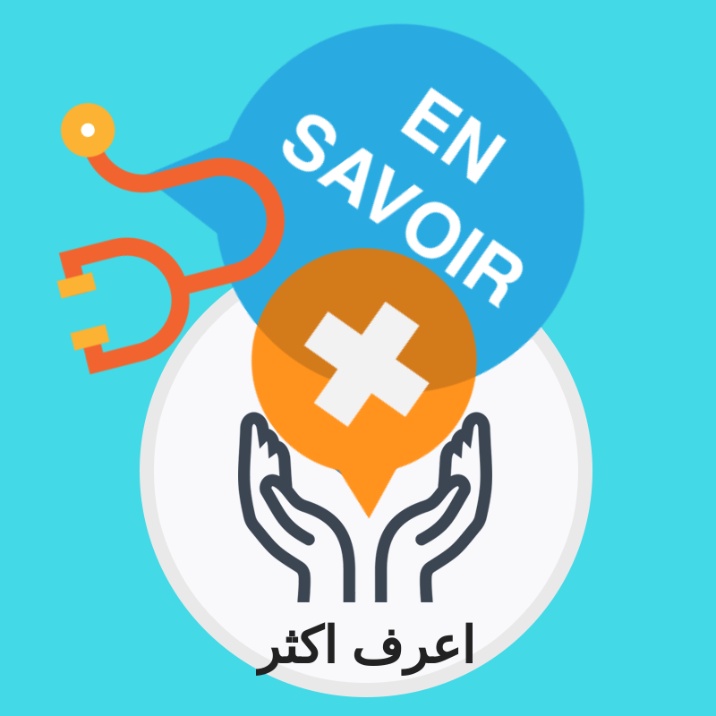

**TL: A mutual friend and queer activist in Cairo was helping me find a place to stay in Paris only a few days before my trip. I somehow end up sleeping on your couch in the suburbs of Paris.**

**You two make the Ankh Association that supports LGBTQQI and HIV+ folks in the Middle East through an arts advocacy campaign. Can I ask, how you got here? Back in Paris and making Ankh?**

ANKH: First things first, Nicolas is a French activist who has been involved for many years in various collectives defending minorities’ rights in France (LGBTIQ, women, migrants, etc.) while working in cultural cooperation between France and the Middle-East. Taha is Egyptian and has also actively been involved in the Human Rights field in his country, both as an activist and on a professional level. We met a few years ago in Egypt, where we were both involved in the local LGBTIQ community. By the end of 2016, due to different circumstances, we also began to be more involved with the HIV+ community, witnessing the numerous challenges and difficulties that one might have in Egypt in order to access testing, treatment, and especially dealing with religious and social stigmatization. For instance, we realized that there was almost no center where one can go to get tested, and the few existing places are being closed by the government. Now the only places where you can get tested are in government-run facilities, which are already in a very small number. Regarding the treatment, you also need to go to the government to be allowed to have access to it, which usually takes months, you never get to know the results of your test, sometimes the medicine is not available for weeks, or they change it without telling you… Of course not mentioning the way that HIV+ people are being treated by doctors and nurses, which most of the time results in them avoiding going to hospitals or doctors at all.

So when we came to France in early 2018, we started thinking about how to help change the situation there, so we decided to make an NGO that will be able to both support HIV+ and LGBTIQ people in Egypt, as well as to advocate and educate on matters related to sexual health, sexual orientation and gender identity, human rights, etc. This is why we established the ANKH association, and the first thing that we worked on was a sexual health campaign called ‘Know More’.

**TL: The Know More campaign is online, and the byproduct is a traveling show called Points of Life for which you already have shows in Lyon and Grenoble lined up and 10 participating artists. How does it work? And, what is your goal ... what will the viewing public understand after attending one of your events. Is there something you want them to know (or do) about HIV conditions in the region?**

ANKH: We started the Know More campaign as an online Facebook page in Arabic, French and English, aiming to raise awareness in the Arab-speaking communities about sexual health issues, and HIV was, of course, a very big part of it.

In order to reach a different audience in Europe and to make more people aware of the challenges that HIV+ people in the Middle-East are facing, we decided to make an art exhibition based on testimonies by people living with HIV in Egypt that will be showed in various European cities.

So we had an open call out for 2 months asking people who are living with HIV in Egypt to send us artworks expressing their personal experiences, either through a small video, voice recording, photo, or text… We ended up receiving up to 8 pieces, from people of different ages, locations, and genders, each depicting how these people manage to live with HIV in their country.

We thought that setting up an art exhibition as a part of an advocacy campaign is a really effective way to reach people, as it is based on direct testimonies, thus creating a direct connection with the audience, through very simple art forms like mobile videos, photos, or recordings that are accessible to anyone.

**TL: OK, then what if another city wants to have the Points of Life exhibition. Would you take it anywhere or do you prefer that it be received in a specific way (locations) whereby your overall strategy is advanced?**

ANKH: We will be more than happy to see Points of Life being exhibited in various cities around the world! The whole point of the project is about encounters and sharing experiences, especially with different kinds of audiences. One thing that we are focusing on is for the exhibition to be shown in very different types of places, sometimes LGBTIQ centres, or art spaces, community centres, etc… Our technical requirements are really basic so it’s really easy to make it travel from one place to another. Also, the exhibition is usually introduced with a small speech about the situation of people living with HIV in Egypt, but we also like to have it linked with a more entertaining event like a movie screening, food, concert, party… Everything is possible, depending on the place where it is organized!

\_\_\_\_\_\_\_\_\_\_\_\_\_\_

To learn more:

Know More Campaign: [https://www.facebook.com/know.more.campaign](https://www.facebook.com/know.more.campaign)  
Ankh Association: [https://www.ankhfrance.org/](https://www.ankhfrance.org/)

