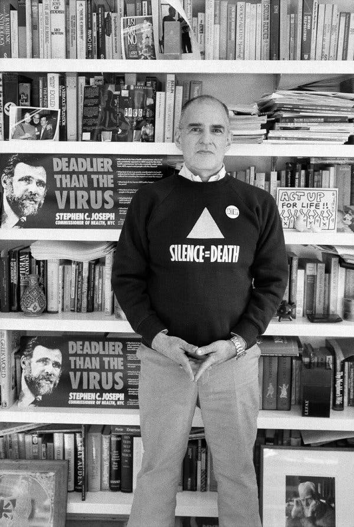

###### **The author and activist Larry Kramer at an AIDS conference in New York in 1987. In the early 1980s, Mr. Kramer was among the first people to foresee that what had at first caused alarm as a rare form of cancer among gay men would spread worldwide and kill millions of people. Credit: Catherine McGann/Getty Images**

  
_\[\*I once saw Larry outside of the VIP performance of 'A Normal Heart'. He was handing out fliers to people exiting the theater. I remember he, Urvashi Vaid and Kate Clinton exchanging warm greetings as he shoved a flier in their hands gruffly. It seems he never stopped pushing an HIV-related agenda. The other day a partner on the LUV project in Warsaw, Jakub Szczęsny sent me a two-word text 'Larry Kramer', and while I'm not sure what made Jakub think of him, he reminded me I want to commemorate his life of being importantly difficult on the LUV site! xo Todd\]_

  
He sought to shock the country into dealing with AIDS as a public-health emergency and foresaw that it could kill millions regardless of sexual orientation.

By Daniel Lewis  
May 27, 2020

Larry Kramer, the noted writer whose raucous, antagonistic campaign for an all-out response to the AIDS crisis helped shift national health policy in the 1980s and ’90s, died on Wednesday morning in Manhattan. He was 84.

His husband, David Webster, said the cause was pneumonia. Mr. Kramer had weathered illness for much of his adult life. Among other things he had been infected with H.I.V., the virus that causes AIDS, contracted liver disease and underwent a successful liver transplant.

An author, essayist and playwright — notably hailed for his autobiographical 1985 play, “The Normal Heart” — Mr. Kramer had feet in both the world of letters and the public sphere. In 1981 he was a founder of the Gay Men’s Health Crisis, the first service organization for H.I.V.-positive people, though his fellow directors effectively kicked him out a year later for his aggressive approach. (He returned the compliment by calling them “a sad organization of sissies.”)

He was then a founder of a more militant group, Act Up (AIDS Coalition to Unleash Power), whose street actions demanding a speedup in AIDS drugs research and an end to discrimination against gay men and lesbians severely disrupted the operations of government offices, Wall Street and the Roman Catholic hierarchy.

<figure>

<figcaption>

Mr. Kramer at his apartment in Manhattan in 1987.Credit...Ángel Franco/The New York Times

</figcaption>

</figure>

“One of America’s most valuable troublemakers,” Susan Sontag called him.

Even some of the officials Mr. Kramer accused of “murder” and “genocide” recognized that his outbursts were part of a strategy to shock the country into dealing with AIDS as a public-health emergency.

In the early 1980s, he was among the first activists to foresee that what had at first caused alarm as a rare form of cancer among gay men would spread worldwide, like any other sexually transmitted disease, and kill millions of people without regard to sexual orientation. Under the circumstances, he said, “If you write a calm letter and fax it to nobody, it sinks like a brick in the Hudson.”

<figure>

<figcaption>

Demonstrators in front of the New York Stock Exchange in 1989 protesting the high cost of the AIDS drug AZT. The protest was organized by the militant group Act Up, of which Mr. Kramer was a founder.Credit...Tim Clary/Associated Press

</figcaption>

</figure>

The infectious-disease expert Dr. Anthony S. Fauci, longtime director of the National Institute of Allergy and Infectious Diseases, was one who got the message — after Mr. Kramer wrote an open letter published in The San Francisco Examiner in 1988 calling him a killer and “an incompetent idiot.”

“Once you got past the rhetoric,” [Dr. Fauci](https://www.nytimes.com/2020/05/27/health/larry-kramer-anthony-fauci.html) said in an interview for this obituary, “you found that Larry Kramer made a lot of sense, and that he had a heart of gold.”

\[[Read about Dr. Fauci’s relationship with Larry Kramer](https://www.nytimes.com/2020/05/27/health/larry-kramer-anthony-fauci.html).\]

Mr. Kramer, he said, had helped him to see how the federal bureaucracy was indeed slowing the search for effective treatments. He credited Mr. Kramer with playing an “essential” role in the development of elaborate drug regimens that could prolong the lives of those infected with H.I.V., and in prompting the Food and Drug Administration to streamline its assessment and approval of certain new drugs.

In recent years Mr. Kramer developed a grudging friendship with Dr. Fauci, particularly after Mr. Kramer developed liver disease and underwent the transplant in 2001; Dr. Fauci helped get him into a lifesaving experimental drug trial afterward.

Their bond grew stronger this year, when Dr. Fauci became the public face of the White House task force on the coronavirus epidemic, opening him to criticism in some quarters.

“We are friends again,” Mr. Kramer said in an email to the reporter John Leland of The New York Times for [an article](https://www.nytimes.com/2020/03/28/nyregion/coronavirus-larry-kramer-aids.html) published at the end of March. “I’m feeling sorry for how he’s being treated. I emailed him this, but his one line answer was, ‘Hunker down.’”

At his death Mr. Kramer was at work on a play centered on the epidemic. “It’s about gay people having to live through three plagues,” he told Mr. Leland — H.I.V./AIDS, Covid-19 and the decline of the human body, an inevitability brought home to him last year when he fell and broke a leg in his apartment, then lay on the floor for hours waiting for a home attendant to arrive.

## Master of Provocation

Mr. Kramer enjoyed provocation for its own sake — he once introduced Mayor Edward I. Koch of New York to his pet wheaten terrier as the man who was “killing Daddy’s friends” — and this could sometimes overshadow his achievements as an author and social activist.

His breakthrough as a writer came with a screen adaptation of D.H. Lawrence’s “Women in Love,” for which he had obtained the film rights with $4,200 of his own money. He also produced the film, which was a box-office hit when it was released in 1969 and a high point of more than one career. The screenplay was nominated for an Academy Award; Glenda Jackson won an Oscar as best actress for her performance; and the director, [Ken Russell](https://www.nytimes.com/2011/11/29/arts/ken-russell-controversial-director-dies-at-84.html), established himself as an important filmmaker.

Four years later, Mr. Kramer wrote the screenplay for the ill-fated musical remake of the classic 1937 film “Lost Horizon.”

<figure>

<figcaption>

Mr. Kramer’s breakthrough as a writer came with his screen adaptation of D.H. Lawrence’s “Women in Love” (1969), directed by Ken Russell. The movie’s cast included, from left, Eleanor Bron, Jennie Linden, Alan Bates, Oliver Reed and Glenda Jackson.Credit...MGM

</figcaption>

</figure>

Mr. Kramer eventually turned to gay themes, and in his first novel, “Faggots,” he did so with a vengeance. A scathing look at promiscuous sex, drug use, predation and sadomasochism among gay men, it was a lightning rod from the day of its publication in 1978.

Some reviewers simply found it beyond belief. (On the contrary, Mr. Kramer responded, it was more a documentary than a work of fiction.) Others complained that it libeled gay people generally, that it lacked literary merit, and that the narrator’s epiphany — one “must have the strength and courage to say no” — was not exactly a stroke of genius.

“Faggots” drew a line between Mr. Kramer and a significant number of gay men, who saw him as an old-fashioned moralist or even a hysteric. In various forums well into the 1990s, he found himself called on to defend his point of view, which was essentially that gay men and lesbians had a diminished chance of living fulfilling lives or producing great art so long as they defined themselves primarily in terms of their sexual orientation.

He preached not only protected sex but also the virtues of affection, commitment and stability — arguments that anticipated the values of the movement for same-sex marriage.

## An Uneasy Childhood

Laurence David Kramer was born on June 25, 1935, in Bridgeport, Conn., the second son of George and Rea (Wishengrad) Kramer. George Kramer had earned undergraduate and law degrees from Yale University but was unable to make a decent living during the Depression. Rea Kramer supported the family by working in a shoe store and teaching English to immigrants. In 1941, George got a government job in Washington, and the family moved.

By his own account, Larry had a miserable childhood and hated his father. His protective older brother, Arthur, was the scholar-athlete of the family, on his way to becoming a prominent lawyer. Larry read the Hollywood gossip columns.

“From the day Larry was born until the day my father died, they were antagonists,” Arthur Kramer told Vanity Fair in 1992.

Nor were the two brothers always on the easiest terms. In “The Normal Heart,” Arthur Kramer is represented by the character Ben Weeks, a man with ambivalent feelings about his brother’s homosexuality. But they shared an abiding affection until Arthur’s death in 2008. Arthur gave $1 million to Yale in 2001 to establish the Larry Kramer Initiative for Lesbian and Gay Studies, and his law firm became active in pro bono work for causes like same-sex marriage.

Larry Kramer himself married his partner, Mr. Webster, in 2013, in a ceremony in the intensive care unit of NYU Langone Medical Center, where Mr. Kramer was recovering from surgery for a bowel obstruction.

<figure>

<figcaption>

Mr. Kramer at home in 1989, a year after he learned he was H.I.V. positive.Credit...Sara Krulwich/The New York Times

</figcaption>

</figure>

In 1953, Mr. Kramer, like his father and brother before him, enrolled at Yale. He studied English literature, tried to kill himself once and had a liberating affair with a male professor.

After graduating in 1957 and serving a tour in the Army, he worked in New York, first for the William Morris Agency and then for Columbia Pictures. In 1961, Columbia sent him to London, where he worked as production executive on “Dr. Strangelove” and “Lawrence of Arabia.” He returned to the United States in 1972.

He got into AIDS work in the summer of 1981 after reading an article about deadly cases of a rare cancer, Kaposi’s sarcoma, among young gay men. It had previously been associated mostly with older men. A meeting of about 80 people in his New York apartment the next week led to the formation of the Gay Men’s Health Crisis.

For the next several years, Mr. Kramer threw himself into fund-raising, lobbying and confrontation, and also into his writing. His landmark essay [“1,112 and Counting,”](http://bilerico.lgbtqnation.com/2011/06/larry_kramers_historic_essay_aids_at_30.php) which appeared in the March 14, 1983, issue of The New York Native, was one of many articles taking gay men to task for apathy.

## ‘The Normal Heart’

The urgency of his life found its way into his plays. “The Normal Heart,” which opened at the Public Theater in April 1985 and ran for nine months, was a passionate account of the early years of AIDS and his campaign to get somebody to do something about it.

“The Normal Heart” returned to the stage in 2011, to powerful effect. “By the play’s end,” [Ben Brantley of The New York Times wrote in his review](https://www.nytimes.com/2011/04/28/theater/reviews/the-normal-heart-on-broadway-theater-review.html), “even people who think they have no patience for polemical theater may find their resistance has melted into tears. No, make that sobs.”

That production won the Tony Award for best revival of a play. An HBO adaptation, written by Mr. Kramer, won the 2014 Emmy for outstanding television movie.

Less successful was Mr. Kramer’s “Just Say No,” a sendup of official morality aimed at familiar targets, including Ronald and Nancy Reagan. [Widely criticized](https://www.nytimes.com/1988/10/21/theater/reviews-theater-skewers-for-the-political-in-kramer-s-just-say-no.html) as crude and nasty, it opened Off Broadway in October 1988 and closed a month later.

That same year, tests confirmed what Mr. Kramer had long suspected: He was carrying the virus that causes AIDS.

“A new fear has now joined my daily repertoire of emotions, and my nighttime ones, too,” he wrote in the afterword to a later edition of his 1989 book, “Reports From the Holocaust: The Making of an AIDS Activist.” “But life has also become exceptionally more precious and, ironically, I am happier.”

<figure>

<figcaption>

Mr. Kramer in 2011 in front of the John Golden Theater in New York, where his 1985 play, “The Normal Heart,” returned to the stage to powerful effect.Credit...Hiroko Masuike/The New York Times

</figcaption>

</figure>

He turned his attention to another autobiographical play, ultimately titled “The Destiny of Me,” which opened in 1992. Recalling the development of that work in an essay for The Times, he called it “one of those ‘family’-slash-‘memory’ plays I suspect most playwrights feel compelled to try their hand at in a feeble attempt, before it’s too late, to find out what their lives have been all about.”

As the play came to life during rehearsals at the Circle Repertory Company, Mr. Kramer wrote, it was a revelation even to him: “The father I’d hated became someone sad to me; and the mother I’d adored became a little less adorable, and no less sad.”

He and Mr. Webster, an architect, began living together in 1994, and Mr. Kramer was able to devote much of his time to writing, in spite of being ill for many more years. Believing that he would die soon, he began putting his literary affairs in order. In fact, The Associated Press reported in 2001 that he had died.

The real plot twist, though, was that the H.I.V. infection had not progressed; he instead had terminal liver disease, traceable to a hepatitis B infection decades earlier. He underwent the liver transplant in Pittsburgh a few days before Christmas 2001.

At the same time, he had been working on a mammoth project, a historical novel called “The American People,” by which he meant the gay American people — a central tenet of which was that many of the country’s historically important figures, including George Washington and Abraham Lincoln, had had homosexual relationships.

A first volume, almost 800 pages long, was published in 2015. Volume 2, more than 80 pages longer, was published in 2020.

The reviews for “The American People, Volume 1: Search for My Heart” were not kind. [Dwight Garner of The Times](https://www.nytimes.com/2015/03/27/books/review-the-american-people-volume-1-by-larry-kramer-retells-history-with-passion.html), for example, called it “a frantic novel that builds up little to no narrative momentum.”

<figure>

<figcaption>

Mr. Kramer in 2017. “Once you got past the rhetoric,” said Dr. Anthony Fauci, an adversary who became a friend, “you found that Larry Kramer made a lot of sense, and that he had a heart of gold.”Credit...Joshua Bright for The New York Times

</figcaption>

</figure>

“It wasn’t given much serious attention,” Mr. Kramer told The Times in 2017. “Most people seemed to review me, not the book: Loudmouth activist Larry Kramer has written a loudmouth book.”

“The American People, Volume 2: The Brutality of Fact,” whose protagonist was based on Mr. Kramer, took its story almost to the present and took scabrous aim at characters clearly based on Ronald Reagan, Hugh Hefner and others. The reviews were not much better.

ADVERTISEMENT[Continue reading the main story](https://www.nytimes.com/2020/05/27/us/larry-kramer-dead.html#after-story-ad-8)

But while Mr. Garner for one found much to dislike, [his Times review](https://www.nytimes.com/2020/01/06/books/review-american-people-volume-two-larry-kramer.html) was not unsympathetic.

“It’s a mess, a folly covered in mirrored tiles, but somehow it’s a beautiful and humane one,” he wrote. “I can’t say I liked it. Yet, on a certain level, I loved it.”

Looking back in 2017 on his early days as an activist, Mr. Kramer, frail but still impassioned, explained the thinking behind his approach:

“I was trying to make people united and angry. I was known as the angriest man in the world, mainly because I discovered that anger got you further than being nice. And when we started to break through in the media, I was better TV than someone who was nice.”

Daniel E. Slotnik contributed reporting.

Article originally published in [The New York Times](https://www.nytimes.com/2020/05/27/us/larry-kramer-dead.html) on May 22nd, 2020
