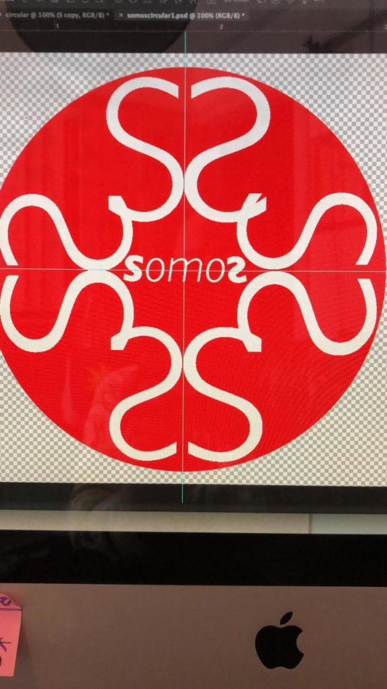
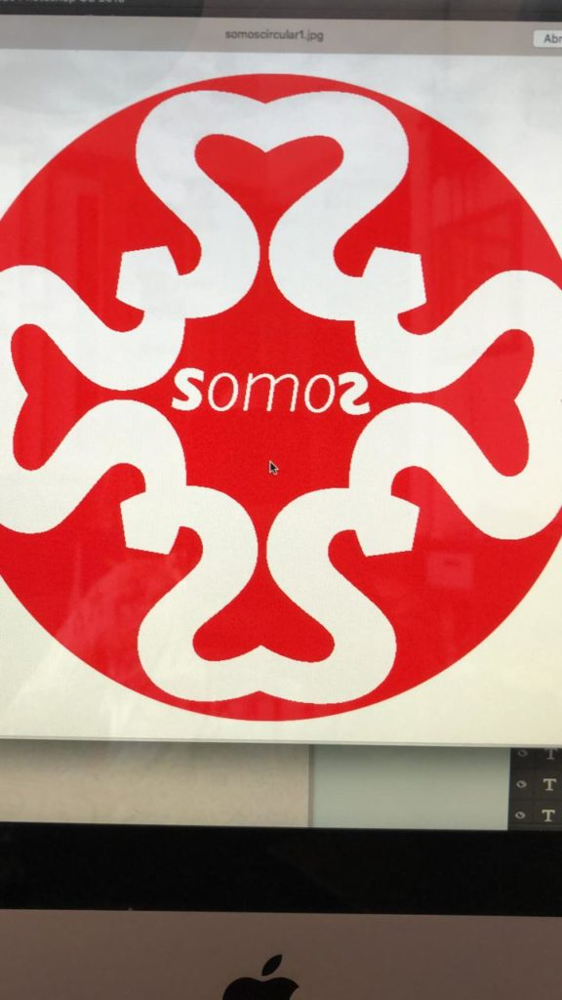
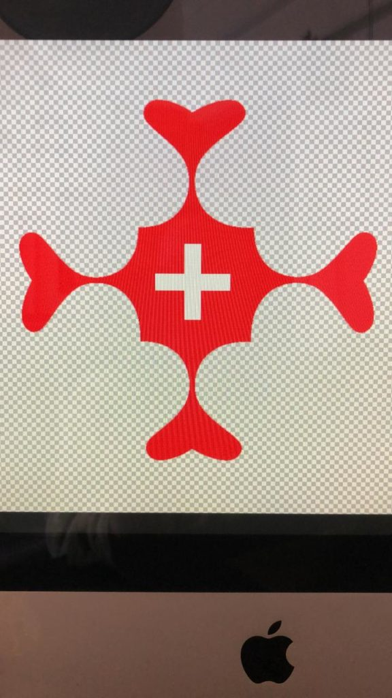
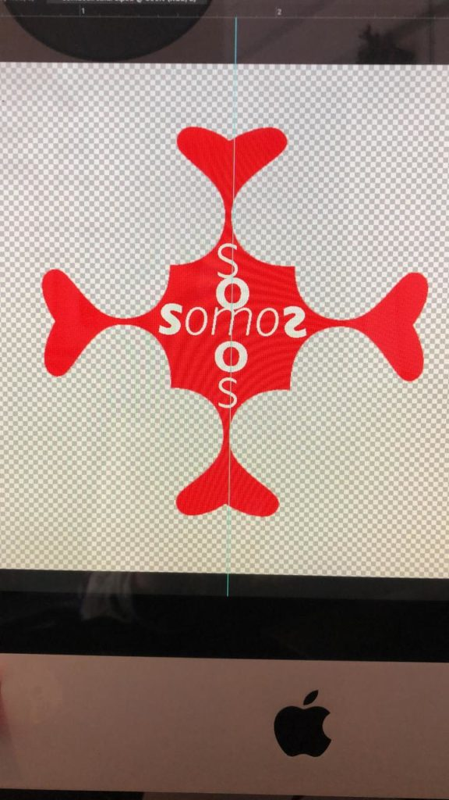
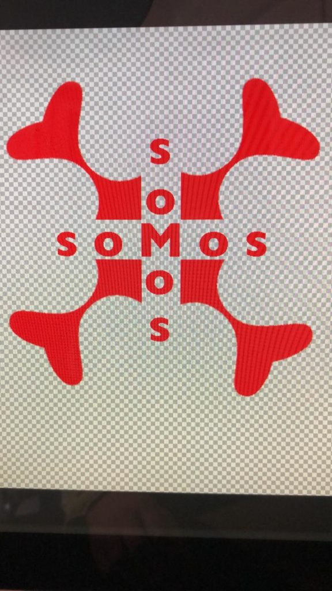

_\[\*Back at the end of 2019, a group of eight called SOMOS (or 'SOMOS Mais') formed in São Paulo to coordinate activities for December 1, International AIDS Day. The idea at first was that a collective might form to continue working together on our HIV-related artworks after the big holiday; however, the group didn't stay together. A sweet event, Sarau Transante transpired on November 30th and members walked together the following day on São Paulo's AIDS Walk. At the time I was unsure if anything had been 'gained' by all the effort that went into the group formation and its lone event; I reflected on our initiative in [Using one ‘project’ to see another](https://luvhurts.co/texts/using-one-project-to-see-another/). Today, though, I can see some (new) things that I personally learned from the process. And, that's nice! xo Todd\]_

- 
    
- 
    

- 
    
- 
    
- 
    

\*Designs by [Dr. Professor Ego Sum Frank](https://luvhurts.co/coalition/metamorphinemachinefuriosaxxx/)
