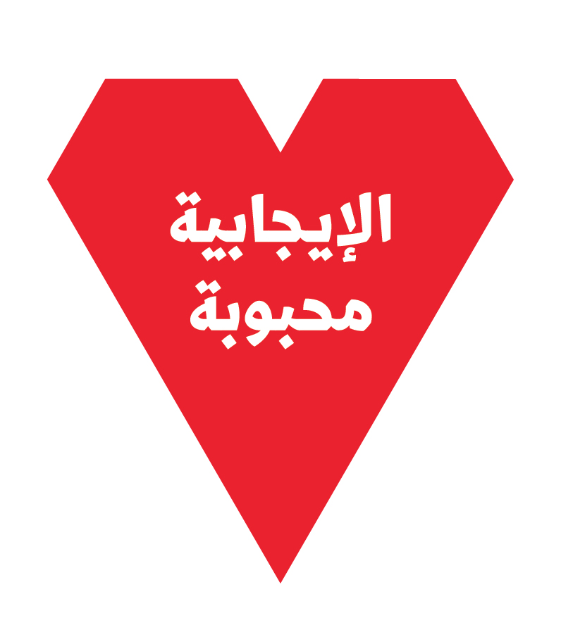
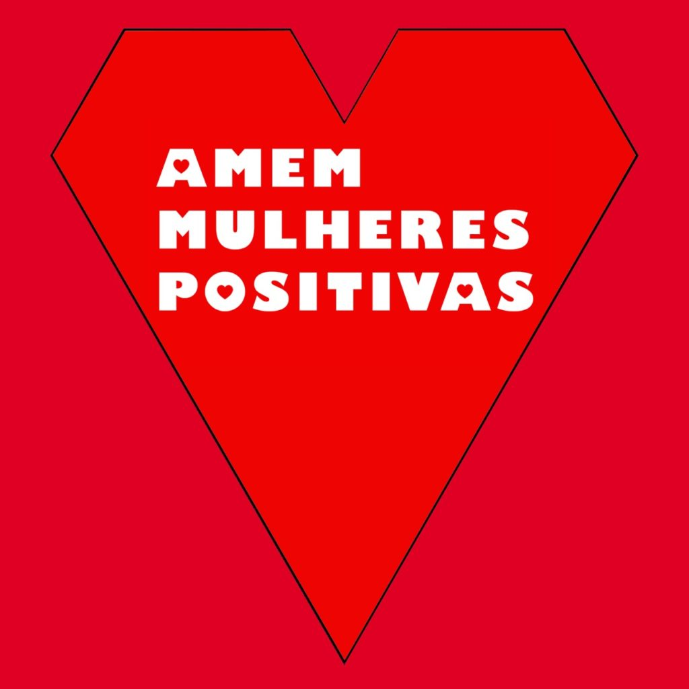
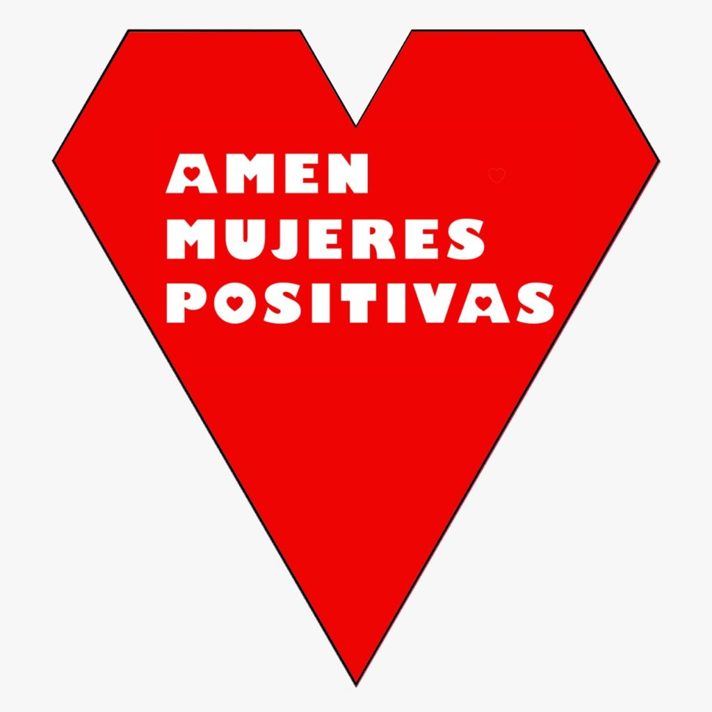

- 
    
- 
    
- 
    

_\[\*It is very exciting (and an honor) to get to imagine and implement ideas for Love Positive Women 2020 in Khartoum (Sudan), New York City (US), São Paulo (Brasil) and other places in South America. Designer_ [_Adham Bakry_](http://abakry.com/en/) _(Port Said/Cairo) came up with a version of the Love Positive Women insignia in Arabic and_ [_Gustavo Marcasse_](https://vav.art.br/gustavomarcasse/) _in both Portuguese and Spanish. Love Positive Women is a project by_ [_Jessica Whitbread_](http://jessicawhitbread.com/project/love-positive-women/)_. xo Todd\]_
