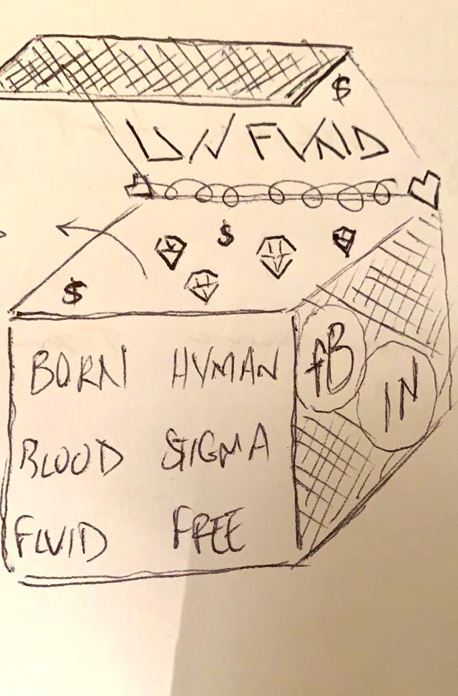

Image: PogoLand

As early as the [1st ‘About’ page: A discussion to be accountable to](https://luvhurts.co/texts/1st-about-page-a-discussion-to-be-accountable-to/), the creation of a 'philanthropic device' was mentioned, and again in an [interview with the Think Twice Collective](https://luvhurts.co/category/think-twice-collective/). Most often over the course of LUV's first two years, this idea of raising funds for artists and activists working on HIV related stigmas referred to an [idea that (after its R&D phase) could be offered to the Elton John AIDS Foundation](https://luvhurts.co/what-about-elton/). And, while this is still the case (or can be), LUV has also been [star-fucking around](https://luvhurts.co/texts/notes-on-starfucking-v-1-not-to-be-confused-with-resource-fucking/) with a couple other artists who have do-good organizations in which a prefab philanthropic device might be nestled. Either way, the apparatus I speak of is conceived for 'give away'. Recently I've begun referring to this 'philanthropic device' as the LUV Fund in order to differentiate it from other LUV byproducts, such as the [LUV Game](https://luvhurts.co/play-me/) and/or [EXQUISITE CORPSE](https://luvhurts.co/mixed-media/exquisite-corpse/), a traveling group show. These items, can of course, work in tandem. There's a [Work Group](https://luvhurts.co/texts/homage-to-a-work-group/) (composed of Brad Walrond, Paula Nishijima & Todd Lanier Lester) that meets weekly to plan future LUV work, and on several occasions I've explained that while energy was given early on to exhibiting the works of artists working on HIV (e.g. [Luv Till It Hurts by Kairon Liu](https://luvhurts.co/encounters/luv-till-it-hurts-by-kairon-liu/)), I did not anticipate [a traveling group show](https://luvhurts.co/mixed-media/exquisite-corpse/) as what would come next. I luv it, but I didn't see it coming! And, as for the 'philanthropic device', whatever LUV does, it has to do that too!!

Presently I have an idea for integration of the LUV Fund into the [EXQUISITE CORPSE](https://luvhurts.co/mixed-media/exquisite-corpse/) show ... but not only. The 'rad purple poster' (above) is a first draft of the LUV Fund gameplan that I'm working on with Brasilian artist, [PogoLand](https://www.pogolandart.com/). I'm sure there will be 'tweaks and tugs' that change its course over the next few weeks, but wanted to share its tenets as I understand them (like how would it make money?), and also offer it to the [LUV show](https://luvhurts.co/mixed-media/exquisite-corpse/) as an artist-made broadsheet, which can carry other info on the traveling / evolving show by printing and using its backside. Here goes in no particular order:  
  
(1) Expography for the traveling group show, EXQUISITE CORPSE has been designed by installation author, Jakub Szczęsny for scalability and cost-sharing across venues. Given potential savings by its 'economy of scale', each host institution may be asked to contribute to the LUV Fund;  
  
(2) I've asked Jakub to design a special 'LUV Fund$' donation box along with the other containers that comprise the show's expography;  
  
(3) Some of the artists in the group show have works that can be merchandised broadly (online & gift shop);  
  
(4) Other artists have works that can be packaged / offered as limited editions;  
  
(5) Beside presenting works and processes of art in galleries and museums, LUV has a performer and speaker's bureau, which brokers fair-pay fees for those involved (and modes of participation for artists and non-artists alike;  
  
(6) After 20 years of asking foundations / philanthropy for money to make art projects, I realize that there are several 'back doors' that can be accessed IF an idea shifts 'the paradigm' ... amongst grantmakers, power-brokering is rife, but this usually excludes potential grantees who sometimes sign or agree to 'non-solicitation' clauses when attending funder meetings, and for whom the experience is often hierarchical & upward-looking at that;  
  
(7) Some of the 'back doors to philanthropic power' I mention above are on the small side, like asking a foundation executive to use his/her/their discretionary or expense fund to support an idea, but I prefer a bigger framework that includes 'estate planning for the extremely wealthy' ... for example when Warren Buffet's wife passed away and he decided to forego the eponymous foundation they'd been planning, he gifted and pre-bequeathed enormous sums of money to the Bill & Melinda Gates Foundation;  
  
(8) Some of the artist-activists that LUV has met in the past two years have large online followings (here I'm speaking mostly of Instagram for which having 10,000 followers opens up avenues of marketing and income generation) ... LUV is learning from these folks so that one day its own brand may have these opportunities to 'influence' and reap $ benefit in so doing;  
  
(9) When a gallery sells an artist's work, the gallery takes 50% and the artist gets 50%. It is conceivable that either a blue chip artist (who cares about HIV) or her/his/their gallery would forego this amount on (say) one work a year for a predetermined number of years. While the artist may not be able to do this, they/she/he may influence the gallery to do so;  
  
(10) There is also a 'nuclear option' ... I'm just not gonna tell ya what it is yet!

Remember, all these 'cogs' and 'spokes' don't need to work at the same time for the LUV Fund to flourish. And, all artists involved would be paid first and/or be 'first in line' recipients of the LUV Fund. Well, let's see ...  
  
###  
  
_\[\*My first project, [freeDimensional](https://fd.artistsafety.net/) created the [Creative Resistance Fund](https://crf.artistsafety.net/), and my second project [Lanchonete.org](http://lanchonete.org/) helped start [Fundo Imobiliário Comunitário para Aluguel (FICA)](https://fundofica.org/?lang=en), with participating artists offering performances and services to raise the fund's first 10,000 Reais.\]_
