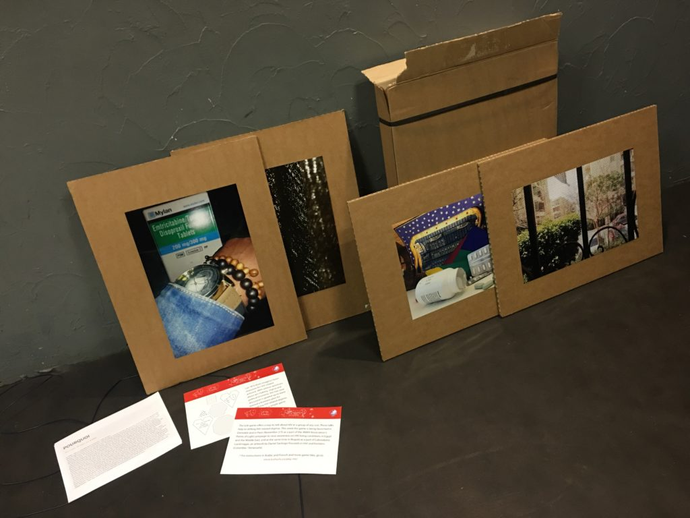
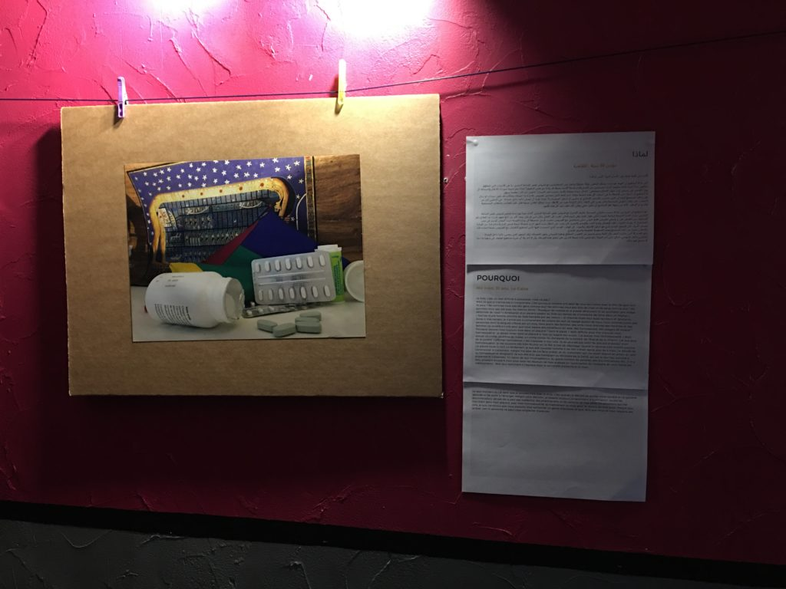
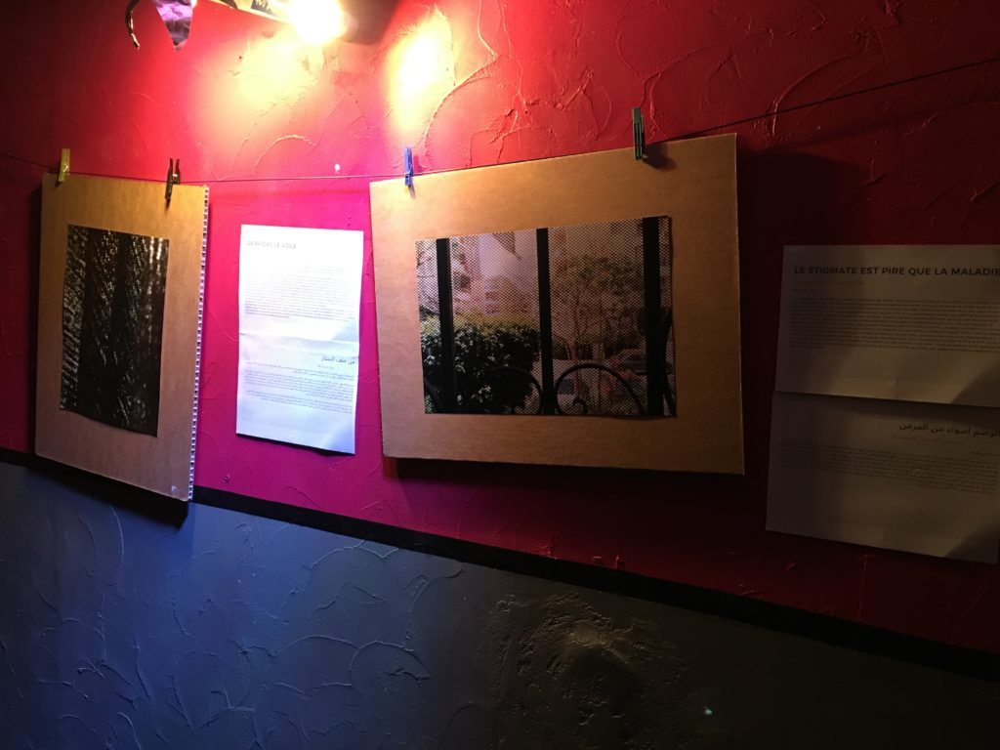
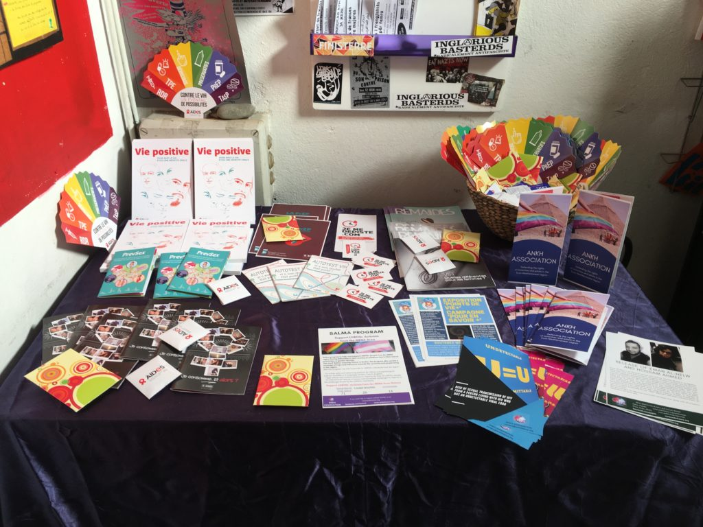
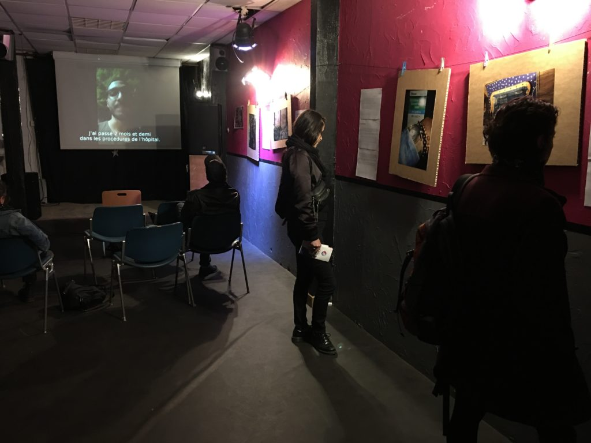
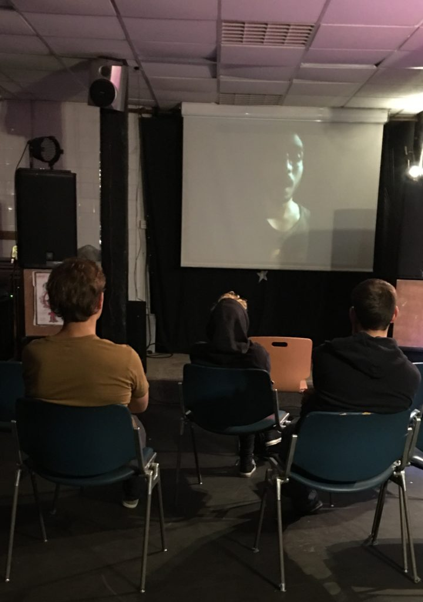
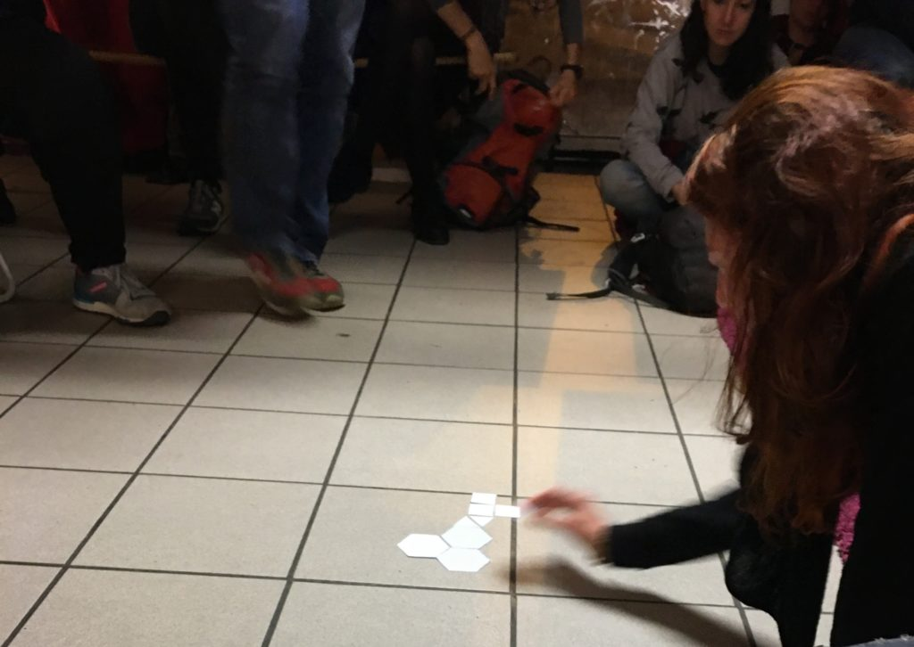

The first public presentation of [Exposition Points de Vie](https://www.facebook.com/events/365385111036477/), organized by [Ankh Association](https://luvhurts.co/coalition/ankh-association/) and dedicated to people living with HIV in Egypt, took place on October 26th in Grenoble, France. The exhibition gave light to their experiences, joys, and difficulties. It involved the interactive game by Luv 'Til it Hurts, a Falafel party, and Karaoke. The benefits went to [حملة اعرف اكثر - Campagne 'Pour en savoir plus' - 'Know more' campaign](https://www.facebook.com/know.more.campaign/) .

Nic/Taha:  
Hope the event in [Colombia](https://luvhurts.co/texts/relatory-bogota/) went well! I just wanted to send you a short feedback of our event in Grenoble yesterday. It went really well, a lot of people attended and they were all really interested by the project and the discussion was really interesting as well.  
  
Todd/LUV:  
Was the LUV game useful helping opening a dialogue and/or holding the space you envisioned for the event?  
  
Nic/Taha:  
Regarding the game, we had some difficulties with the printing process, as we couldn't find in the short period of time a printing house that had the kind of material that we wanted, so we printed the tiles on the thickest paper we could find, then had them plastified. It worked well anyway to play, except for the fact that some shapes were really too small so we only used the medium and big ones.  
  
Todd/LUV:  
Can you say more on how you used the came and what came up?  
  
Nic/Taha:  
Also, even if the game is supposed to be used to start or open a discussion, we used it at the end of the event, but it was also a good way to close it in a more playful and participatory way. We had a lot of really encouraging messages, among them:   
  
Silence=dead  
  
Transnational solidarity  
  
treatment for all  
  
u=u  
  
life goes on  
  
hope  
  
... and some really nice drawings :)

- 
    
- 
    
- 
    
- 
    
- 
    
- 
    
- 
