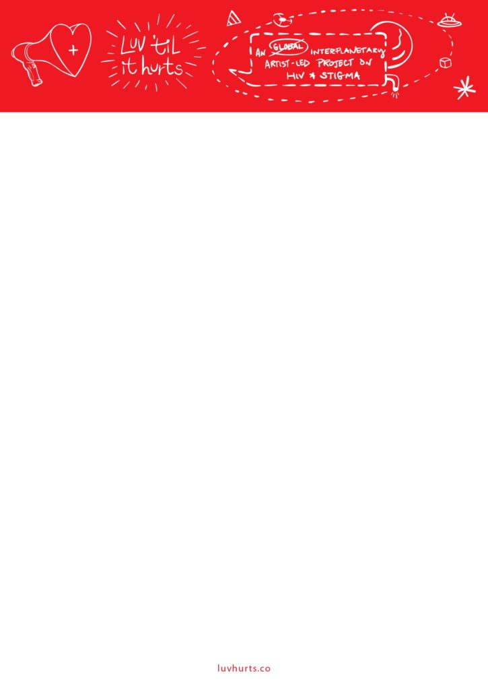
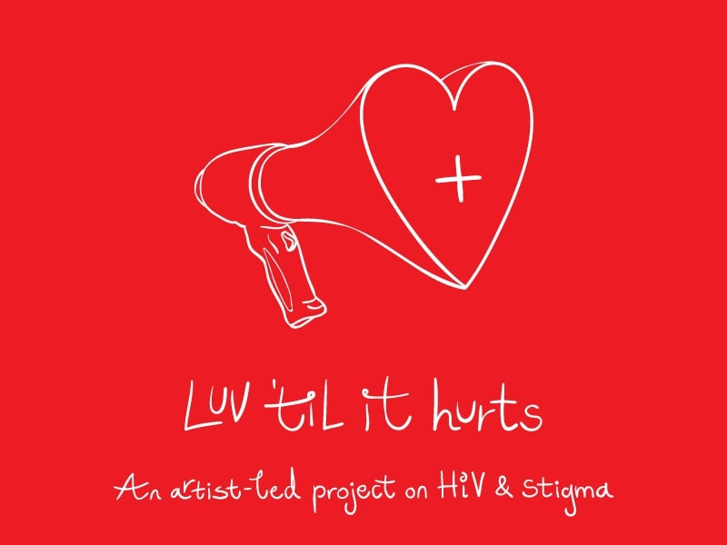
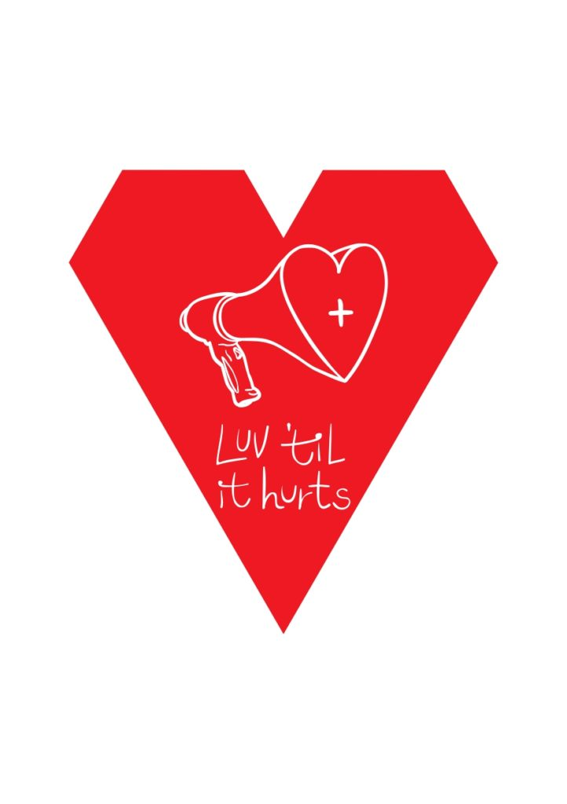

When I first put out tent pegs for Luv 'til it Hurts (LUV), I framed it as a two-year period of R&D. The duration of the R&D is the (art) work. This is because I could guarantee to perform 'research and development' for a period that I determine duration. I aimed the process at a concept loosely termed 'philanthropic device', and then somewhere on this axis where process (asking questions / meeting people while focused on a theme) 'meets' identifiable / achievable structure or agglomeration of activities (culmination), I've been watching and nudging, teasing out and archiving the ensuing form. And, of course the ending can be the beginning of something else. If something substantive and/or timely comes out of this two-year marathon, I'll see it. The period is up at end of June, and I'm on a keen outlook for what emerges. It might need new words to describe it, as it shouldn't be run-of-the-mill. It will be clear soon. Of that, I'm sure. 

In the mean time, I offer some 'tenets of transition' ... here goes:  
  
\* This red site ([www.luvhurts.co](https://luvhurts.co/)) will serve as archive of the two-year process;  
\* A new site ([www.luvtilithurts.co](http://www.luvtilithurts.co/)) will be erected sometime in July, and will explain itself (in terms of form);  
\* Notes on organization, like these 'rules' (or suggestions) will 'live' in the archive and cede space to new works and the discussions they bring up on the new site;  
\* The project's brand identity will be tweaked during the transition, and some bits will be woven into /foregrounded in its new look  
  
\+ The LUV logo was designed by Adham Bakry, as was the project's signature geometric heart and our letterhead.   
+ [Thiago Correia Gonçalves](https://thiagocorreiagoncalves.com/) pulled another logo from these spare parts with geometric 'heart-LUV-heart'  
\+ Over the course of the project-to-date, the LUV logo has been used to show partnership with an artist's independent film in closing credits and on the placard for a Bogotá public performance, and our letterhead used for artist reference letters on conference scholarships and residency opportunities   
  

Check out the two different letterheads below. If any of these visual tools are needed by LUV peeps (people who are in LUV) then, [just ask us](https://luvhurts.co/contact/). And, we'll send the version you need. 

- 
    
- 
    
- 
    

Luv ‘til it Hurts began as a two-year, uncharted project about HIV and Stigma. An odyssey, of sorts. Yet, a limited set of questions. A discussion that grew into a team. Its next-life is aligned with our urgency to keep talking…talking in different directions and including others. The experience of many, once a minefield of individual fears, instigates the rumbling of collective production power. We’re gathering our ideas on a common table, and planning for a future whose hope is in the disruption of our present. We are convinced that to strategize our next steps we need more than single linear energies, but a group, a multitude of voices prepared to sing (and shout), to harmonize and also disarrange. Luv ‘til it Hurts is a platform for real bodies to come onboard and co-pilot its playful unfolding, one set of interaction generating the next. Brad Walrond, Eric Rhein, Jakub Szczęsny, Paula Nishijima, Todd Lanier Lester, Alberto Pereira Jr., Adham Bakry, Juan de la Mar/"De Gris a PositHIVo" (Colombia), HIV2020, Every Where Alien (US), ANKH Association (Egypt), Humans as Hosts (Taiwan), Love Positive Women, Nhimbe Trust (Zimbabwe), Luciérnagas (Colombia), House of Zion, El Santo Taller de Cerámica (Colombia), Think Twice Collective (Netherlands)… and morphing. Embark immediately @LuvTilitHurts

_\*The final block of text is by Paula Nishijima & Todd Lanier Lester._ 

[Letterhead 1](https://luvhurts.co/wp-content/uploads/2020/06/Luv_letter-1_page-0001-2.jpg)[Download](https://luvhurts.co/wp-content/uploads/2020/06/Luv_letter-1_page-0001-2.jpg)

[Letterhead 2](https://luvhurts.co/wp-content/uploads/2020/06/Luv-letter-head-_-blank_page-0001.jpg)[Download](https://luvhurts.co/wp-content/uploads/2020/06/Luv-letter-head-_-blank_page-0001.jpg)
