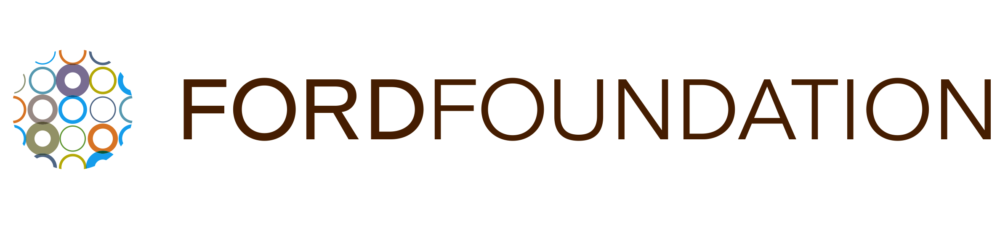
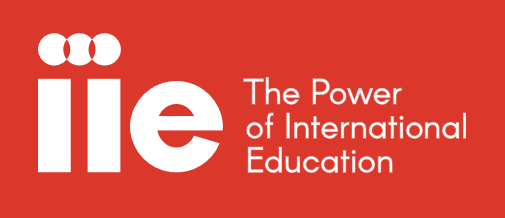

**Opening Reception: Thursday, October 18 from 6-8pm**  
**Exhibition dates: October 18-28, 2018**  
**Gallery Hours: Wednesday through Sunday, 12-6pm**

****El Museo de Los Sures**  
**120 South 1st Street, Brooklyn, NY 11249**  
**(Between Bedford Avenue and Berry Street)****

Curatorial Advisor: Adam Zucker, Theodore (Ted) Kerr

Organized by **[Luv 'til it hurts](https://luvhurts.co/)**, and collaborating with more than 150 others to co-create [Reimagine End of Life 2018.](https://www.letsreimagine.org/new-york/schedule)

* * *

Today, medical treatments help people infected with the Human Immunodeficiency Virus (HIV) have prolonged and ordinary lives, as well as prevent further transmission, but they can never kill the virus hiding within. Despite these advances, moral condemnation and discrimination against the disease continue. The consequences of this stigma are mental illness and distress, often generating greater suffering than the physiological disease itself. Until a true cure is found, shame, insecurity, and trauma will continue to afflict those diagnosed with HIV until our societies and communities change the ways in which we consider and support them.

Kairon Liu started his research with HIV in 2017 in Taiwan. The inspiration of Liu's project, [Humans as Hosts](https://www.kaironliu.com/humansashosts) is his best friend, alias Tree, who has recovered from betrayal and sorrow several times due to his affliction. The photographs and archives created by Liu and the participants he encounters through his daily life and practice make evident that all human beings are exposed to the virus. We are all human beings, and we continuously face this threat, physically and/or mentally.

This exhibition is made possible by multiple supporters that Liu has engaged during his time with Residency Unlimited in New York. While the exhibition title reflects Liu's ongoing journey to confront the universal value, it also reveals the first chapter of the artist-led discussion on HIV and stigma, Luv 'til it Hurts.This program is made possible with support from The Lily and Earle M. Pilgrim Art Foundation, Apicha Community Health Care, Candi Me, Ford Foundation and the Institute of International Education. Special thanks to Taipei Cultural Center in New York, Residency Unlimited, Artists Alliance Inc, Visual AIDS, Hetrick-Martin Institute, and Baboo Digital.

* * *

As a visual artist and photographer, Kairon Liu's practice reflects his observations on diverse beliefs in human society through the creation of narratives exploring issues related to religion, disease, and universal values. Since 2017, Liu has been developing Humans as Hosts, a project focused on understanding the living situation of people with HIV and heightening awareness about AIDS. In collaboration with social networks, NGOs, and public health authorities, Liu gets to know HIV-positive individuals and invites them into his work. The resulting images/archives can be viewed as the proof/disproof of stereotypes, prejudices and stigmatization produced by societies.

* * *

This program has been made possible with support from **[Ford Foundation](https://www.fordfoundation.org/)** and the **[Institute of International Education](https://www.iie.org/)**. **[The Lily and Earle M. Pilgrim Art Foundation](https://laempaf.weebly.com/)**, **[Candi Me](http://candimesf.com/)**,  Special thanks to **[Taipei Cultural Center in New York](https://ny.us.taiwan.culture.tw/)**, **[Visual AIDS](http://visualaids.org/)**, **[Artists Alliance Inc](http://artistsallianceinc.org/)**, **[Hetrick-Martin Institute](https://www.hmi.org/)**, and **[Baboo Digital](https://baboodigital.com/)**.

* * *

_Luv Till It Hurts by Kairon Liu_, is part of [Reimagine End of Life.](https://www.letsreimagine.org/)

**About Reimagine:** Reimagine End of Life is a week of exploring big questions about life and death through art, creativity, and conversation.  

For the last few months, artists, storytellers, healthcare professionals, faith and community leaders, and innovators across all five boroughs of New York City have been uniting to create a unique week of events that will prove to be reflective of this city’s diversity and spirit. With more than 250 events set to explore death and celebrate life from every perspective, we invite you to join us in questioning how we think about our most universal experience.  

Visit [www.letsreimagine.org/new-york](http://www.letsreimagine.org/new-york) to learn more!  

Let's bring death out of the shadows and into the light.  

* * *

