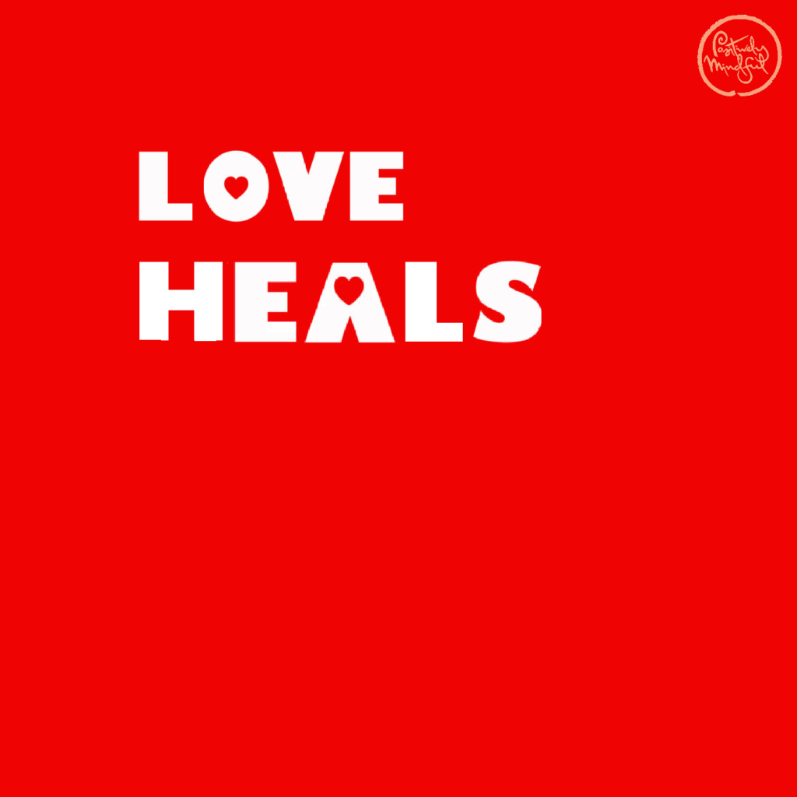
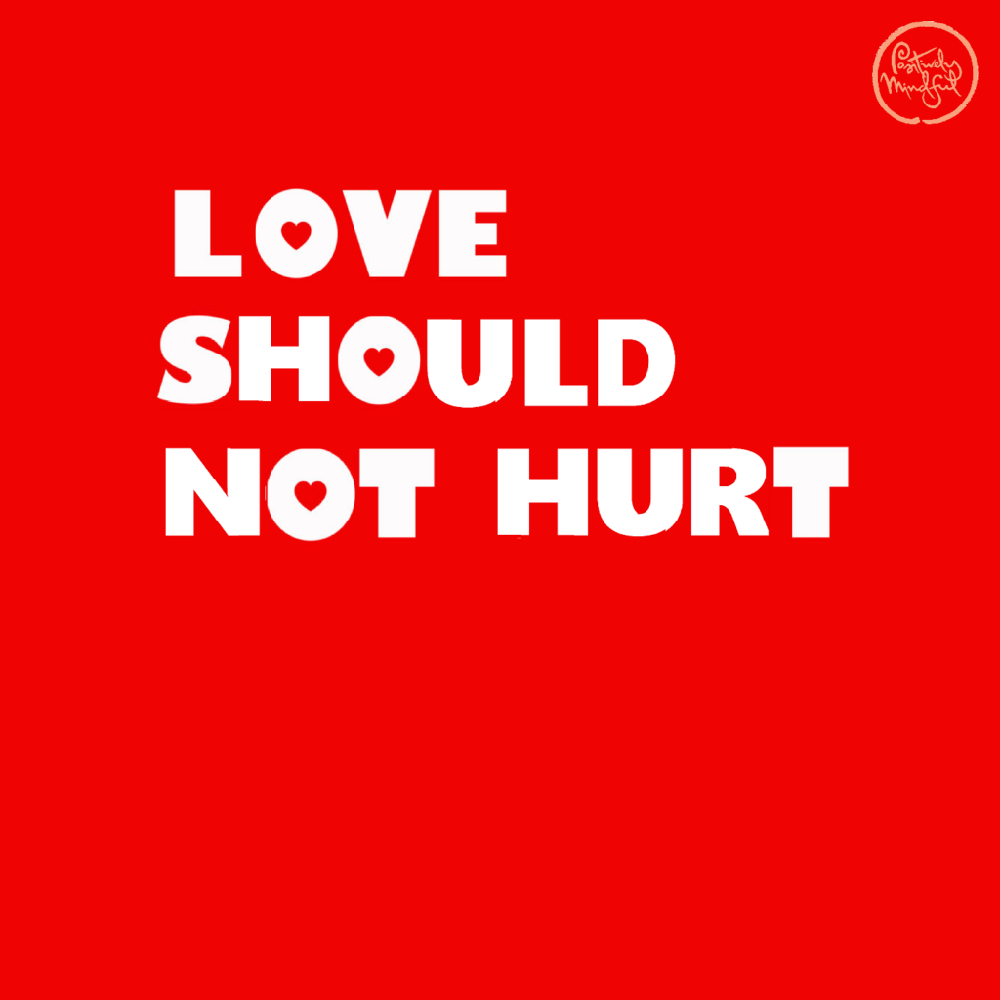
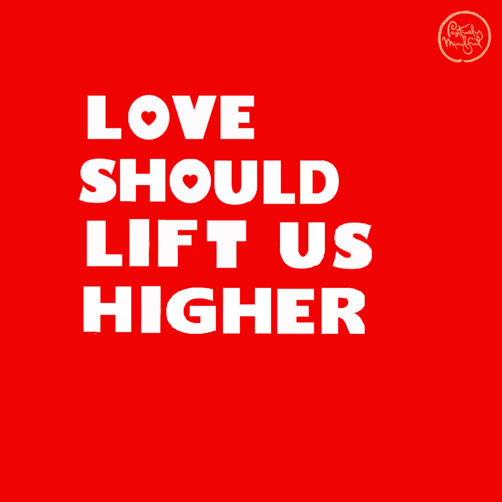
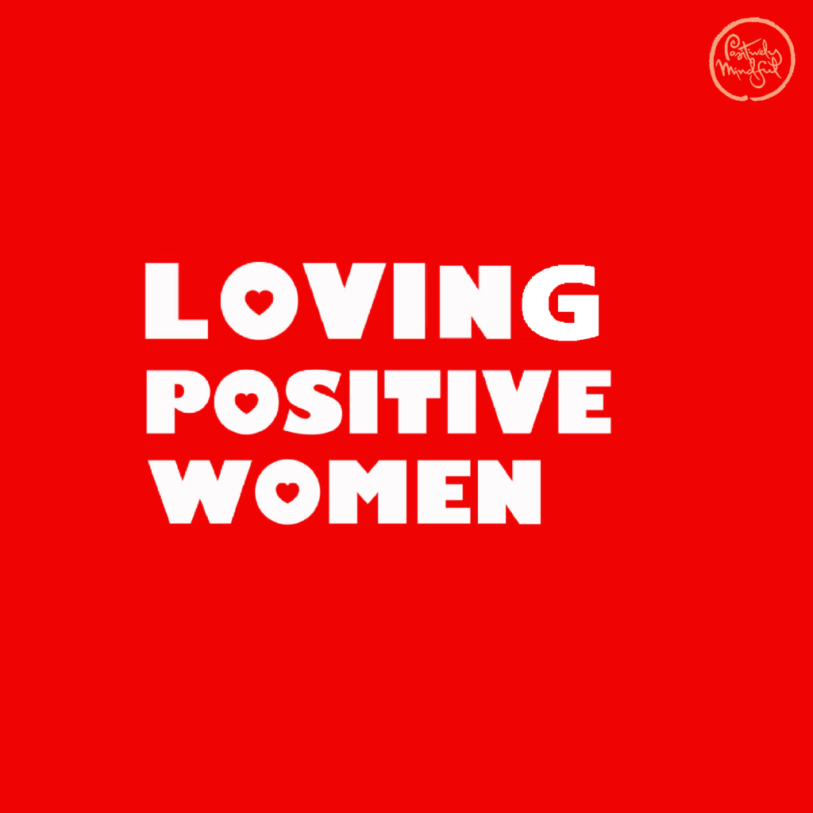
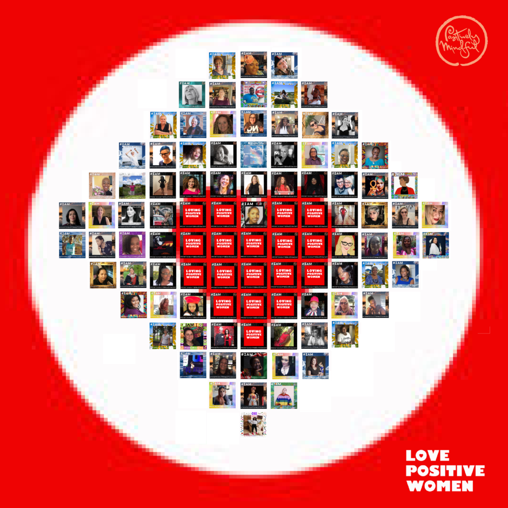

- 
    
- 
    
- 
    
- 
    

Being invited to write as an artist, to be celebrated for the campaign Positive Affirmation Day, felt great. I had a sense of pride, a warmth, a worthiness, feelings that I am learning to cultivate, so sure, I’ll support Love Positive Women, tell me more…

“Luv til it hurts”

“Ummm”  

Now I feel unsettled, confused, triggered.

I breathe, 

I am a survivor of intimate partner violence, 

I am breaking the silence.

I am very good at distracting myself, numbing, changing the subject, moving on I avoid facing my painful memories, I don’t talk about it, I didn’t talk about it, and yet just right now, I can share. As I write I realise that, just as my life incrementally fell into the depths, I have since, slowly climbed up the mountain and now there is no fear. I am not worried about provoking threat or disturbing the peace, 

I am free. 

The time line to this inner strength is long and complex, 6 years ago my home had a police sig marker and panic alarm, 4 years ago I still reacted with hysteria, 3 years ago with despair, 2 years ago I took back control. In December 2018 I had to contact the authorities because a protection order was broken, but I was calm, for the first time I didn’t feel I needed to run,

It didn’t hurt anymore. 

25 years ago I fell in love, I had found my king and he treated me like a queen. I was blinded by romance, dance and faith in a future forever, I know now that I did not love myself, I believed I was not enough on my own, I needed another, and so when things changed, I could not let go.   

He was the father of my children, my husband for better or worse, in sickness and in health, sometimes furious, sometimes fragile. I was forgiving and couldn’t see any other direction, it’s so difficult to see the light when you have to wear sunglasses to hide the bruises. We fought, then with the reality check of HIV we fought even more, and I stayed, I lied, I cried. This is not love, this is anger, bitterness, frustration with life’s struggles, debt, drugs, diagnosis. It is pain and has an aftermath, that arises in any new relationship I try to form, flinching, questioning, an inability to build trust, to feel safe, to completely embrace. 

Today the past feels lighter, I have found ways to move forward, to be independent, to love myself. I celebrate my perfect imperfections and with my sisters I build strength and solidarity. 

I am an artist, and with each image I help to create, each story I listen to, there is an increase in awareness that I am/we are not alone there is a message of empowerment. These connections have filled my heart and healed my wounds, through women that share my status, and women that support us, I have learned love.   

I am loving positive women

I am loving me

I am luving til it uplifts us all. 

[https://www.positivelymindful.org/](https://www.positivelymindful.org/)

