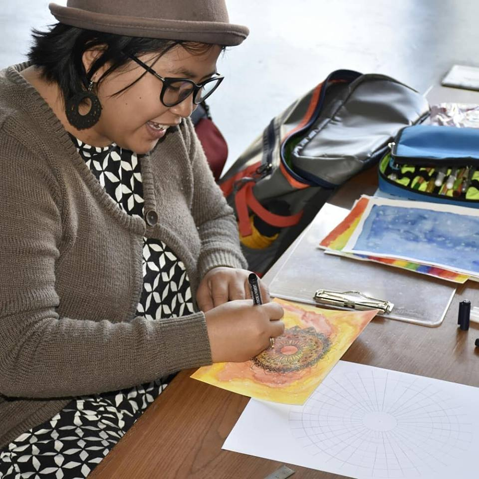
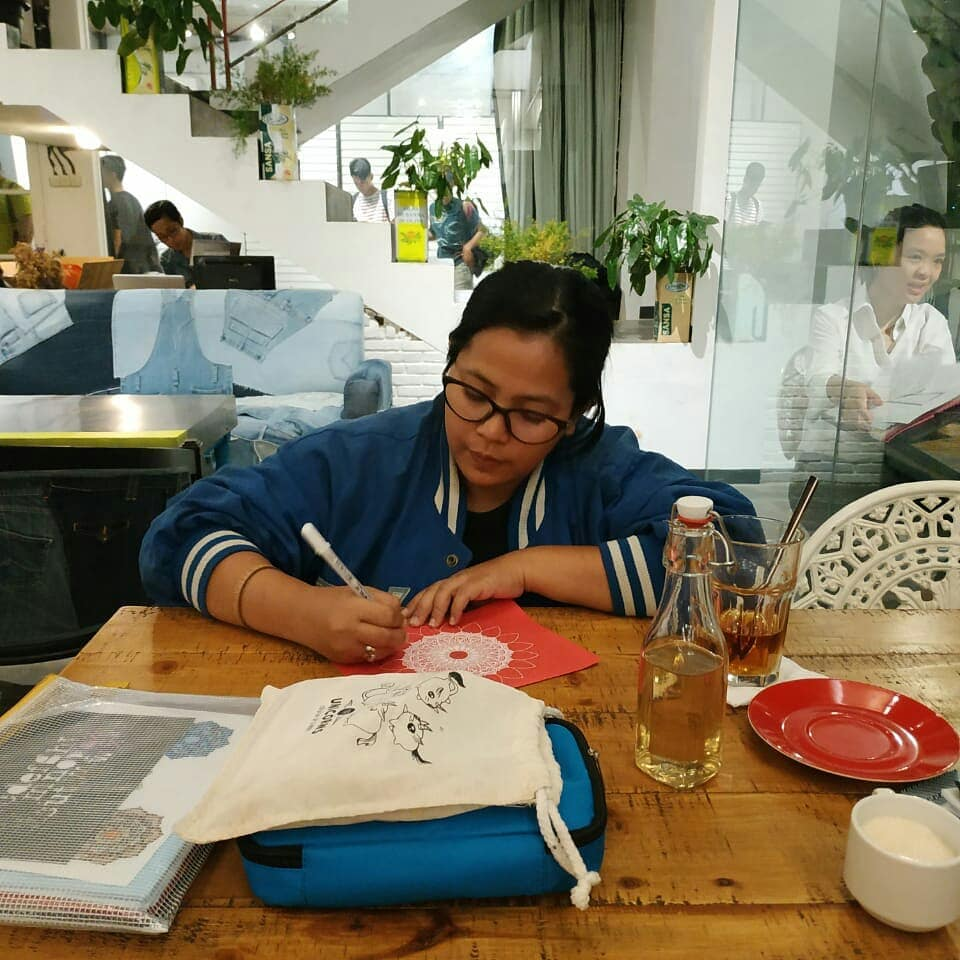
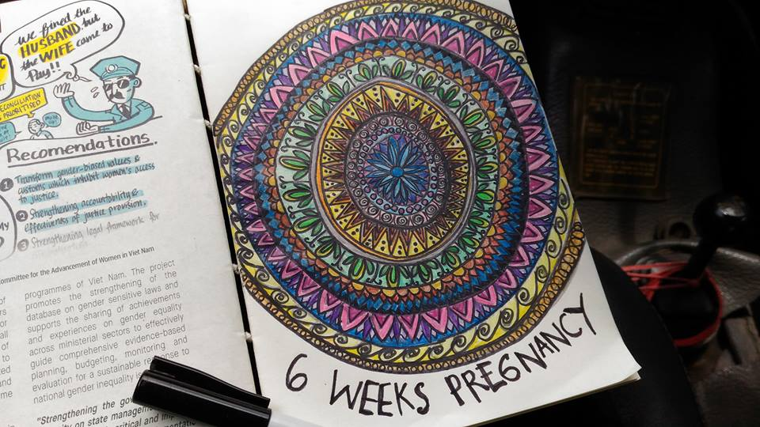

By Ayu Oktariani

- 
    
- 
    
- 
    

I was living with HIV for 8 years when I decide to pregnant. It’s been a long journey to make that decision. Waiting for the man who understand each other and want to take responsibility of having a child free from HIV. My husband is HIV Negative, so of course it’s easier for me to planning the pregnancy. I’m very nervous. It’s been 10 years after my first born. We have sex, no condom this time. But before planning to get pregnant, we always used the condom. I feel uncomfortable if we don’t use it, yeah you know… because of the HIV.

So, I am pregnant! I don’t know if it’s a happy or sad thing.

Once I see the two stripes in the pregnancy test, I feel like my world was going down. My mood is terrible and I don’t know why.  I was confused, and I suddenly felt capable of doing something unusual. 

I remember going to service station to fix the car with my husband. On the way I suddenly drew in a small notebook that I always bring everywhere. I don’t understand why, and I don’t know what I was drawing. It was circle with so many layer and pattern inside. It’s a repetition pattern. I realize something, every time I traced the pen I feel so much better. My husband ask what am I doing? What I am  drawing? And I said I don’t know, but I feel good.

After that moment, I buy all  the drawing tools for my painting. I practice at home, in a café, before sleep, and anywhere. And I realize I never feel terrible again during the pregnancy. 

The terrible mood during pregnancy is not gone. They keep coming back and what make it worse, I couldn’t eat anything. And not long after finish eating I will vomit. I remember I loss almost 15 pound in my first 16 week. It was so exhausted. Sometimes I’m crying with no reason in the middle of the night. I am very afraid to be in the in a crowd, like if I’m going to traditional market. I can suddenly vomit in front of the people I don’t feel comfortable with.  

But then again, I feel much better when I decide to draw. 

So curious with the pattern and the circle I draw, I searching and Voila! The name is Mandala! What I got from the definition from Wikipedia, Mandala is a spiritual and ritual symbol in Hinduism and Buddhism, representing the universe.  After know what I drew, I do not care so much. I am not so concerned just kept drawing and feel that Mandala repaired the bad thing during my pregnancy.

After a long journey the day he was born finally arrived. No is not easy.

It’s one of my painful journey after battle HIV stigma and everything. The baby was born, his name is Sir Miguel. Unfortunately, I never see him once he comes out from my stomach after the surgery. Because of the shit procedure that makes me asleep with the anaesthetic. I never know that he is not crying, I don’t know he had trouble breathing, I don’t even know that his ratio of oxygen only 60% after born. In order to breathing he should be fitted with the ventilator machine.

It’s getting worse because the hospital in our city in Indonesia cannot provide my baby the machine to help him breathe. So he should move to other hospital, they separate us. I can’t even touch or breastfeed him, or even his first prophylaxis medication (to stop him from getting HIV). They just took him away from me. My husband is taking care of him, once in awhile he sent me his picture or video of him in a box with the machine entering into his small throat. I am crying. I cannot calm down, I screwed up everything. I’m a bad mom, I cannot deliver a healthy baby, it’s my fault.

40 hours after the doctor trying to help, Sir Miguel passed away.

And we never got an answer why.

.

.

.

Today, it’s been almost 2 years after he leaving us. I am recovering every second using so many methods. I am following the five step of grief and I feel like shit each time I remember this story. My parents, husband, daughter and even my friends are trying so hard to cheer me up. But they cannot. 

On July, third month after my baby left me… I start to drawing Mandala again. 

But now is different. I don’t feel anything, I’m not feeling even better. But I am trying every day. I remember, during the pregnancy that I could draw three Mandala a day. But now, one is struggling. Until sometime, one of my friend Dea, with her astrology project asking me to help drawing for the Taurus Session. I ask why me? I am Libra. And she said, it’s not because of me. She is interest with the Mandala. So the project is talking about the sign of the zodiac each month and it include one artist to make some art that relate to the zodiac sign.

I keep asking why me?

But After a month of trying, I finish draw a head of bull, with the Mandala Pattern inside and around. That’s it. But Dea, who own the project found a lot of “thing” that I need to know.

She thinks during my pregnancy the energy for drawing of the Mandala is come from the baby. She can prove it with the zodiac chart that she check in her apps. After she put a date and time of him, this what come after…

“Most of the planet is in second quadrant, it’s the area of creativity. Arrangement of planets also not really scattered, means he is focus. Miguel is a Lunar Aries, with Scorpio rising. It makes him have a big energy and It may be a little mysterious his external appearance”.

I am speechless.

There so much magical coincidence in our collaboration. She doesn’t know why there is strong encouragement to ask me to be artist who contributed to the Taurus edition. She knows that I am a Libra, but after all her investigation she realized that the Taurus one is Miguel. 

The other fact is I start to draw is when I pregnant, and after Miguel born I am back to be the Libra who very inconsistent. My art is also change more colorful, it’s so black and white before.

She is claiming to seek artist but nearly the same time I suddenly showed up with the mandala. Our deep conversation makes me found the connection between the Sand Mandala from Tibet and my journey of Guarding, praying, and eventually let the baby go.

There is another friend who can also see something during the pregnancy. “Ayu, your baby is so powerful and have a big energy, it’s larger than the mother. As the mother you may not be able to bear energy of your son. That is why the universe immediately take him a moment after he was born.”

Dea  said something again about Miguel “He lived without the body because maybe body cannot accommodate his strength. That was so large energy and he cannot solidified in space. But for sure, he will never leave you. He always be with you as something that I cannot explain. I believe this project wan to remind you as his parents”.

In one of the in ancient mythology of taurus, zeus said, “All things reached by your eyes after that you may have.”

Meanwhile Dea think, Miguel might say “There is something that you cannot reach from your eyes and you cannot have. But, what do you let go of actually, living together with you as the essence.”

I still draw Mandala until now. I also draw for people who want me to see inside them self, it’s all for free. I am never try to sell anything.  Somehow, I believe mandala really help me to fight my anxiety and fear also the anger of loss. 

The history of Tibetan Mandala start with the Sand, it made with pray and very care full by the monk, Mandala is the means of meditation. When it’s done and be a beautiful image, the mandala must be removed. Sand collected for release into the sea so it reached the shore.  

A series of the ceremony was conducted to remind me that is nothing eternal. Happiness, sadness, comfort, suffering, all flowing in cycles for the larger planned.  At the end, we have to learn releasing everything with sincere.  Like the sand from the Mandala that clad with pray, everything that we release will flow over the ocean to the universe. For Love Positive Women, let’s share our own wisdom of healing together.
