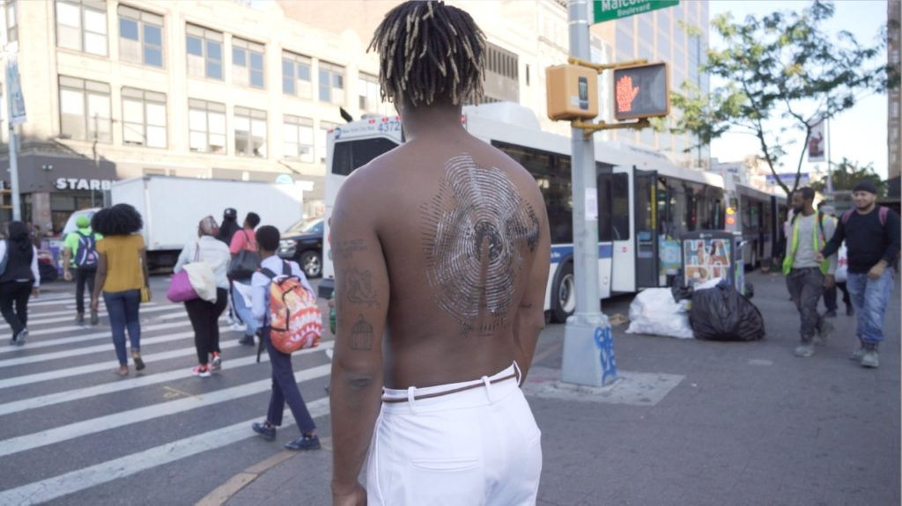
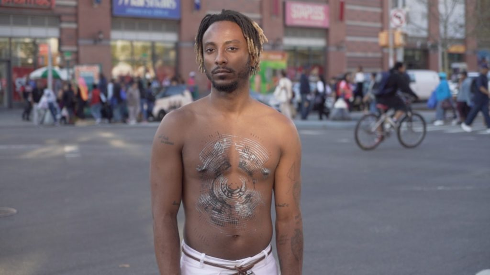
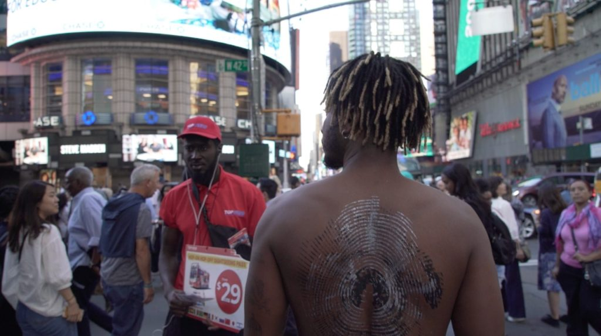
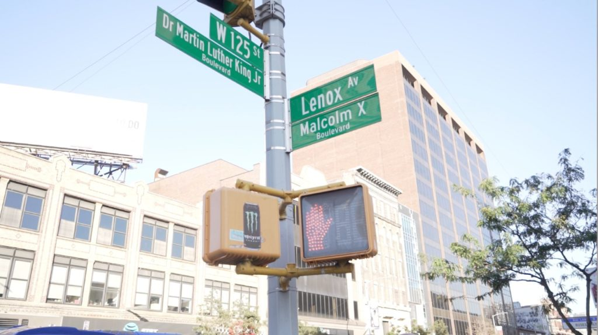
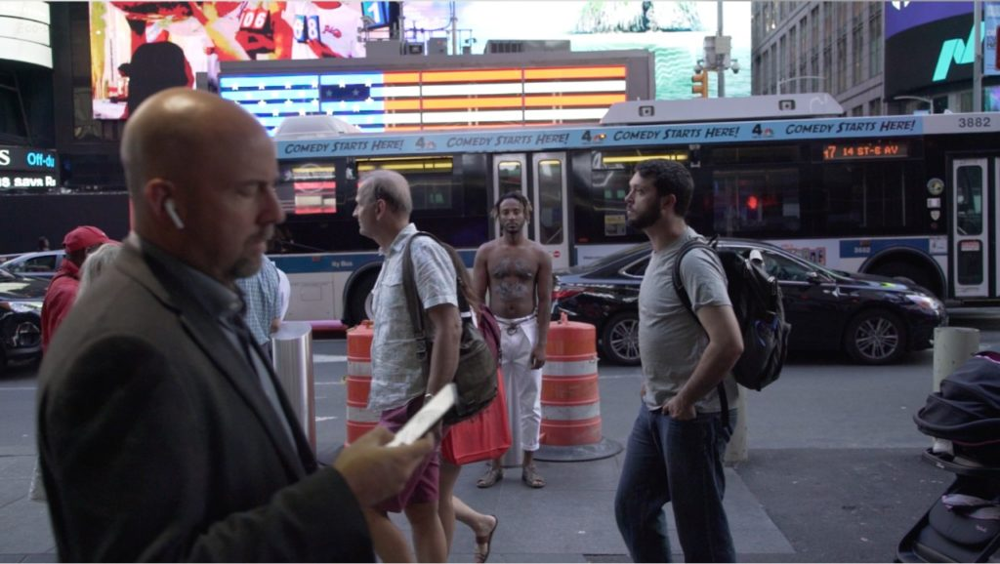
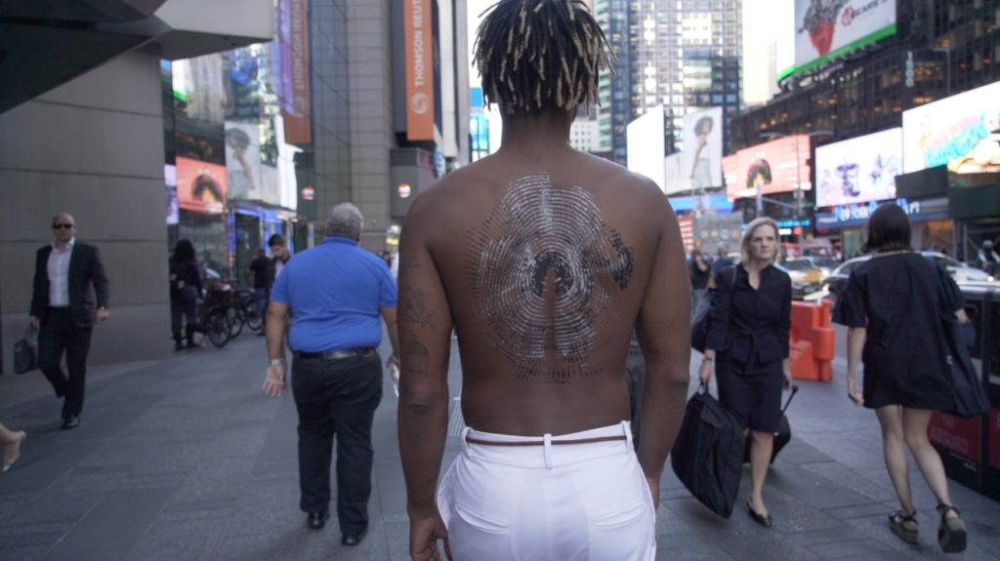

- 
    
- 
    
- 
    
- 
    
- 
    
- 
    

alvos desde sempre

porque não hegemônicos

corpos reclassificados

incômodos

inconformes

marginais seculares

preto

feminino

não-binário

trans

intersexual

refugiado

positivo

imigrado

expulso

indígena

.

sacrificado

.

Mas em movimento!

.  
  

Body Work and conception: Alberto Pereira Jr. @albertopereirajr  
Body Art: DIG Ferreira @digferreira  
Images: Flavio Melgarejo @ffmelgarejo

  
See also, by Alberto Pereira Jr:

[#](https://luvhurts.co/texts/movingtarget/)[ELE](https://luvhurts.co/texts/ele/)

[Please, touch me (PT/EN)](https://luvhurts.co/texts/please-touch-me-pt-en/)
