_\[\*In the process of making [Luv 'til it Hurts](http://www.luvtilithurts.co) (starting with a two-year staged impersonation by its alter-ego, Luv Hurts), I began working with fellow artists, Paula Nishijima and Brad Walrond. Paula reviewed my organization of ideas & content from its 2018-20 archive (a.k.a. the red site) using her ['swarm' methodology](https://luvhurts.co/texts/game-of-swarms-descends-upon-luv/) to understand patterns, and ultimately to propose the project's [next online iteration](http://www.luvtilithurts.co).\]_

- 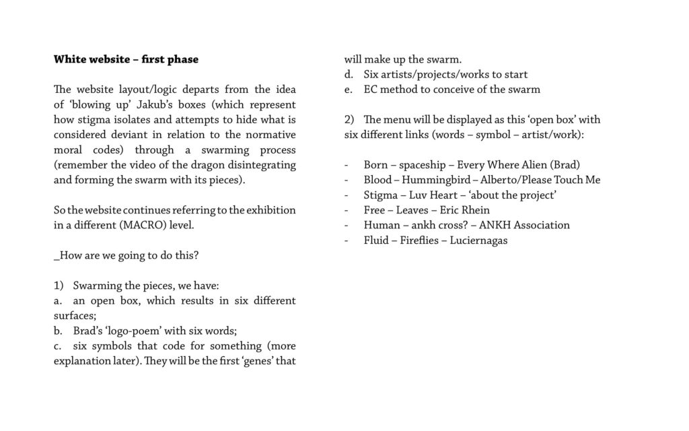
    
- 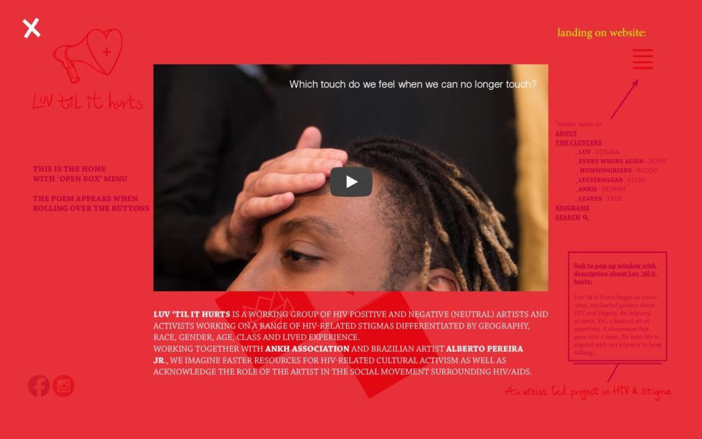
    
- 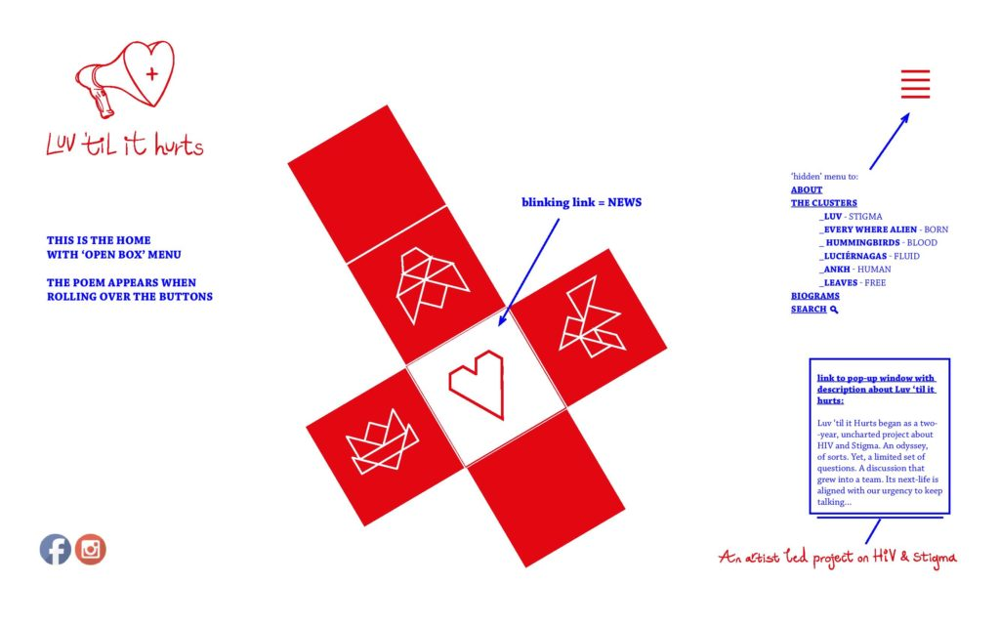
    
- 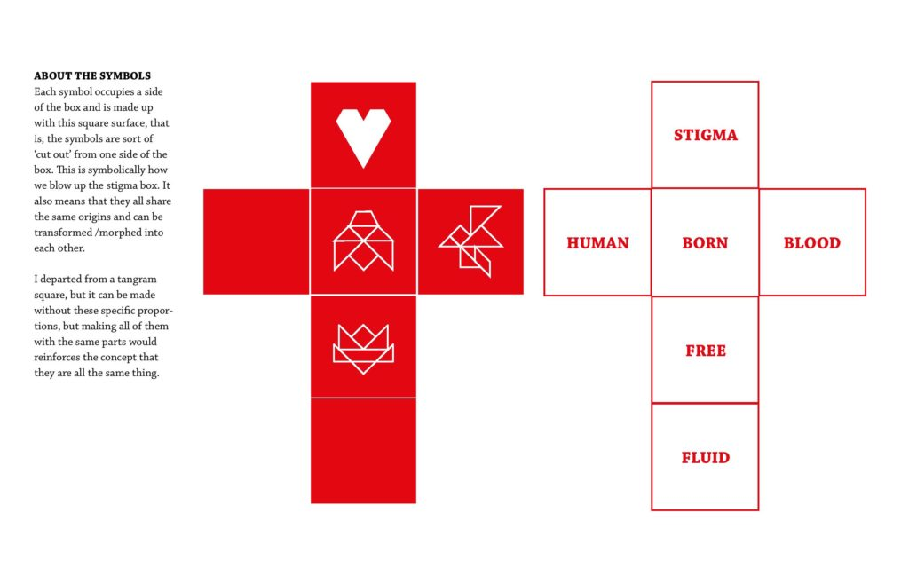
    
- 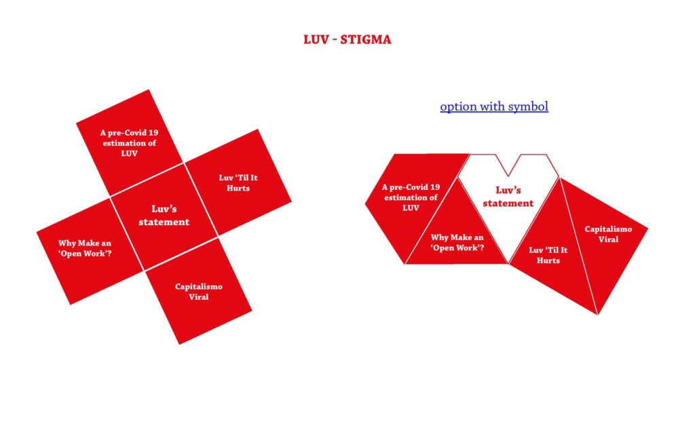
    
- 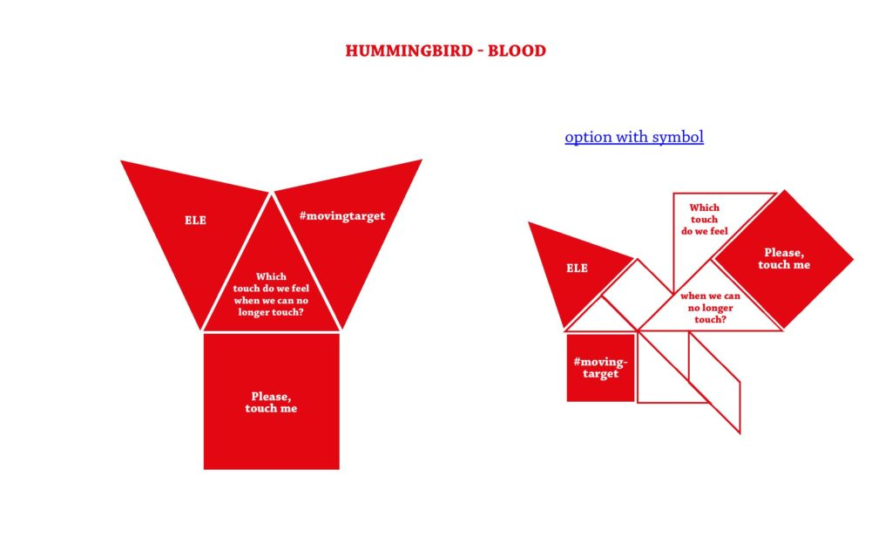
    
- 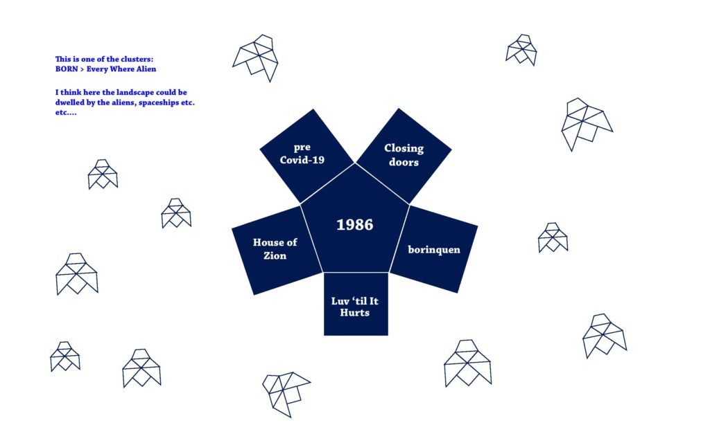
    
- 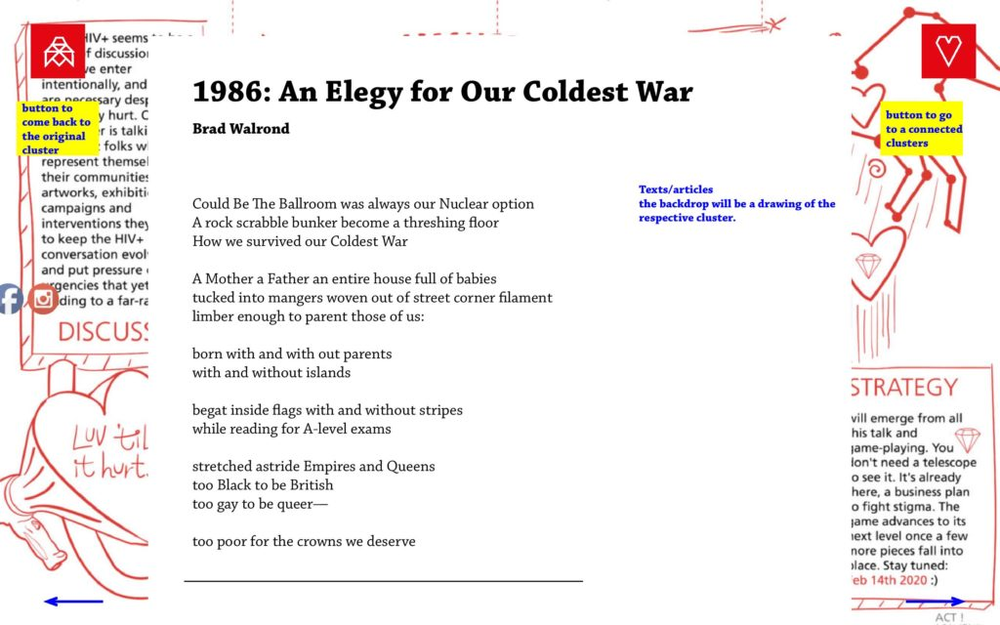
    
- 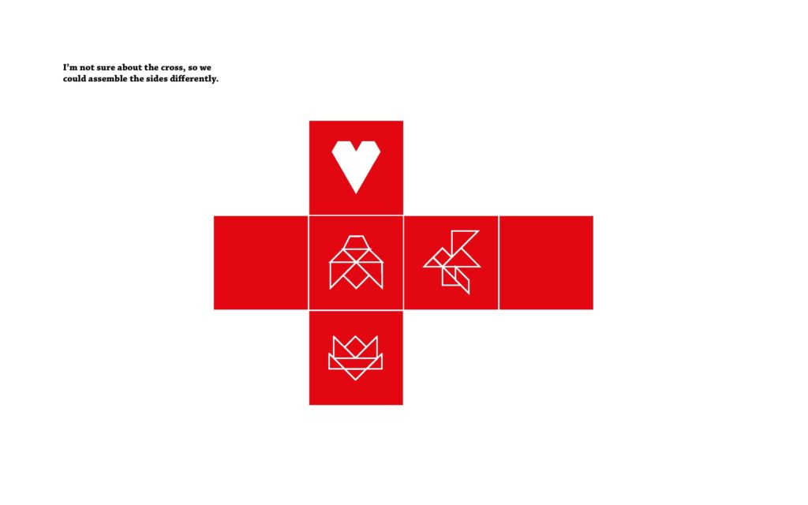
    
- 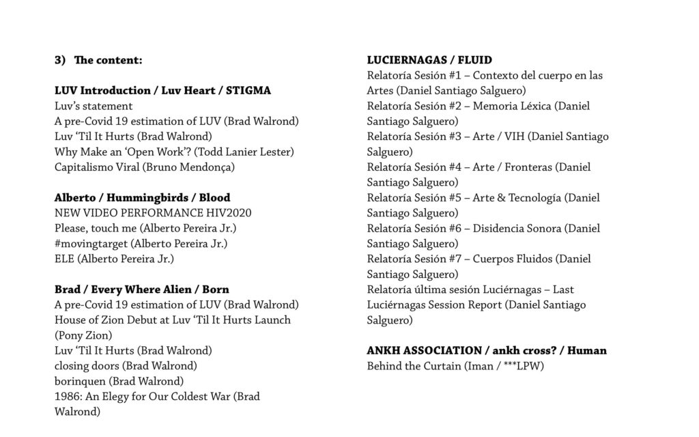
    
- 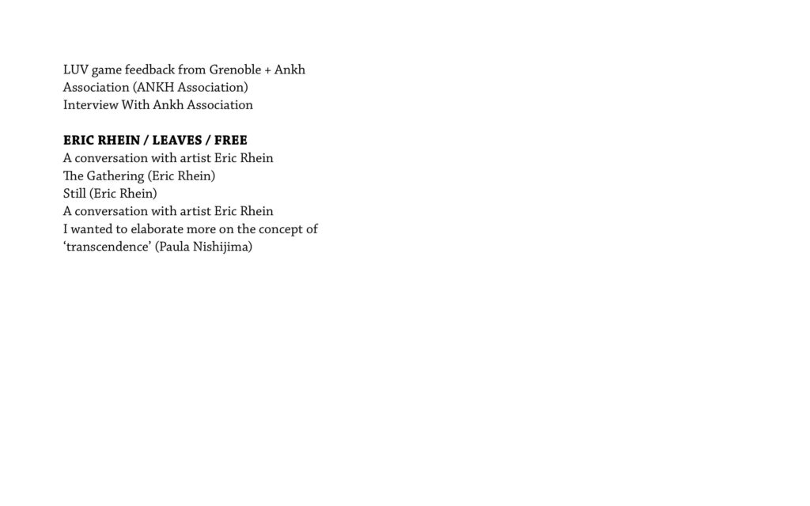
    

[Layout White Site](https://luvhurts.co/wp-content/uploads/2020/09/Layout_white_site_June23-1.pdf) [Download](https://luvhurts.co/wp-content/uploads/2020/09/Layout_white_site_June23-1.pdf)
