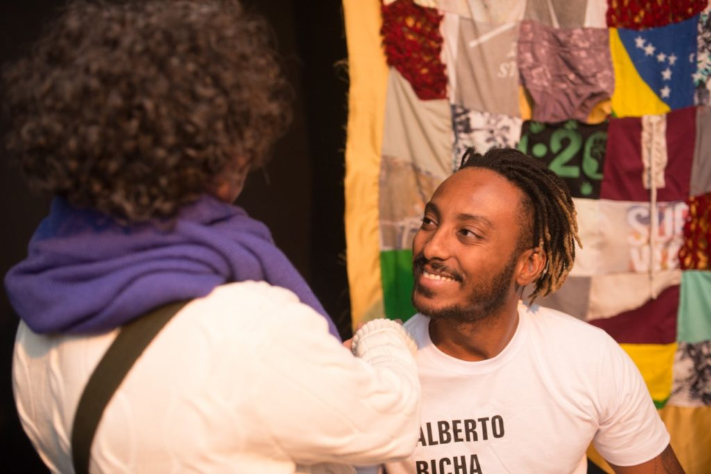
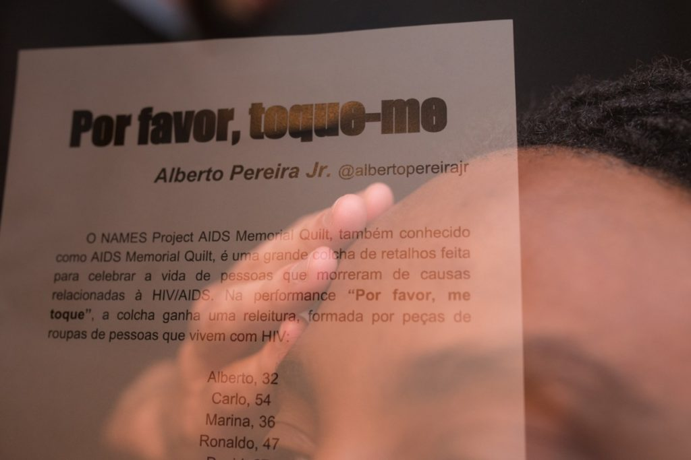

_\[\*Alberto Pereira Jr. first made 'Please, touch me' for a 2019 workshop in São Paulo. His production notes are the third in a series that also includes a project abstract [#movingtarget](https://luvhurts.co/texts/movingtarget/) and creative writing, [ELE](https://luvhurts.co/texts/ele/). xo, Todd\]_

PT

Instigado por um workshop realizado no instituto Itaú Cultural, sobre estigma e produção artística contemporânea em relação ao tema HIV/Aids, realizei a minha segunda saída do armário: vivendo há 10 anos com HIV, criei a performance "Por favor, toque-me", revelando meu status positivo e convidando o público a ressignificar a imagem pré-concebida de um corpo positivo.

EN

Instigated by a workshop that was realized in the Itaú Cultural Institute, on stigma and the contemporary artistic production in relation to the theme of HIV/Aids, I realized my second coming out of the closet: living with HIV for over 10 years, I created the performance "Please, touch me," revealing my positive status and inviting the public to resignify the preconceived image of a positive body.

PT

A performance-instalação “Por Favor, Toque-me” reelabora, no contato entre criador/performer e público, as possíveis imagens pré-concebidas a cerca de um corpo que vive com o HIV. Característica ou estigma, a soropositividade de Alberto Pereira Jr., é autodeclarada em seu vestuário, tornando-se física e passível de toque. Tocar para apreender, para expurgar, para reumanizar? Cabe ao público participante investigar suas novas ou antigas convicções. Integra a parte instalativa da performance, um tapete costurado tal qual uma colcha de retalhos, com peças de roupas de pessoas que vivem com HIV.

EN

**1) Activity title:** Please, touch me  
  
**a) Objectives:** The performance/body work “Please, Touch Me” re-elaborates, in the contact between creator/performer and audience, the possible preconceived images about a human body living with HIV.  
  
**b) Description of activities:** Characteristic or stigma, the seropositivity of artist and activist Alberto Pereira Jr. is self-declared in his clothing, becoming physical and susceptible to people’s touch. Touch to seize, to purge, to rehumanize? It is up to the participating public to investigate their new or old beliefs about human relations, about HIV and the prejudice that follows people  
living under this stigma.  
  
**c) Material:** There is an installation part of the performance, a rug sewn like a quilt, with garments of people living with HIV, inspired by the NAMES Project AIDS Memorial Quilt.  
  
**d) Format:** The performer's body will be touched and he will touch as well the people who touch him. The encounter between the audience and the artist will provoke a new narrative of infinities possibilities.  
  
**e) Expected Outcomes:**Wherever the performance is performed, it generates empathy, listening and affection. A moment of resignification of preconceived ideas from the public and also of empowerment for the artist, who has been living with HIV for 10 years.  
  
f**) Experience/expertise:** Alberto Pereira Jr. is a Brazilian social artist, who seeks intersection between theater, audiovisual, body work and literature for a dialogue and friction of contemporary themes such as blackness, homosexuality, HIV and affectivity. He created and directed “I now pronounce you…” (2012), documentary about LGBTQI + families in Brazil, awarded and funded by the São Paulo State Secretariat of Culture. Born and raised in the outskirts of São Paulo city, he is the founder of Domingo Ela Não Vai, one of the biggest street Carnival groups called blocos, part of the official line-up of the city. He also organizes various cultural events, such as Queermesse, a party that reunites LGBTQI + collectives. He created Subtle Lashes Festival of Margins Arts, sponsored by Levi's. In its first edition, held in April 2019, the festival had a line-up with only black, trans and cis women, LGBTQI+ community protagonism, with music, talks and free workshops. As a journalist, he worked for six years at Grupo Folha Publishing Co., one of the biggest Brazilian media outlets. Currently, besides performing in theater, he has been working as a screenwriter and creative manager for TV and film projects, producing content for Discovery Channel, MTV, Fox and others.

- 
    
- 
