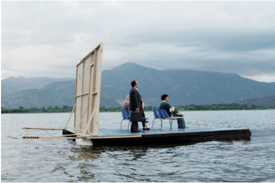
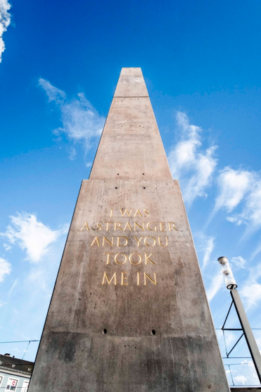
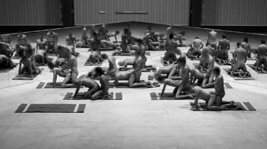
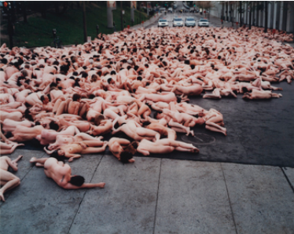
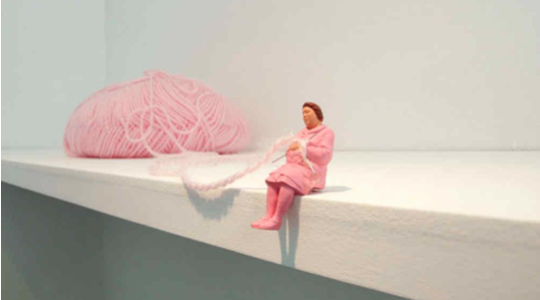
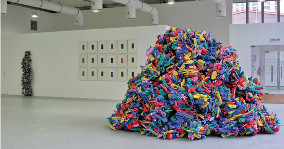
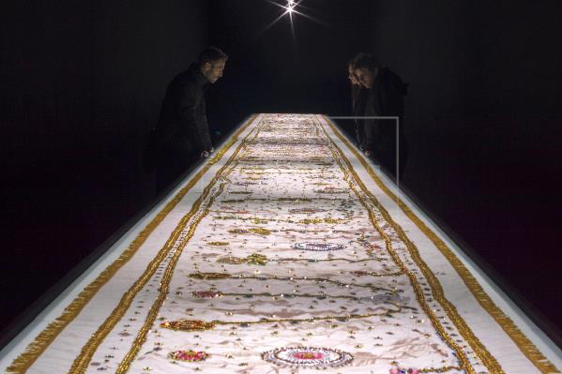
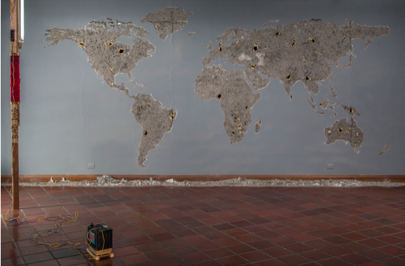
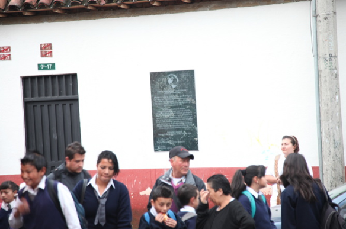

**Laboratorio Luciérnagas**

**Relatoría 27 Julio**

**sesión #4**   

**Arte y fronteras políticas**

**Invitadas:**

**Melissa Guevara**

**Artista**

**Laura Echeverri**

**Abogada derechos humanos**

**Relatoría:**

Melisa Guevara es artista Salvadoreña. Habló del libro “Luciérnagas en el Mozote” que contiene narraciones y testimonios sobre la masacre (1981) mas grande que ha sucedió en américa latina, 900 muertos perpetrados por el ejercito.

También nos habla del proyecto 24 Horas de fronteras abiertas, realizado por el colectivo del que hace parte, comprendido por dos colombianos, dos salvadoreños y un salvadoreño en NY. El proyecto se trata de grabar 24 capítulos relacionados cada uno a diferentes perspectivas sobre fronteras y migración, visto desde el punto de vista académico, artístico y de los inmigrantes mismos. 

Como parte de este proyecto los miembros del grupo viajaron a la frontera con Venezuela y rehicieron el camino que recorren los inmigrantes camino al interior del país, atravesando inclusive un frío páramo, una caminada inimaginablemente difícil. Nos contaron como en muchos puntos los caminantes son maltratados o ignorados producto de la xenofobia. 

Nos cuenta que en el Salvador también hay bastante desplazamiento interno. El problema grabe ahora son las pandillas. Nos cuenta que hay muchos imaginarios fantasmas sobre el país, lo que se cree, se imagina, se ha oído, lejanos a la realidad.

Se dice que debería existir un manual para migrar, si no estoy mal se habla de esto como posible proyecto artístico utópico.

Poniéndonos en contexto en centro américa nos cuenta que en Costa Rica no hay ejercito.

Alguien dice: lo que tenemos los artistas es tiempo para pensar, para apoyar y dar opiniones. Ayudamos a pensar de una forma diferente.

El migrante no tiene opciones. En los ochentas en la guerra de El Salvador se da una ola de migración hacia USA. Nacen los Maras Salvatruchos entre pandillas de otros países en USA.

Melisa y sus compañeros tienen un espacio de trabajo colaborativo. Son dos historiadores y dos artistas visuales. 

Se comentan trabajos:

- Manifiestos de la reimaginación (imaginarios regionales)
- Territorios conceptuales: ecología de las interfaces, matemáticas, para crear manifiestos. teniendo en cuenta el texto Capitalismo y Esquizofrenia de Deleuze y Guattari.

Generan imágenes desde la poética, el sexo, la violencia, desde términos como orgía o pogo. 

Se conocieron como equipo de investigación. Melisa también pertenece a otro colectivo: The Fire Theory. 

Se promedia que hay 3´400.000 de venezolanos en Colombia. 

Se promedia que ante las circunstancias, 300.000 personas que anteriormente habían emigrado desde Colombia a Venezuela han regresado ante la crisis. 

Históricamente las políticas migratorias en Colombia han sido cerradas.

Todos los venezolanos sueñan con volver a su país.

Se comenta al película estadounidense “un día sin mexicanos”.

Laura Echeverri, abogada experta en derechos humanos nos aclara:

Migrante es cualquier persona que vive fuera de su país de origen.

Refugiado es quien sale por emergencia. 

Existen casos de

Migración interna  (caso urgente en Colombia)

Desplazamiento forzado, que es una condición.

Desplazamiento interurbano. 

Los colombianos hemos sido refugiados en otros países en las olas de violencia y crisis económicas de los años noventas y dosmiles.

A los venezolanos se les está dando un permiso provisional de permanencia por dos años. Se llama el PEP. Les permite trabajar. Lo dan solo a personas con pasaporte y domicilio fijo, lo cual es una grande imposibilidad para ellos pues mucho carecen de esas condiciones. Los pasaportes para venezolanos están alrededor de us$300, en Venezuela mientras el salario mínimo es de US$4.00

[**FUPAD**](https://www.fupad.org/) es una organización que trabaja por el desarrollo socioeconómico de las comunidades y le apuesta a la reconstrucción del territorio colombiano.

Laura trabaja en [**ACNUR**](https://www.acnur.org/) la agencia de la ONU para los refugiados.

Nos contextualiza en la historia política reciente de Venezuela.

En 1998 fue la elección de Hugo Chaves, militar, que había participado en una revolución que se dio en 1992. Fue reelegido presidente en el 2000, 2006 y 2012. A partir de 2013 entra Nicolás Maduro al poder.

Venezuela sale de la convención Americana y deja de contribuir de la Convención Interamericana. 

Agosto 2015 declaración de emergencia.

Mayo 2016 El departamento de atención de desastres de Colombia es el encargado de recibir la ola de migración. 

Hay varios grupos armados y formas de violencia en Venezuela: Garimbas, Redadas, Colectivos armados, Tupamaros, Megabandas desde las cárceles, guerrillas, militares, el ELN también está en Venezuela.

Venezuela tiene una de las tazas de homicidio más altas del mundo. El 82% vive en pobreza extrema. 

En 2018 solo el 13% de la población con VIH en Venezuela recibe medicina. 

La condición de refugiados nace en la convención de 1951 como respuesta a la segunda guerra mundial.

Declaración de Cartagena. Respuesta a conflictos de Centro América.  

Más de 20.000 niños nacidos en Colombia de padres venezolanos no tienen nacionalidad ya que los consulados venezolanos están cerrados indefinidamente. Este hecho cambió recientemente. [https://www.nytimes.com/es/2019/08/06/colombia-ciudadania-hijos-venezolanos/?rref=collection%2Fsectioncollection%2Fnyt-es](https://www.nytimes.com/es/2019/08/06/colombia-ciudadania-hijos-venezolanos/?rref=collection%252Fsectioncollection%252Fnyt-es)

Nos preguntamos:

Y ¿Qué se puede hacer desde las artes?

Surgen ideas como estas:

Llevar a otro lado el pensamiento y sus lógicas.

Generar espacios de empatía

Arte 

como complemento de lo humano político o apolítico.

como medio de desahogo.

como espacio de reflexión y respiro.

Hablamos de una propuesta utópica, construir un espacio donde no haya fronteras. Pienso en el concepto TAZ de Hakim Bey [https://es.wikipedia.org/wiki/Zona\_temporalmente\_aut%C3%B3noma](https://es.wikipedia.org/wiki/Zona_temporalmente_aut%25C3%25B3noma)

Camilo, que trabaja con las madres comunitarias de Bosa en Bogota dice:

“Siempre quieres irte para Barranquilla, pero si te vas extrañas tu silla”

comparte ideas:

La frontera como límite nos limita.

¿Qué se siente perder el lugar de uno?

El pensamiento como frontera.

Miedo a la usurpación del territorio.

**Algunos artistas referentes para el tema**

Enrique Ramírez (Chile) 

Cruzar un Muro (Crossing a Wall) es una película, inspirada en el artículo 13 de la Declaración Universal de Derechos Humanos, en la que afirma que "Toda persona tiene derecho a abandonar cualquier país, incluido el suyo, y regresar a su país". . En esta película, una sala de espera, una oficina pública de asuntos de inmigración, ubicada en «algún lugar», es el escenario que converge todas las aspiraciones humanas de nuestro tiempo ... La espera, la convicción, el anhelo y el derecho de todos a soñar. , viajar, cruzar, a la libertad de movimiento y residencia dentro de las fronteras de cada estado o al derecho de retorno a su país de origen ... Todo esto se representa metafóricamente en este escenario de ficción y realidad.

Olu Oguibe (Nigeria) 

“Monument to Strangers and Refugees” 

Santiago Sierra (España)

“Los penetrados” estuvo dividido en ocho actos de sexo en vivo, cada uno tenía una combinación de género y etnia distinta. La idea era crear un mundo artificial que simulara las comunidades donde han ocurrido procesos de mestizaje.

Artur Żmijewski (Polonia)

 Liliana Porter (Argentina)

Hasan Sharif (Dubai) 

_Sandalias y cable_, 2009

Teresa Margolles (México),

La artista mexicana Teresa Margolles propone una profunda reflexión sobre el drama de la violencia machista, con la vista puesta en Bolivia y México, con la exposición "Sobre la sangre".

Mario Opazo (Colombia)

MAPA MUDO | 2016 | INTERVENCIÓN ESCULTÓRICA

Daniel Santiago Salguero (Colombia)

Convención de territorios y desplazamientos. 2012

De la mano de una abogada experta en derechos humanos redactamos un texto jurídico ficcional dónde se declara que en el año 2046 todos los habitantes de la tierra pueden desplazarse libremente por el territorio terrestre y asumir como lugar de residencia el lugar de su elección sin necesidad de visas ni permisos. El texto fue impreso en una placa y emplazado en el espacio público en Bogotá. Aquí acudo a las ficciones y a los juegos con el tiempo para darle la posibilidad de ser a algo que desde nuestro tiempo parece absolutamente ridículo. Este proyecto responde al sentimiento de impotencia de millones de personas a quienes les es negada la movilidad entre países. 

\_\_\_\_\_\_\_\_\_\_\_\_\_\_\_\_\_\_\_\_\_\_\_\_\_\_\_\_\_\_\_\_\_\_\_\_\_\_\_\_\_\_\_\_

**Luciérnagas**

**July 17th Report**

**session #4**   

**Art and political borders**

**Invitees:**

**Melissa Guevara**

**Artist**

**Laura Echeverri**

**Human Rights Lawyer**

**Report:**

Melisa Guevara is a Salvadoran artist. She spoke of the book “Liciérnagas in Mozote,” which contains narrations and testimonies of the largest massacre (1981) that has occurred in Latin America, 900 people killed by the army.

She also speaks to us about the 24 hours of open borders project, realized by the collective that she is part of, made up of two Colombians, two Salvadorans and one Salvadoran in NY. The project seeks to record 24 chapters, each one related to different perspectives on borders and migration, seen from an academic and artistic point of view, as well as from the immigrants themselves.

As part of this project, the members of the group traveled to the border with Venezuela and retraced the path that immigrants make into the country, also going across cold moors, a walk that is unimaginably difficult. They told us about how at many points the walkers were mistreated or ignored as a result of xenophobia. 

She tells us that in El Salvador there is also a lot of internal displacement. The serious problem now are the gangs. She tells us that there are many imaginary ghosts about the country, what is believed, imagined, heard, far from reality.

She says that there should exist a migration manual, it is spoken of as a possible utopic artistic project.

As she brings us into the context of Central America, she tells us that Costa Rica does not have an army.

Someone says: what we have as artists is time to think, support, and give our opinions. We help to think in a different way.

The migrant does not have options. In the eighties during the war in El Salvador there is a wave of migration to the USA. the Maras Salvatruchos are born among the gangs and in other countries and the USA.

Melisa and her partners have a space for collaborative work. They are two historians and two visual artists.

Works are commented on:

- Manifestos of the reimagination (regional imaginaries)
- Conceptual territories: the ecology of interfaces, math, to create manifestos. having in mind the text Capitalism and Schizophrenia by Deleuze and Guattari.

They generate images ranging from poetics, sex, violence, to terms such as orgies and pogo.

They met each other as a research team. Melisa is also part of another collective: The Fire Theory.

It was estimated that there are about 3,400,000 Venezuelans in Colombia.

It was estimated that due to the circumstances, 300,000 people who had emigrated from Colombia to Venezuela have returned because of the crisis.

Historically, the immigration policies in Colombia have been enclosed.

All Venezuelans dream of returning to their country.

Someone comments on the USA film “un día sin mexicanos”

Laura Echeverri, lawyer expert in human rights clarifies to us:

Migrant is any person who lives outside of their country of origin.

Refugee is who must leave due to an emergency

There are cases of

Internal migration (urgent case in Colombia)

Forced displacement, which is a condition.

Interurban displacement.

Colombians have been refugees in other countries during the waves of violence and economic crises of the 90s and 2000s.

Venezuelans are receiving a provisional permit to stay for two years. It is called the PEP. It allows them to work. It is only given to people with a passport and fixed residency, which makes it less possible for them as many do not meet these conditions. Venezuelan passports cost around US$300 in Venezuela, while the minimum wage is of US$4,00.

[**FUPAD**](https://www.fupad.org/) is an organization that works for the socioeconomic development of communities and aims at the reconstruction of the Colombian territory.

Laura works at [**ACNUR**](https://www.acnur.org/), the UN agency for refugees.

She contextualizes us in the recent political history of Venezuela.

In 1998 there was Huge Chaves’ election, a military man, who had participated in a revolution that took place in 1992. He was reelected as president in 2000, 2006 and 2012. From 2013 on, Nicolás Maduro is in power.

Venezuela leaves the American convention and ceases to contribute to to the Interamerican Convention.

August 2015 declaration of emergency.

May 2016 the Department of attention to disasters in Colombia is in charge of receiving the wave of migration.

There are many armed groups and types of violence in Venezuela: Garimbas, Redadas, armed Collectives, Tupamaros, Megabandas from jails, guerrillas, military people, the ELN is also in Venezuela.

Venezuela has one of the highest homocide rates in the world. 82% of the country lives in extreme poverty. 

In 2018, only 13% of the population with HIV received medicine.

The condition of the refugees is born in the convention of 1951, as a response to the second world war. 

Declaration of Cartagena. Response to conflicts in Central America.

More than 20,000 children born in Colombia from Venezuelan parents do not have the nationality, since the Venezuelan consulates have been closed indefinitely. This fact changed recently.

[https://www.nytimes.com/es/2019/08/06/colombia-ciudadania-hijos-venezolanos/?rref=collection%2Fsectioncollection%2Fnyt-es](https://www.nytimes.com/es/2019/08/06/colombia-ciudadania-hijos-venezolanos/?rref=collection%252Fsectioncollection%252Fnyt-es)

We ask ourelves:

And what can be done in the arts?

Ideas come up, such as these:

To take the thought and its logics over to the other side.

To generate spaces of empathy.

Art

as a complement to the political and apolitical human. 

as a means of relief.

as a space for reflection and breathing.

We spoke of a utopic proposal, of building a space in which there are no borders. I think of the concept of TAZ by Hakim Bey [https://en.wikipedia.org/wiki/Temporary\_Autonomous\_Zone](https://en.wikipedia.org/wiki/Temporary_Autonomous_Zone) 

Camilo, who works with the community mothers from Bosa in Bogotá, says:

“You always want to go to Barranquilla, but once you go you start missing your seat”

shares ideas: 

The border as a limit limits us.

What does it feel like to lose one’s place?

The thought as border.

Fear of territory usurpation.

**Some artist references in the theme**

Enrique Ramírez (Chile)

Crossing a Wall is a movie, inspired by article 13 of the Universal Declaration of Human Rights, which affirms that “All people have the right to leave any country, including their own, and to return to their country.” In this movie, a waiting room, a public workshop on migration issues, located “somewhere,” are scenarios that converge all human aspirations of our time… The waiting, the conviction, the desire and the right that everyone has to dream. , traveling, crossing, the liberty of movement and of residency at the border of each state, or the right to return to their country of origin … All of this is represented metaphorically in a scenario of fiction and reality.

Olu Oguibe (Nigeria) 

“Monument to Strangers and Refugees”

Santiago Sierra (Spain)

“Los penetrados” was divided into eight acts of live sex, each one with a different combination of genders and ethnicities. The idea was to create an artificial world that simulated communities in which processes of mixing have occurred. 

Artur Zmijewski (Poland)

Liliana Porter (Argentina)

Hasan Sharif (Dubai)

_Sandalias y cable_, 2009

Teresa Margolles (Mexico),

The Mexican artist Teresa Margolles proposes a profound reflection on the drama of macho violence, looking at Bolivia and Mexico, with the exhibition “Sobre la sangre.”

Mario Opazo (Colombia) 

MAPA MUNDO | 2016 | SCULPTURAL INTERVENTION

Daniel Santiago Salguero (Colombia)

Convention of territories and displacements. 2012

At the hands of a human rights lawyer, we wrote out a fictitious text in which it is declared that in the year of 2046 all of the inhabitants of earth will be able to move freely through terrestrial territory and assume, as a place of residency, the place of his/her choice, without the necessity of visas or permits. The text was printed out on a board and placed in Bogotá’s public space. Here I turn to fictions and to time games in order to give it the possibility of being something that, during our current time, appears absolutely ridiculous. This project responds to the feeling of impotence of millions of people to whom mobility between countries is denied.
