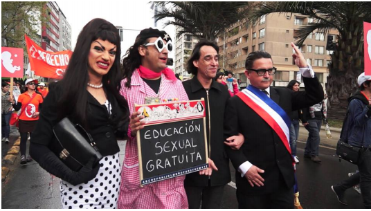

Laboratorio Luciérnagas

Relatoría 24 Agosto

sesión #6

disidencia sonora

artista invitado: Mauricio Rivera Henao

lugar: Adorno – Liberia

**Relatoría:**

Mauricio Rivera es artista sonoro, también trabaja con video e instalaciones. Tiene una pregunta constante por el territorio.

Disidencia = contra hegemónico

Obra: un diálogo con el lago Titicaca

Paisaje sonoro: retratar los paisajes en término sonoros. Volver plástica la materia sonora. Habla de tener conversaciones con insectos o minerales como gesto contra hegemónico ( disidente ).

Se cree que el sonido es virtual porque no es tangible, pero los sonidos son tangibles y sus ondas también son imágenes.

Trabajó con sabedores tradicionales.

Sus piezas están grabadas en frecuencias específicas con las que resuena el cuerpo físico y los animales. Las frecuencias de onda viajan por la humedad. La información de ondas se guarda en piedras que están hechas en gran parte de agua. Son como discos duros.

¿Cómo escuchar? Mauricio nos dice: mi experiencia viene de mi educación y vida crecí viendo MTV, escuchando música andando en bus, taxi, por la ciudad.

El sonido es muy subjetivo.

La imagen es dada, el sonido en cambio se imagina.

Trabajó con cantos de Babalús Cubanos y con cantos guturales canadienses, hubo resonancia entre ellos y su obra.

Jose Manuel Berenguer, artista sonoro español Instalación sonora con luciérnagas (revisar)

Momentos de Climax, como concepto. Lo latente, (latir). Una pieza con Carlos Gómez Caballero en Barcelona.

Tienen la Orquesta del Caos. Proyecto Sonidos en Causa.

Idea: trabajar con el sonido real del agua, ¿tecnologías? Sonido cuerpos, instrumentos…

Conceptos: transmisión y retransmisión de radio. ¿Cual es la duración?

Pregunta: ¿cómo subvertir?

Sonido – Sanar como técnica Tibetana. Investiga en el cuerpo donde no se detiene la onda. Como los Taitas con sus cantos. Sonidos que estimulan la glándula pituitaria. Resonar.

Cómo el mensaje que queremos transmitir esté latente.

Sonido disidente, curador

Cuestiones para la presentación: ¿Cuál puede ser el pico “climax” en el performance?.

Estado de sensibilidad, línea delgada, quien es portador, quien desarrolla el síndrome.

En la película “Nuestra Película” de Luis Ospina sobre Lorenzo Jaramillo se ve la pérdida de sentidos.

¿Cómo fluye la sangre? Otra densidad.

Estimular los minerales que hay en la sangre, como el hierro.

Visitamos la exposición En Aguante, que incluye videos, fotografías y material de archivo de Hija de Perra (artista y activista trans, chilena, 1980 – 2014) bajo la curaduría de Julia Eilers Smith. La exposición incluía también obras de la artista brasilera Jota Mombaça y el artista mexicano ektor garcia.

Hicimos lectura del texto de Hija de Perra.

Ideas: Locura urbana en contra del fluir anárquico. Azote visual y auditivo.

Forma extraterrestre, disidente. La disidencia surge de la rabia.

Concepto: Aguantar (desde el aguante).

Los géneros como institucionalizaciones.

\_\_\_\_\_\_\_\_\_\_\_\_\_\_\_\_\_\_\_\_\_\_\_\_\_\_\_\_\_\_\_\_\_\_\_\_\_\_\_\_\_\_\_\_

Luciérnagas Lab

August 24th Report

session #6

sound dissidence 

place: Adorno – Liberia

invited artist: Mauricio Rivera Henao

**Report:**

Mauricio Rivera is a sound artist, who also travels with video and installations. He is in a constant questioning of the territory.

Dissidence = against hegemony

Work: A dialogue with the lake Titicaca

Sound landscape: To portray landscapes as sounds. To turn sound matter into plastic. He talks about having conversations with insects or minerals as a gesture against hegemony ( dissident ).

It is believed that sound is virtual because it is not tangible, but non-tangible sounds and their waves are also images.

Worked with traditional knowledges. 

His pieces are recorded in specific frequencies with those that resonate the physical body and the animals. The wave frequencies travel through humidity. The information of the waves is kept in stones that are largely made of water. They are like hard disks. 

How can we listen? Mauricio tells us: my experience comes from my education and life, I grew up watching MTV, listening to music, taking the bus, the taxi, throughout the city.

Sound is very subjective.

Images are given, but sounds are imagined.

Worked with songs of the Cuban Babalús and with guttural Canadian chants, he felt resonance between them and his work.

Jose Manuel Berenguer, Spanish sound artist sound installation with luciérnagas (revise)

Climax moments, as a concept. The latent, (bark). A piece with Carlos Game Caballero in Barcelona.

They have the Chaos Orchestra. Sonidos en Causa Project. 

Idea: to work with the real sound of water. Technologies? Sound bodies, instruments…

Concepts: radio transmission and retransmission. What is the duration?

Question: How to survive?

Sound — To heal with the Tibetan technique. Investigates the body in which the wave is not detained. Like the Taitas with their chants. Sounds that stimulate the pituitary gland. Resonate.

As if the message that we want to transmit was latent.

Dissident sound, curing.

Matters for the presentation: What can be the “climas” peak of the performance?

State of sensibility, thin line, who is the bearer, who develops the syndrome.

In the movie “Nuestra Película” by Luis Ospina about Lorenzo Jaramillo you can see the loss of senses.

How does blood flow? Another density.

Stimulate the minerals that there are in blood, like iron.

We visit the exhibition En Aguante, which includes videos, photographs and archival material of Hija de Perra (trans artist and activist, Chilean, 1980 — 2014), curated by Julia Eliers Smith. The exhibition also included works by the Brazilian artist Jota Mombaça and the Mexican artist Ektor Garcia.

We read Hija de Perra’s text.

Ideas: Urban insanity against the anarchic flow. Visual and auditive nitrogen.

Extraterrestrial form, dissident. Dissidence arrises from anger. 

Concept: to bear (from patience).

Genders as institutionalizations.

