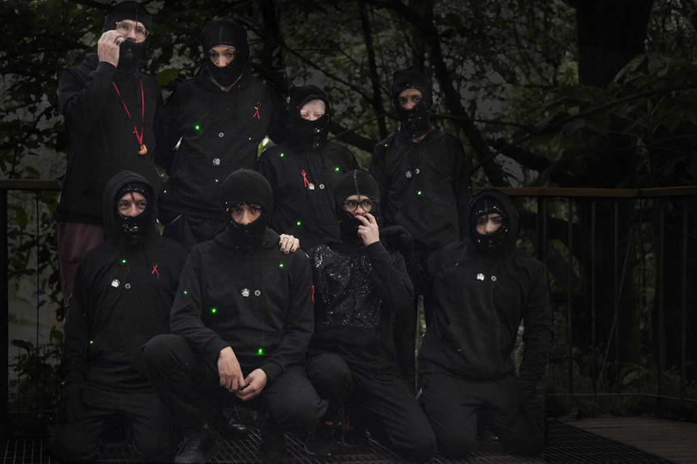

Image taken at Oct 25 (2019) Luciérnagas performance

**Before the presentation** we did some in situ rehearsals, although they were never enough, we did them. The Botanical Garden is a very bureaucratic institution and it was difficult to manage the space for more preparations. For these last sessions we got together Eudes Toncel, a Guajiro Colombian artist, writer, and anthropologist, with special interest in the themes of gender and afro cultures. Almost all of us arrived in time for the presentation. Laura Figueroan, a very good friend of mine, came over to help us with the details, and brought us ski masks, which were intervened upon with fancy black stones, which went really well with the costumes. We had been cooking up the LED lights in the last weeks, with the help of Duvan Puerto, who arrived in the project thanks to Juan Sebastián Jaramillo and the creativity and technology agency that they worked at. Megan Cross Star, a member of the laboratory, was one of the people who had the most interest in the process, and especially in her costume for this night. She brought jewelry, make up, and was truly very elegant. As it was the night at the Botanical Garden that is open and free, many people came. More than we expected. After 6 months of planning and speculation , the day had arrived. It rained a lot that week, but luckily this day was clear, and both the members of the lab, as well as the visitors, were all able to calmly visit the Botanical Garden.

The time for the performance arrived, and we were ready. Each one went to their specific spot, where they would do their work in the dark jungle. They started to do their movements, in slow, subtle dances, while the the little LED lights were like fireflies. My instruction to them was: you are the containers of the fireflies, roaming through the jungle. In anyway, we had never been there at night, so there were places that I had expected to be especially dark, but weren’t. This made it so that each one had to run to find his/her place of work, and to assure me that they were placed in the darkest possible point, as it was only there that we could notice the magic of the tiny lights floating in space. I also went over the speed of the movements for each one, and the way in which they produced the sounds. Camilo arrived at the garden late, although I had warned him about it. So I had to leave to take him to the dressing room at the entrance, and give him the immediate instructions so that he could join in with the rest. When we returned from the jungle we saw the center, where we had planned to end the action, where all of the bodies from the performance met each other. In pairs, we did a reflection exercise that we had learned in the session that was dedicated to the exploration of the body, conducted by Juan Manuel Mosquera, at this same location, some months ago. Now that we returned there, it turned out that the space was full of people, and the action was difficult to appreciate. I did not have another option but to ask the people to please open up some space, which I was later told interrupted a bit the mystique of the moment, but I had to do it. This third part of the action, that we call the _partitura_ (score) – the _apareamento_ (pairing up) – consisted of doing this subtle reflection dance in pairs, while the volume of the whistles intensified up to the point in which the sound would be cut, after my signal. Friends, family members, and partners came to see us. 

**The weeks before** the presentation, we had many gatherings, generally dedicated to the designing of the wardrobe, to sewing, and to connecting the LED lights though the conducting wires on the black hoodies. It was a complex process, we had to learn the positives and the negatives, LilyPad, LED, batteries with different durations and strengths. For me it was a great challenge, as technology has not been my forte. To get closer to these notions was a useful thing to learn. We met at my house almost always during the weekends, all of us cooking and talking until the late hours of the night.

**Todd Lester came from São Paulo**, and I hosted him at my house. Two days before we were printing publications with the information on his project Luv ’til It Hurts, about art and HIV. Todd’s enthusiasm has been defining in all of the project’s development, with the help of Paula Querido Van Erven, Brazilian, who translated the previous reports about the lab, and they published it on Luv ’til It Hurts’ [**online platform**](https://luvhurts.co/) on art and HIV. Todd, during the days of the performance, organized an event at El Parche Artist Residency, where he presented his personal project as an artist, a table game that invites people to talk about, discuss, and express themselves openly on matters related to HIV/AIDS.

**The sound element** appeared in a magic way. We had already talked a lot about what could be the sound that accompanied the action, in the session dedicated to sound art, delivered by Mauricio Rivera. We had decided that the best would perhaps be to find forms of sounds emitted from the body, that are natural, or chants, simple instruments, something like that. But up until this point we had not succeeded in solidifying what it could be. Some weeks before the presentation, there was a tutoring session with the Mexican artist Tania Cadiani, following up from my 10-month residency in Flora ARS NATURA. Tania told me: “But have you listened to the chant of the fireflies when mating?” I told her that I hadn’t. I had consulted the literature on fireflies, seen videos and photos, illustrations, poems. But none of them had mentioned, that I recall, specifically the sound of the fireflies, perhaps because what was more evident was to think of the lights that they emit. At last, I was rewatching videos of fireflies while mating, and listening attentively to their chants, and it fit like a glove. The sound element, now under this guiding pole, would come to be an essential part of the performance. Some days afterwards, I went to buy artisanal whistles at the ‘Pasaje Rivas’ and I found one made out of clay in the shape of little chickens, that, when played in unison and in the dark, could sound just like the melodious screeches that the fireflies emit during nocturnal courting.

**After the presentation,** Mario Andrés González, a member of the lab and part of the board of the Kuir cinema festival in Bogotá, invited us over to his house, where we ordered some pizza and beers. We were almost all members of the lab, plus some friends and family.   
We were talking until extremely late, asking ourselves how we felt throughout the night. Some members of the lab had gone that night to shoot videos at the very dark parts of the forest in the Botanical Garden, and brought very interesting results and good ideas. We thought of how it would be to appear as a group with our LED light costumes in another space, for example.

**Immediately after** the presentation, I had in my head a question about the nature of the aesthetic and the action as a conclusion of the lab. Because, the lab, whether the performance succeeded or not, let’s say, was effective, worked, the ten sessions took place, all of the invitees came over, ties of affection were created between the members and participants, extremely important questions and ideas on the relationship that each one had with HIV came up, as well as of its relation with the current Venezuelan migration crisis. The question that kept surrounding me every once in a while, in an accelerated way, because it is possible that the performance may have been, aesthetically, a bit chaotic (it is also possible that it wasn’t, but let’s just say that some precisions escaped us, over which I would have liked to have had control), for example, there were a lot more people than we expected, the lights could not be seen as much as I would have liked because it was not dark enough for these to accurately have the imagined effect. But besides this, the action worked, the bodies spread out throughout the jungle, the LED lights were turned on, we emitted the sounds that alluded to the fireflies’ chants while mating. I have ended it by concluding that the important thing, as far as my interest as an artist, with regards to aesthetics, perhaps speaking specifically about this work, is more about the content, and that the aesthetic that prevails above the beauty or lack thereof in the performance, is the aesthetic of collaboration. It is an aesthetic that is beyond the visible, that can perhaps even be evidenced through reports, pictures, and videos of the process, but that it is only possible to prove by speaking to one of the members of the lab. What is even more difficult of proving, being myself a member of the lab, is that it is possible that the aesthetic only lives in ourselves, because it was our bodies that the lab transformed. Indeed, there were changes in our attitude and thinking after this process, and this is, in my opinion, the aesthetic dimension that matters in appreciating this project as an artistic work. 

\_\_\_\_\_\_\_\_\_\_\_\_\_\_\_\_\_\_\_\_\_\_\_\_\_\_\_\_\_\_\_\_\_\_\_\_\_\_\_\_\_\_\_

**Previo a la presentación** hicimos algunos ensayos in situ, nunca suficientes pero los hicimos. El Jardín Botánico es una institución muy burocrática y era difícil gestionar las preparaciones. Para estas últimas sesiones se sumó Eudes Toncel, artista, escritor y antropólogo con interés especial en temas de género y culturas afro. A la presentación llegamos casi todos a tiempo. Laura Figueroan vino a ayudarnos con detalles, nos trajo los pasamontañas intervenidos con piedras negras de fantasía. Las luces LED las habíamos estado cociendo en las últimas semanas con la ayuda de Duván Puerto que llegó al proyecto gracias a Juan S. Jaramillo y a la agencia de creatividad y tecnología donde trabajaban. Megan Cross Star, miembra del laboratorio fue una de quienes más le puso interés al proceso y especialmente a su traje para esa noche, trajo joyas y maquillaje.Cómo era noche abierta y gratuita en el Jardín Botánico vino más gente de las que esperábamos. Después de 6 meses de planeamiento y especulación el día había llegado. Llovió mucho esa semana, pero afortunados, ese día y noche estuvo despejado y eso ayudó a que tanto los miembros del laboratorio como los visitantes pudieran venir tranquilamente. 

Llegó la hora del performance y estábamos listes. Cada une se fue al lugar específico donde trabajaría en la selva nocturna. Empezaron a hacer sus movimientos, lentos, danzas sutiles, mientras los bombillitos LED hacían de luciérnagas. Mi recomendación era: son contenedores de luciérnagas deambulando por la selva. De todas formas nunca habíamos estado allí de noche así que había lugares que yo esperaba que estuvieran más oscuros. Eso hizo que debiera correr a buscar a cada uno a su sitio de trabajo y asegurarme de que se ubicaran en el punto más oscuro posible, pues solo ahí se podía percibir la magia de las lucecitas flotando en el espacio. También con cada une repasé su velocidad de movimiento y la forma en que estaba produciendo el sonido. Camilo llegó tarde aunque lo había advertido, debí ausentarme para llevarle el vestuario a la entrada y darle las instrucciones inmediatas para que incorporarse. Cuando regresamos a la selva vimos que en el centro, donde habíamos planeado el final de la acción, donde todos los cuerpos del performance se encontraban en parejas y hacían un ejercicio de reflejo que aprendimos en la sesión dedicada a explorar el cuerpo dirigida por Juan Mosquera allí mismo hacía un par de meses. Cuando regresamos el espacio estaba lleno de gente y la acción era difícil de apreciar. No tuve de otra que pedir a las personas el favor de abrir espacio y moverse un poco, lo cual después me dijeron, interrumpió la mística del momento, pero tenía que hacerlo. Esta tercera parte de la acción, que llamábamos en la partitura -apareamiento- consistía en hacer una danza ‘reflejo’ en parejas, mientras el volumen de los silbatos se intensificaba hasta el punto que había un pico y el sonido se cortaba al momento en que daba la señal. Entre el público estaban amigues y familiares. 

**Las semanas anteriores** a la presentación tuvimos varios encuentros, en general dedicados al diseño del vestuario y a cocer y hacer la conexión de los LEDS a través de hilos conductores sobre las sudaderas negras. Era un proceso complejo, tuvimos que aprender de positivos y negativos, lilypaths, LEDS, baterías con tiempos de vida y diferentes tipos de potencias. Para mi fue un reto grande pues la tecnología no ha sido mi fuerte. Acercarnos a las nociones fue un útil aprendizaje. Nos vimos en mi casa casi siempre en fines de semana, todes cociendo y charlando inclusive hasta altas horas de la noche.

**Vino Todd Lester desde São Paulo**, se alojó en casa. Dos días antes estuvimos imprimiendo publicaciones con la información de su fundación Luv 'Til It Hurts sobre arte y VIH. El entusiasmo y apoyo de Todd ha sido definitivo en todo el desarrollo del proyecto, con la ayuda de Paula Querido Van Erven, brasilera, quien tradujo todas las anteriores relatorías del laboratorio y las publicaron en su [plataforma WEB](https://luvhurts.co/) sobre arte y VIH. Todd, por los días del performance organizó un evento en El Parche Artist Residency donde se presentó su proyecto personal como artista, un juego de mesa donde se invita a hablar, discutir y expresarse abiertamente sobre cuestiones relacionadas al VIH/ SIDA. 

**El elemento sonoro** surgió de una manera mágica. Ya habíamos estado hablando mucho sobre cuál podía ser el sonido que acompañara la acción, esto en la sesión dedicada a arte sonora dictado por Mauricio Rivera. Habíamos concluido que lo mejor quizás era encontrar formas de sonidos emitidos desde el cuerpo, naturales, cantos, instrumentos simples, algo así, pero hasta ese momento no habíamos logrado concretar que podría ser. Unas semanas antes de la presentación tuve una tutoría con la artista mexicana Tania Candiani a raíz de mi residencia de diez meses en Flora ARS NATURA. Tania me dijo –pero y ¿has escuchado el canto de las luciérnagas al aparearse? No, le dije. Había consultado literatura sobre luciérnagas, había visto videos y fotografías, ilustraciones, poemas, pero no se nombraba, que yo recuerde, específicamente el sonido de las luciérnagas, quizás porque lo evidente es pensar en las luces que emiten y no en su sonido. Ahora estuve revisando videos de luciérnagas al aparearse y escuché con atención su canto al aparearse. Ese hecho me vino como anillo al dedo, pues el elemento sonoro ahora bajo esta batuta, vendría a ser parte esencial de la acción. Unas días después fui a buscar silbatos artesanales al pasaje Rivas y encontré unos de barro en forma de gallinitas, que sonando al unísono y en la oscuridad, bien podrían ser los chillidos melodiosos que emiten las luciérnagas en su cortejo. 

**Después de la presentación** Mario A Gonzalez, miembro del laboratorio nos invitó a su casa, donde pedimos pizzas y cervezas. Fuimos casi todos los miembros del laboratorio más algunos amigues y familiares. Estuvimos charlando hasta tardísimo, nos preguntamos cómo nos habíamos sentido durante la noche. Algunos miembros del laboratorio se habían ido a hacer videos en un bosque muy oscuro en el Jardín Botánico y trajeron más tarde unes resultados muy interesantes y buenas ideas. Pensamos cómo sería aparecer en grupo con nuestros trajes de LEDS en otros espacio, por ejemplo.

**Inmediatamente después** de la presentación en mi cabeza rondaba una pregunta sobre la naturaleza de lo estético. Porque el laboratorio, más allá del un éxito o no de la performance, digamos, fue efectivo, funcionó, se dieron las diez sesiones, vinieron les invitades, se crearon lazos de afectividad y trabajo entre les miembres y participantes, surgieron preguntas e ideas importantes sobre la relación de cada uno frente al VIH y este en relación a la actual crisis de migración Venezolana. La pregunta sobre lo estético me seguía rondando de manera acelerada, porque es posible que el performance hubiera sido un poco caótico (es posible que no, pero digamos que se escaparon algunas precisiones sobre las que yo hubiera preferido tener el control) por ejemplo vino mucha más gente de la que esperábamos, los LEDS no se veían tanto como yo hubiera querido pues no había la oscuridad necesaria para que estás surgieran fielmente el efecto imaginado. Pero más allá de eso, la acción funcionó, los cuerpos nos repartimos por la selva y nos encontramos para el momento del cortejo, los LEDS prendieron, emitimos los sonidos que hacían alusión al canto de las luciérnagas al aparearse. He terminado por ir concluyendo que lo importante en cuanto a mi interés como artista frente a lo estético quizás específicamente hablando de este trabajo, es más sobre el contenido. Y la estética que prevalece, por encima más allá de lo bello o no de la performance, es la estética de la colaboración. Es una estética que está más allá de lo visible, que quizás pueda llegar a evidenciarse en relatos, fotos y videos del proceso, pero que solo es posible comprobar al hablar con alguno de los miembros del laboratorio, o y más difícil aún de comprobar, siendo uno de los miembros del laboratorio. Es posible que la estética solo viva en nosotros, porque fue a nosotros a los cuerpos que el laboratorio transformó. Efectivamente hubo cambios de actitud y pensamiento después de este proceso, y ahí esta, según yo, la dimensión estética que importa para apreciar este proyecto como obra o trabajo artístico. 

