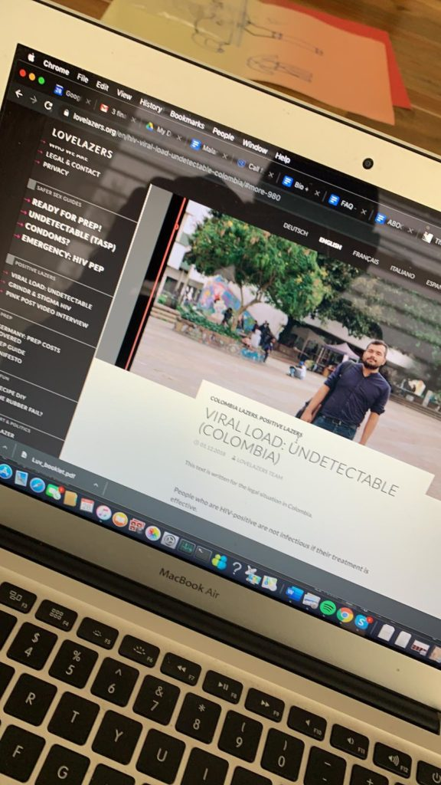

_Bodies containing Fireflies that wander through the nocturnal jungle, emitting calls and small sparks of light for courting and to find copulation. They remind us that in the jungle there are no limits or borders. Migrating, as many do out of necessity, or as a virus does from one body into another, is a fluid process. The spectator is invited to use the space to take a break, breathe, and rethink of him/herself as an individual body, and as a gear in a collective body in constant movement. In AIDS and Its Metaphors (1987), Susan Sontag proposes a relationship with illnesses that is not of pity. Instead, she suggests approaching the illness by recognizing it as being a fundamental part of living organisms. Sontag's intake emphasizes the necessity of confronting the illness with compassion, which implies understanding what happens to the other as if it was happening to yourself. In Survival of the Fireflies (1992), Georges Didi-Huberman proposes these light bugs as being metaphors of resilience, especially during convoluted political moments. These are some reflections that have opened up in the Luciérnagas_ _lab of research and creation._ 

+++  
  
I landed early on Thursday, October 24, 2019 in Bogotá. It's an overnight flight from São Paulo. The culminating performance of the [Laboratório Luciérnagas](https://luvhurts.co/coalition/luciernagas/) would be the following night.   
  
I was hosted at home by Daniel Santiago Salguero, the maker of [Laboratório Luciérnagas](https://luvhurts.co/coalition/luciernagas/) with ten of his colleagues. He stays with artists, Carlos and Alejandra. On Wednesday the following week, Carlos would prepare MIERCOLES, a lunch offering at [FLORA ars + natura](http://arteflora.org/), the residency where both Daniel and Carlos are in residency this year. Marta Ramos was there at the same time as me offering portfolio reviews to the residents. It was nice to see several São Paulo faces during the week.  
  
A performance by members of [Laboratório Luciérnagas](https://luvhurts.co/coalition/luciernagas/) happened on Friday evening during a free/public night at Bogotá's Botanical Garden. The goal of _Luciérnagas_ was to convene a group of people for a period of six months, to think, talk, and act around themes associated with HIV / AIDS in relation to current urgent migration crises. There are approximately 10 members of the laboratory, and as far as I can tell this was only the beginning.   
  
I've had the opportunity to assist several artists in my practice. Sometimes it looks like arts administration or production and others it is explicitly dramaturgy 'glue' that I offer. One thing that I feel is important when visiting another artist's project--especially one that is representative of a complex issue, demographic, identity or community--is to have permission to participate or add value, and to make sure and not distract from the intention of the work. Some pieces are easier to offer this to than others. Daniel Santiago Salguero and I spoke about ways to 'help' and be involved before I arrived, and I made sure I understood his intention with [Laboratório Luciérnagas](https://luvhurts.co/coalition/luciernagas/). I asked if I could distribute a pamphlet on the [LUV game](https://luvhurts.co/play-me/) during the performance or before as guests were arriving ... catching passersby too. LUV is supported by a designer in Egypt, and in the days before my trip, Daniel and I decided to incorporate some pages in the pamphlet on [Laboratório Luciérnagas](https://luvhurts.co/coalition/luciernagas/) rather than having a separate flier or programme. We spent the first day after my arrival and some hanging out going to the printer and laying out the final guide with the design items sent by Adham. I picked them up the next day while Daniel, Jacir and Jackie made final costume adjustments at the house Daniel shares with Carlos and Alejandra. Jackie made lunch for us all before we headed to the Botanical Gardens to meet the others.   
  
Whenever I do something like this, I always carry a bigger question with me. I look to see how and if the arts and human rights communities locally can be of service to one another. I was told about an organization that works on HIV and related activism called [Temblores](https://www.temblores.org/?fbclid=IwAR1efy8ynuw9TGVcXQ86eV9e18Qc9VRLsuDvMqU0ySxJPhuEatU28FKZfzI). A friend introduced me to a staffer who had just been to Hong Kong for an AIDS conference. We did manage to flirt a bit on WhatsApp, but my invitation to come and share info on his work at the closing LUV meeting went unanswered.  While I do not want to read into this handsome WhatApp profile's thinking, I can offer that this sort of ouverture (a mini gesture within a larger artistic gesture) is usually unrecognized by the human rights camp. I think in a way they (we) do not think we need something like a gesture. And, how could anything useful come out of the blue like that? In such a short time period without proper planning? It seemed like a very busy 'art week' in Bogotá, but also that something quite special happened on Wednesday night, October 30th at [el parche](http://www.elparche.org/?fbclid=IwAR3DclM55rJCdoPmxil3tWdnbcVw_yZALwJjb5YNYoukBhKbSupeJaPuLQ8). The event was called _[Arte/VIH/Activismo: Luv 'til it Hurts & Luciérnagas Laboratorio](https://www.facebook.com/events/675101239678987/)_.  
  

Thankfully, there was a unique overlap with the venue, [el parche](http://www.elparche.org/?fbclid=IwAR3DclM55rJCdoPmxil3tWdnbcVw_yZALwJjb5YNYoukBhKbSupeJaPuLQ8) that offered to host the closing LUV chat, which was also like an 11th meeting for the [Laboratório Luciérnagas](https://luvhurts.co/coalition/luciernagas/) and was nicely festive in celebration of their beautiful intervention executed in a rather nuanced way atop the open/public night programming at the Botanical Gardens. Juan, who manages [el parche](http://www.elparche.org/?fbclid=IwAR3DclM55rJCdoPmxil3tWdnbcVw_yZALwJjb5YNYoukBhKbSupeJaPuLQ8) is also a part of [LoveLazers](https://www.lovelazers.org/en/), a group that sees its 'assignment' as "spreading information on forms of safer sex and drug use/consumption – and giving statements concerning stigmas and emancipation." Earlier in the week, we met Ricardo from [LigaSIDA](http://www.ligasida.org.co/)\--where Daniel first made contact with people living with HIV who became members of [Laboratório Luciérnagas](https://luvhurts.co/coalition/luciernagas/)\--and he offered to help us share the online invite. Juan shared more on the work of [LoveLazers](https://www.lovelazers.org/en/) as we played the [LUV game](https://luvhurts.co/play-me/), and another Juan (who offered us a private screening of his film, 'De Gris a POSITHIVO') brought a colleague who runs the Clínica del Alma Invita who explained its services. We ate empanadas and drank wine. LUV notes were passed.   
  
[Kuir Bogotá](https://www.kuirbogota.com/) had a Halloween party the next night. Wallace, Tina and Marcela were all there from São Paulo revving folks up for a mini-carnival. São Paulo follows one around, I've learned:)  
  
And, Gustavo taught me some Reggaeton moves at the party ... and also something about character later that night.  
  
\*\*\* 

Read also: [Wrap love in latex – Interview with Juan De La Mar](https://luvhurts.co/encounters/wrap-love-in-latex-interview-with-juan-de-la-mar/)
