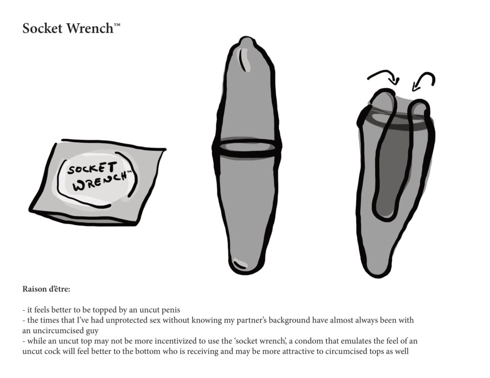
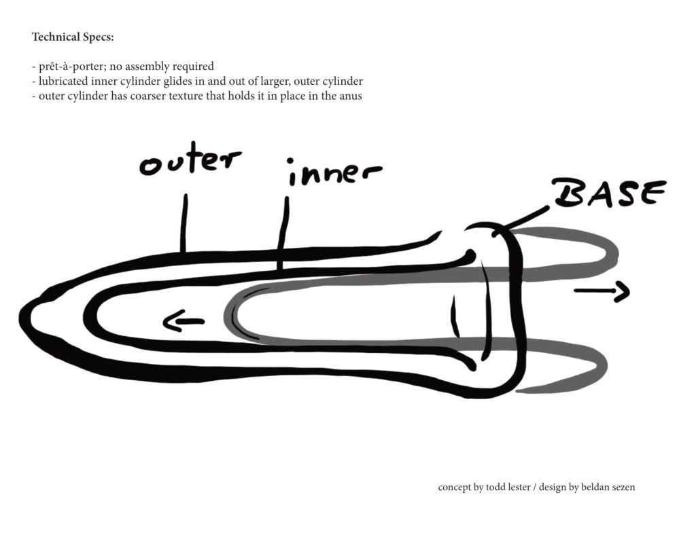

_\[\*A few years ago (2013), graphic artist Beldan Sezen was in the Netherlands and needed some quick photos of a historic scene. The graphic short she was making is called HOMOE, set in 1964 pre-Stonewall NYC, about a man remembering the homophobic murder of his neighbor “back in the day.” We decided to trade my photo-taking for some design work on a concept I sent to the Bill & Melinda Gates Foundation called Socket Wrench.\]_

_BREAKING NEWS:  Beldan & I retrofitted our unsuccessful Gates proposal (and design) for [Visual AIDS: Postcard from the Edge](http://www.visualaids.org/events/detail/postcards-from-the-edge-benefit-sale2#.Ut7Mcij0DR0) Benefit!  Here’s [more about the event](http://artfuladministrator.wordpress.com/2014/01/21/postcards-from-the-edge-a-benefit-for-visual-aids/)!!_

For my 40th birthday, I designed a condom!  I had read about a challenge by the [Gates Foundation](http://www.gatesfoundation.org/) to [Develop the Next Generation of Condom](http://www.grandchallenges.org/explorations/topics/pages/nextgenerationcondomround11.aspx), and figured, _why not?_

I put forward a proposal to design a condom that emulates the feel of an uncircumcised penis.  My friend, artist, [Beldan Sezen](http://beldansezen.com/) helped to design a [prototype of the condom](https://unstitute.files.wordpress.com/2013/05/socketwrenche284a2.pdf) to go along with my hypothesis.  In the application, I offered a concrete, non-rational-choice-influenced innovation toward improved _condomization_.  I also thanked the [Gates Foundation](http://www.gatesfoundation.org/) for being progressive in the field of public health while asking them to transcend their hetero-normative, scientific-model constrained approach.  _See their [open call](https://unstitute.files.wordpress.com/2013/05/next-generation-condom-round-11.pdf) and [guidelines](https://unstitute.files.wordpress.com/2013/05/gceapplication_form.pdf)._

While Beldan and I were cooking this up across timezones (she’s in Amsterdam), I became nostalgic thinking about a project I did back in 2002 right after I finished my Peace Corps service in Cameroon:  While in the Peace Corps, I worked with organizations such as [UNICEF](http://www.unicef.org/) and [Population Services International](http://www.psi.org/) (PSI) to make a community radio series on youth sexuality and other issues in the rural province where I was stationed. One night I was at a party with the PSI director in the capital city, Yaoundé and he asked me what I was doing next.  I didn’t know what I was doing next and therefore he proposed that I go to Bangui, capital of the Central African Republic and make a radio spot and TV commercial for the rebranding of their socially-marketed condom.  So, for the next three weeks that’s just what I did.  The resulting product was a bilingual (French and Sango) marketing campaign that consisted of radio and TV content and billboard images; however just after I left civil war erupted and the marketing campaign was never used … _Guess what I just found on VHS tape?_

You can find original content [here](https://unstitute.wordpress.com/2013/05/09/socket-wrench/).
