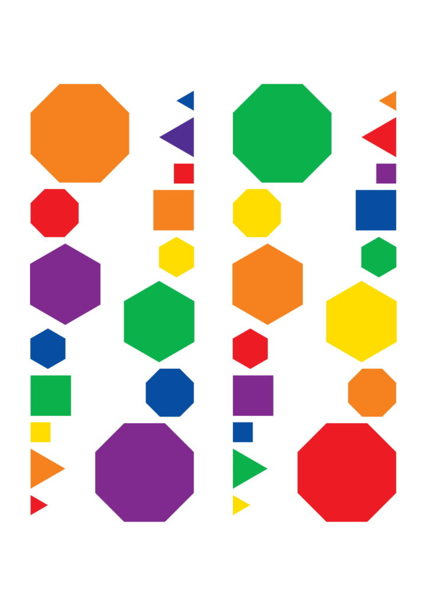

'Stealing' the LUV Game is a bit easier than [Hoffman's book](https://en.wikipedia.org/wiki/Steal_This_Book). It is free to begin with. I tell the story of how the [LUV Game](https://luvhurts.co/play-me/) came about first as an idea from a young Egyptian designer in a [description of ACT I](https://luvhurts.co/act-i/), considering how one might discuss (or signal a safe discussion on) HIV in a place like Cairo ... starting with a sticker of a game tile he envisioned on the back of a laptop...something that would 'call out' to someone entering a busy cafe. Something iconic (a brand of sorts) but coded...like something one learns about on social media but that isn't explicit in form or words. From the original idea had in Port Said along the edge of the Suez Canal, the game spilled out and its pieces (or tiles) and simple instructions in 10 different languages are [available online for download and printing](https://luvhurts.co/play-me/) in [B/W](https://luvhurts.co/wp-content/uploads/2019/12/Luv_booklet.pdf) or [color](https://luvhurts.co/wp-content/uploads/2019/12/Luv_booklet3.pdf). The game has been test-played in [São Paulo](https://luvhurts.co/encounters/luv-game-feedback-from-sao-paulo-somos-mais-aids-walk/) during the December 1st (2019) [AIDS Walk](https://gay.blog.br/saude/aids-walk-de-nova-york-camara-em-sp/) in [Portuguese](https://luvhurts.co/wp-content/uploads/2019/11/LUV_-PT3-1-1.pdf); in [Grenoble](https://luvhurts.co/encounters/luv-game-feedback-from-grenoble-ankh-association/) with [Ankh Association](https://www.ankhfrance.org/) in [French](https://luvhurts.co/wp-content/uploads/2019/11/LUV_-_FR_.pdf) and [Arabic](https://luvhurts.co/wp-content/uploads/2019/10/LUV_inst_Ar.pdf); and in [Bogotá](https://luvhurts.co/encounters/luv-game-feedback-from-bogota-luciernagas/) at the culmination of the [Luciérnagas Laboratory](https://luvhurts.co/coalition/luciernagas/) in [Spanish](https://luvhurts.co/wp-content/uploads/2019/11/LUV_-_ES_.pdf).    
  
While the [LUV Game](https://luvhurts.co/play-me/) is not the [end game](https://luvhurts.co/what-about-elton/) of the LUV project, we do hope that it is used far and wide as an icebreaker for discussing HIV and related stigmas. One idea is that we offer it to an institution to help us scale up (like a research outfit, university, NGO or UN agency), and another is that we work with global techies to make an open source online version, something like the [Robyn game / app](https://labs.earthpeople.se/2018/11/the-making-of-secret-gig-x-robyn/). We'd LUV for you to 'steal it' first and [tell us about your particular heist](https://luvhurts.co/contact/). Let us know how we can 'distract the guards' and we'll lend a hand:)

