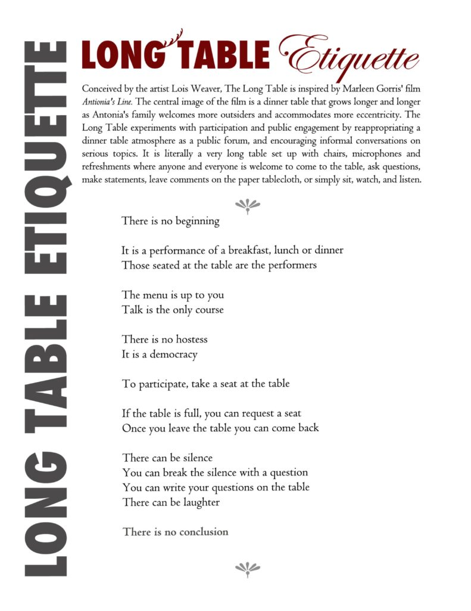
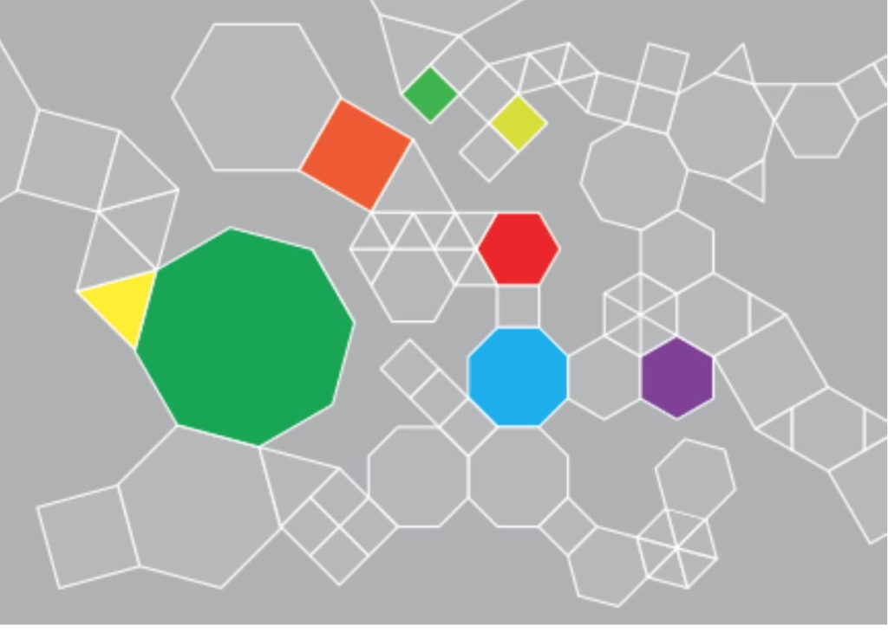
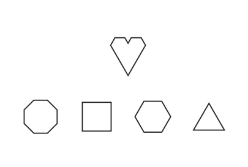

Conceived by Luv 'til it Hurts participants during a design workshop in Port Said, Egypt, the LUV\_GAME is inspired by The Long Table, a performance process by Lois Weaver. The game is designed for art world and non-art world venues ... public, private and super private spaces. At the same time it may be available online one day. The game pieces will be downloadable from the LUV site by World AIDS Day, December 1, 2019. Each time the game is presented in a new language, the translated 'instructions' will be made available from the site. The game can be played in black and white or in color. 

- 
    
- 
    

The game is modeled after [Exquisite Corpse](https://en.wikipedia.org/wiki/Exquisite_corpse). There are five shapes, including a signature heart. Four of the shapes are varied in size (large and small), design and color when feasible. The black-and-white game is meant to be played with very little overhead. The geometric shapes of the tiles as well as the graphic designs of the tiles allow for almost infinite configurations.

  
The 'heart' tile carries the LUV logo and a description of the project. A second version of the heart tile is available for partner events. The partner's logo is on one side. On the back of the four variated shape tiles, there is room for a LUV\_NOTE. The public or audience is encouraged to take a tile and write something on the back. Ask a question or share a thought on HIV. If it's in an art or community context (whatever the grounds for playing the game), the public is encouraged to respond to their surroundings, in as general or as personal terms as the like. 

  
The LUV\_GAME requires a wall or floor.

The first tile is placed, and tile holders are invited to place theirs around it--or shooting off from it. The tile holder decides if the design faces out or if their LUV\_NOTE faces out. This can happen in passive or active settings. For example, in a museum or gallery context, there are a set of five or six large tiles on the exhibition wall. Succinct instructions for the game are printed on the nameplate for the piece. The variated tiles are stacked beside the piece as broadsheets sometimes are. A space is made available on the wall for the initial set of 5/6 tiles to expand and extend (perhaps being refreshed at the beginning of each day). 

  
A scheduled viewing of the same group show, similar to other public settings offers an active context in which to play the game. The process is led with the instructions announced. Tiles are distributed. Markers and sticky tape for writing and pinning the LUV\_NOTES. 

  
Having a discussion after the allotted time period for reflection/writing/pinning-up the tiles is suggested, and is meant to be an extension of the process. The game does not need to be discussed per se, but perhaps the broader context--art show or community center--does. 

  
The game should help discussions along. 

  
Thank you Lois Weaver.
