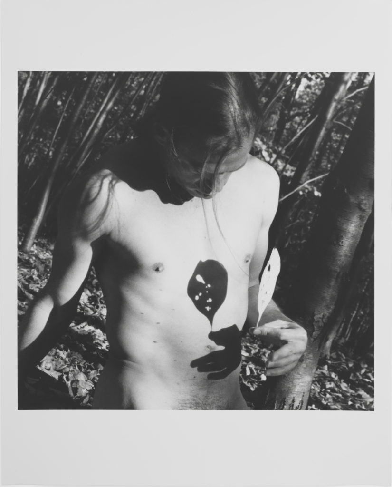
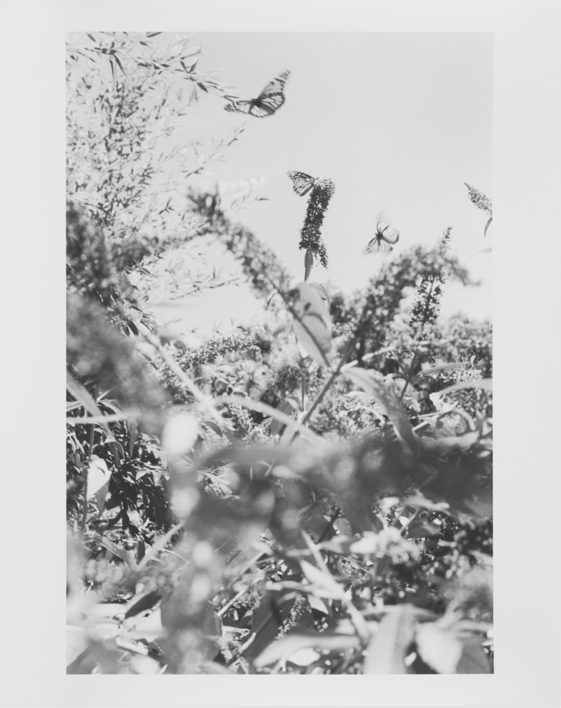

<figure>

<figcaption>

_Company -_ S_elf Portrait_  
1998, silver gelatin print, 20x16 inches

</figcaption>

</figure>

**_Introduction_**

_In “_[_A Conversation with Eric Rhein_](https://luvhurts.co/events/a-conversation-with-artist-eric-rhein/)_,” an interview on this website, Eric was asked about some writing he’d done: a text which corresponds with many of the themes in his recent exhibition,_ **_Lifelines_**_. Eric followed-up with this memoir, written in 1998, and we are happy that he’s shared it with us here._

**The Gathering**  
_by Eric Rhein_  
(1998)

        I’ve been pushed back from the borders of death, redeemed to life—escorted by the same spirits who comforted me on the precipice of demise. I’ve been awakened from a turbulent dream, or so it seems; awakened by a prince, with a pharmaceutical kiss.

        I had aged prematurely—ravaged through the course of ten years with H.I.V. When testing positive, my 27-year-old body was still that of a boy, fresh from college; then it became that of an old man, leapfrogging adulthood to decay. Now, having been restored to health, I wear a man’s body that I’d lost sight of. It’s strangely unfamiliar.

        The spirits of my Kentucky ancestors are with me. Their wisdom—imbibed from only seemingly simpler lives and times—resonate in my devotion to the autumn leaves that I revere as tributes to fallen friends.

        My Granny Corinne said the autumn leaves wear brilliant colors like their best Sunday school dresses to remind us of nature’s glory, even as they die. Granny Corinne is ever-present. I remember when she died—I was less then five and unafraid, as I sat alone—wearing short pants and a bow tie—in the parlor of our ancestral home. She was laid-out for her wake—like Snow White in her deep sleep. The morning light was passing through the parlor windows, golden like the turning leaves. The parlor was divided from adjoining rooms by imported Japanese soji screens—their paper was embedded with butterflies and leaves. Their shadows began to migrate across the room with the shifting sun. A butterfly kissed Granny’s forehead—another lit on my hand. A pattern of leaves trailed my bare legs. The silhouettes fluttered, giving form to the spirits of departed kin—as they welcomed Granny into their fold.

        We buried Granny in our remote family cemetery—the funeral procession recalling previous rituals—braving the crude path up the hill. Preceded by pallbearers on foot, the mourners stumbled through brambles as they forged their way to the graveyard.

        Returning from the burial, I remember Uncle Lige—resplendent—in long hippie hair and his funeral clothes, somersaulting with his lover Jack—down the hill through the fallen leaves.

        Uncle Lige was killed when I was 13. Like Granny, he is still with me in spirit. I’ve often called on him for his support and inspiration. He once said to my mother, “Don’t be surprised if Eric grows up to be Gay like me.” Maybe it was the way I’d stare at him, studying his every move—each flex of muscle—his facial expressions. Now, Uncle Lige watches over my shoulder as I wander the streets of New York City and inhabit his former East Village neighborhood. I wonder what it’s like for him, seeing our world swept by a plague.

        Uncle Lige used to say, “You have to learn to bend like the willow.” I didn’t understand what he meant until AIDS came into my life—and death became a constant “companion”—enveloping comrades in such rapid succession that I trip over the count and would lose their names if they weren’t housed in my memorial file:

        There is young blonde Scott with the bright green eyes; Carlos—and Australian Tim—Fair Pam—and the Jones boys, composer John and Jim the painter—David, the artist and activist—there is Huck, the frenzied Aries—beautiful Santiago and Zany Ann—Blue-eyed Roland—Lovely Tina—and Sweet Adrian…

I walk with the shadows

of the men I’ve known

and loved and tasted –-

and feel, even still,

the warmth of their breaths 

against my skin.

        The spirits of my friends and lovers who died of complications from AIDS commingle with my departed ancestors—an extended family tree.

        My guardian spirits abound—sending me back into the world. Each lends their individual attributes. They strengthen me as I feel my footing and learn to walk again in a world I was prepared to leave. My guardians have not relinquished me in my revival. They are stronger in me, as I am in myself.

<figure>

<figcaption>

Visitation (Fire Island)  
2012, silver gelatin print, 20x24 inches  

</figcaption>

</figure>

[www.ericrhein.com](http://www.ericrhein.com)
