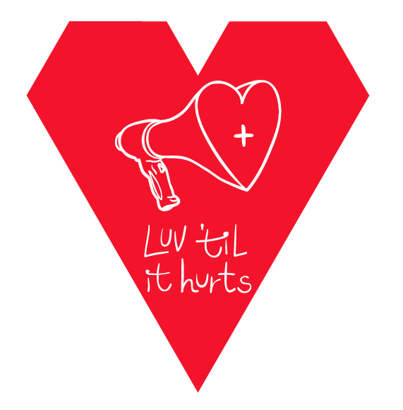
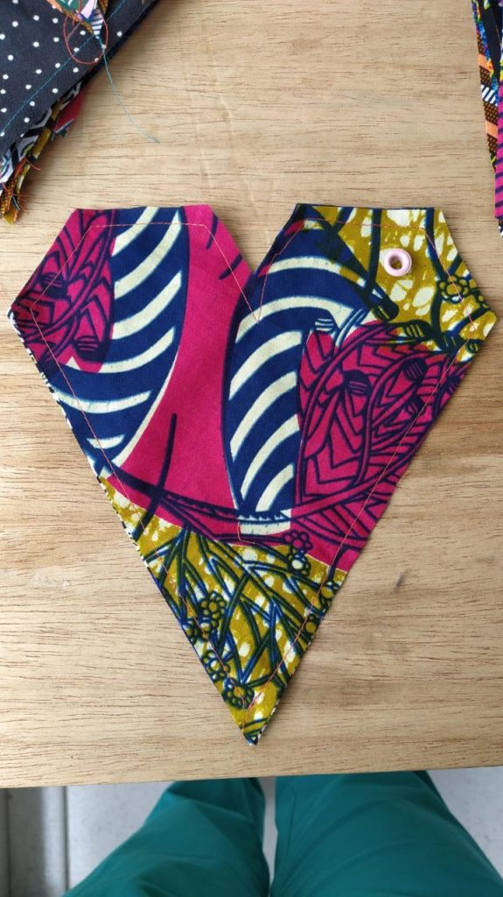

The original idea for an iconic tile came from Saouf in Port Said. He imagined what it would be like to walk into a Cairo cafe and see an iconic tile on the back of a laptop. A tile that let him know (if he so desired) he could talk to this person about HIV. Later as the game took shape, Adham created a signature tile in the shape of an 'all lines' stylized heart. This heart carried the LUV logo at first and then became the template to share partner logos.

  
The [LUV game](https://luvhurts.co/play-me/) is a part of Luv ’til it Hurts. The idea is based on a game played around the world called _[Exquisite Corpse](https://en.wikipedia.org/wiki/Exquisite_corpse)_. It’s a non-competitive game that can be played with only two people as well as a large group. The game is super easy. A new design or ‘visual work’ is made each time people play the game together. The [LUV game](https://luvhurts.co/play-me/) simply offers an excuse to talk about HIV and stigma in a range of settings from museum to public space or even on the street. The game idea came up when I asked a young design time in Port Said (Egypt) to help me communicate the values and goals of Luv ’til it Hurts. The [LUV game](https://luvhurts.co/play-me/) launched officially in Bogotá and Grenoble in late October; again during São Paulo’s December 1st AIDS Walk; and will soon be [available online](https://luvhurts.co/play-me/) in the general period of [World AIDS Day](https://en.wikipedia.org/wiki/World_AIDS_Day) 2019. 

  
PARTNER TILES:  
On each occasion the [LUV game](https://luvhurts.co/play-me/) was played--in [Grenoble](https://luvhurts.co/encounters/luv-game-feedback-from-grenoble-ankh-association/) (French/Arabic), [Bogotá](https://luvhurts.co/encounters/luv-game-feedback-from-bogota-luciernagas/) (Spanish) and [São Paulo](https://luvhurts.co/encounters/luv-game-feedback-from-sao-paulo-somos-mais-aids-walk/) (Portuguese)--LUV offered a specially-designed heart tile with the initiative's logo inside. This could be placed in the center of the floor to get the game started. Other tiles would be placed around it. As I was making all the tiles at the same time, I also offered each location the partner tiles from other locations. From the beginning the LUV project has developed a motley crew of affiliations. We call this a [coalition](https://luvhurts.co/coalition/) and it is open for joining ... if you like who we are, that is. We also offer all these folks a partner tile. Having a logo is a part of doing something. Usually it is the first hologram of an idea. A serious idea can be formed in the chambers of design, we know well. An idea without a form can be helpless. So if LUV can help boost new ideas--being one itself--then that is what it wants to do. Helping a good idea to go faster is a worthwhile endeavor in and of itself.   
  
The [Think Twice Collective](https://luvhurts.co/think-twice-collective/) based at the University of Leiden (Netherlands) got involved by bringing on 5 more languages of instructions for the LUV Game. And we've discussed how the LUV project might be a part of their work local to the Leiden campus in the future. In our brainstorm, there are many ways to have a campus-focused conversation on HIV and stigma. The idea of interactions that use the LUV game using all partner tiles (to date) rather than only the Luv 'til it Hurts one represents the ethos of the project and has the value of sharing initiatives from other parts of the world. While It's not quite Abbie Hoffman (à la [Steal this Book](https://en.wikipedia.org/wiki/Steal_This_Book)), we do wish for each and every visible, verifiable piece of the project to be used as soon as possible. So if the general brand of LUV can help another new initiative that's great. We will soon change our (brand) look a bit, so please take it while it's there.   
  
In the best of circumstances, sharing partner tiles from other locations and being able to learn more about the initiatives on our site (linking to their sites) will help to share information about and conditions experienced by other positive people. We hope there is some solidarity in this design function. It is a gesture and maybe more.   
  
The partner tiles are all here in this booklet:

[LUV Partner Tiles (Global)](https://luvhurts.co/wp-content/uploads/2019/12/Luv_PartnerBook.pdf)[Download](https://luvhurts.co/wp-content/uploads/2019/12/Luv_PartnerBook-1.pdf)

Please use and re-use the Luv game in the most generous, unconstrained ways you can imagine. And, well, [tell us about it](https://luvhurts.co/contact/) if you have time.
