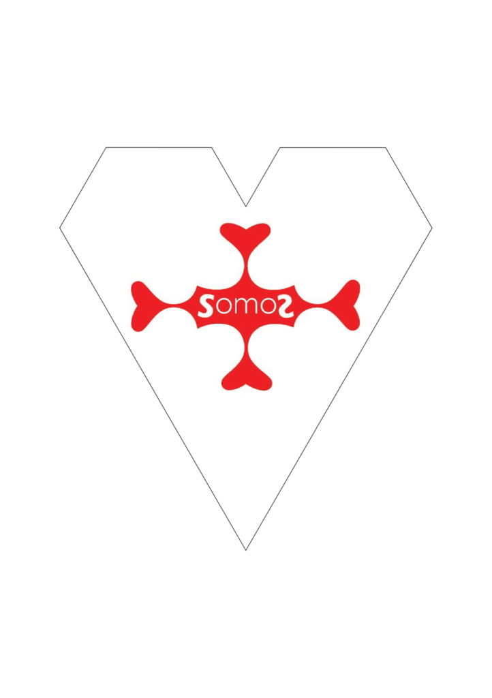
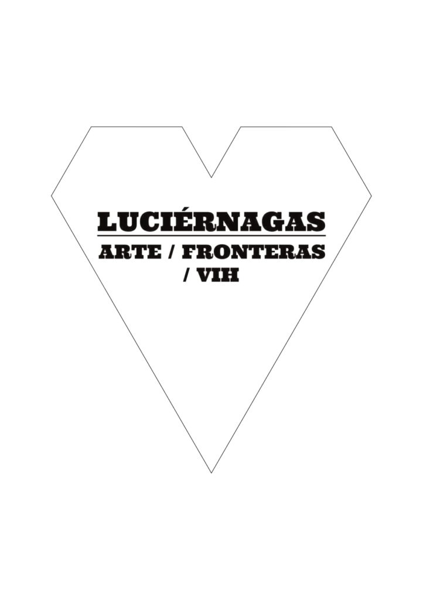

This article is a [field \[luv\] note](https://luvhurts.co/features/field-notes/) to [Luciérnagas](https://luvhurts.co/coalition/luciernagas/) and friends in Bogotá. I was [there for a project](https://luvhurts.co/texts/relatory-bogota/) by Daniel Santiago Salguero and his HIV+ peers. Fireflies, this is the word in Spanish for fireflies. 

Speaking of fireflies, I met some luminary folk while in Bogotá Like Jackie ... as far as I know she is the only woman in Luciérnagas, well, except your costuming friend (Daniel). I would love to publish a text or reflections on process by her for the 2020 [Love Positive Women](https://visualaids.org/projects/love-positive-women) holiday (Feb 1-14).  We will be putting up 14 days of woman-authored content on those days early next year. Can you ask (or work with) Jackie to make a text? Let's do in Spanish, but also we can translate on our side. If you will agree to interview her for the site, then you can also be a bit instructive w/ your questions. Just make it about the lab process. In that way you both support Love Positive Women. 

When I got back from Bogotá, a group of us (somos) began meeting for drinks on Tuesday nights. The first meeting in late October or early November yielded an idea for a collective group which would first make a [Sarau Transante](https://www.facebook.com/events/441794199865349/) on November 30, Saturday evening before World AIDS Day, the following Sunday, Dec. 1, 2019. I have been very excited about the game ever since it came up on my trip to Egypt in March 2019. 

I had thought it would be in Taiwan for a show in this period. The process took longer than expected. As long-time friends, [Adham](http://abakry.com/en/) and I had a lot to discuss before getting on with the next 'work' project. He also has a project of the BIG variety--[a museum of sorts](https://www.france24.com/fr/20190712-a-port-said-le-son-ancestral-semsemia-resonne-encore)\--that I want to be involved in, a project also taking its own pace over a multi-year timeline. 

When I came back from Bogotá, I was planning to pretend to be LUV and invite other very active artist friends who are positive to meet for drinks and then perhaps LUV would help to amplify the outcome. LUV is a small project led by an independent artist, but it does already have some trappings (on its road toward / becoming a philanthropic device). I have been rather tired since the end of [Lanchonete.org](http://lanchonete.org/), and also having made AIDS Day / period programming in 2015 (beg. of [Cidade Queer](http://www.cidadequeer.lanchonete.org/)); 2016 (ending of [Cidade Queer](http://www.cidadequeer.lanchonete.org/), [EXPLODE!](http://www.cidadequeer.lanchonete.org/) and ATAQUE); 2017 (Neighborhood Museum with Amber Art & Design); 2018 (@Esponja w/ Coletivo Coletores + Colectivo Amem); and now 2019 with Somos and also a partnership with the Municipal Secretary of Human Rights for the AIDS Walk and the performance /public space where the walk ended. It changed a 1000 times, yet I'd say it all went very well. It was also possible to see what other artists were doing for AIDS Day. 

Daniel, I remember when I was in Bogotá in October. You already had interest from a municipal authority to do another performance or intervention on /around World AIDS Day, December 1. We haven't been able to talk directly since then, so I don't know if this panned out in the end. Can you share with us what happened next?

You probably saw the interview LUV did with Juan De La Mar last week? This is a field note to you, but also it has questions for you to answer in a follow-up piece. So, see it as advice (at times) and feel free to answer the questions indicated in orange. 

My strongest advice is to help the group become what it will be next. It takes a lot of energy to do what you did. I bet you are tired. Exhausted even. So, save your energy. Help to hold the idea together but hand it off. Now that I've interviewed Juan and given the aforementioned idea for Love Positive Women (and Jackie) ... as well as my next idea for [El Santo](https://www.facebook.com/elSantotallerdeceramica/), I can also offer to help you take this next step. What I'm saying is that it's obvious that some of the Laboratory group will make their own works as artists, and other Positive artists and allies will come around and want to be involved. There are members of your group who could grow to need the affiliation of the laboratory. It may even seem like a support group at times. These are not certainties, but they are the 'good likelihoods' if you can help make the space for it.

When I came back from Bogotá, I did not plan to create or co-create yet another thing. I was willing to catch some new ideas with the LUV apparatus. As we got up to the Sarau with Somos (and when I specifically didn't want to assume or seem to assume leadership/sole ownership) it became obvious that my closest allies felt it was my 'show' ... there were a range of signals (including direct conversation) that revealed this to me. Given that my intention was the opposite, I have asked my colleagues to share with me how they see it. I've asked them to help me with my general research on how people get together and do things, in a social sense. Artists and others. Activists among them.   
 

There was tension in this process. I have also experienced tension (and outright conflict) in previous AIDS Day / Periods. In some ways, I think it is bound to happen. In other ways, I want to consider how for it not to happen. It is not enjoyable. 

I have a lot of faults, but one thing I try to do is to apply some community organizing and publicity logic to social causes. These are useful tools for urgent situations. But I fear that the so-called 'art world' that we (at least, partially) act in, is not so good at identifying urgency. And by not doing so it cannot offer appropriate care. It is not a complete 'world' in this sense. It does not take such good care of its workers. I talk about art world concerns in [Relatory Bogotá](https://luvhurts.co/texts/relatory-bogota/) and [other pieces](https://luvhurts.co/features/field-notes/). 

Daniel you may get an opportunity from this art world that is useful to the Luciérnagas Laboratory group. You may not decide to use it yourself, but it may still have value to your peers. You may find other ways to nurture or help with the work of Juan, Jackie et al. There will also be new people who come around inspired by your first pass on Oct 25 at the Botanical Gardens. Making space for them will be up to you as a leader of the project, because first you have to admit (or say) if the project goes on and under what conditions. 

So for example, let's say that El Santo didn't make a pin for World AIDS Day as discussed. But I saw his 'resist' plates on Instagram. Maybe that is the item we attempt to merchandise with the future LUV platform and shows. It can work. If El Santo agrees to something like this, we'll need to move fast. If it's the plates (El Santo) I would need high resolution photos very quickly. I luv the plates by the way. 

Just as I attempted to do when in the midst of your context, city and project, Daniel, I will meet you where you are. Let's say you did nothing for World AIDS Day. Cool. Let's go?

I must admit the idea that came up from you guys (Daniel + El Santo) was powerful: the idea that we need new representation beyond (or next) to the red flag. This could be more specific to Bogotá, or World AIDS Day, but it would seem to come from those of us newly making or having voice on HIV and stigma. So, newness is perhaps just good. So when I got back and got my hands in all these pots, one of the most 'new' and nice experiences was coming up with the [cloth heart](https://luvhurts.co/texts/puppy-luv-cloth-hearts/) that mimics the heart tile in the [LUV game](https://luvhurts.co/play-me/). 

What if you took on the challenge of doing this re-branding of the red flag just because I ask you to?  What if we use the [HIV2020 meeting](https://www.hiv2020.org/), AIDS Day 2020, AIDS conference in San Francisco, Love Positive Women, and the ending of Luv 'til it Hurts, including the intended Schwules Museum prototype show in 2021 ... all to popularize this new symbol. And what if it made money for other folks working on and thinking deeply about HIV and stigma? 

It could, guys:)

- 
    
- 
