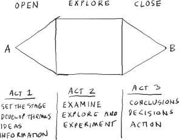
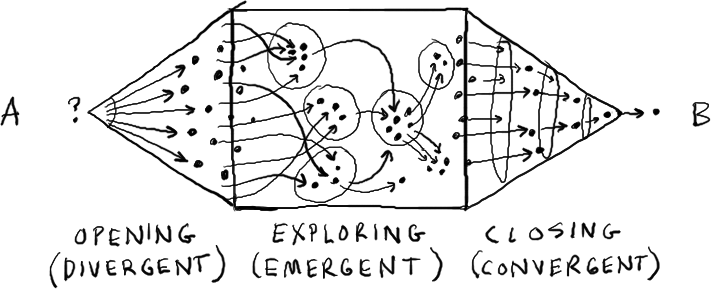

I launched Luv ’til it Hurts, a long-considered project on HIV and stigma in July 2018. The project goes through the middle of 2020 officially, and yet I’m also quite interested in the afterlife of projects. DURATION is important to me for reasons I’ll explain later, and based on specific methods drawn from the community organizing field. Luv ’til it Hurts follows a five-year project on the right to the city, site-specific to the center of São Paulo called Lanchonete.org and a ten-year project, freeDimensional on free expression and artist safety (and shelter) in pre-existing artist residencies around the world. Given that an afterlife is expected and having experimented with different forms of archiving (or the project reporting on itself) with both freeDimensional and Lanchonete.org, Luv ’til it Hurts attempts to externalize a ‘record’ of the two-year process in various ways, such as the project’s website as ‘scrapbook’… and even an [annual report](https://drive.google.com/file/d/0By6i86TJubAaVG5IVkJPVkt5X0lGaFAwTlQtUF8tS2hsTzk0/view?usp=sharing). 

<figure>

<figcaption>

From '_Gamestorming: A Playbook for Innovators, Rulebreakers, and Changemaker_s' (2010)

</figcaption>

</figure>

In my work, there are often elements of institutional critique woven into the project design. I don’t care to always point to them, but too this series of three multi-stakeholder, durational, rights-focused projects are intended as a form of action research and therefore patently ‘open’ to independent investigation and interrogation. I myself ‘ask’ the projects as questions. They now span almost 20 years, a period in which I’ve also been in dialogue with other artists and observed various forms of practice in both the art and human rights ‘worlds’. At this point I find that I am considering methodology. As a method, I ‘network’ my projects in particular ways, through personal artist connections and through thematic or ‘field’ institutional approaches. It comes as second nature to me and perhaps is therefore easier to do than it is to explain. I decided to wait until after the 3rd and final project (in the series), _Luv ’til it Hurts_ is finished before doing a ‘deep dive’ on methodological issues in this same twenty year period. That work (or book) already has a name, which is Variations on Worldmaking.

At the same time, the 3rd project (for which this site is eponymous) is the most personal of the three. I am HIV+. So while freeDimensional and Lanchonete.org may give me an edge on framing such durational, multi-stakeholder, rights-focused projects as Luv ’til it Hurts, the subject matter of HIV and stigma affects (infects) me wholly. 

Each process has had a phase of inviting stakeholders. Given that this is typically the most intense period within the overall ‘durational’ process, I can now say that a longer break between the second and third project was deserved. Lanchonete.org did not ‘stop on a dime’ and so the beginning of Luv ’til it Hurts overlaps the second project, just as it has overlapped the first project, freeDimensional.  While a project can gain stakeholders throughout (and I might argue even after the end of its designated timeframe), the first participants to join are needed for contiguous growth and the most time is spent with these stakeholders (and usually in discussion over project design). They then repeat this process with new stakeholders if they so choose. I typically open and ‘hold’ the process. It can sometimes feel like the role of artistic director and is quite lonely at first. But, after a few more principal stakeholders are on board it is possible to co-lead while also doing other individual and group ‘actions’.

<figure>

<figcaption>

From '_Gamestorming: A Playbook for Innovators, Rulebreakers, and Changemaker_s' (2010)

</figcaption>

</figure>

Regarding Luv ’til it Hurts—and _en brev_—I will hold the process (ultimately an open design method that includes finding money to make the project); write for the website in a couple of ‘threads’—about the process of making the project and some creative texts; co-curate public programs (conferences, exhibitions, residencies, etc); introduce an independent work (or action) within the ‘container’ as would be the prerogative of any serious stakeholder; and ultimately archive the project through its end-date and a short period thereafter. One needs to want to ‘use’ the device to participate … it is not a theoretical project in that ‘sideline’ sense, even if I may consider it a form of research (something I’ll explain later). I am told that I can be a toughie during the recruitment phase, encouraging people off the sideline in smooth and not-so-smooth ways. It is critical no matter how you ‘crack it’ this particularly tedious and essential part of the process. 

Once the container is secure (and explainable) in act two, a larger range of actions are possible. Luv ’til it Hurts is completing its first act I do believe. I will say so here when the process is clear of each of its milestones. 

Such a project can be tiring at times for sure. I make open works because they excite me. And, nourish me at times as well. 

###

_\[\*The phrase ‘open work’ is a reference to Umberto Eco’s criticism on such works throughout history, The Open Work, Harvard University Press (April 1989), shared_ [_nicely online_](https://monoskop.org/images/6/6b/Eco_Umberto_The_Open_Work.pdf) _by Monoskop.\]_
